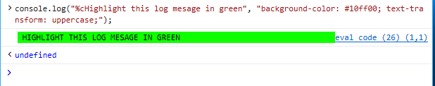
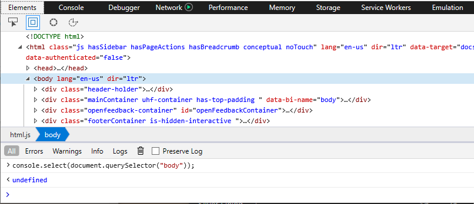

# <span data-ttu-id="bba55-104">API do Console</span><span class="sxs-lookup"><span data-stu-id="bba55-104">Console API</span></span>

<span data-ttu-id="bba55-105">A *API do console* fornece acesso programático e linha de comando ao console do devtools por meio do `console` objeto global, permitindo que você:</span><span class="sxs-lookup"><span data-stu-id="bba55-105">The *Console API* provides command-line and programmatic access to the  DevTools Console through the global `console` object, allowing you to:</span></span>

 - <span data-ttu-id="bba55-106">[Registrar mensagens personalizadas](#logging-custom-messages) a partir de seu código</span><span class="sxs-lookup"><span data-stu-id="bba55-106">[Log custom messages](#logging-custom-messages) from you code</span></span>
 - <span data-ttu-id="bba55-107">[Inspecionar objetos e elementos](#inspecting-objects-and-elements) e registrar suas informações</span><span class="sxs-lookup"><span data-stu-id="bba55-107">[Inspect objects and elements](#inspecting-objects-and-elements) and log their information</span></span>
 - <span data-ttu-id="bba55-108">[Testar e medir o código](#testing-and-measuring) definindo asserções, temporizadores e contadores</span><span class="sxs-lookup"><span data-stu-id="bba55-108">[Test and measure your code](#testing-and-measuring) by setting assertions, timers and counters</span></span>
 - <span data-ttu-id="bba55-109">[Criar instantâneos do heap](#taking-heap-snapshots) para avaliar o consumo de memória do seu código em execução e identificar vazamentos de memória</span><span class="sxs-lookup"><span data-stu-id="bba55-109">[Take snapshots of the heap](#taking-heap-snapshots) to assess the memory consumption of your running code and identify memory leaks</span></span>
 - <span data-ttu-id="bba55-110">[Rastrear suas chamadas de chamadas](#tracing-callstacks) para entender para onde o seu código está sendo chamado</span><span class="sxs-lookup"><span data-stu-id="bba55-110">[Trace your callstacks](#tracing-callstacks) to understand where your code is being called from</span></span> 
 - <span data-ttu-id="bba55-111">[Organize a saída do log](#organizing-log-output) para simplificar a depuração</span><span class="sxs-lookup"><span data-stu-id="bba55-111">[Organize your log output](#organizing-log-output) to streamline your debugging</span></span>

<span data-ttu-id="bba55-112">Veja a seguir os comandos e os parâmetros de formatação aos quais o Microsoft Edge oferece suporte no momento.</span><span class="sxs-lookup"><span data-stu-id="bba55-112">The following are the commands and formatting parameters currently supported by Microsoft Edge.</span></span> <span data-ttu-id="bba55-113">Elas funcionam de maneira semelhante nos principais navegadores.</span><span class="sxs-lookup"><span data-stu-id="bba55-113">They work similarly on major browsers.</span></span>

## <span data-ttu-id="bba55-114">Registrando mensagens personalizadas</span><span class="sxs-lookup"><span data-stu-id="bba55-114">Logging custom messages</span></span>

<span data-ttu-id="bba55-115">Seu código pode enviar vários tipos de mensagens personalizadas para o console, incluindo:</span><span class="sxs-lookup"><span data-stu-id="bba55-115">Your code can send several types of custom messages to the console, including:</span></span>

<span data-ttu-id="bba55-116">Tipo de mensagem</span><span class="sxs-lookup"><span data-stu-id="bba55-116">Message type</span></span>  | &nbsp;   |
:------------------- | :------ |
<span data-ttu-id="bba55-117">[**Error ()**](https://developer.mozilla.org/docs/Web/API/Console/error) e [ **Exception ()**](https://developer.mozilla.org/docs/Web/API/Console/error)</span><span class="sxs-lookup"><span data-stu-id="bba55-117">[**error()**](https://developer.mozilla.org/docs/Web/API/Console/error) and [**exception()**](https://developer.mozilla.org/docs/Web/API/Console/error)</span></span>| <span data-ttu-id="bba55-118">Erros críticos e falhas</span><span class="sxs-lookup"><span data-stu-id="bba55-118">Critical errors and failures</span></span>
[**<span data-ttu-id="bba55-119">WARN ()</span><span class="sxs-lookup"><span data-stu-id="bba55-119">warn()</span></span>**](https://developer.mozilla.org/docs/Web/API/Console/warn) | <span data-ttu-id="bba55-120">Possíveis erros ou comportamento inesperado</span><span class="sxs-lookup"><span data-stu-id="bba55-120">Possible errors or unexpected behavior</span></span> 
[**<span data-ttu-id="bba55-121">info ()</span><span class="sxs-lookup"><span data-stu-id="bba55-121">info()</span></span>**](https://developer.mozilla.org/docs/Web/API/Console/info) | <span data-ttu-id="bba55-122">Informações úteis, mas não críticas</span><span class="sxs-lookup"><span data-stu-id="bba55-122">Useful, but non-critical information</span></span>
<span data-ttu-id="bba55-123">[**log ()**](https://developer.mozilla.org/docs/Web/API/Console/log) e [ **debug ()**](https://developer.mozilla.org/docs/Web/API/Console/log)</span><span class="sxs-lookup"><span data-stu-id="bba55-123">[**log()**](https://developer.mozilla.org/docs/Web/API/Console/log) and [**debug()**](https://developer.mozilla.org/docs/Web/API/Console/log)</span></span> | <span data-ttu-id="bba55-124">Depuração geral (sem gerar um ícone de alerta do sistema no console)</span><span class="sxs-lookup"><span data-stu-id="bba55-124">General debugging (without generating a system alert icon in the console)</span></span>

   
<span data-ttu-id="bba55-125">Você pode agrupá-los e filtrá-los com as outras mensagens geradas pelo Microsoft Edge no painel do console.</span><span class="sxs-lookup"><span data-stu-id="bba55-125">You can group and filter these along with the other messages generated from Microsoft Edge from the  Console panel.</span></span> <span data-ttu-id="bba55-126">Todos os métodos de mensagens personalizados exigem um parâmetro de cadeia de caracteres (mensagem) e parâmetros de substituição de formato opcionais.</span><span class="sxs-lookup"><span data-stu-id="bba55-126">All custom message methods require a string (message) parameter and optional format substitution parameters.</span></span> <span data-ttu-id="bba55-127">O Microsoft Edge suporta as seguintes opções de formatação:</span><span class="sxs-lookup"><span data-stu-id="bba55-127">Microsoft Edge supports the following formatting options:</span></span>

<span data-ttu-id="bba55-128">Parâmetro de formato</span><span class="sxs-lookup"><span data-stu-id="bba55-128">Format parameter</span></span> | &nbsp;
:------------------- | :--- |
**<span data-ttu-id="bba55-129">% b</span><span class="sxs-lookup"><span data-stu-id="bba55-129">%b</span></span>** | <span data-ttu-id="bba55-130">Binário</span><span class="sxs-lookup"><span data-stu-id="bba55-130">Binary</span></span>
**<span data-ttu-id="bba55-131">% c</span><span class="sxs-lookup"><span data-stu-id="bba55-131">%c</span></span>** | <span data-ttu-id="bba55-132">Estilo CSS embutido (consulte o exemplo abaixo)</span><span class="sxs-lookup"><span data-stu-id="bba55-132">Inline CSS style (see example below)</span></span>
<span data-ttu-id="bba55-133">**% d**, **% i**</span><span class="sxs-lookup"><span data-stu-id="bba55-133">**%d**, **%i**</span></span> | <span data-ttu-id="bba55-134">Inteiro</span><span class="sxs-lookup"><span data-stu-id="bba55-134">Integer</span></span> 
**<span data-ttu-id="bba55-135">% f</span><span class="sxs-lookup"><span data-stu-id="bba55-135">%f</span></span>** | <span data-ttu-id="bba55-136">Float</span><span class="sxs-lookup"><span data-stu-id="bba55-136">Float</span></span>  
**<span data-ttu-id="bba55-137">% s</span><span class="sxs-lookup"><span data-stu-id="bba55-137">%s</span></span>** | <span data-ttu-id="bba55-138">String</span><span class="sxs-lookup"><span data-stu-id="bba55-138">String</span></span> 
**<span data-ttu-id="bba55-139">% x</span><span class="sxs-lookup"><span data-stu-id="bba55-139">%x</span></span>** | <span data-ttu-id="bba55-140">Decimal</span><span class="sxs-lookup"><span data-stu-id="bba55-140">Hexadecimal</span></span> 
**<span data-ttu-id="bba55-141">% e</span><span class="sxs-lookup"><span data-stu-id="bba55-141">%e</span></span>** | <span data-ttu-id="bba55-142">Expoente</span><span class="sxs-lookup"><span data-stu-id="bba55-142">Exponent</span></span> 

<span data-ttu-id="bba55-143">Por exemplo, veja como você deve incluir variáveis de cadeia de caracteres e inteiros na mensagem de registro:</span><span class="sxs-lookup"><span data-stu-id="bba55-143">For example, here's how you would include string and integer variables in your log message:</span></span>

```javascript
var myText = 'pieces';
var myVal = 5;
console.log("The number of %s is %d.", myText, myVal);
```

>`The number of pieces is 5.`

<span data-ttu-id="bba55-144">Veja como você pode adicionar um efeito de realce verde a uma mensagem de log com CSS embutido ( `%c` ):</span><span class="sxs-lookup"><span data-stu-id="bba55-144">And here's how you might add a green highlight effect to a log message with inline CSS (`%c`):</span></span>

```javascript
console.log("%cHighlight this log message in green", "background-color: #10ff00; text-transform: uppercase;");
```



## <span data-ttu-id="bba55-146">Inspecionando objetos e elementos</span><span class="sxs-lookup"><span data-stu-id="bba55-146">Inspecting objects and elements</span></span>

<span data-ttu-id="bba55-147">Objetos inspecionáveis aparecem no console em um modo de exibição de árvore recolhido com nós expansíveis.</span><span class="sxs-lookup"><span data-stu-id="bba55-147">Inspectable objects appear in the console in a collapsed tree view with expandable nodes.</span></span> <span data-ttu-id="bba55-148">O console detecta se você está enviando um nó DOM (como um div) ou um objeto JavaScript (como um evento) e os exibe automaticamente como o tipo detectado.</span><span class="sxs-lookup"><span data-stu-id="bba55-148">The console detects whether you are sending a DOM node (like a div) or a JavaScript object (like an event) and displays them as the detected type automatically.</span></span>

<span data-ttu-id="bba55-149">Você também pode forçar uma saída específica:</span><span class="sxs-lookup"><span data-stu-id="bba55-149">You can also force a specific output:</span></span>

<span data-ttu-id="bba55-150">Comando</span><span class="sxs-lookup"><span data-stu-id="bba55-150">Command</span></span> | &nbsp;
:------------------- | :--- |
[**<span data-ttu-id="bba55-151">Dir ()</span><span class="sxs-lookup"><span data-stu-id="bba55-151">dir()</span></span>**](https://developer.mozilla.org/docs/Web/API/Console/dir) | <span data-ttu-id="bba55-152">Exibe como objeto JavaScript inspecionável</span><span class="sxs-lookup"><span data-stu-id="bba55-152">Displays as inspectable JavaScript object</span></span>
[**<span data-ttu-id="bba55-153">dirxml()</span><span class="sxs-lookup"><span data-stu-id="bba55-153">dirxml()</span></span>**](https://developer.mozilla.org/docs/Web/API/Console/dirxml) | <span data-ttu-id="bba55-154">Exibe como nó DOM inspecionável</span><span class="sxs-lookup"><span data-stu-id="bba55-154">Displays as inspectable DOM node</span></span>

<span data-ttu-id="bba55-155">Por exemplo, tente abrir o console e comparar as seguintes saídas do `<div id='main'>` elemento nesta página:</span><span class="sxs-lookup"><span data-stu-id="bba55-155">For example, try opening the console and compare the following outputs for the `<div id='main'>` element on this page:</span></span>

```javascript
console.dir(document.querySelector('#main'));
console.dirxml(document.querySelector('#main'));
```


### <span data-ttu-id="bba55-157">Selecionando um elemento no painel **elementos**</span><span class="sxs-lookup"><span data-stu-id="bba55-157">Selecting an element in the **Elements** panel</span></span>

<span data-ttu-id="bba55-158">Você pode selecionar um elemento dentro do contexto da árvore HTML da página diretamente do console para o layout imediato e a depuração de estilo.</span><span class="sxs-lookup"><span data-stu-id="bba55-158">You can select an element within the HTML tree context of the page directly from the console for immediate layout and style debugging.</span></span>

<span data-ttu-id="bba55-159">Comando</span><span class="sxs-lookup"><span data-stu-id="bba55-159">Command</span></span> | &nbsp;
:------------------- | :--- |
**<span data-ttu-id="bba55-160">Select ()</span><span class="sxs-lookup"><span data-stu-id="bba55-160">select()</span></span>** | <span data-ttu-id="bba55-161">Alterna para o painel **elementos** e define o foco para o elemento especificado.</span><span class="sxs-lookup"><span data-stu-id="bba55-161">Switches to the **Elements** panel and sets focus to the specified element.</span></span>

<span data-ttu-id="bba55-162">Por exemplo, se você abrir o console nesta página e digitar:</span><span class="sxs-lookup"><span data-stu-id="bba55-162">For example, if you open the console on this page and type:</span></span>

```javascript
console.select(document.querySelector("body"));
```

<span data-ttu-id="bba55-163">O DevTools mudará para o painel **elementos** (se ele ainda não for o atual) e definirá o foco no [*modo de exibição de árvore HTML*](../elements.md#html-tree-view) para o elemento especificado.</span><span class="sxs-lookup"><span data-stu-id="bba55-163">The DevTools will switch to the **Elements** panel (if its not already the current) and set focus in the [*HTML tree view*](../elements.md#html-tree-view) to the specified element.</span></span>



## <span data-ttu-id="bba55-165">Teste e medição</span><span class="sxs-lookup"><span data-stu-id="bba55-165">Testing and measuring</span></span>

### <span data-ttu-id="bba55-166">Testando seu código</span><span class="sxs-lookup"><span data-stu-id="bba55-166">Testing your code</span></span>

<span data-ttu-id="bba55-167">Adicione declarações de teste de API de console ao seu código para teste de unidade e depuração do seu código à medida que ele é executado no navegador.</span><span class="sxs-lookup"><span data-stu-id="bba55-167">Add Console API test assertions to your code for unit testing and debugging your code as it runs in the browser.</span></span>

<span data-ttu-id="bba55-168">Comando</span><span class="sxs-lookup"><span data-stu-id="bba55-168">Command</span></span> | &nbsp;
:------------ | :-------------
[**<span data-ttu-id="bba55-169">Assert ()</span><span class="sxs-lookup"><span data-stu-id="bba55-169">assert()</span></span>**](https://developer.mozilla.org/docs/Web/API/Console/assert) | <span data-ttu-id="bba55-170">Registra uma mensagem de erro do console se a expressão fornecida for avaliada como *false*.</span><span class="sxs-lookup"><span data-stu-id="bba55-170">Logs a console error message if the provided expression evaluates to *false*.</span></span>

<span data-ttu-id="bba55-171">Além da expressão lógica fornecida como a asserção testada, você pode adicionar uma mensagem opcional e parâmetros de formatação como usaria com outras [mensagens de console personalizadas](#logging-custom-messages).</span><span class="sxs-lookup"><span data-stu-id="bba55-171">In addition to the logical expression you supply as the testable assertion, you can add an optional message and formatting parameters as you would use with other [custom console messages](#logging-custom-messages).</span></span> <span data-ttu-id="bba55-172">Por exemplo:</span><span class="sxs-lookup"><span data-stu-id="bba55-172">For example:</span></span>

```javascript
var x = 26.8;
console.assert(x < 25, 'The value of x is %f (it is NOT less than %i)', x, 25);
```


### <span data-ttu-id="bba55-174">Contando execuções em seu código</span><span class="sxs-lookup"><span data-stu-id="bba55-174">Counting executions in your code</span></span>

<span data-ttu-id="bba55-175">Você pode definir contadores em seu código para controlar quantas vezes o código ao redor é executado.</span><span class="sxs-lookup"><span data-stu-id="bba55-175">You can set counters in your code to keep track of how many times the surrounding code gets executed.</span></span> <span data-ttu-id="bba55-176">Os contadores de configuração podem ajudar a garantir que o seu código esteja sendo executado como esperado e ajudá-lo a diagnosticar afunilamentos de desempenho.</span><span class="sxs-lookup"><span data-stu-id="bba55-176">Setting counters can help ensure your code is running as expected and assist you in diagnosing performance bottlenecks.</span></span>

<span data-ttu-id="bba55-177">Comando</span><span class="sxs-lookup"><span data-stu-id="bba55-177">Command</span></span> | &nbsp;
:------------ | :-------------
[**<span data-ttu-id="bba55-178">Count ()</span><span class="sxs-lookup"><span data-stu-id="bba55-178">count()</span></span>**](https://developer.mozilla.org/docs/Web/API/Console/count) | <span data-ttu-id="bba55-179">Incrementa e registra o número de vezes que a contagem de horários *()* para o rótulo especificado foi executada.</span><span class="sxs-lookup"><span data-stu-id="bba55-179">Increments and logs the number of times *count()* for the given label has been executed.</span></span>
[**<span data-ttu-id="bba55-180">countReset()</span><span class="sxs-lookup"><span data-stu-id="bba55-180">countReset()</span></span>**](https://developer.mozilla.org/docs/Web/API/Console/countReset) | <span data-ttu-id="bba55-181">Redefine a contagem para zero para o rótulo do contador fornecido.</span><span class="sxs-lookup"><span data-stu-id="bba55-181">Resets the count to zero for the given counter label.</span></span>

<span data-ttu-id="bba55-182">Por exemplo, executar as seguintes linhas no console:</span><span class="sxs-lookup"><span data-stu-id="bba55-182">For example, executing the following lines in console:</span></span>

```javascript
console.count('My Counter');
console.count('My Counter');
console.countReset('My Counter');
console.count('My Counter');
```

 <span data-ttu-id="bba55-183">.</span><span class="sxs-lookup"><span data-stu-id="bba55-183">.</span></span> <span data-ttu-id="bba55-184">.</span><span class="sxs-lookup"><span data-stu-id="bba55-184">.</span></span> <span data-ttu-id="bba55-185">.</span><span class="sxs-lookup"><span data-stu-id="bba55-185">.</span></span> <span data-ttu-id="bba55-186">fará:</span><span class="sxs-lookup"><span data-stu-id="bba55-186">will result in:</span></span>
> <span data-ttu-id="bba55-187">Meu contador: 1</span><span class="sxs-lookup"><span data-stu-id="bba55-187">My Counter: 1</span></span>

### <span data-ttu-id="bba55-188">Cronometrar seu código</span><span class="sxs-lookup"><span data-stu-id="bba55-188">Timing your code</span></span>

<span data-ttu-id="bba55-189">Instrumente seu código com temporizadores rotulados para medir quanto tempo leva para concluir uma determinada operação.</span><span class="sxs-lookup"><span data-stu-id="bba55-189">Instrument your code with labeled timers to measure how long it takes to complete a given operation.</span></span>

<span data-ttu-id="bba55-190">Comando</span><span class="sxs-lookup"><span data-stu-id="bba55-190">Command</span></span> | &nbsp;
:------------ | :-------------
[**<span data-ttu-id="bba55-191">tempo ()</span><span class="sxs-lookup"><span data-stu-id="bba55-191">time()</span></span>**](https://developer.mozilla.org/docs/Web/API/Console/time) | <span data-ttu-id="bba55-192">Inicia um temporizador com o rótulo fornecido.</span><span class="sxs-lookup"><span data-stu-id="bba55-192">Starts a timer with the given label.</span></span>
[**<span data-ttu-id="bba55-193">timeEnd()</span><span class="sxs-lookup"><span data-stu-id="bba55-193">timeEnd()</span></span>**](https://developer.mozilla.org/docs/Web/API/Console/timeEnd) | <span data-ttu-id="bba55-194">Termina o temporizador com o rótulo fornecido e informa o tempo decorrido (em milissegundos).</span><span class="sxs-lookup"><span data-stu-id="bba55-194">Ends the timer with the given label and reports the time elapsed (in milliseconds).</span></span>
[**<span data-ttu-id="bba55-195">Carimbo de data/hora ()</span><span class="sxs-lookup"><span data-stu-id="bba55-195">timeStamp()</span></span>**](https://developer.mozilla.org/docs/Web/API/Console/timeStamp) | <span data-ttu-id="bba55-196">Relata a hora atual do sistema (em milissegundos).</span><span class="sxs-lookup"><span data-stu-id="bba55-196">Reports the current system time (in milliseconds).</span></span>

<span data-ttu-id="bba55-197">Por exemplo, tente executar as seguintes linhas no console:</span><span class="sxs-lookup"><span data-stu-id="bba55-197">For example, try executing the following lines in console:</span></span>

```javascript
console.time('My Timer');
console.timeEnd('My Timer');
```

### <span data-ttu-id="bba55-198">Fazendo instantâneos de heap</span><span class="sxs-lookup"><span data-stu-id="bba55-198">Taking heap snapshots</span></span>

<span data-ttu-id="bba55-199">Faça instantâneos do heap para avaliar o consumo de memória do seu código em execução e identificar vazamentos de memória.</span><span class="sxs-lookup"><span data-stu-id="bba55-199">Take snapshots of the heap to assess the memory consumption of your running code and identify memory leaks.</span></span>

<span data-ttu-id="bba55-200">Comando</span><span class="sxs-lookup"><span data-stu-id="bba55-200">Command</span></span> | &nbsp;
:------------ | :-------------
**<span data-ttu-id="bba55-201">takeHeapSnapshot()</span><span class="sxs-lookup"><span data-stu-id="bba55-201">takeHeapSnapshot()</span></span>** | <span data-ttu-id="bba55-202">Captura detalhes sobre o heap JavaScript atual e seus objetos alocados.</span><span class="sxs-lookup"><span data-stu-id="bba55-202">Captures details about the current JavaScript heap and its allocated objects.</span></span>

<span data-ttu-id="bba55-203">O DevTools de [memória](../memory.md#toolbar) do deve estar em execução para fazer instantâneos de heap.</span><span class="sxs-lookup"><span data-stu-id="bba55-203">The  DevTools [memory profiler](../memory.md#toolbar) must be running in order to take heap snapshots.</span></span> <span data-ttu-id="bba55-204">Cada instantâneo será exibido como um bloco no [*Resumo do instantâneo*](../memory.md#snapshot-summary) do painel [**memória**](../memory.md) para inspeção adicional.</span><span class="sxs-lookup"><span data-stu-id="bba55-204">Each snapshot will appear as a tile in the [*Snapshot summary*](../memory.md#snapshot-summary) of the [**Memory**](../memory.md) panel for further inspection.</span></span>

## <span data-ttu-id="bba55-205">Rastreamento de chamadas de rastreamento</span><span class="sxs-lookup"><span data-stu-id="bba55-205">Tracing callstacks</span></span>

<span data-ttu-id="bba55-206">Compreender onde o código está sendo chamado, qual código está em execução e por quanto tempo essa execução pode ser útil para analisar slowness ou comportamento inesperado.</span><span class="sxs-lookup"><span data-stu-id="bba55-206">Understanding where your code is being called from, what code is running, and how long that execution takes can be useful in analyzing slowness or unexpected behavior.</span></span> <span data-ttu-id="bba55-207">Um rastreamento de pilha mostra o caminho de execução que o código levou para contatá-lo, da solicitação de rastreamento para cima até o caminho.</span><span class="sxs-lookup"><span data-stu-id="bba55-207">A stack trace shows you the execution path your code took to reach it, from the trace request upward through the path.</span></span> 

<span data-ttu-id="bba55-208">Comando</span><span class="sxs-lookup"><span data-stu-id="bba55-208">Command</span></span> | &nbsp;
:------------ | :-------------
[**<span data-ttu-id="bba55-209">Trace ()</span><span class="sxs-lookup"><span data-stu-id="bba55-209">trace()</span></span>**](https://developer.mozilla.org/docs/Web/API/Console/trace) | <span data-ttu-id="bba55-210">Gera um rastreamento da pilha de execução de script atual.</span><span class="sxs-lookup"><span data-stu-id="bba55-210">Outputs a trace of the current script execution callstack.</span></span>

<span data-ttu-id="bba55-211">Por exemplo, executar o seguinte código no console:</span><span class="sxs-lookup"><span data-stu-id="bba55-211">For example, running the following code in the console:</span></span>

```javascript
function a(){
  c();
}
function b(){
  c();
}
function c(){
  console.trace()
}
function d(){
  b();
}

a();
d();
```

<span data-ttu-id="bba55-212">.</span><span class="sxs-lookup"><span data-stu-id="bba55-212">.</span></span> <span data-ttu-id="bba55-213">.</span><span class="sxs-lookup"><span data-stu-id="bba55-213">.</span></span> <span data-ttu-id="bba55-214">.</span><span class="sxs-lookup"><span data-stu-id="bba55-214">.</span></span> <span data-ttu-id="bba55-215">produzirá os seguintes rastreamentos de pilha:</span><span class="sxs-lookup"><span data-stu-id="bba55-215">will output the following stack traces:</span></span>
> <span data-ttu-id="bba55-216">console. Trace () em c (código de avaliação: 8:3) em um (código eval: 2:3) no código eval (código eval: 14:1)</span><span class="sxs-lookup"><span data-stu-id="bba55-216">console.trace() at c (eval code:8:3) at a (eval code:2:3) at eval code (eval code:14:1)</span></span>
> 
> <span data-ttu-id="bba55-217">console. Trace () em c (código eval: 8:3) at b (código eval: 5:3) at d (código eval: 11:3) no código eval (código eval: 15:1)</span><span class="sxs-lookup"><span data-stu-id="bba55-217">console.trace() at c (eval code:8:3) at b (eval code:5:3) at d (eval code:11:3) at eval code (eval code:15:1)</span></span>

## <span data-ttu-id="bba55-218">Organizando a saída do log</span><span class="sxs-lookup"><span data-stu-id="bba55-218">Organizing log output</span></span>

<span data-ttu-id="bba55-219">Para desmarcar toda a saída de console anterior, use *console. Clear ()* (ou `CTRL + L` ).</span><span class="sxs-lookup"><span data-stu-id="bba55-219">To simply clear all previous console output, use *console.clear()* (or `CTRL + L`).</span></span> <span data-ttu-id="bba55-220">Isso não desmarca a BackStack do histórico de comandos do seu console (você ainda pode percorrendo as teclas de seta para cima e para baixo).</span><span class="sxs-lookup"><span data-stu-id="bba55-220">This does not clear the backstack of your console command history (you can still traverse it with the up and down arrow keys).</span></span>

<span data-ttu-id="bba55-221">Comando</span><span class="sxs-lookup"><span data-stu-id="bba55-221">Command</span></span> | &nbsp;
:------------ | :-------------
[**<span data-ttu-id="bba55-222">Clear ()</span><span class="sxs-lookup"><span data-stu-id="bba55-222">clear()</span></span>**](https://developer.mozilla.org/docs/Web/API/Console/clear) | <span data-ttu-id="bba55-223">Limpa toda a saída de console anterior.</span><span class="sxs-lookup"><span data-stu-id="bba55-223">Clears all previous console output.</span></span>

<span data-ttu-id="bba55-224">Se o seu código produzir muitas mensagens de console, você pode organizá-las visualmente em blocos aninhados com os seguintes comandos:</span><span class="sxs-lookup"><span data-stu-id="bba55-224">If your code outputs a lot of console messages, you can visually organize them into nested blocks with the following commands:</span></span>

 <span data-ttu-id="bba55-225">Comando</span><span class="sxs-lookup"><span data-stu-id="bba55-225">Command</span></span> | &nbsp;
:------------ | :-------------
[**<span data-ttu-id="bba55-226">Group ()</span><span class="sxs-lookup"><span data-stu-id="bba55-226">group()</span></span>**](https://developer.mozilla.org/docs/Web/API/Console/group) | <span data-ttu-id="bba55-227">Inicia um novo nível de aninhamento para saída do console com o rótulo especificado (opcional).</span><span class="sxs-lookup"><span data-stu-id="bba55-227">Starts a new level of nesting for console output with the specified (optional) label.</span></span>
[**<span data-ttu-id="bba55-228">groupCollapsed()</span><span class="sxs-lookup"><span data-stu-id="bba55-228">groupCollapsed()</span></span>**](https://developer.mozilla.org/docs/Web/API/Console/groupCollapsed) | <span data-ttu-id="bba55-229">Inicia um novo nível de aninhamento para saída de console com o rótulo especificado (opcional), no entanto, o controle de agrupamento é recolhido por padrão e deve ser expandido (clicando no controle de seta) para exibir a saída filho.</span><span class="sxs-lookup"><span data-stu-id="bba55-229">Starts a new level of nesting for console output with the specified (optional) label, however the grouping control is collapsed by default and must be expanded (by clicking on the arrow control) to display the child output.</span></span>
[**<span data-ttu-id="bba55-230">groupEnd()</span><span class="sxs-lookup"><span data-stu-id="bba55-230">groupEnd()</span></span>**](https://developer.mozilla.org/docs/Web/API/Console/groupEnd) | <span data-ttu-id="bba55-231">Finaliza o grupo de aninhamento para o rótulo especificado.</span><span class="sxs-lookup"><span data-stu-id="bba55-231">Ends the nesting group for the specified label.</span></span>

<span data-ttu-id="bba55-232">Por exemplo, tente digitar os seguintes comandos no console:</span><span class="sxs-lookup"><span data-stu-id="bba55-232">For example, try entering the following commands in the console:</span></span>

```javascript
console.groupCollapsed('Group 1');
console.log('In Group 1');
console.groupCollapsed('Group 1.1');
console.log('In Group 1.1');
console.groupEnd('Group 1.1');
console.groupEnd('Group 1');
console.log('No longer in a group');
```

<span data-ttu-id="bba55-233">.</span><span class="sxs-lookup"><span data-stu-id="bba55-233">.</span></span> <span data-ttu-id="bba55-234">.</span><span class="sxs-lookup"><span data-stu-id="bba55-234">.</span></span> <span data-ttu-id="bba55-235">.</span><span class="sxs-lookup"><span data-stu-id="bba55-235">.</span></span> <span data-ttu-id="bba55-236">em seguida, expanda os controles *Group 1* e *Group 1,1* para ver como os comentários do log são aninhados:</span><span class="sxs-lookup"><span data-stu-id="bba55-236">and then expand the *Group 1* and *Group 1.1* controls to see how the log comments are nested:</span></span>


<span data-ttu-id="bba55-238">Às vezes, é mais fácil visualizar um objeto ou matriz JavaScript em formato de tabela, em vez de uma lista plana.</span><span class="sxs-lookup"><span data-stu-id="bba55-238">Sometimes its easier to visualize a JavaScript object or array in tabular form, rather than a flat list.</span></span> <span data-ttu-id="bba55-239">Para isso, você pode usar o comando *console. Table ()* :</span><span class="sxs-lookup"><span data-stu-id="bba55-239">For that, you can use the *console.table()* command:</span></span>

<span data-ttu-id="bba55-240">Comando</span><span class="sxs-lookup"><span data-stu-id="bba55-240">Command</span></span> | &nbsp;
:------------ | :-------------
[**<span data-ttu-id="bba55-241">Table ()</span><span class="sxs-lookup"><span data-stu-id="bba55-241">table()</span></span>**](https://developer.mozilla.org/docs/Web/API/Console/table) | <span data-ttu-id="bba55-242">Gera a matriz ou o objeto fornecido ao console em formato tabular.</span><span class="sxs-lookup"><span data-stu-id="bba55-242">Outputs the supplied array or object to the console in tabular form.</span></span>

<span data-ttu-id="bba55-243">Por exemplo, a seguinte matriz de objeto:</span><span class="sxs-lookup"><span data-stu-id="bba55-243">For example, the following object array:</span></span>

```javascript
var orders = [{'Size':'XL', 'Quantity':1},{'Size':'M', 'Quantity':3}, {'Size':'L', 'Quantity':2}];
console.table(orders);
```

<span data-ttu-id="bba55-244">.</span><span class="sxs-lookup"><span data-stu-id="bba55-244">.</span></span> <span data-ttu-id="bba55-245">.</span><span class="sxs-lookup"><span data-stu-id="bba55-245">.</span></span> <span data-ttu-id="bba55-246">.</span><span class="sxs-lookup"><span data-stu-id="bba55-246">.</span></span> <span data-ttu-id="bba55-247">será renderizado como esta tabela no console:</span><span class="sxs-lookup"><span data-stu-id="bba55-247">will render as this table in the console:</span></span>


