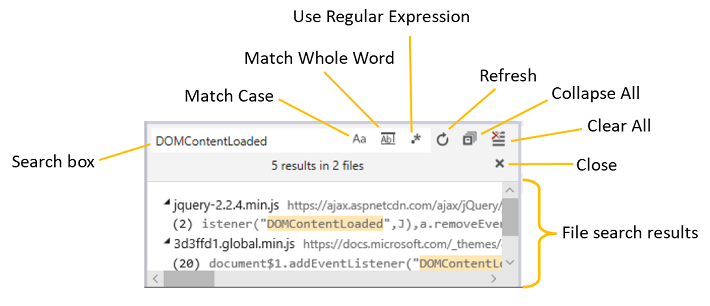
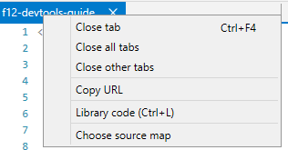
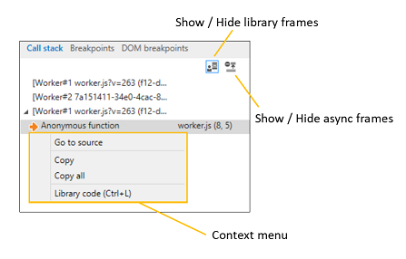
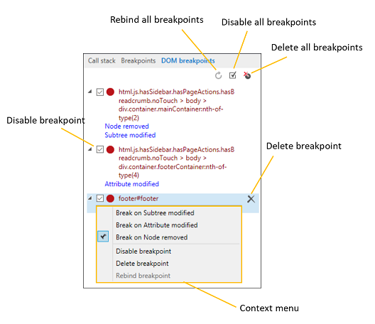

# <span data-ttu-id="3e4a3-104">Depurador-DevTools (EdgeHTML)</span><span class="sxs-lookup"><span data-stu-id="3e4a3-104">Debugger - DevTools (EdgeHTML)</span></span>

<span data-ttu-id="3e4a3-105">Use o **depurador** para depurar o código, definir inspeções e pontos de interrupção, editar ao vivo seu código e inspecionar os caches.</span><span class="sxs-lookup"><span data-stu-id="3e4a3-105">Use the **Debugger** to step through code, set watches and breakpoints, live edit your code and inspect your caches.</span></span> <span data-ttu-id="3e4a3-106">Teste e solucione o problema do seu código:</span><span class="sxs-lookup"><span data-stu-id="3e4a3-106">Test and troubleshoot your code by:</span></span>

- <span data-ttu-id="3e4a3-107">[Procurando](#resource-picker) e [procurando](#file-search) código de seus arquivos de origem carregados</span><span class="sxs-lookup"><span data-stu-id="3e4a3-107">[Browsing](#resource-picker) and [searching](#file-search) code from your loaded source files</span></span>
- <span data-ttu-id="3e4a3-108">[Controlando o fluxo de execução](#toolbar) enquanto você percorre o código</span><span class="sxs-lookup"><span data-stu-id="3e4a3-108">[Controlling the execution flow](#toolbar) as you step through your code</span></span>
- <span data-ttu-id="3e4a3-109">[Gerenciamento de recursos de armazenamento de página](./storage.md#cache-manager), incluindo os [funcionários do serviço e o cache](./service-workers.md), [os cookies](./storage.md#cookies-list) e o [armazenamento na Web](./storage.md#local-and-session-storage-managers)</span><span class="sxs-lookup"><span data-stu-id="3e4a3-109">[Managing page storage resources](./storage.md#cache-manager), including the [service workers and cache](./service-workers.md), [cookies](./storage.md#cookies-list) and [web storage](./storage.md#local-and-session-storage-managers)</span></span>  
- <span data-ttu-id="3e4a3-110">[Definir pontos de interrupção e editar ao vivo](#debug-window) seu código durante a execução</span><span class="sxs-lookup"><span data-stu-id="3e4a3-110">[Setting breakpoints and live editing](#debug-window) your code as it runs</span></span>
- <span data-ttu-id="3e4a3-111">[Rastrear e editar as variáveis locais](#watches) enquanto você depura</span><span class="sxs-lookup"><span data-stu-id="3e4a3-111">[Tracking and editing local variables](#watches) as you debug</span></span>
- <span data-ttu-id="3e4a3-112">[Ocultar ou mostrar o código assíncrono e o código da biblioteca](#call-stack) da pilha de chamadas conforme necessário</span><span class="sxs-lookup"><span data-stu-id="3e4a3-112">[Hiding or showing asynchronous code and library code](#call-stack) from your callstack as needed</span></span>
- <span data-ttu-id="3e4a3-113">[Adicionando pontos de interrupção especializados](#breakpoints) para XMLHttpRequests, eventos e [mutações dom](#dom-breakpoints)</span><span class="sxs-lookup"><span data-stu-id="3e4a3-113">[Adding specialized breakpoints](#breakpoints) for XmlHttpRequests, events and [DOM mutations](#dom-breakpoints)</span></span>


<span data-ttu-id="3e4a3-115">Há três maneiras de iniciar uma sessão de depuração.</span><span class="sxs-lookup"><span data-stu-id="3e4a3-115">There are three ways to begin a debugging session.</span></span>

1. **<span data-ttu-id="3e4a3-116">Definir um ponto de interrupção.</span><span class="sxs-lookup"><span data-stu-id="3e4a3-116">Set a breakpoint.</span></span>** <span data-ttu-id="3e4a3-117">Quando a execução do seu código chegar, você entrará no depurador e poderá percorrer o código.</span><span class="sxs-lookup"><span data-stu-id="3e4a3-117">When the execution of your code reaches it, you'll enter the debugger and be able to step through your code.</span></span>
2. **<span data-ttu-id="3e4a3-118">Iniciar uma pausa no código.</span><span class="sxs-lookup"><span data-stu-id="3e4a3-118">Initiate a break in code.</span></span>** <span data-ttu-id="3e4a3-119">Clique no botão da barra de ferramentas de [**quebra**](#toolbar) (ícone de*pausa* ) ou `Ctrl+Shift+B` .</span><span class="sxs-lookup"><span data-stu-id="3e4a3-119">Click the [**Break**](#toolbar) (*pause* icon) toolbar button or `Ctrl+Shift+B`.</span></span> <span data-ttu-id="3e4a3-120">O depurador será interrompido na próxima instrução de execução.</span><span class="sxs-lookup"><span data-stu-id="3e4a3-120">The debugger will break on the next statement of execution.</span></span>
3. **<span data-ttu-id="3e4a3-121">Defina o comportamento da exceção.</span><span class="sxs-lookup"><span data-stu-id="3e4a3-121">Set exception behavior.</span></span>** <span data-ttu-id="3e4a3-122">Use o menu [**alterar comportamento de exceção**](#toolbar) ( `Ctrl+Shift+E` ) para invadir o depurador quando o código gera uma exceção.</span><span class="sxs-lookup"><span data-stu-id="3e4a3-122">Use the [**Change exception behavior**](#toolbar) menu (`Ctrl+Shift+E`) to break into the debugger when your code throws an exception.</span></span> <span data-ttu-id="3e4a3-123">Por padrão, o depurador é definido para *nunca interromper em exceções*, mas ele é registrado no console.</span><span class="sxs-lookup"><span data-stu-id="3e4a3-123">By default, the debugger is set to *Never break on exceptions*, but they are logged to the console.</span></span>

## <span data-ttu-id="3e4a3-124">Seletor de recursos</span><span class="sxs-lookup"><span data-stu-id="3e4a3-124">Resource picker</span></span>

<span data-ttu-id="3e4a3-125">Geralmente, a primeira etapa na depuração é definir pontos de interrupção no código que você está procurando para solucionar o problema.</span><span class="sxs-lookup"><span data-stu-id="3e4a3-125">Often the first step in debugging is to set breakpoints in the code you're looking to troubleshoot.</span></span> <span data-ttu-id="3e4a3-126">Você pode encontrar todos os arquivos de código carregados pela página no painel do *seletor de recursos* , incluindo arquivos *. html,. css* e *. js* .</span><span class="sxs-lookup"><span data-stu-id="3e4a3-126">You can find all the code files currently loaded by the page from the *Resource picker* pane, including *.html, .css* and *.js* files.</span></span>

 <span data-ttu-id="3e4a3-127">Clicar em uma entrada de arquivo abrirá uma guia para esse arquivo na [janela de depuração](#debug-window) e colocará em negrito o texto do nome do arquivo para indicar isso (como o nome de arquivo do *devtools* está na ilustração acima).</span><span class="sxs-lookup"><span data-stu-id="3e4a3-127">Clicking on a file entry will open a tab for that file in the [Debug window](#debug-window) and bold the text of the file name to indicate this (as *devtools-guide* file name is in the illustration above).</span></span> <span data-ttu-id="3e4a3-128">Em seguida, você pode definir pontos de interrupção nesse arquivo a partir da [janela de depuração](#debug-window).</span><span class="sxs-lookup"><span data-stu-id="3e4a3-128">You can then set breakpoints within that file from the [Debug window](#debug-window).</span></span>


<span data-ttu-id="3e4a3-130">No menu de contexto do *seletor de recursos* , você também pode marcar um arquivo como **código de biblioteca** ( `Ctrl+L` ), oferecendo a opção de [ignorar o código no depurador](#debug-window) e [ocultá-lo no painel **pilha de chamadas** ](#call-stack).</span><span class="sxs-lookup"><span data-stu-id="3e4a3-130">From the *Resource picker* context menu, you can also mark a file as **library code** (`Ctrl+L`), giving you the option to [skip over that code in the debugger](#debug-window) and [hide it from the **Call stack** pane](#call-stack).</span></span> <span data-ttu-id="3e4a3-131">Clicar (ou `Ctrl+L` ) novamente alternará o arquivo de volta para o valor anterior \*\* como código ou *código da biblioteca*.</span><span class="sxs-lookup"><span data-stu-id="3e4a3-131">Clicking (or `Ctrl+L`) again will toggle the file back to its previous value as *my code* or *library code*.</span></span>

### <span data-ttu-id="3e4a3-132">Pesquisa de arquivos</span><span class="sxs-lookup"><span data-stu-id="3e4a3-132">File search</span></span>

<span data-ttu-id="3e4a3-133">Use o comando *Find in Files* ( `Ctrl` + `Shift` + `F` ) quando você tiver uma cadeia de caracteres específica de código que você está tentando encontrar na fonte.</span><span class="sxs-lookup"><span data-stu-id="3e4a3-133">Use the *Find in files* command (`Ctrl`+`Shift`+`F`) when you have a specific string of code you're trying to find in the source.</span></span> <span data-ttu-id="3e4a3-134">A barra de ferramentas fornece opções de pesquisa diferentes, incluindo expressões regulares.</span><span class="sxs-lookup"><span data-stu-id="3e4a3-134">The toolbar provides different search options, including regular expressions.</span></span> <span data-ttu-id="3e4a3-135">Clicar em um resultado de pesquisa focalizará a *janela de depuração* no arquivo e na linha especificados.</span><span class="sxs-lookup"><span data-stu-id="3e4a3-135">Clicking on a search result will focus the *Debug window* on the specified file and line.</span></span>



## <span data-ttu-id="3e4a3-137">Janela de depuração</span><span class="sxs-lookup"><span data-stu-id="3e4a3-137">Debug window</span></span>

<span data-ttu-id="3e4a3-138">A *janela de depuração* é onde você define seus pontos de interrupção, percorre o código e edita o script durante a depuração.</span><span class="sxs-lookup"><span data-stu-id="3e4a3-138">The *Debug window* is where you set your breakpoints, step through code, and live edit your script as you debug.</span></span> <span data-ttu-id="3e4a3-139">Clique à esquerda de qualquer comando de script para adicionar (ou remover) um **ponto de interrupção**.</span><span class="sxs-lookup"><span data-stu-id="3e4a3-139">Click to the left of any script command to add (or remove) a **Breakpoint**.</span></span> <span data-ttu-id="3e4a3-140">Use o menu de contexto ou o painel de contexto do clique com o botão direito do mouse para *Adicionar uma condição* ao ponto [**de interrupção fornecendo**](#breakpoints) uma expressão lógica que faz com que o depurador seja interrompido se for avaliado como *verdadeiro* nesse local.</span><span class="sxs-lookup"><span data-stu-id="3e4a3-140">Use the right-click context menu or [**Breakpoints**](#breakpoints) pane to *Add a condition* to the breakpoint by supplying a logical expression that causes the debugger to break if it evaluates *True* at that location.</span></span>


<span data-ttu-id="3e4a3-142">Outros recursos da janela de depuração incluem controles para:</span><span class="sxs-lookup"><span data-stu-id="3e4a3-142">Other features of the debug window include controls for:</span></span>

### <span data-ttu-id="3e4a3-143">1. edição de código</span><span class="sxs-lookup"><span data-stu-id="3e4a3-143">1. Code editing</span></span>

<span data-ttu-id="3e4a3-144">Você pode editar o JavaScript ao vivo durante uma sessão de depuração.</span><span class="sxs-lookup"><span data-stu-id="3e4a3-144">You can edit your JavaScript live during a debugging session.</span></span> <span data-ttu-id="3e4a3-145">Depois de fazer as alterações, clique em <strong> Salvar </strong> ( `Ctrl+S` ) para testar as alterações na próxima vez que a seção do código for executada.</span><span class="sxs-lookup"><span data-stu-id="3e4a3-145">Once you make your changes, click <strong>Save</strong> (`Ctrl+S`) to test your changes next time that section of code runs.</span></span> <span data-ttu-id="3e4a3-146">Se você tiver alterações de código não salvas, um asterisco (\ \*) será exibido antes do nome do arquivo na guia da *janela de depuração* .</span><span class="sxs-lookup"><span data-stu-id="3e4a3-146">If you have unsaved code changes, an asterisk (\*) will appear before the file name in the *Debug window* tab.</span></span>

<span data-ttu-id="3e4a3-147">Clique no botão **comparar documento com o original** para exibir a comparação do que você alterou.</span><span class="sxs-lookup"><span data-stu-id="3e4a3-147">Click the **Compare document to original** button to view the diff of what you changed.</span></span>


<span data-ttu-id="3e4a3-149">Lembre-se das seguintes restrições:</span><span class="sxs-lookup"><span data-stu-id="3e4a3-149">Please be aware of the following constraints:</span></span>

- <span data-ttu-id="3e4a3-150">A edição de script funciona apenas em arquivos *. js* externos (e não inseridos `<script>` em *. html*)</span><span class="sxs-lookup"><span data-stu-id="3e4a3-150">Script editing only works in external *.js* files (and not embedded `<script>` within *.html*)</span></span>
- <span data-ttu-id="3e4a3-151">As edições são salvas na memória e liberadas quando o documento é recarregado, portanto, você não poderá executar edições dentro de um `DOMContentLoaded` manipulador, por exemplo</span><span class="sxs-lookup"><span data-stu-id="3e4a3-151">Edits are saved in memory and flushed when the document is reloaded, thus you won't be able to run edits inside a `DOMContentLoaded` handler, for example</span></span>
- <span data-ttu-id="3e4a3-152">No momento, não há nenhuma maneira (como a opção **salvar como** ) para salvar suas edições em disco a partir da devtools</span><span class="sxs-lookup"><span data-stu-id="3e4a3-152">Currently there's no way (such as a **Save As** option) to save your edits to disk from the DevTools</span></span>

### <span data-ttu-id="3e4a3-153">2. formatação de código</span><span class="sxs-lookup"><span data-stu-id="3e4a3-153">2. Code formatting</span></span>

<span data-ttu-id="3e4a3-154">Use esses controles para formatar o código minified para melhorar a legibilidade durante a depuração:</span><span class="sxs-lookup"><span data-stu-id="3e4a3-154">Use these controls to format minified code for better readability as you debug:</span></span>

#### <span data-ttu-id="3e4a3-155">Superimposição ( `Ctrl+Shift+P` )</span><span class="sxs-lookup"><span data-stu-id="3e4a3-155">Pretty print (`Ctrl+Shift+P`)</span></span> 
<span data-ttu-id="3e4a3-156">Adiciona quebras de linha e alinhamento de chaves por convenções JavaScript.</span><span class="sxs-lookup"><span data-stu-id="3e4a3-156">Adds line breaks and curly brace alignment per JavaScript conventions.</span></span> <span data-ttu-id="3e4a3-157">Até mesmo código compactado que tenha sido tornado mais legível com essa opção pode ter função, seletor e nomes de variáveis muito diferentes dos em seu código-fonte original.</span><span class="sxs-lookup"><span data-stu-id="3e4a3-157">Even compressed code that's been made more readable with this option may have function, selector, and variable names that are much different than in your original source code.</span></span> <span data-ttu-id="3e4a3-158">Nesses casos, a opção [*alternar mapas de origem*](#source-maps) pode estar disponível.</span><span class="sxs-lookup"><span data-stu-id="3e4a3-158">In these cases, the [*Toggle source maps*](#source-maps) option might be available.</span></span>

#### <span data-ttu-id="3e4a3-159">Quebra automática de texto ( `Alt+W` )</span><span class="sxs-lookup"><span data-stu-id="3e4a3-159">Word wrap (`Alt+W`)</span></span>
<span data-ttu-id="3e4a3-160">Ajusta o código para caber nas margens atuais da janela de depuração (eliminando a necessidade de rolagem horizontal).</span><span class="sxs-lookup"><span data-stu-id="3e4a3-160">Adjusts code to fit within the current margins of the debug window (eliminating the need for horizontal scrolling).</span></span>

### <span data-ttu-id="3e4a3-161">3. escopo de código</span><span class="sxs-lookup"><span data-stu-id="3e4a3-161">3. Code scoping</span></span>

<span data-ttu-id="3e4a3-162">Você pode direcionar o depurador para ignorar certos arquivos com o botão **Marcar como código da biblioteca** ( `Ctrl+L` ).</span><span class="sxs-lookup"><span data-stu-id="3e4a3-162">You can direct the debugger to ignore certain files with the **Mark as library code** (`Ctrl+L`) button.</span></span> <span data-ttu-id="3e4a3-163">Por padrão, o botão [**depurar apenas meu código**](#toolbar) está ativado, o que significa que o depurador ignorará todos os arquivos que você marca como *código da biblioteca* e eles não aparecerão na [pilha de chamadas](#call-stack)do depurador.</span><span class="sxs-lookup"><span data-stu-id="3e4a3-163">By default, the [**Debug just my code**](#toolbar) toolbar button is on, meaning that the debugger will skip over any files that you mark as *library code* and they will not appear in the debugger [call stack](#call-stack).</span></span> <span data-ttu-id="3e4a3-164">Ao pressionar o botão (**Marcar como meu código**), o `Ctrl+L` sinalizador será removido.</span><span class="sxs-lookup"><span data-stu-id="3e4a3-164">Depressing the button (**Mark as my code**, `Ctrl+L`) will remove this flag.</span></span>

<span data-ttu-id="3e4a3-165">Para acompanhar bibliotecas em sessões de depuração, você pode editar esses arquivos para manter uma lista padrão ou adicionar caracteres curinga para um domínio ou tipo de arquivo:</span><span class="sxs-lookup"><span data-stu-id="3e4a3-165">For keeping track of libraries across debugging sessions, you can edit these files to maintain a default list or add wildcards for a domain or file type:</span></span>

```JavaScript
%APPDATA%\..\LocalLow\Microsoft\F12\header\MyCode.json and %APPDATA%\..\Local\Microsoft\F12\header\MyCode.json
```

#### <span data-ttu-id="3e4a3-166">Mapas de origem</span><span class="sxs-lookup"><span data-stu-id="3e4a3-166">Source maps</span></span>

<span data-ttu-id="3e4a3-167">Você verá o botão **alternar mapas de origem** habilitado para o código escrito em uma linguagem que é compilada em JavaScript ou CSS, que fornece um *mapa de origem* (um mapeamento de arquivo intermediário para a fonte original).</span><span class="sxs-lookup"><span data-stu-id="3e4a3-167">You will see the **Toggle source maps** button enabled for code written in a language that compiles to JavaScript or CSS and that provides a *source map* (an intermediate file mapping to the original source).</span></span> <span data-ttu-id="3e4a3-168">Essa opção direciona o depurador a apresentar a fonte original para usar para depuração (em vez do arquivo compilado que está *realmente* sendo executado no navegador).</span><span class="sxs-lookup"><span data-stu-id="3e4a3-168">This option directs the debugger to present the original source to use for debugging (rather than the compiled file that's *actually* running in the browser).</span></span>

<span data-ttu-id="3e4a3-169">O DevTools verificará se o compilador que gerou o arquivo JavaScript incluía um comentário com o nome do arquivo de mapa.</span><span class="sxs-lookup"><span data-stu-id="3e4a3-169">The DevTools will check if the compiler that generated the JavaScript file included a comment with the name of the map file.</span></span> <span data-ttu-id="3e4a3-170">Por exemplo, se um compilador tiver sido compactado *myfile.js* para *myfile.min.js*, ele também pode gerar um arquivo de mapa, *myfile.min.js. map* e incluir um comentário no arquivo compactado da seguinte forma:</span><span class="sxs-lookup"><span data-stu-id="3e4a3-170">For example, if a compiler compressed *myfile.js* to *myfile.min.js*, it might also generate a map file, *myfile.min.js.map* and include a comment in the compressed file like this:</span></span>

```JavaScript
//# sourceMappingURL=myfile.min.js.map
```



<span data-ttu-id="3e4a3-172">Se o DevTools não conseguir localizar o mapa automaticamente, você pode escolher um mapa de origem para esse arquivo.</span><span class="sxs-lookup"><span data-stu-id="3e4a3-172">If the DevTools can't find the map automatically, you can choose a source map for that file.</span></span> <span data-ttu-id="3e4a3-173">Clique com o botão direito do mouse na guia do arquivo para localizar a opção **escolher mapa do código-fonte** .</span><span class="sxs-lookup"><span data-stu-id="3e4a3-173">Right-click the file's tab to find the **Choose source map** option.</span></span> 

## <span data-ttu-id="3e4a3-174">Barra de ferramentas</span><span class="sxs-lookup"><span data-stu-id="3e4a3-174">Toolbar</span></span>

<span data-ttu-id="3e4a3-175">Use a *barra de ferramentas* do depurador para controlar o modo de depurar o código e o código para percorrer ou ignorar.</span><span class="sxs-lookup"><span data-stu-id="3e4a3-175">Use the debugger *Toolbar* to control how you step through code, and what code to step through or ignore.</span></span> <span data-ttu-id="3e4a3-176">Aqui você também pode fazer uma pesquisa de texto completo em seus arquivos de código para cadeias de caracteres específicas.</span><span class="sxs-lookup"><span data-stu-id="3e4a3-176">From here you can also do a full text search across your code files for specific strings.</span></span>


### <span data-ttu-id="3e4a3-178">1. Continue ( `F5` )/Break ( `Ctrl+Shift+B` )</span><span class="sxs-lookup"><span data-stu-id="3e4a3-178">1. Continue (`F5`) / Break (`Ctrl+Shift+B`)</span></span>
 <span data-ttu-id="3e4a3-179">**Continue** ( `F5` ) continua a execução do código para o próximo ponto de interrupção.</span><span class="sxs-lookup"><span data-stu-id="3e4a3-179">**Continue** (`F5`) continues code execution to the next breakpoint.</span></span> <span data-ttu-id="3e4a3-180">Se `F5` você se soltar, as quebras antigas serão removidas repetidamente até você liberá-la.</span><span class="sxs-lookup"><span data-stu-id="3e4a3-180">Holding down `F5` will repeatedly move past breaks until you release it.</span></span> 

 <span data-ttu-id="3e4a3-181">**Break** ( `Ctrl+Shift+B` ) entrará no depurador após executar a próxima instrução.</span><span class="sxs-lookup"><span data-stu-id="3e4a3-181">**Break** (`Ctrl+Shift+B`) will break into the debugger after running the next statement.</span></span>

### <span data-ttu-id="3e4a3-182">2. funções de etapa ( `F11` , `Ctrl+F10` , `Shift+F11` )</span><span class="sxs-lookup"><span data-stu-id="3e4a3-182">2. Step functions (`F11`, `Ctrl+F10`, `Shift+F11`)</span></span>
 <span data-ttu-id="3e4a3-183">**Step Into** ( `F11` ) etapas para a função que está sendo chamada.</span><span class="sxs-lookup"><span data-stu-id="3e4a3-183">**Step into** (`F11`) steps into the function being called.</span></span> 

 <span data-ttu-id="3e4a3-184">\*\*\*\* `Ctrl+F10` Etapas de passar sobre a função que estão sendo chamadas.</span><span class="sxs-lookup"><span data-stu-id="3e4a3-184">**Step over** (`Ctrl+F10`) steps over the function being called.</span></span> 

 <span data-ttu-id="3e4a3-185">**Step Out** ( `Shift+F11` ) percorre a função atual e para a função de chamadas.</span><span class="sxs-lookup"><span data-stu-id="3e4a3-185">**Step out** (`Shift+F11`) steps out of the current function and into the calling function.</span></span> 

 <span data-ttu-id="3e4a3-186">O depurador passará para a próxima instrução se não estiver em uma função quando esses comandos forem usados.</span><span class="sxs-lookup"><span data-stu-id="3e4a3-186">The debugger will step to the next statement if it is not at a function when these commands are used.</span></span>

### <span data-ttu-id="3e4a3-187">3. pausa no novo trabalhador ( `Ctrl+Shift+W` )</span><span class="sxs-lookup"><span data-stu-id="3e4a3-187">3. Break on new worker (`Ctrl+Shift+W`)</span></span>
 <span data-ttu-id="3e4a3-188">Quebras na criação de um novo [trabalhador da Web](https://developer.mozilla.org/docs/Web/API/Web_Workers_API/Using_web_workers).</span><span class="sxs-lookup"><span data-stu-id="3e4a3-188">Breaks on the creation of a new [web worker](https://developer.mozilla.org/docs/Web/API/Web_Workers_API/Using_web_workers).</span></span>

### <span data-ttu-id="3e4a3-189">4. controle de exceção</span><span class="sxs-lookup"><span data-stu-id="3e4a3-189">4. Exception control</span></span>
<span data-ttu-id="3e4a3-190">**Alterar comportamento de exceção** ( `Ctrl+Shift+E` ) abre opções para alterar a forma como o depurador reage a exceções.</span><span class="sxs-lookup"><span data-stu-id="3e4a3-190">**Change exception behavior** (`Ctrl+Shift+E`) opens options to change how the debugger reacts to exceptions.</span></span> <span data-ttu-id="3e4a3-191">Por padrão, exceções são ignoradas pelo depurador e conectadas ao [**console**](./console.md).</span><span class="sxs-lookup"><span data-stu-id="3e4a3-191">By default exceptions are ignored by the debugger and logged to the [**Console**](./console.md).</span></span> <span data-ttu-id="3e4a3-192">Você pode optar por *interromper todas as exceções*ou apenas aquelas que não sejam manipuladas por `try...catch` instruções em seu código (*interromper em exceções sem tratamento*).</span><span class="sxs-lookup"><span data-stu-id="3e4a3-192">You can choose to *Break on all exceptions*, or just those not being handled by `try...catch` statements in your code (*Break on unhandled exceptions*).</span></span>

### <span data-ttu-id="3e4a3-193">5. exibir resultados da pesquisa</span><span class="sxs-lookup"><span data-stu-id="3e4a3-193">5. View search results</span></span>
<span data-ttu-id="3e4a3-194">(Atualmente desabilitado.) **Mostrar/ocultar resultados** alterna a exibição dos resultados da pesquisa [*localizar nos arquivos*](#6-find-in-files-ctrlf) .</span><span class="sxs-lookup"><span data-stu-id="3e4a3-194">(Currently disabled.) **Show/Hide results** toggles the display of [*Find in files*](#6-find-in-files-ctrlf) search results.</span></span>

### <span data-ttu-id="3e4a3-195">6. localizar nos arquivos ( `Ctrl+F` )</span><span class="sxs-lookup"><span data-stu-id="3e4a3-195">6. Find in files (`Ctrl+F`)</span></span>
 <span data-ttu-id="3e4a3-196">**Find in Files** ( `Ctrl+F` ) executa uma pesquisa de texto em todos os arquivos carregados dentro do [*seletor de recursos*](#resource-picker).</span><span class="sxs-lookup"><span data-stu-id="3e4a3-196">**Find in files** (`Ctrl+F`) runs a text search through all the loaded files within the [*Resource picker*](#resource-picker).</span></span> <span data-ttu-id="3e4a3-197">Se o texto for encontrado, ele abrirá o primeiro arquivo correspondente à cadeia de caracteres de pesquisa.</span><span class="sxs-lookup"><span data-stu-id="3e4a3-197">If the text is found, it opens the first file matching the search string.</span></span> <span data-ttu-id="3e4a3-198">Pressionar `Enter` ou `F3` leva você para a próxima correspondência.</span><span class="sxs-lookup"><span data-stu-id="3e4a3-198">Pressing `Enter` or `F3` takes you to the next match.</span></span>

### <span data-ttu-id="3e4a3-199">7. depurar apenas meu código ( `Ctrl+J` )</span><span class="sxs-lookup"><span data-stu-id="3e4a3-199">7. Debug just my code (`Ctrl+J`)</span></span>
 <span data-ttu-id="3e4a3-200">**Depurar apenas meu código** ( `Ctrl+J` ) atua como uma alternância para incluir ou excluir todos os arquivos que foram marcados como [código de biblioteca](#3-code-scoping) enquanto você percorre o depurador.</span><span class="sxs-lookup"><span data-stu-id="3e4a3-200">**Debug just my code** (`Ctrl+J`) acts as a toggle to include or exclude all the files that have been marked as [library code](#3-code-scoping) as you step through the debugger.</span></span>

### <span data-ttu-id="3e4a3-201">8. conexão do depurador</span><span class="sxs-lookup"><span data-stu-id="3e4a3-201">8. Debugger connection</span></span>
<span data-ttu-id="3e4a3-202">O **depurador de desconexão/conexão** é essencialmente a opção de ativar/desativar para o depurador.</span><span class="sxs-lookup"><span data-stu-id="3e4a3-202">**Disconnect/Connect debugger** is essentially the on/off switch for the debugger.</span></span>

## <span data-ttu-id="3e4a3-203">Watch</span><span class="sxs-lookup"><span data-stu-id="3e4a3-203">Watches</span></span>

<span data-ttu-id="3e4a3-204">Use o painel **inspeções** para procurar um catálogo de todos os objetos e variáveis (**locais**), tanto no escopo local quanto global, disponível para a instrução que é o foco da quebra atual no depurador.</span><span class="sxs-lookup"><span data-stu-id="3e4a3-204">Use the **Watches** pane to browse a catalog of all objects and variables (**Locals**), both in the local and global scope, available to the statement that is the focus of the current break in the debugger.</span></span>


<span data-ttu-id="3e4a3-206">Você pode acompanhar o valor de variáveis específicas à medida que elas passam e saem do escopo adicionando uma inspeção (**Adicionar inspeção**, `Ctrl+W` ) e modificar os valores editáveis clicando duas vezes nele ou selecionando **Editar valor** no menu de *contexto*.</span><span class="sxs-lookup"><span data-stu-id="3e4a3-206">You can track the value of specific variables as they pass in and out of scope by adding a watch (**Add watch**, `Ctrl+W`) and modify any editable values by double-clicking on it or by selecting **Edit value** from the *Context menu*.</span></span> <span data-ttu-id="3e4a3-207">Limpe seus relógios usando os botões **excluir** ( `Ctrl+D` )/ **excluir tudo** ou do menu de contexto.</span><span class="sxs-lookup"><span data-stu-id="3e4a3-207">Clear your watches using the **Delete** (`Ctrl+D`) / **Delete all** buttons or from the context menu.</span></span> 

## <span data-ttu-id="3e4a3-208">Detalhes</span><span class="sxs-lookup"><span data-stu-id="3e4a3-208">Details</span></span>

<span data-ttu-id="3e4a3-209">O painel de *detalhes* inclui as guias [**pilha de chamadas**](#call-stack), [**pontos de interrupção**](#breakpoints) e [**pontos de interrupção dom**](#dom-breakpoints) .</span><span class="sxs-lookup"><span data-stu-id="3e4a3-209">The *Details* pane includes the [**Callstack**](#call-stack), [**Breakpoints**](#breakpoints) and [**DOM breakpoints**](#dom-breakpoints) tabs.</span></span>

### <span data-ttu-id="3e4a3-210">Pilha de chamadas</span><span class="sxs-lookup"><span data-stu-id="3e4a3-210">Call stack</span></span>

<span data-ttu-id="3e4a3-211">A guia **pilha de chamadas** mostra a cadeia de funções que levaram ao ponto de execução atual.</span><span class="sxs-lookup"><span data-stu-id="3e4a3-211">The **Call stack** tab shows the chain of functions that led to the current point of execution.</span></span> <span data-ttu-id="3e4a3-212">A função atual aparece na parte superior e as funções de chamada aparecem abaixo dela em ordem inversa.</span><span class="sxs-lookup"><span data-stu-id="3e4a3-212">The current function appears at the top, and the calling functions appear below it in reverse order.</span></span>



<span data-ttu-id="3e4a3-214">O botão **Mostrar/ocultar quadros da biblioteca** ( `Ctrl+Shift+J` ) alterna a saída do [código da biblioteca](#3-code-scoping) da pilha de chamadas.</span><span class="sxs-lookup"><span data-stu-id="3e4a3-214">The **Show/Hide library frames** button (`Ctrl+Shift+J`) toggles the output of [library code](#3-code-scoping) from the call stack.</span></span> <span data-ttu-id="3e4a3-215">Use a opção de **código de biblioteca** ( `Ctrl+L` ) no menu de *contexto* clique com o botão direito do mouse para marcar (ou desmarcar) a fonte do quadro selecionado como código de biblioteca.</span><span class="sxs-lookup"><span data-stu-id="3e4a3-215">Use the **Library code** option (`Ctrl+L`) from the right-click *Context menu* to mark (or unmark) the source of the selected frame as library code.</span></span> 

<span data-ttu-id="3e4a3-216">O botão **Mostrar/ocultar quadros assíncronos** alterna a exibição de raízes para chamadas de função assíncronas.</span><span class="sxs-lookup"><span data-stu-id="3e4a3-216">The **Show/Hide async frames** button toggles the display of roots for asynchronous function calls.</span></span>

### <span data-ttu-id="3e4a3-217">Pontos de interrupção</span><span class="sxs-lookup"><span data-stu-id="3e4a3-217">Breakpoints</span></span>

<span data-ttu-id="3e4a3-218">Na guia **pontos de interrupção** , você pode gerenciar pontos de interrupção e tracepoints de evento, incluindo a configuração de condições, a desativação e a exclusão deles.</span><span class="sxs-lookup"><span data-stu-id="3e4a3-218">From the **Breakpoints** tab, you can manage you breakpoints and event tracepoints, including setting conditions, disabling and deleting them.</span></span>


<span data-ttu-id="3e4a3-220">Aqui está um resumo dos diferentes tipos de pontos de interrupção que você pode usar para depuração.</span><span class="sxs-lookup"><span data-stu-id="3e4a3-220">Here's a summary of the different types of breakpoints you can use for debugging.</span></span>

<span data-ttu-id="3e4a3-221">Tipo de ponto de interrupção</span><span class="sxs-lookup"><span data-stu-id="3e4a3-221">Breakpoint type</span></span> | <span data-ttu-id="3e4a3-222">Descrição</span><span class="sxs-lookup"><span data-stu-id="3e4a3-222">Description</span></span> | <span data-ttu-id="3e4a3-223">Como configurá-lo</span><span class="sxs-lookup"><span data-stu-id="3e4a3-223">How to set it</span></span>
:------------ | :------------ | :--------
**<span data-ttu-id="3e4a3-224">Interrupção</span><span class="sxs-lookup"><span data-stu-id="3e4a3-224">Breakpoint</span></span>** | <span data-ttu-id="3e4a3-225">Quebra no depurador logo antes da linha especificada do código ser executada.</span><span class="sxs-lookup"><span data-stu-id="3e4a3-225">Breaks into the debugger just before the specified line of code is executed.</span></span> <span data-ttu-id="3e4a3-226">Pontos de interrupção regulares são mais fáceis de definir se você tiver uma instrução por linha.</span><span class="sxs-lookup"><span data-stu-id="3e4a3-226">Regular breakpoints are easiest to set if you have one statement per line.</span></span> | <span data-ttu-id="3e4a3-227">Na [janela depurar](#debug-window), clique na margem esquerda ao lado de qualquer número de linha no código.</span><span class="sxs-lookup"><span data-stu-id="3e4a3-227">From the [Debug window](#debug-window), click in the left margin next to any line number in the code.</span></span> <span data-ttu-id="3e4a3-228">Um ponto vermelho é exibido e o ponto de interrupção é definido.</span><span class="sxs-lookup"><span data-stu-id="3e4a3-228">A red dot appears and the breakpoint is set.</span></span> <span data-ttu-id="3e4a3-229">Você pode saltar para a fonte de qualquer ponto de interrupção clicando em seu texto azul.</span><span class="sxs-lookup"><span data-stu-id="3e4a3-229">You can jump into the source of any breakpoint by clicking on its blue text.</span></span>
**<span data-ttu-id="3e4a3-230">Ponto de interrupção condicional</span><span class="sxs-lookup"><span data-stu-id="3e4a3-230">Conditional breakpoint</span></span>** | <span data-ttu-id="3e4a3-231">Quebras se a condição especificada for avaliada como *verdadeira*.</span><span class="sxs-lookup"><span data-stu-id="3e4a3-231">Breaks if the specified condition evaluates to *true*.</span></span> <span data-ttu-id="3e4a3-232">Isso é essencialmente um `if(condition)`  para quebrar o depurador.</span><span class="sxs-lookup"><span data-stu-id="3e4a3-232">This is essentially an `if(condition)`  for breaking into the debugger.</span></span>  | <span data-ttu-id="3e4a3-233">Na guia [pontos de interrupção](#breakpoints) , passe o mouse sobre um ponto de interrupção existente e clique no botão "lápis" (*Adicionar uma condição a esse ponto de interrupção*), clique com o botão direito do mouse em um ponto de interrupção existente e selecione **condição...** no menu de contexto.</span><span class="sxs-lookup"><span data-stu-id="3e4a3-233">From the [Breakpoints](#breakpoints) tab, hover over an existing breakpoint and click the "pencil" button (*Add a condition to this breakpoint*), right-click an existing breakpoint and select **Condition...** from the context menu.</span></span> <span data-ttu-id="3e4a3-234">Especifique a condição "se" a ser avaliada no local do ponto de interrupção.</span><span class="sxs-lookup"><span data-stu-id="3e4a3-234">Specify the "if" condition to be evaluated at the breakpoint location.</span></span> 
<span data-ttu-id="3e4a3-235">**Ponto de interrupção XMLHttpRequest** (w/condição opcional)</span><span class="sxs-lookup"><span data-stu-id="3e4a3-235">**XMLHttpRequest breakpoint** (w/optional condition)</span></span> | <span data-ttu-id="3e4a3-236">Quebras sempre que uma solicitação XMLHttpRequest (XHR) foi cumprida.</span><span class="sxs-lookup"><span data-stu-id="3e4a3-236">Breaks whenever a XMLHttpRequest (XHR) request has been fulfilled.</span></span> <span data-ttu-id="3e4a3-237">Você pode inspecionar o `response` objeto XHR no painel [**inspeções**](#watches) .</span><span class="sxs-lookup"><span data-stu-id="3e4a3-237">You can inspect the XHR `response` object from the [**Watches**](#watches) pane.</span></span> | <span data-ttu-id="3e4a3-238">Na guia [pontos de interrupção](#breakpoints) , clique no botão de *ponto de interrupção XMLHttpRequest* (círculo com setas para cima/para baixo).</span><span class="sxs-lookup"><span data-stu-id="3e4a3-238">From the [Breakpoints](#breakpoints) tab, click the *XMLHttpRequest breakpoint* button (circle with up/down arrows).</span></span> <span data-ttu-id="3e4a3-239">Você pode transformá-lo em um *ponto de interrupção condicional* , conforme descrito acima.</span><span class="sxs-lookup"><span data-stu-id="3e4a3-239">You can turn it into a *Conditional breakpoint* as described above.</span></span>
**<span data-ttu-id="3e4a3-240">Tracepoint de evento</span><span class="sxs-lookup"><span data-stu-id="3e4a3-240">Event tracepoint</span></span>** | <span data-ttu-id="3e4a3-241">Chamadas [`console.log()`](./console/console-api.md#logging-custom-messages) com uma cadeia de caracteres especificada em resposta a um evento específico.</span><span class="sxs-lookup"><span data-stu-id="3e4a3-241">Calls [`console.log()`](./console/console-api.md#logging-custom-messages) with a specified string in response to a specific event.</span></span> <span data-ttu-id="3e4a3-242">Use isso para instruções temporárias de log do console que você não deseja salvar diretamente no código do manipulador de eventos.</span><span class="sxs-lookup"><span data-stu-id="3e4a3-242">Use this for temporary console logging statements that you don't want to save directly in your event handler code.</span></span> | <span data-ttu-id="3e4a3-243">Na guia [pontos de interrupção](#breakpoints) , clique no botão *tracepoint de evento* (losango com raio).</span><span class="sxs-lookup"><span data-stu-id="3e4a3-243">From the [Breakpoints](#breakpoints) tab, click the *Event tracepoint* button (diamond with lightning bolt).</span></span> <span data-ttu-id="3e4a3-244">Selecione um tipo de **evento** para o gatilho e uma instrução de **rastreamento** para registro em log.</span><span class="sxs-lookup"><span data-stu-id="3e4a3-244">Select an **Event** type for the trigger and a **Trace** statement for logging.</span></span>
<span data-ttu-id="3e4a3-245">**Ponto de interrupção de evento** (c/condição opcional)</span><span class="sxs-lookup"><span data-stu-id="3e4a3-245">**Event breakpoint** (w/optional condition)</span></span> | <span data-ttu-id="3e4a3-246">Quebras sempre que um evento especificado é acionado.</span><span class="sxs-lookup"><span data-stu-id="3e4a3-246">Breaks whenever a specified event is fired.</span></span> | <span data-ttu-id="3e4a3-247">Na guia [pontos de interrupção](#breakpoints) , clique no botão de *ponto de interrupção de evento* (círculo com raio).</span><span class="sxs-lookup"><span data-stu-id="3e4a3-247">From the [Breakpoints](#breakpoints) tab, click the *Event breakpoint* button (circle with lightning bolt).</span></span> <span data-ttu-id="3e4a3-248">Selecione um tipo de **evento** para o gatilho e, opcionalmente, especifique uma instrução de **condição** .</span><span class="sxs-lookup"><span data-stu-id="3e4a3-248">Select an **Event** type for the trigger and optionally, specify a **Condition** statement.</span></span> 
**<span data-ttu-id="3e4a3-249">Ponto de interrupção DOM</span><span class="sxs-lookup"><span data-stu-id="3e4a3-249">DOM breakpoint</span></span>** | <span data-ttu-id="3e4a3-250">Quebras sempre que um elemento especificado na página é modificado, como quando sua subárvore é modificada, seus atributos mudam ou quando ele é desanexado do DOM.</span><span class="sxs-lookup"><span data-stu-id="3e4a3-250">Breaks whenever a specified element on the page is mutated, such as when its subtree is modified, its attributes change, or when it is detached from the DOM.</span></span> | <span data-ttu-id="3e4a3-251">Na guia [elementos](./elements/dom-breakpoints.md) , clique com o botão direito do mouse em um elemento de origem e selecione uma das opções de *pontos de interrupção do dom* .</span><span class="sxs-lookup"><span data-stu-id="3e4a3-251">From the [Elements](./elements/dom-breakpoints.md) tab, right-click on a source element and select from the *DOM Breakpoints* options.</span></span> <span data-ttu-id="3e4a3-252">Use a guia [**pontos de interrupção dom**](#dom-breakpoints) nos painéis de *depurador* ou *elementos* para gerenciar seus pontos de interrupção.</span><span class="sxs-lookup"><span data-stu-id="3e4a3-252">Use the [**DOM breakpoints**](#dom-breakpoints) tab in either the *Debugger* or *Elements* panels to manage your breakpoints.</span></span> 

<span data-ttu-id="3e4a3-253">Os pontos de interrupção condicionais e tracepoints têm acesso a todas as variáveis locais e globais no escopo quando elas falham no depurador.</span><span class="sxs-lookup"><span data-stu-id="3e4a3-253">Conditional breakpoints and tracepoints have access to all the local and global variables currently in scope when they break into the debugger.</span></span>

### <span data-ttu-id="3e4a3-254">Pontos de Interrupção DOM</span><span class="sxs-lookup"><span data-stu-id="3e4a3-254">DOM breakpoints</span></span>

<span data-ttu-id="3e4a3-255">Gerencie seus pontos de interrupção de mutação DOM na guia **pontos de interrupção dom** , incluindo desabilitar, excluir e revinculá-los.</span><span class="sxs-lookup"><span data-stu-id="3e4a3-255">Manage your DOM mutation breakpoints from the **DOM breakpoints** tab, including disabling, deleting and rebinding them.</span></span>  <span data-ttu-id="3e4a3-256">Os [pontos de interrupção dom podem ser definidos](./elements/dom-breakpoints.md) a partir do *modo de exibição de árvore HTML* no painel de **elementos** .</span><span class="sxs-lookup"><span data-stu-id="3e4a3-256">[DOM breakpoints can be set](./elements/dom-breakpoints.md) from the *HTML tree view* in the **Elements** panel.</span></span>



<span data-ttu-id="3e4a3-258">A guia *pontos de interrupção dom* no **depurador** fornece funcionalidade equivalente à guia *pontos de interrupção do dom*\* no painel de **elementos** .</span><span class="sxs-lookup"><span data-stu-id="3e4a3-258">The *DOM breakpoints* tab in the **Debugger** provides equivalent functionality to the *DOM breakpoints*\* tab on the **Elements** panel.</span></span>

<span data-ttu-id="3e4a3-259">Veja mais sobre os diferentes tipos de [pontos de interrupção dom](./elements/dom-breakpoints.md).</span><span class="sxs-lookup"><span data-stu-id="3e4a3-259">Here's more on the different types of [DOM breakpoints](./elements/dom-breakpoints.md).</span></span>

## <span data-ttu-id="3e4a3-260">Atalhos</span><span class="sxs-lookup"><span data-stu-id="3e4a3-260">Shortcuts</span></span>

### <span data-ttu-id="3e4a3-261">Atalhos da barra de ferramentas</span><span class="sxs-lookup"><span data-stu-id="3e4a3-261">Toolbar shortcuts</span></span>

<span data-ttu-id="3e4a3-262">Ação</span><span class="sxs-lookup"><span data-stu-id="3e4a3-262">Action</span></span> | <span data-ttu-id="3e4a3-263">Atalho</span><span class="sxs-lookup"><span data-stu-id="3e4a3-263">Shortcut</span></span>
:------------ | :-------------
<span data-ttu-id="3e4a3-264">Localizar</span><span class="sxs-lookup"><span data-stu-id="3e4a3-264">Find</span></span> | `Ctrl` + `F`
<span data-ttu-id="3e4a3-265">Continuar (a partir do ponto de interrupção)</span><span class="sxs-lookup"><span data-stu-id="3e4a3-265">Continue (from breakpoint)</span></span> | `F5` <span data-ttu-id="3e4a3-266">ou</span><span class="sxs-lookup"><span data-stu-id="3e4a3-266">or</span></span> `F8`
<span data-ttu-id="3e4a3-267">Continuação rápida</span><span class="sxs-lookup"><span data-stu-id="3e4a3-267">Fast continue</span></span> | <span data-ttu-id="3e4a3-268">Segure `F5` ou</span><span class="sxs-lookup"><span data-stu-id="3e4a3-268">Hold `F5` or</span></span> `F8`
<span data-ttu-id="3e4a3-269">Continuar e atualizar</span><span class="sxs-lookup"><span data-stu-id="3e4a3-269">Continue and refresh</span></span> | `Ctrl` + `Shift` + `F5`
<span data-ttu-id="3e4a3-270">Condicional</span><span class="sxs-lookup"><span data-stu-id="3e4a3-270">Break</span></span> | `Ctrl` + `Shift` + `B`
<span data-ttu-id="3e4a3-271">Depuração</span><span class="sxs-lookup"><span data-stu-id="3e4a3-271">Step into</span></span> | `F11`
<span data-ttu-id="3e4a3-272">Depuração de cima</span><span class="sxs-lookup"><span data-stu-id="3e4a3-272">Step over</span></span> | `F10`
<span data-ttu-id="3e4a3-273">Depurar</span><span class="sxs-lookup"><span data-stu-id="3e4a3-273">Step out</span></span> | `Shift` + `F11`
<span data-ttu-id="3e4a3-274">Interromper no novo trabalhador</span><span class="sxs-lookup"><span data-stu-id="3e4a3-274">Break on new worker</span></span> | `Ctrl` + `Shift` + `W`
<span data-ttu-id="3e4a3-275">Alterar comportamento de exceção (menu de abertura)</span><span class="sxs-lookup"><span data-stu-id="3e4a3-275">Change exception behavior (opens menu)</span></span> | `Ctrl` + `Shift` + `E`
<span data-ttu-id="3e4a3-276">Depurar apenas meu código</span><span class="sxs-lookup"><span data-stu-id="3e4a3-276">Debug just my code</span></span> | `Ctrl` + `J`

### <span data-ttu-id="3e4a3-277">Atalhos do seletor de recursos</span><span class="sxs-lookup"><span data-stu-id="3e4a3-277">Resource picker shortcuts</span></span>

<span data-ttu-id="3e4a3-278">Ação</span><span class="sxs-lookup"><span data-stu-id="3e4a3-278">Action</span></span> | <span data-ttu-id="3e4a3-279">Atalho</span><span class="sxs-lookup"><span data-stu-id="3e4a3-279">Shortcut</span></span>
:------------ | :-------------
<span data-ttu-id="3e4a3-280">Marcar como código do meu código/biblioteca</span><span class="sxs-lookup"><span data-stu-id="3e4a3-280">Mark as my code / library code</span></span> | `Ctrl` + `L`
<span data-ttu-id="3e4a3-281">Abrir arquivo</span><span class="sxs-lookup"><span data-stu-id="3e4a3-281">Open file</span></span> | `Ctrl`<span data-ttu-id="3e4a3-282"> + `O`, `Ctrl` + </span><span class="sxs-lookup"><span data-stu-id="3e4a3-282"> + `O`, `Ctrl` + </span></span>`P`
<span data-ttu-id="3e4a3-283">Pesquisar todos os arquivos</span><span class="sxs-lookup"><span data-stu-id="3e4a3-283">Search all files</span></span> | `Ctrl` + `Shift` + `F`

### <span data-ttu-id="3e4a3-284">Atalhos da janela depurar</span><span class="sxs-lookup"><span data-stu-id="3e4a3-284">Debug window shortcuts</span></span>

<span data-ttu-id="3e4a3-285">Ação</span><span class="sxs-lookup"><span data-stu-id="3e4a3-285">Action</span></span> | <span data-ttu-id="3e4a3-286">Atalho</span><span class="sxs-lookup"><span data-stu-id="3e4a3-286">Shortcut</span></span>
:------------ | :-------------
<span data-ttu-id="3e4a3-287">Remover ponto de interrupção</span><span class="sxs-lookup"><span data-stu-id="3e4a3-287">Remove breakpoint</span></span> | `F9`
<span data-ttu-id="3e4a3-288">Desabilitar ponto de interrupção</span><span class="sxs-lookup"><span data-stu-id="3e4a3-288">Disable breakpoint</span></span> | `Ctrl` + `F9`
<span data-ttu-id="3e4a3-289">Ponto de interrupção condicional...</span><span class="sxs-lookup"><span data-stu-id="3e4a3-289">Conditional breakpoint...</span></span> | `Alt` + `F9`
<span data-ttu-id="3e4a3-290">Copiar</span><span class="sxs-lookup"><span data-stu-id="3e4a3-290">Copy</span></span> | `Ctrl` + `C`
<span data-ttu-id="3e4a3-291">Salvar</span><span class="sxs-lookup"><span data-stu-id="3e4a3-291">Save</span></span> | `Ctrl` + `S`
<span data-ttu-id="3e4a3-292">Ir para a linha...</span><span class="sxs-lookup"><span data-stu-id="3e4a3-292">Go to line...</span></span> | `Ctrl` + `G`
<span data-ttu-id="3e4a3-293">Mostrar próxima instrução</span><span class="sxs-lookup"><span data-stu-id="3e4a3-293">Show next statement</span></span> | `Alt` + `Num` + `*`
<span data-ttu-id="3e4a3-294">Executar até o cursor</span><span class="sxs-lookup"><span data-stu-id="3e4a3-294">Run to cursor</span></span> | `Ctrl` + `F10`
<span data-ttu-id="3e4a3-295">Definir a próxima instrução</span><span class="sxs-lookup"><span data-stu-id="3e4a3-295">Set next statement</span></span> | `Ctrl` + `Shift` + `F10`
<span data-ttu-id="3e4a3-296">Mostrar no seletor de arquivos</span><span class="sxs-lookup"><span data-stu-id="3e4a3-296">Show in file picker</span></span> | `Ctrl` + `Alt` + `P`
<span data-ttu-id="3e4a3-297">Vá para definição em arquivo</span><span class="sxs-lookup"><span data-stu-id="3e4a3-297">Go to definition in file</span></span> | `Ctrl`+`D`
<span data-ttu-id="3e4a3-298">Localizar referências no arquivo</span><span class="sxs-lookup"><span data-stu-id="3e4a3-298">Find references in file</span></span> | `Ctrl` + `Shift` + `D`
<span data-ttu-id="3e4a3-299">Impressão bonita</span><span class="sxs-lookup"><span data-stu-id="3e4a3-299">Pretty print</span></span> | `Ctrl` + `Shift` + `P`
<span data-ttu-id="3e4a3-300">Quebra automática de texto</span><span class="sxs-lookup"><span data-stu-id="3e4a3-300">Word wrap</span></span> | `Alt` + `W`
<span data-ttu-id="3e4a3-301">Marcar como código do meu código/biblioteca</span><span class="sxs-lookup"><span data-stu-id="3e4a3-301">Mark as my code/library code</span></span> | `Ctrl` + `L`
<span data-ttu-id="3e4a3-302">Desabilitar/habilitar guias no editor.</span><span class="sxs-lookup"><span data-stu-id="3e4a3-302">Disable/Enable tabs in the editor.</span></span> <span data-ttu-id="3e4a3-303">**Observação:** se você estiver usando o teclado para navegar no depurador, não poderá sair do editor até desabilitar a tecla Tab</span><span class="sxs-lookup"><span data-stu-id="3e4a3-303">**Note:** if you're using the keyboard to navigate in the Debugger, you won't be able to tab out of the editor until you disable tabbing</span></span> | `Ctrl` + `M`

### <span data-ttu-id="3e4a3-304">Atalhos para o painel inspeções</span><span class="sxs-lookup"><span data-stu-id="3e4a3-304">Shortcuts for Watches pane</span></span>

<span data-ttu-id="3e4a3-305">Ação</span><span class="sxs-lookup"><span data-stu-id="3e4a3-305">Action</span></span> | <span data-ttu-id="3e4a3-306">Atalho</span><span class="sxs-lookup"><span data-stu-id="3e4a3-306">Shortcut</span></span>
:------------ | :-------------
<span data-ttu-id="3e4a3-307">Adicionar inspeção</span><span class="sxs-lookup"><span data-stu-id="3e4a3-307">Add watch</span></span> | `Ctrl` + `W`
<span data-ttu-id="3e4a3-308">Excluir inspeção</span><span class="sxs-lookup"><span data-stu-id="3e4a3-308">Delete watch</span></span> | `Ctrl` + `D`

### <span data-ttu-id="3e4a3-309">Atalhos para o painel de detalhes</span><span class="sxs-lookup"><span data-stu-id="3e4a3-309">Shortcuts for Details pane</span></span>

| <span data-ttu-id="3e4a3-310">Ação</span><span class="sxs-lookup"><span data-stu-id="3e4a3-310">Action</span></span>                             | <span data-ttu-id="3e4a3-311">Atalho</span><span class="sxs-lookup"><span data-stu-id="3e4a3-311">Shortcut</span></span>                 |
|:-----------------------------------|:-------------------------|
| <span data-ttu-id="3e4a3-312">Mostrar/ocultar quadros do código da biblioteca</span><span class="sxs-lookup"><span data-stu-id="3e4a3-312">Show/Hide frames from library code</span></span> | `Ctrl` + `Shift` + `J`   |
| <span data-ttu-id="3e4a3-313">Habilitar todos os pontos de interrupção</span><span class="sxs-lookup"><span data-stu-id="3e4a3-313">Enable all breakpoints</span></span>             | `Ctrl` + `Shift` + `F11` |
