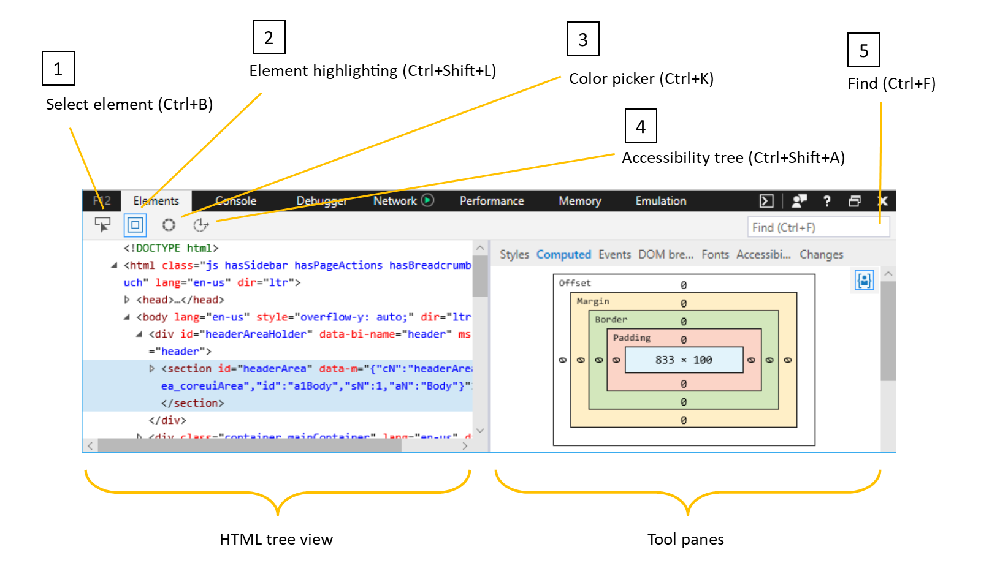
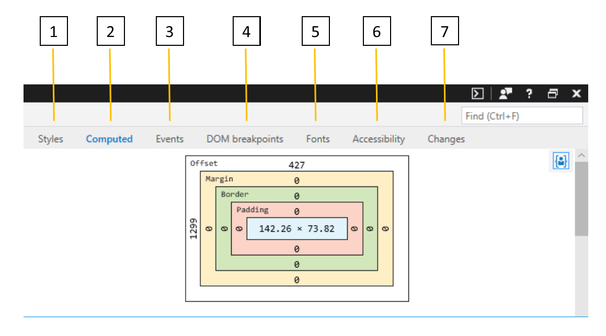

# ElementosElements

O painel **elementos** ajuda você a:The **Elements** panel helps you to:

* [Identificar e Editar elementos na árvore HTML](#html-tree-view) da página atual[Identify and edit elements in the HTML tree](#html-tree-view) of the current page
* [Inspecionar e modificar CSS](./elements/styles.md) na página, incluindo pseudo-estados e pseudoelementos[Inspect and modify CSS](./elements/styles.md) on the page, including pseudo-states and pseudo-elements
* [Entender o layout CSS e o estilo em cascata](./elements/computed.md) acontecendo na página[Understand the CSS layout and style cascade](./elements/computed.md) happening on the page
* [Rastrear manipuladores de eventos não autorizados](./elements/events.md) para que você possa depurá-los[Track down rogue event handlers](./elements/events.md) so you can debug them
* [Definir pontos de interrupção de depuração para alterações visuais inesperadas](./elements/dom-breakpoints.md) para saltar para o código que os causou[Set debugging breakpoints for unexpected visual changes](./elements/dom-breakpoints.md) to jump into the code causing them
* [Obter informações detalhadas sobre as fontes usadas na página](./elements/fonts.md) e onde elas estão sendo carregadas[Get detailed information about the fonts used on the page](./elements/fonts.md) and where they're loading from
* [Exibir sua página a partir de um ponto de vista do leitor de tela](./elements/accessibility.md) para verificar e testar a acessibilidade[View your page from a screen reader's point of view](./elements/accessibility.md) to verify and test accessibility 
* [Revisar uma comparação em execução das alterações de CSS](./elements/changes.md) feitas enquanto você depura a interface do usuário da página[Review a running diff of the CSS changes](./elements/changes.md) you make as you debug the UI of your page

## Modo de exibição de árvore HTMLHTML tree view

1. Use a ferramenta **Select Element** ( `Ctrl+B` ) para localizar um elemento no **modo de exibição de árvore HTML** clicando nele na página.Use the **Select element** (`Ctrl+B`) tool to locate an element in the **HTML tree view** by clicking on it in the page.

2. Use a ferramenta de **realce de elemento** ( `Ctrl+Shift+L` ) para localizar um elemento na página passando o mouse sobre ele no **modo de exibição de árvore HTML**.Use the **Element highlighting** (`Ctrl+Shift+L`) tool to locate an element on the page by hovering over it in the **HTML tree view**.

3. Abra a ferramenta **seletor de cores** ( `Ctrl+K` ) para ver uma lista das cores em uso na página atual.Open the **Color picker** (`Ctrl+K`) tool to see a list of the colors in use on the current page. Clicar em uma cor na lista fornece mais detalhes (Matiz, saturação, luminosidade, alfa).Clicking on a color on the list will provide further details (Hue, Saturation, Lightness, Alpha). O *seletor de cores* também é aberto quando você clica no quadrado colorido ao lado de um valor de cor no painel **estilos** , permitindo que você edite a cor de um elemento de página e veja os resultados imediatamente.The *Color picker* also opens when you click on the colored square next to a color value in the **Styles** pane, allowing you to edit the color of a page element and immediately see the results.

4. O botão da **árvore de acessibilidade** ( `Ctrl+Shift+A` ) abrirá o painel de [árvore de acessibilidade](./elements/accessibility.md) mostrando a estrutura da sua página como seria exibido para uma tecnologia assistencial, como o [narrador do Windows](https://support.microsoft.com/help/22798/windows-10-narrator-get-started) leitor.The **Accessibility tree** (`Ctrl+Shift+A`) button will open the [Accessibility tree](./elements/accessibility.md) pane showing the structure of your page as it would appear to an assistive technology, such as the [Windows Narrator](https://support.microsoft.com/help/22798/windows-10-narrator-get-started) screenreader.

5. Você também pode **encontrar** ( `Ctrl+F` ) um elemento no modo de exibição de árvore HTML procurando por seu nome de marca, atributos ou conteúdo de texto.You can also **Find** (`Ctrl+F`) an element in the HTML tree view by searching for its tag name, attributes, or text content.

### Editando elementosEditing elements

Você pode editar um elemento clicando com o botão direito do mouse nele dentro do modo de exibição de árvore HTML e selecionando **Editar como HTML** no menu de contexto.You can edit an element by right-clicking on it within the HTML tree view and selecting **Edit as HTML** from the context menu. O menu de contexto também fornece opções para excluir, recortar, copiar, colar, definir pseudovariáveis CSS (*: ativo*, *: foco*, *: focalizar*, *: visitado*) e adicionar atributos.The context menu also provides options to delete, cut, copy, paste, set CSS pseudo-classes (*:active*, *:focus*, *:hover*, *:visited*) and add attributes. Outra maneira de editar um atributo e/ou seu valor é clicar duas vezes nele no modo de exibição de árvore HTML.Another way to edit an attribute and/or its value is to double-click it from the HTML tree view.

> [!NOTE]
> Editar a árvore HTML não afeta a marcação de origem subjacente.Editing the HTML tree does not affect the underlying source markup. Atualizar a página reverterá as alterações e renderizará apenas o layout determinado pela fonte da página.Refreshing the page will revert your changes and render only the layout determined by the page source. Você pode **copiar** o HTML modificado para a área de transferência clicando com o botão direito do mouse no elemento desejado (ou no `html` elemento global, se você quiser a página inteira) para abrir o menu de contexto.You can **Copy** your modified HTML to the clipboard by right-clicking the desired element (or the global `html` element, if you want the entire page) to open up the context menu. (As opções de**recorte** e **colagem** também estão disponíveis).(**Cut** and **Paste** options are also available).

No painel [estilos](./elements/styles.md) , você também pode adicionar/excluir/Editar pseudoelementos e pseudoelementos CSS.From the [Styles](./elements/styles.md) pane you can also add/delete/edit CSS pseudo-states and pseudo-elements.

## Painéis de ferramentasTool Panes

Depois de selecionar um elemento de página de interesse, você pode usar os painéis de ferramentas para inspecionar ainda mais seus diferentes estilos e propriedades de acessibilidade, exibir seus ouvintes de eventos e definir pontos de interrupção de mutação DOM.Once you have selected a page element of interest, you can use the tool panes to further inspect its different styles and accessibility properties, view its event listeners, and set DOM mutation breakpoints.

1. [**Estilos**](./elements/styles.md): estilos atualmente aplicados organizados por folha de estilos[**Styles**](./elements/styles.md): Currently applied styles organized by stylesheet

2. [**Calculado**](./elements/computed.md): estilos atualmente aplicados organizados por atributos de CSS[**Computed**](./elements/computed.md): Currently applied styles organized by CSS attributes

3. [**Eventos**](./elements/events.md): ouvintes de eventos registrados no elemento atual e nos elementos ancestrais[**Events**](./elements/events.md): Event listeners registered on the current element and ancestor elements

4. [**Pontos**](./elements/dom-breakpoints.md)de interrupção dom: pontos de interrupção de mutação dom[**DOM breakpoints**](./elements/dom-breakpoints.md): DOM Mutation Breakpoints 

5. [**Fontes**](./elements/fonts.md): fontes aplicadas atualmente para um elemento selecionado[**Fonts**](./elements/fonts.md): Currently applied fonts for a selected element

6. [**Acessibilidade**](./elements/accessibility.md): Propriedades de acessibilidade[**Accessibility**](./elements/accessibility.md):  Accessibility properties

7. [**Alterações**](./elements/changes.md): alterações de CSS feitas durante a sessão de diagnóstico[**Changes**](./elements/changes.md): CSS changes made during diagnostic session  

## AtalhosShortcuts

| AçãoAction               | AtalhoShortcut               |
|:---------------------|:-----------------------|
| Painel elementosElements panel       | `Ctrl` + `1`           |
| Realce de elementoElement highlighting | `Ctrl` + `Shift` + `L` |
| Selecionar elementoSelect element       | `Ctrl` + `B`           |
| Seletor de corColor picker         | `Ctrl` + `K`           |
| Árvore de acessibilidadeAccessibility tree   | `Ctrl` + `Shift` + `A` |
