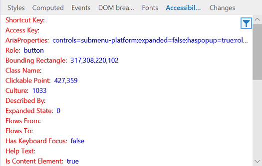

# Acessibilidade – DevTools (EdgeHTML)Accessibility - DevTools (EdgeHTML)  

Exibir as propriedades acessíveis atribuídas ao elemento selecionado.View the accessible properties assigned to the selected element. Passe o mouse sobre qualquer um dos nomes das propriedades para obter uma descrição de como ele é usado por tecnologias adaptativas.Hover over any of the property names for a description of how it's used by assistive technologies. Você também pode clicar com o botão direito do mouse em qualquer propriedade para copiar seu valor para a área de transferência.You can also right-click any property to copy its value to the clipboard.

É útil abrir a árvore de [acessibilidade](#accessibility-tree) para navegar pela página como um leitor de tela e, em seguida, usar o painel de **acessibilidade** para inspecionar detalhes sobre as propriedades de acessibilidade de interesse.It's useful to open the [Accessibility tree](#accessibility-tree) to navigate around your page as a screen reader would, and then use the **Accessibility** pane to inspect details about accessibility properties of interest.

## Árvore de acessibilidadeAccessibility tree  

O painel de **árvore de acessibilidade** mostra a estrutura da sua página como ela seria exibida para uma tecnologia assistencial, como o leitor de tela do [narrador do Windows](https://support.microsoft.com/help/22798/windows-10-narrator-get-started) .The **Accessibility tree** pane shows the structure of your page as it would appear to an assistive technology, such as the [Windows Narrator](https://support.microsoft.com/help/22798/windows-10-narrator-get-started) screen reader.

Clicar em um nó no modo de exibição de árvore também o selecionará na [**árvore HTML**](../elements.md#html-tree-view)e vice-versa.Clicking on a node in the tree view will also select it in the [**HTML tree**](../elements.md#html-tree-view), and vice versa. Selecionar um elemento acessível nos modos de exibição de árvore de *HTML* ou *acessibilidade* também preencherá mais detalhes de propriedades de acessibilidade no painel de ferramentas de **acessibilidade** .Selecting an accessible element from either the *HTML* or *Accessibility* tree views will also populate further accessibility property details in the **Accessibility** tool pane. 

<!--  Here are further resources on [Accessibility with Microsoft Edge](../../accessibility.md).  -->  
