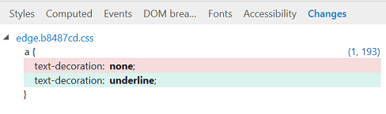

# AlteraçõesChanges
Exiba as alterações CSS feitas durante a sua sessão de diagnóstico do DevTools (dos painéis [estilos](./styles.md) e edição CSS [calculadas](./computed.md) ).View the CSS changes you made during your DevTools diagnostic session (from the [Styles](./styles.md) and [Computed](./computed.md) CSS editing panes). Semelhante às convenções de outras ferramentas de diferenciação, as linhas excluídas aparecem em vermelho e as linhas adicionadas são verdes.Similar to the conventions of other diffing tools, deleted lines appear in red and added lines are green.

Você também pode (no menu de contexto do clique direito do mouse) copiar as alterações para a área de transferência, reverter as alterações ou saltar para o local de origem.You can also (from the right-click context menu) copy  your changes to the clipboard, revert your changes, or jump to their source location.
