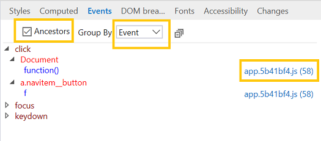

# EventosEvents 

Exiba os ouvintes de eventos registrados no elemento selecionado e (opcionalmente, usando a caixa de seleção alternar) seus ancestrais.View the event listeners registered on the selected element and (optionally, using the checkbox toggle) its ancestors. Isso é útil para rastrear ouvintes de eventos desconhecidos.This is useful for tracking down rogue event listeners. 

Você pode agrupar os ouvintes de eventos por **evento** ou **elemento**.You can group the event listeners by either **Event** or **Element**. Clicar no hiperlink azul ao lado do nome do manipulador de eventos abrirá o depurador para o local dessa função.Clicking the blue hyperlink next to the event handler name will open the debugger to the location of that function.

