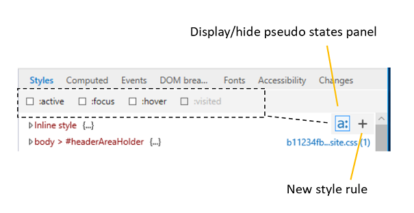
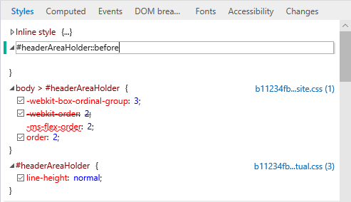

# Estilos

Exiba e edite os estilos aplicados no momento, organizados por folha de estilo.  Ao fazer alterações em suas propriedades, uma barra de indicador colorida será exibida para propriedades alteradas (amarelas), adicionadas (verdes) e excluídas (vermelho).

Você pode exibir o painel de pseudo-Estados clicando no botão "**um:**". Defina uma nova regra de estilo clicando no **+** botão "" ou clicando com o botão direito do mouse em qualquer lugar do painel **estilos** para abrir o menu de contexto.

## Editando pseudo elementos

Use o painel estilos para adicionar, editar e excluir pseudo elementos e pseudo-estados. Para aplicar um pseudo-estado CSS ao elemento selecionado, abra o *painel pseudo-Estados* (**a:** Button) e marque a classe desejada.

Para adicionar um pseudo elemento, clique no **+** botão (*nova regra de estilo*) e edite-o como faria com uma folha de estilos normal.

Os pseudoelementos são agrupados em seus próprios títulos no painel *estilos* .
