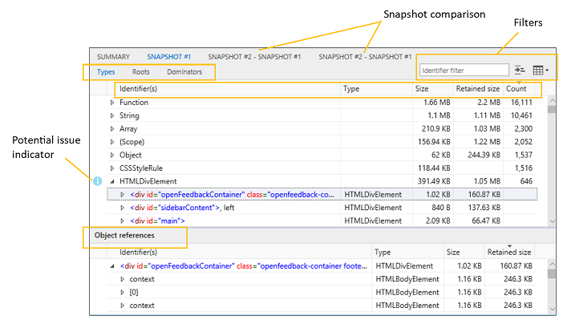
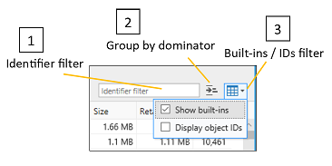
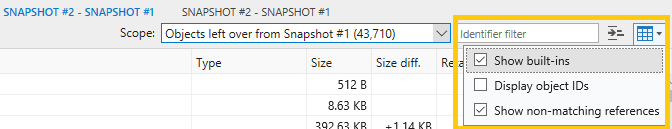

# Memória

Use o painel **memória** para medir o uso de recursos do sistema e comparar instantâneos de heap em diferentes Estados de execução de código. Com ele, você pode:

- [Representar o gráfico do consumo de memória de sua página em tempo real](#memory-usage-timeline) e tirar instantâneos da pilha
- [Identificar possíveis problemas de memória](#snapshot-summary) em seu código, como objetos retidos não associados ao dom
- [Revise os dados de uso de memória](#snapshot-details) por tipo de objeto, contagem de instâncias, tamanho e referências para ajudar a isolar problemas
- [Aplicar filtros de dados de instantâneo](#filters) para reduzir o ruído de informações não acionáveis
- [Identificar o custo de memória de um objeto específico](#object-references) e as referências que o mantêm ativo
- [Diferenciar a pilha em fases diferentes da sua investigação](#snapshot-comparison) para acompanhar a origem de vazamentos de memória e outros problemas

## Barra de ferramentas

1. **Iniciar/parar sessão de criação de perfil (Ctrl + E)**: ativar o profiler permite que você controle o uso da memória e faça instantâneos do heap.
2. **Importar sessão de criação de perfil (Ctrl + O)**: carregar uma sessão de diagnóstico de memória devtools salva.
3. **Exportar sessão de criação de perfil (Ctrl + S)**: Salve a sessão de diagnóstico atual em disco.
4. **Criar instantâneo de heap (Ctrl + Shift + T)**: Registre as atribuições de memória atuais para um determinado ponto de tempo.

## Linha do tempo de uso da memória

Os problemas de memória podem ser um dos principais culpados dos problemas de desempenho, fazendo com que sua página fique cada vez mais inresponsiva e esgotada ao longo do tempo.

A primeira etapa para analisar o uso da memória da sua página é [iniciar uma sessão de criação de perfil](#toolbar) para levar antes/depois dos instantâneos da pilha enquanto você reproduz as etapas que causam o excesso de memória ou um vazamento de memória suspeita.

Ao iniciar o criador de perfil de memória, você verá um gráfico de memória do processo que permite observar o conjunto de trabalho particular geral (a quantidade de memória consumida pela página) ao longo do tempo. O gráfico memória mostra uma visualização dinâmica da memória do processo da guia, que inclui bytes privados, memória nativa e heap JavaScript. 

 O gráfico fornece uma indicação da tendência da memória para a página que permite que você julgar quando é adequado [fazer um instantâneo de heap](#toolbar) para comparação posterior, por exemplo, quando você vê períodos de retenção de memória inesperada.

### Performance. Mark ()

Você pode adicionar **marcas de usuário** personalizadas à linha do tempo para ajudar a identificar os principais eventos durante o curso da sessão de análise chamando o [`Performance.mark()`](https://developer.mozilla.org/docs/Web/API/Performance/mark) método de dentro do seu código ou do [**console**](./console.md)do devtools.

### Console. takeheapSnapshot ()

Às vezes, você precisa fazer instantâneos em points-in-time muito específicos, como imediatamente antes de uma grande mutação do DOM. Nesses casos, você pode fazer instantâneos programaticamente com [`Console.takeHeapSnapshot()`](./console/console-api.md#taking-heap-snapshots) .

## Resumo do instantâneo

[Fazer um instantâneo](#toolbar) gerará um bloco de resumo que indica o tamanho do heap de JavaScript no momento em que o instantâneo foi tirado, juntamente com o número de objetos alocados e uma captura de tela da página. Você pode continuar a fazer instantâneos a qualquer momento ao executar o cenário do usuário que requer análise. Os instantâneos geram blocos adicionais, cada um indica a diferença na memória JavaScript do instantâneo anterior.

Clicar nos valores do bloco de resumo mudará para o painel mostrando [detalhes dos dados do instantâneo](#snapshot-details). Possíveis [problemas de memória são indicados](#snapshot-details) com um ícone de informação azul ("i").

## Detalhes do instantâneo

Os dados no painel do *instantâneo* mostram os objetos criados pela sua página juntamente com qualquer memória alocada por estruturas JavaScript que você possa estar consumindo.

As três guias representam diferentes modos de exibição dos dados:

#### Tipos

Mostra a contagem de instâncias e o tamanho total dos objetos na pilha, agrupados por tipo de objeto. Por padrão, elas são classificadas por contagem de instâncias.

Quando você seleciona um objeto no painel *tipos* superiores, a tabela [referências de objeto](#object-references) no painel inferior lista todos os objetos que apontam para esse objeto.

#### Raízes

Mostra uma exibição hierárquica de referências filho para descrever como os objetos são enraizada para o objeto global, evitando que eles sejam coletados como lixo.

Por padrão, os nós filho são classificados pela coluna tamanho retido, com o maior na parte superior.

#### Dominadores

Mostra uma lista de objetos no heap que têm referências exclusivas a outros objetos. Os dominadores são classificados pelo tamanho retido para indicar os objetos que estão consumindo a maioria das memórias que são mais fáceis de liberar.

Veja como interpretar as colunas nos modos de exibição *tipos, raízes* e *dominadores* :

Coluna | Descrição
:------------ | :-------------
Identificador (es) | Nome que melhor identifica o objeto. Por exemplo, para elementos HTML, os detalhes do instantâneo mostram o valor do atributo ID, se um for usado.
Tipo | Tipo de objeto (por exemplo, *HTMLDivElement*).
Size | Tamanho do objeto, sem incluir o tamanho dos objetos referenciados.
Tamanho retido | Tamanho do objeto mais o tamanho de todos os objetos filho que não têm outros pais. Para fins práticos, essa é a quantidade de memória retida pelo objeto, portanto, se você excluir o objeto, você recupera a quantidade especificada de memória.
Contagem | Número de instâncias do objeto. Esse valor é exibido apenas no modo de exibição tipos.

Quando você selecionar um objeto no painel superior *Dominars* , a tabela [referências do objeto](#object-references) no painel inferior listará todos os objetos que apontam para esse objeto.

### Eles

Você pode ajustar ainda mais os dados na tabela com o seguinte:

1. **Filtro de identificador**: filtrar dados procurando por um identificador de objeto específico
2. **Agrupar por Dominator**: somente objetos com referências *exclusivas* a outros objetos são mostrados na exibição de nível superior de objetos (esse é o modo de exibição padrão na guia *dodominars* ).
3. **Filtro de objetos internos/IDs**: por padrão, os [objetos internos JavaScript](https://developer.mozilla.org/docs/Web/JavaScript/Reference/Global_Objects) são incluídos na lista. Listar IDs de objeto pode ser útil se houver vários objetos anônimos que precisam ser diferenciados.

Os modos de exibição de *tipos, raízes* e *dominadores* têm seu próprio filtro, portanto, o filtro não é preservado quando você alterna para outro modo de exibição.

### Referências a objetos

Nos modos de exibição [**tipos**](#types) e [**dominadores**](#dominators) , o painel inferior contém uma lista de **referências de objetos** que exibe referências compartilhadas. Quando você escolhe um objeto no painel superior, essa lista exibe todos os objetos que apontam para esse objeto, em outras palavras, os objetos que mantêm o objeto selecionado em atividade.

Referências circulares são mostradas com um asterisco (*) e uma dica de ferramenta informativo e não podem ser expandidas. Caso contrário, ele impediria que você retorne a árvore de referência e identifique os objetos que estão retendo a memória.

Para identificar rapidamente os objetos equivalentes, marque a opção de filtro [*IDs do objeto de exibição*](#filters) para exibir as IDs dos objetos ao lado dos nomes dos objetos na coluna *identificador (es)* . Objetos que têm a mesma ID são referências compartilhadas.

### Comparação de instantâneos

Clicar em uma [Guia de comparação de instantâneo](#snapshot-details) ou em um link de comparação no [bloco Resumo do instantâneo](#snapshot-summary)  mostrará uma comparação das informações entre os dois instantâneos. No painel comparação, os modos de exibição *dominadores, tipos* e *raízes* fornecem os mesmos [*detalhes de instantâneos*](#snapshot-details) que você veria para um único instantâneos, com estes valores adicionais:

Coluna | Descrição
:------------ | :-------------
Diferenciar tamanho. | Diferença entre o tamanho do objeto no instantâneo atual e seu tamanho no instantâneo anterior, sem incluir o tamanho dos objetos referenciados.
Diferenciar tamanho retido. | Diferença entre o tamanho retido do objeto no instantâneo atual e o tamanho retido no instantâneo anterior. O tamanho retido inclui o tamanho do objeto mais o tamanho de todos os seus objetos filhos que não têm outros pais. Para fins práticos, o tamanho retido é a quantidade de memória mantida pelo objeto, portanto, se você excluir o objeto, você recupera a quantidade especificada de memória.

Você pode usar o menu suspenso **Scope** para filtrar informações diferenciais entre instantâneos:

- <strong>Objetos restantes do instantâneo # <number></strong> : mostra a comparação entre os objetos adicionados à pilha e removidos do heap do instantâneo da linha de base para o instantâneo anterior. Por exemplo, se o resumo do instantâneo mostrar <em> + 205/-195 </em> na contagem de objetos, esse filtro mostrará os dez objetos que foram adicionados, mas não serão removidos.

- <strong>Objetos adicionados entre o instantâneo # <number> e # <number></strong> : mostra todos os objetos adicionados ao heap do instantâneo anterior.

- <strong>Todos os objetos no instantâneo # <number></strong> : mostra todos os objetos na pilha (em outras palavras, um <em> modo de exibição não filtrado </em> ).

Por padrão, o filtro *Mostrar referências sem correspondência* é aplicado ao modo de exibição de comparação para indicar referências a objetos que não correspondam ao filtro de escopo atual. Você pode desativá-lo do menu suspenso:

## Atalhos

 Ação | Atalho
:------------ | :-------------
Iniciar/parar sessão de criação de perfil  | `Ctrl` + `E`
Importar sessão de criação de perfil | `Ctrl` + `O`
Exportar sessão de criação de perfil | `Ctrl` + `S`
Criar instantâneo de heap | `Ctrl` + `Shift` + `T`

## Problemas conhecidos

### Ocorreu um erro ao iniciar a sessão de criação de perfil

Se você vir esta mensagem de erro: **ocorreu um erro ao iniciar a sessão de criação de perfil** na ferramenta de memória, siga estas etapas para solucionar o problema.

1. Pressione `Windows Key`  +  `R` .

2. Na caixa de diálogo Executar, digite **Services. msc**.

3. Localize o **serviço coletor padrão do hub de diagnóstico da Microsoft (R)** e clique nele com o botão direito do mouse.

4. Reinicie o **serviço coletor padrão do hub de diagnóstico do Microsoft (R)**.

5. Feche as ferramentas de desenvolvedor do Microsoft Edge e a guia. Abra uma nova guia, navegue até a página e pressione `F12` .

6. Agora você deve ser capaz de começar a criação de perfil. 

Ainda está com problemas? Envie-nos seus comentários usando o ícone **enviar comentários** ! 

