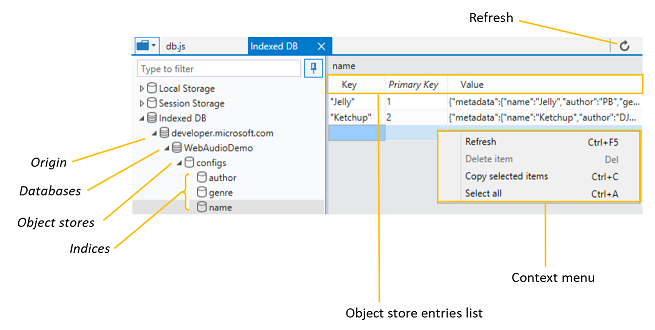
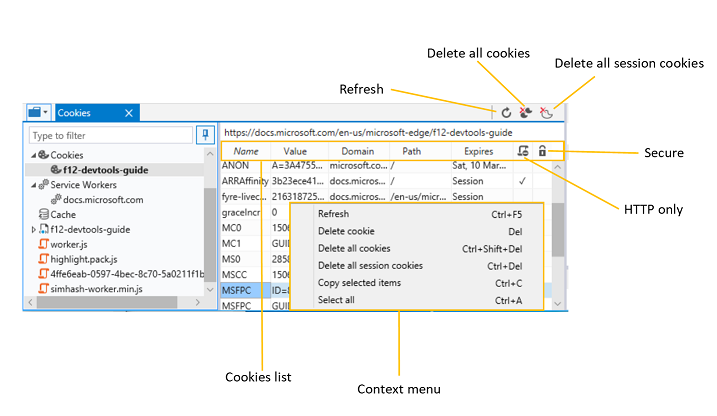

# Armazenamento

Use o painel **armazenamento** para inspecionar e gerenciar vários dados armazenados em cache localmente, incluindo:

 - Pares de chave/valores de [armazenamento na Web](#local-and-session-storage-managers) (armazenamento*local* e de *sessão* )
 - Dados estruturados do [BD indexado](#indexeddb-manager)
 - [Cookies](#cookies-list) para o domínio
 - [Cache](#cache-manager) (pares de solicitação/resposta) para depuração do trabalho do serviço

Expanda qualquer uma dessas categorias e clique em uma entrada de filho para abrir a guia do Gerenciador de recursos.

## Gerentes de armazenamento local e de sessão

Use o *Gerenciador de armazenamento local* e o *Gerenciador de armazenamento de sessão* para inspecionar e gerenciar o armazenamento na Web da sua página. 

As pastas armazenamento **local** e **sessão de armazenamento de sessão** dentro do [*seletor de recursos*](./debugger.md#resource-picker) do painel de armazenamento exibem uma lista de origens para a página. Selecionar um desses quadros abre uma tabela editável dos pares de chave/valor atuais definidos por meio de [Window. localStorage](https://developer.mozilla.org/docs/Web/API/Window/localStorage) ou [Window. sessionStorage](https://developer.mozilla.org/docs/Web/API/Window/sessionStorage), respectivamente (e/ou definido diretamente da [lista armazenamento](#storage-list)devtools).

Nas guias *armazenamento local* e *armazenamento de sessão* , você pode:

 - **Refresh** ( `Ctrl+F5` ) a [lista de armazenamento](#cookies-list) para ver o conjunto atual de pares de chave/valores para o domínio especificado. (A lista não é atualizada automaticamente após as atualizações de script.)
 - **Simule alcançar o limite de armazenamento para o** armazenamento na Web do Microsoft Edge. Cada domínio e subdomínio tem sua própria área de armazenamento, no entanto, há um limite combinado:
    - **Subdomínios:** até 5 MBS de espaço
    - **Domínios:** até 10 MBs de espaço
    - **Total para todos os domínios:** até 50 MBS de espaço

   O armazenamento da sessão é limpo assim que a última guia do navegador que faz referência à sua origem é fechada. As entradas de armazenamento local persistem indefinidamente até serem desmarcadas de forma programática pela página ou manualmente pelo usuário:

   **Configurações**  >  de **Limpar dados**  >  de navegação **Cookies e dados de sites salvos**

### Lista de armazenamento

Na tabela de *lista de armazenamento* , você pode:

 - **Inspecione e classifique** os pares de chave/valor clicando em um dos nomes de coluna na tabela.
 - **Edite** a *chave* e o *valor* de uma entrada existente clicando na célula.
 - **Delete** ( `Del` ) uma entrada da opção de menu de contexto clique com o botão direito do mouse em *Excluir item*.
 - **Adicione** um novo par de chave/valor clicando na linha vazia na parte inferior da tabela.

### Atalhos

| Ação              | Atalho      |
|:--------------------|:--------------|
| Atualizar             | `Ctrl` + `F5` |
| Excluir item         | `Del`         |
| Copiar itens selecionados | `Ctrl` + `C`  |
| Selecionar tudo          | `Ctrl` + `A`  |

## IndexedDB Manager

Use a guia **IndexedDB** para inspecionar e gerenciar os dados estruturados armazenados localmente em um computador cliente. Especificamente, você pode inspecionar/classificar e atualizar os repositórios de objetos e índices e também excluir entradas de valores chave individuais.

> [!TIP]
> Você pode usar a demonstração do [mixer de áudio](https://developer.microsoft.com/microsoft-edge/testdrive/demos/audiomixer/) para testar a unidade do *IndexedDB Manager* no Microsoft Edge devtools.

Para excluir todos os dados do IndexedDB armazenados para o usuário atual no Microsoft Edge, use o menu *configurações* do Microsoft Edge:

**...** >  **Configurações**  >  de **Limpar dados**  >  de navegação **Cookies e dados de sites salvos**

A pasta **IndexedDB** dentro do [*seletor de recursos*](./debugger.md#resource-picker) do depurador exibe uma lista de origens dos recursos carregados pela página. Qualquer banco de dados IndexedDB (IDB) estará listado na origem, juntamente com seus armazenamentos de objetos. 

### Barra de ferramentas IndexedDB

Na barra de ferramentas do *IndexedDB* , você pode:

 - **Refresh** ( `Ctrl+F5` ) para ver as entradas atuais no repositório de objetos ou índice do seu banco de dados. O Gerenciador de IndexedDB não é atualizado automaticamente quando são feitas alterações em seu banco de dados.

### Lista de entradas do repositório de objetos

No *repositório de objetos* ou na tabela de *índice* , você pode:

 - **Inspecione e classifique** os pares de valor chave clicando em qualquer nome de coluna na tabela.
 - **Refresh** ( `Ctrl+F5` )
 - **Excluir item** ( `Del` ) para remover a entrada selecionada em seu repositório de objetos ou índice. Você também pode fazer isso a partir da opção de [menu de contexto](#context-menu) clique com o botão direito do mouse em *Excluir item*.
 - **Copiar itens selecionados** ( `Ctrl+C` ) para copiar o item selecionado para a área de transferência. Você também pode fazer isso a partir da opção de [menu de contexto](#context-menu) clique com o botão direito do mouse, *Copiar item selecionado*.
 - **Selecionar tudo** ( `Ctrl+A` ) para selecionar todas as entradas no repositório de objetos ou índice. Você também pode fazer isso a partir da opção de [menu de contexto](#context-menu) clique com o botão direito do mouse, *Selecione todos*.

As colunas do *repositório de objetos* ou da tabela de *índice* são classificável:

Coluna | Descrição
:------------ | :-------------
Chave | Nome do par chave-valor (igual à *chave primária*) ao iterar em um repositório de objetos; Nome da chave de índice (chave atual do cursor) ao iterar em um índice
Chave primária | Nome do par chave-valor (consulte *documentos da Web do MDN* para obter mais informações sobre [chaves](https://developer.mozilla.org/docs/Web/API/IndexedDB_API/Using_IndexedDB#Structuring_the_database)idb)
Valor | Valor do par chave-valor

Confira os *documentos da Web do MDN* para saber mais sobre os [conceitos e uso do IndexedDB](https://developer.mozilla.org/docs/Web/API/IndexedDB_API).

### Menu de contexto

Além da barra de [ferramentas *IndexedDB* ](#indexeddb-toolbar), você também pode gerenciar seus dados em repositórios de objetos ou índices no menu de **contexto** de clique com o botão direito do mouse e/ou nos [atalhos](#shortcuts)de teclado.

### Atalhos

Ação | Atalho
:------------ | :-------------
Atualizar | `Ctrl` + `F5`
Excluir par chave-valor | `Del`
Copiar itens selecionados | `Ctrl` + `C`
Selecionar tudo | `Ctrl` + `A`

## Gerenciador de cookies

Use o *Gerenciador de cookies* para inspecionar e gerenciar os cookies para o domínio especificado. 

A pasta **cookies** dentro do [*seletor de recursos*](./debugger.md#resource-picker) do depurador exibe uma lista de origens dos recursos carregados pela página. Selecionar um desses quadros abre uma tabela que representa os cookies atuais definidos por um cabeçalho [http](https://developer.mozilla.org/docs/Web/HTTP/Cookies) ou por meio de um script com [Document. cookie](https://developer.mozilla.org/docs/Web/API/Document/cookie).

Na barra de ferramentas da guia *cookies* , você pode:

 - **Refresh** ( `Ctrl+F5` ) a [lista de cookies](#cookies-list) para ver o conjunto atual de cookies para o domínio especificado. (A lista não é atualizada automaticamente.)
 - **Exclua todos os cookies** ( `Ctrl+Shift+Del` ) (sessão e permanentes) para o caminho da página atual.
 - **Exclua todos os cookies de sessão** ( `Ctrl+Del` ) para o caminho da página atual.

Para limpar completamente a *lista de cookies*, talvez seja necessário **limpar todos os cookies do domínio** da barra de ferramentas painel de [**rede**](./network.md#toolbar) .

### Lista de cookies

Na tabela *lista de cookies* , você pode:

 - **Inspecione e classifique** seus cookies clicando em qualquer nome de coluna na tabela.
 - **Edite** o *nome* e o *valor* de um cookie existente clicando na célula.
 - **Delete** ( `Del` ) um cookie da opção de menu de [contexto](#context-menu) clique com o botão direito do mouse em *excluir cookie*.
 - **Adicione** um novo cookie de sessão para o *domínio/caminho* fornecido clicando na linha vazia na parte inferior da tabela. Isso só funciona com cookies de sessão; os cookies permanentes (com datas de vencimento específicas) devem ser definidos com métodos tradicionais. Os valores de *domínio* e de *caminho* são preenchidos automaticamente de acordo com o local da página.

As colunas da *lista de cookies* são classificável:

Coluna | Descrição
:------------ | :-------------
Name | Nome do cookie
Valor | Valor do cookie
Domínio | Nome do host do cookie (pode estar vazio)
Caminho | Caminho da URL para o cookie (pode estar vazio)
Expira | Tempo de vida máximo do cookie como um carimbo de data/hora HTTP. Se não `Expires` `Max-Age` for definido, a entrada será considerada um cookie de *sessão* .
Somente HTTP | Indica se o cookie foi definido com a `HttpOnly` diretiva, indicando que ele não está acessível a partir de JavaScript
Proteja | Indica se o cookie foi definido com a `Secure` diretiva, indicando que ele só será enviado para o servidor a partir de uma solicitação usando SSL e o protocolo HTTPS.

Consulte a referência do **MDN Web docs** [Set-cookie](https://developer.mozilla.org/docs/Web/HTTP/Headers/Set-Cookie) para ver mais detalhes sobre as propriedades do cookie.

### Menu de contexto

Além da [barra de ferramentas](#cookies-manager)da guia *cookies* , você também pode gerenciar seus cookies do **menu de contexto** de clique com o botão direito do mouse e/ou os [atalhos](#shortcuts)de teclado.

### Atalhos

| Ação                     | Atalho                 |
|:---------------------------|:-------------------------|
| Atualizar                    | `Ctrl` + `F5`            |
| Excluir cookie              | `Del`                    |
| Excluir todos os cookies         | `Ctrl` + `Shift` + `Del` |
| Excluir todos os cookies de sessão | `Ctrl` + `Del`           |
| Copiar itens selecionados        | `Ctrl` + `C`             |
| Selecionar tudo                 | `Ctrl` + `A`             |

### Gerenciador de cache

Clicar em uma entrada de cache específica abrirá o Gerenciador de **cache** do trabalho do serviço, onde você pode inspecionar e, opcionalmente, excluir entradas de cache (pares de*solicitação* e *resposta* /valor):

### Atalhos

#### Gerenciador de cache

| Ação              | Atalho      |
|:--------------------|:--------------|
| Atualizar             | `Ctrl` + `F5` |
| Excluir item         | `Del`         |
| Copiar itens selecionados | `Ctrl` + `C`  |
| Selecionar tudo          | `Ctrl` + `A`  |
