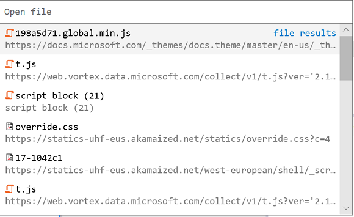

# DevTools na atualização mais recente do Windows 10 (EdgeHTML 18)

A atualização mais recente do Microsoft Edge DevTools adiciona uma série de conveniências à interface do usuário e nos bastidores, incluindo novos painéis dedicados [*para trabalhadores de serviço*](#service-workers-panel) e [*armazenamento*](#storage-panel), ferramentas de pesquisa de [arquivos](#source-file-search-tools) de origem no depurador e novos domínios de [protocolo de devtools](#edge-devtools-protocol-updates) para a depuração de estilo/layout e APIs do console.

Estes são os recursos mais recentes do Microsoft Edge DevTools disponíveis agora na [atualização de outubro de 2018 do Windows 10](/windows/uwp/whats-new/windows-10-build-17763) ([EdgeHTML 18](https://aka.ms/devguide_edgehtml_18)). Além de tudo isso, também corrigimos vários bugs de acessibilidade, confiabilidade e desempenho para melhorar os conceitos básicos!

## Aplicativo DevTools

Atualizamos o aplicativo autônomo [Microsoft Edge devtools Preview](./index.md#microsoft-store-app). A versão mais recente inclui acesso remoto à depuração para funtionality núcleo no [**depurador**](./debugger.md), [**elementos**](./elements.md) (para operações somente leitura) e painéis do [**console**](./console.md) .

## Painel funcionários do serviço

Agora há um painel de [**funcionários**](./service-workers.md) dedicado para inspecionar, gerenciar e depurar os funcionários de serviço do seu site. Isso fornece a mesma funcionalidade que anteriormente estava no painel do *depurador* (agora com uma interface do usuário menos cheia!).

## Painel de armazenamento

Também mudamos todos os inspetores de armazenamento local (*armazenamento local e sesion, IndexedDB, cookies, cache*) anteriormente no *depurador* para o próprio painel de [**armazenamento**](./storage.md) exclusivo.

## Ferramentas de pesquisa de arquivos de origem

O [**depurador**](./debugger.md) agora tem um painel de [pesquisa de arquivo de origem](./debugger.md#file-search) . Abra-o com o comando *Find in Files* ( `Ctrl` + `Shift` + `F` ) quando você tiver uma cadeia de caracteres específica de código que você está tentando encontrar na fonte. A barra de ferramentas fornece opções de pesquisa diferentes, incluindo expressões regulares. 

Você também pode abrir rapidamente qualquer arquivo de origem carregado com o comando *Abrir arquivo* ( `Ctrl` + `P` ).

## Atualizações do protocolo Edge DevTools

A [versão 0,2](../devtools-protocol/0.2/index.md) do protocolo devtools fornece novos domínios para a depuração de estilo e o layout (somente leitura) e APIs de console, além da funcionalidade de depuração de script principal introduzida na [versão 0,1](../devtools-protocol/0.1/index.md). Na interface do usuário de borda DevTools, isso se traduz na funcionalidade disponível nos [**elementos**](../devtools-guide/elements.md) (para operações somente leitura), [**console**](../devtools-guide/console.md) e painéis do [**depurador**](../devtools-guide/debugger.md) .
