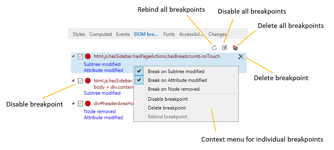
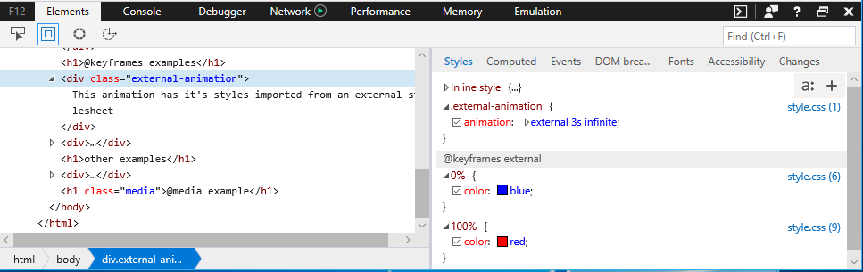
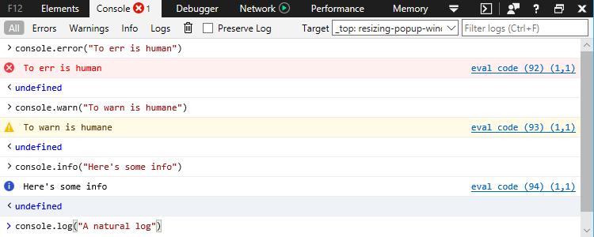
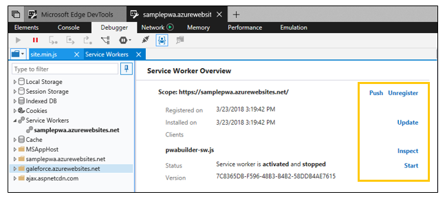

# DevTools na atualização do Windows 10 para criadores de outono (EdgeHTML 16)DevTools in the Windows 10 Fall Creators Update (EdgeHTML 16)

Com este lançamento, começamos um grande esforço de refatoração de DevTools para melhorar a robustez e o desempenho, além de adicionar um monte de novos recursos que você pode começar a usar hoje mesmo!With this release we started a major DevTools refactoring effort for improved robustness and performance, and also added a bunch of new features you can start using today! 

Estes são os recursos do Microsoft Edge DevTools fornecidos com a [atualização do Windows 10 para criadores de outono](/windows/uwp/whats-new/windows-10-build-16299) ([EdgeHTML 16](https://aka.ms/devguide_edgehtml_16)).Here are the Microsoft Edge DevTools features that shipped with the [Windows 10 Fall Creators Update](/windows/uwp/whats-new/windows-10-build-16299) ([EdgeHTML 16](https://aka.ms/devguide_edgehtml_16)).

## Ouvintes de eventos ancestraisAncestor event listeners 

O painel **eventos** agora adiciona a opção para exibir ouvintes de eventos registrados em qualquer ancestral do elemento atualmente selecionado (no painel **elementos** ), além daqueles do elemento em si.The **Events** pane now adds the option to view event listeners registered on any ancestor of the currently selected element (in the **Elements** panel), in addition to those on the element itself. Além disso, você agora pode agrupar a exibição ouvinte de eventos por *evento* ou *elemento*.Additionally, you can now group the event listener display by either *Event* or *Element*. 

## Pontos de interrupção de mutação DOMDOM mutation breakpoints

Agora você pode definir pontos de interrupção de mutação DOM para invadir o depurador sempre que um nó de elemento selecionado é alterado.You can now set DOM mutation breakpoints to break into the Debugger whenever a selected element node changes. No painel **elementos** , clique com o botão RT em qualquer elemento na exibição de árvore DOM e selecione um ou mais dos seguintes itens:From the **Elements** panel, rt-click on any element in the DOM tree view and select one or more of the following:

 - Quebra no nó removidaBreak on Node removed
 - Quebra na subárvore modificadaBreak on Subtree modified
 - Quebra no atributo modificadoBreak on Attribute modified

Você pode gerenciar seus pontos de interrupção de mutação do painel **pontos de interrupção do dom** nos painéis **elementos** ou **depurador** .You can manage your mutation breakpoints from the **DOM breakpoints** pane in the **Elements** or **Debugger** panels.

## Suporte a CSS at-RuleCSS at-rule support

As regras CSS "at" (@) agora são representadas entre outras declarações de regra CSS no painel **estilos** , incluindo regras de animação `@keyframes` (atualmente limitadas a somente leitura), `@supports` consultas de recursos e `@media` consultas.CSS "at" (@) rules are now represented among other CSS rule declarations on the **Styles** pane, including animation `@keyframes` rules (currently limited to read-only), `@supports` feature queries, and `@media` queries.

## Painel fontes CSSCSS fonts pane

`@font-face`Agora, as regras CSS têm o próprio painel **fontes** dedicadas que exibe onde a fonte é carregada (*local* ou *rede*) e quantos caracteres estão usando.CSS `@font-face` rules now have their own dedicated **Fonts** pane that displays where the font is loaded from (*Local* or *Network*) and how many characters are using it. Se uma fonte for carregada da rede, o DevTools exibirá a regra que a importada juntamente com o seu alias e tipo de fonte.If a font is loaded from the network,  DevTools will display the rule that imported it along with its alias and font type.

## Suporte a polielemento CSSCSS pseudo-element support

Agora, o painel **estilos** agrupa os pseudoelementos em seus próprios títulos e não exibe mais o conteúdo deles como riscado.The **Styles** pane now groups pseudo-elements under their own headings and no longer displays their content as crossed out.

**Antes:Before:**
 

**Depois:After:**
 

## Melhorias no consoleConsole improvements

O painel de **console** tem uma revisão de UX para melhor usabilidade e uma experiência de IntelliSense mais rápida e mais rica.The **Console** panel got a UX overhaul for improved usability and a faster, richer Intellisense experience.

**Antes:** 

**Após:** 
![ Novo console**After:**

Também adicionamos estes aprimoramentos:We also added these improvements:

 -  Use `Shift + Enter` para adicionar uma linha adicional a um comando antes de executá-lo `Enter` .Use `Shift + Enter` to add an additional line to a command before executing it with `Enter`. (Antigamente, houve uma *mudança para o botão de alternância de várias linhas/modo de linha única* .)(Formerly there was a *Switch to multiline/single-line mode* toggle button.)

 - Há suporte para as seguintes novas APIs:The following new APIs are supported:
    - método [ **console. Table (**_objeto_*_)_* ](../console/console-api.md#organizing-log-output)[**console.table(**_object_*_)_*](../console/console-api.md#organizing-log-output) method
    - comando [ **getEventListeners (**_objeto_*_)_* ](../console/command-line.md#event-listeners)[**getEventListeners(**_object_*_)_*](../console/command-line.md#event-listeners) command
    - comando [ **Keys (**_objeto_*_)_* ](../console/command-line.md#object-inspection)[**keys(**_object_*_)_*](../console/command-line.md#object-inspection) command
    - comando [ **valores (**_objeto_*_)_* ](../console/command-line.md#object-inspection)[**values(**_object_*_)_*](../console/command-line.md#object-inspection) command
    - seletor [ **de $x (**_expressão XPath_*_)_* ](../console/command-line.md#dom-selectors)[**$x(**_xpath expression_*_)_*](../console/command-line.md#dom-selectors) selector

 - Agora há suporte para o parâmetro de formatação [**% c ()**](../console/console-api.md#logging-custom-messages)The [**%c()**](../console/console-api.md#logging-custom-messages) formatting parameter is now supported

## Aprimoramentos de depuraçãoDebugging improvements

Além de um conjunto de novos recursos para a depuração dos [funcionários e do cache do serviço PWA](#progressive-web-app-debugging), o depurador adicionou estes recursos:In addition to a suite of new features for debugging your [PWA service workers and cache](#progressive-web-app-debugging), the Debugger added these features:

### Depuração consolidada para recursos compartilhadosConsolidated debugging for shared resources

Mesmo quando um recurso, como um arquivo carregado da CDN, é referenciado várias vezes em todo o seu código, o DevTools agora fornecerá uma única instância de depuração para esse arquivo em que você pode, em seguida, definir pontos de interrupção comuns que serão atingidos independentemente de onde o arquivo for referenciado.Even when a resource, such as a file loaded from CDN, is referenced multiple times throughout your code,  DevTools will now provide a single debugging instance for that file where you can then set common breakpoints which will be hit regardless of where that file is referenced. (Anteriormente, cada referência de script foi considerada um recurso exclusivo que seria mapeado para um conjunto separado de pontos de interrupção.)(Previously each script reference was considered a unique resource would map to a separate set of breakpoints.)

### Editar em tempo real JavaScript com o *Editing-on-Idle*Live edit JavaScript with *Edit-on-idle*

Agora você pode editar o JavaScript ao vivo durante uma sessão de depuração.You can now edit your JavaScript live during a debugging session. Este recurso estava experimentomente disponível (atrás de um sinalizador) na versão [anterior](https://blogs.windows.com/buildingapps/2017/04/05/windows-10-creators-update-creators-update-sdk-released/#MMhK2OdcrR12Vi6u.97) (*Windows 10 Creators Update*) e agora é um recurso permanente.This feature was experimentally available (behind a flag) in the [previous](https://blogs.windows.com/buildingapps/2017/04/05/windows-10-creators-update-creators-update-sdk-released/#MMhK2OdcrR12Vi6u.97) (*Windows 10 Creators Update*) release and now its a permanent feature. Basta selecionar qualquer arquivo de script no painel **depurador** , editar e, em seguida, clicar em **salvar** (ou `Ctrl+S` ) para testar suas alterações na próxima vez que a seção de código for executada.Simply select any script file from the **Debugger** panel, edit, then click **Save** (or `Ctrl+S`) to test your changes next time that section of code runs. 

 

Clique no botão **comparar documento com o original** para exibir a comparação do que você alterou.Click the **Compare document to original** button to view the diff of what you changed.

 

Lembre-se das seguintes restrições:Please be aware of the following constraints:

- A edição de script funciona apenas em arquivos *. js* externos (e não inseridos `<script>` em *. html*)Script editing only works in external *.js* files (and not embedded `<script>` within *.html*)
- As edições são salvas na memória e liberadas quando o documento é recarregado, portanto, você não poderá executar edições dentro de um `DOMContentLoaded` manipulador, por exemploEdits are saved in memory and flushed when the document is reloaded, thus you won’t be able to run edits inside a `DOMContentLoaded` handler, for example
- No momento, não há nenhuma maneira (como a opção **salvar como** ) para salvar suas edições em disco a partir do devtoolsCurrently there’s no way (such as a **Save As** option) to save your edits to disk from  DevTools

## AtalhosShortcuts

Agora você pode iniciar o DevTools no último painel exibido ( `Ctrl+Shift+I` ) ou diretamente ao console ( `Ctrl+Shift+J` ) da mesma forma que faria em outros principais navegadores.You can now launch DevTools to the last viewed panel (`Ctrl+Shift+I`) or directly to the Console (`Ctrl+Shift+J`) just like you would on other major browsers.

## Depuração de aplicativo Web progressivoProgressive Web App debugging

Teste o suporte experimental para aplicativos Web progressivos (PWAs) no Microsoft Edge e no DevTools selecionando a opção **habilitar trabalhos de serviço** a partir de `about:flags` (e reiniciar o Microsoft Edge).Test out the experimental support for Progressive Web Apps (PWAs) in Microsoft Edge and  DevTools by selecting the **Enable service workers** option from `about:flags` (and restarting Microsoft Edge). Se um site usa funcionários de **serviço** e/ou a API de **cache** , as entradas no painel do **depurador** serão preenchidas para cada origem, de forma semelhante à forma como o armazenamento da Web e a inspeção de cookies funcionam.If a site makes use of **Service Workers** and/or the **Cache** API,  will populate entries in the **Debugger** panel for each origin, similar to how web storage and cookie inspection work.

Clicar em uma entrada de trabalho específica do serviço abrirá a **visão geral do trabalho do serviço**, onde você pode gerenciar o registro de trabalho do serviço para o escopo fornecido e forçar uma notificação por push de teste.Clicking on a specific service worker entry will open up the **Service Worker Overview**, where you can manage the service worker registration for the given scope and force a test push notification. Você também pode **parar** / de**Iniciar** trabalhadores individuais do serviço e **inspecioná** -los em uma janela separada do depurador:You can also **Stop**/**Start** individual service workers and **Inspect** them from a separate debugger window:

Observe o seguinte sobre a depuração de trabalho do serviço:Please note the following about service worker debugging:

 - A depuração de um trabalhador de serviço iniciará uma nova instância do DevTools separada das ferramentas da página, pois os trabalhadores do serviço podem ser compartilhados entre várias guias.Debugging a service worker will launch a new instance of the DevTools separate from the page's tools because service workers can be shared across multiple tabs. 
 - Os painéis de [elementos](../elements.md) e [emulação](../emulation.md) estão ausentes do depurador de trabalho do serviço, pois os trabalhadores do serviço são executados em segundo plano e não controlam diretamente o front-end do seu aplicativo.The [Elements](../elements.md) and [Emulation](../emulation.md) panels are absent from the service worker debugger, given that service workers run in the background and do not directly control the front-end of your app.
 - Atualmente, o tráfego de rede para um trabalhador de serviço é reportado apenas da instância de depuração DevTools para esse trabalhador, e não da instância central da própria página.Currently network traffic for a service worker is only reported from the DevTools debugging instance for that worker, and not from the central instance for the page itself.

Clicar em uma entrada de cache específica abrirá o Gerenciador de **cache** , onde você pode inspecionar e, opcionalmente, excluir entradas de cache (pares de*solicitação* e *resposta* de chave/valor).Clicking on a specific cache entry will open up the **Cache** manager, where you can inspect and optionally delete cache entries (*Request* and *Response* key/value pairs).
