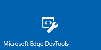
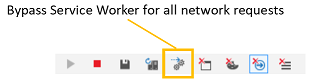

# DevTools na atualização de abril de 2018 do Windows 10 (EdgeHTML 17)

A versão EdgeHTML de 17 do DevTools vem de duas maneiras: as ferramentas tradicionais no navegador ( `F12` ) para Microsoft Edge e a visualização como um aplicativo autônomo do [Windows 10](#microsoft-edge-devtools-app-preview) da Microsoft Store!

As ferramentas foram atualizadas com vários recursos principais, incluindo suporte básico para [depuração remota](../index.md#remote-debugging) (por meio do nosso novo [protocolo devtools](#devtools-protocol)), [recursos de depuração do PWA](#pwa-debugging), [Gerenciamento de cache do IndexedDB](#indexeddb-inspection), [encaixe vertical](#docking-to-the-right-in-microsoft-edge) e muito mais! Também continuamos o [esforço de refatoração](./edgehtml-16.md) geral ter começado o último lançamento como parte de investimentos contínuos em desempenho e confiabilidade.

Estes são os recursos mais recentes do Microsoft Edge DevTools fornecidos na [atualização de abril de 2018 do Windows 10](/windows/uwp/whats-new/windows-10-build-17134) ([EdgeHTML 17](https://aka.ms/devguide_edgehtml_17)).

## Visualização do aplicativo Microsoft Edge DevTools

 

O [Microsoft Edge devtools](https://www.microsoft.com/store/p/microsoft-edge-devtools-preview/9mzbfrmz0mnj) agora está disponível para visualização como um aplicativo autônomo do Windows 10 da Microsoft Store. Com a versão da loja, há um painel de *seletor* para anexar a abrir destinos de página locais e remotos e um layout com guias para alternar entre instâncias das DevTools. Também exclusivo para o aplicativo DevTools é a capacidade de depurar o conteúdo da Web em aplicativos \(como suplementos para o Office, Cortana, EdgeHTML [WebView](../../hosting/webview/index.md)e PWAs \) [instalado no Windows](../../progressive-web-apps/windows-features.md)\).

O DevTools de borda ainda também está disponível ( `F12` ) de dentro do navegador (sem o painel do seletor).

A dissociação do DevTools do navegador oferece estas vantagens da arquitetura e do UX:

- O DevTools é executado em um contêiner de aplicativo separado na área de segurança do Microsoft Edge, fornecendo melhor confiabilidade para ambos.
- O aplicativo oferece fácil alternância entre as guias de instância ativas do DevTools (em vez de alternar entre as guias abrir Microsoft Edge)
- É possível instrumentar o mecanismo do navegador *EdgeHTML* e abri-lo no ecossistema maior do devtools com [APIs de navegadores diferentes](https://github.com/WICG/devtools-protocol/).
- Podemos enviar DevTools atualizações independentemente do ciclo de lançamento do Windows (e do EdgeHTML).

Confira o *Guia do devtools* para saber mais sobre [a depuração local e remota usando o aplicativo devtools](../index.md).

## Protocolo DevTools

Ferramentas de desenvolvedor podem usar o [**protocolo Microsoft Edge devtools**](../../devtools-protocol/index.md) para inspecionar e depurar o navegador Microsoft Edge. Ele fornece um conjunto de métodos e eventos organizados em diferentes [domínios](../../devtools-protocol/0.1/domains/index.md) de instrumentação do mecanismo EdgeHTML.

 Os clientes de ferramentas podem chamar esses métodos e monitorar esses eventos por meio de mensagens JSON Web Socket trocadas com o *servidor devtools* hospedado pelo Microsoft Edge ou pelo [Windows Device portal](/windows/mixed-reality/using-the-windows-device-portal). 
 
 O Microsoft Edge DevTools usa esse protocolo para habilitar a [depuração remota](../../devtools-protocol/0.1/clients.md#microsoft-edge-devtools-preview) de um computador host executando o Microsoft Edge do [cliente devtools autônomo](https://www.microsoft.com/store/p/microsoft-edge-devtools-preview/9mzbfrmz0mnj) disponível na Microsoft Store. Atualmente, este suporte à visualização está limitado à depuração do JS de outra borda em outro dispositivo de área de trabalho ou VM. Ao longo do tempo, adicionaremos suporte para o conjunto completo de DevTools a qualquer instância do EdgeHTML em qualquer dispositivo com o Windows 10.  
 
 As versões mais recentes do [**Visual Studio Preview**](https://www.visualstudio.com/vs/preview/) (visual Studio 15,7 Preview 1 ou posterior) usam o protocolo devtools para habilitar a inicialização e a depuração da Microsoft Edge (código JavaScript) a partir do IDE do Visual Studio de qualquer projeto do ASP.net ou do .NET Core.

## Inspeção IndexedDB

Novo no [**depurador**](../debugger.md) esta versão é um [Gerenciador de IndexedDB](../storage.md#indexeddb-manager) com suporte para inspecionar e atualizar os armazenamentos de objetos e excluir entradas de valores chave individuais. Espere ainda mais funcionalidade em lançamentos futuros.

## Depuração do PWA

O suporte para a depuração de aplicativos Web progressivos (PWAs) agora está habilitado por padrão, fornecendo guias de ferramentas para [**trabalhadores de serviço**](../service-workers.md), [**API de cache**](../storage.md#cache-manager)e gerenciamento de [**IndexedDB**](../storage.md#indexeddb-manager) .

Além disso, a [barra de ferramentas do painel de rede](../network.md#toolbar) tem um botão novo, ignorar o **trabalho de serviço para todas as solicitações de rede**, para ativar/desativar seus trabalhadores de serviço registrados como proxies de rede:

Você pode depurar o [PWA como um aplicativo do Windows 10 instalado](../../progressive-web-apps/windows-features.md) selecionando-o na lista de destinos [**locais**](../../progressive-web-apps/windows-features.md#debug-your-pwa-edgehtml-as-a-windows-app) (guia navegador/PWA/WebView) no seletor do [aplicativo devtools autônomo](../index.md#microsoft-store-app).  

## Encaixe à direita no Microsoft Edge

Agora você pode encaixar o DevTools à direita da página na qual está depurando dentro do Microsoft Edge, além de encaixar na parte inferior e desencaixar o DevTools da janela do navegador. Use `Ctrl+Shift+D` para alternar entre as posições **encaixar inferior**, **encaixar à direita**e **desencaixar** , ou os ícones no canto superior direito da devtools:

 
