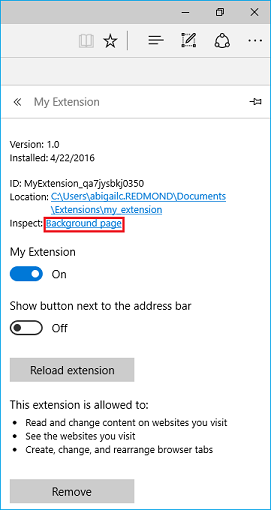
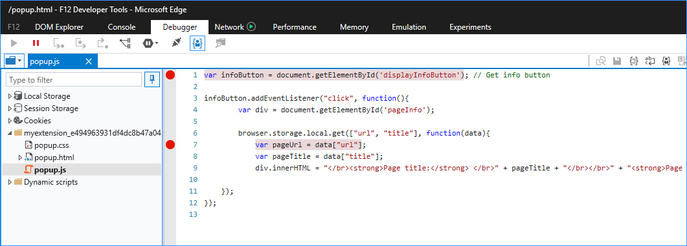
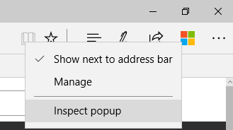

# Depurar extensões  

[!INCLUDE [deprecation-note](../includes/deprecation-note.md)]  

Você pode depurar as extensões no Microsoft Edge usando as ferramentas de desenvolvedor F12.

O vídeo a seguir passa por uma extensão de depuração do Microsoft Edge, acompanhando cada cenário de depuração e corrigindo-o ao longo do caminho. Para obter mais informações, consulte as instruções passo a passo abaixo.

> [!VIDEO https://channel9.msdn.com/Blogs/One-Dev-Minute/Debugging-Microsoft-Edge-Extensions/player]

> [!NOTE]
> Para aproveitar a depuração de extensão com F12, você deve primeiro ativar os recursos de desenvolvedor em About: flags. Consulte [adicionando e removendo extensões](./adding-and-removing-extensions.md) para obter detalhes sobre como fazer isso.

## Depuração de script em segundo plano
Para iniciar a depuração do script de tela de fundo de sua extensão:

1. Clique em **mais (...)** seguido de **extensões** para ir para o painel extensão.  
 
2. Clique na extensão que você deseja depurar.
3. Clique no link da **página de plano de fundo** para exibir F12 para o processo em segundo plano.  
 
4. Selecione a guia **depurador** em F12.
5. Navegue até o script de plano de fundo da extensão e selecione-o.
6. Coloque pontos de interrupção para depuração clicando à esquerda do número de linha do código-fonte.  
 
7. Selecionar a guia **console** e executar o comando " `location.reload()` ". Isso reexecutará o script em segundo plano, permitindo que você percorra o código.  
 

## Depuração de script de conteúdo
Para iniciar a depuração do script de conteúdo de sua extensão:

1. Inicie o F12 navegando até o botão **mais (...)** e selecionando **"ferramentas de desenvolvedor F12"** ou pressionando F12 no teclado.
2. Navegue até o script de conteúdo da extensão e selecione-o. Scripts de conteúdo para extensões em execução no momento serão representados por uma pasta diferente para cada extensão.

    > [!NOTE]
    > Somente scripts de conteúdo em execução aparecerão.

3. Coloque pontos de interrupção para depuração clicando à esquerda do número de linha do código-fonte.  
 
4. Atualize a guia do navegador para começar a percorrer o código.

## Depuração da página de extensão

Há dois métodos que podem ser usados para acessar o código-fonte da página de extensão para a depuração. Um método aplica-se a uma variedade de páginas enquanto a outra só funciona para páginas pop-up.

### Depuração de qualquer página de extensão
O método a seguir funciona para todas as páginas de extensão, como a página opções e pop-ups:

1. Clique com o botão direito do mouse no plano de fundo da página.
2. Selecione **"Exibir fonte"**.

   

3. Quando o F12 abrir, coloque os pontos de interrupção no arquivo que você deseja depurar.

   
4. Selecione a guia **console** e execute o comando `location.reload()` . Isso reexecutará o script de página, permitindo que você percorra o código.  

   

### Depurando uma página de extensão pop-up
Embora o método de depuração de páginas de extensão também se aplique às páginas de extensão pop-up, as etapas a seguir descrevem outra maneira de depurar o Popup:

1. Clique com o botão direito do mouse no ícone da extensão.
2. Selecione **"inspecionar pop-up"**.

   
3. Siga as etapas 3 e 4 acima para colocar pontos de interrupção e recarregar o pop-up.
