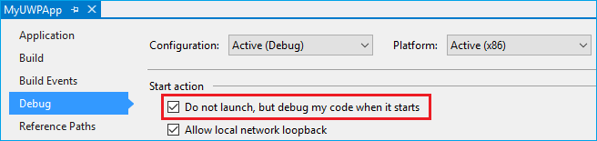

# <a name="native-messaging-in-microsoft-edge"></a>Mensagens nativas no Microsoft Edge  

[!INCLUDE [deprecation-note](../includes/deprecation-note.md)]  

## <a name="native-messaging-architecture-overview"></a>Visão geral da arquitetura de mensagens nativa  

Com a Atualização de Criadores do Windows 10, as extensões do Microsoft Edge são capazes de usar mensagens nativas para se comunicar com um aplicativo da Plataforma Universal do Windows \(UWP\).  Em alto nível, as extensões do Microsoft Edge usam as mesmas APIs para mensagens nativas que as extensões Chrome e Firefox.  No entanto, o host de mensagens nativo precisará ser implementado usando a Plataforma Universal do Windows.  

> [!NOTE]
> O método descrito abaixo \(conectando-se a um aplicativo UWP via AppService\) é o único mecanismo com suporte para habilitá-lo entre extensões do Microsoft Edge e componentes nativos.  Confira a seção [Adicionando um](#adding-a-desktop-bridge-component) componente da Ponte de Desktop deste guia para obter mais informações sobre como habilitar a comunicação com componentes Win32 herdados.  

A arquitetura de mensagens nativa no Microsoft Edge aproveita a API existente como a infraestrutura subjacente de comunicação entre processos [`AppService`](/uwp/api/Windows.ApplicationModel.AppService?view=winrt-19041&preserve-view=true) \(IPC\).  Os aplicativos UWP usam `AppService` a API para se comunicarem entre si.  Por isso, as extensões do Microsoft Edge agora podem se comunicar com aplicativos UWP.  

  

### <a name="when-and-when-not-to-use-native-messaging"></a>Quando e quando não usar mensagens nativas  

A mensagem nativa adiciona uma nova camada inteira à sua extensão.  Ao implementar um aplicativo de parceiro UWP para sua extensão, as seguintes possibilidades ficam disponíveis para você:  

*   Sincronizar dados \(por exemplo, credenciais\) com um aplicativo UWP parceiro.  
*   Implemente algoritmos de criptografia/descriptografia mais fortes não disponíveis em APIs da Web.  
*   Acessar recursos que não são acessíveis por meio de APIs da Web, por exemplo, hardware ou dispositivos USB  

Há algumas instâncias em que as mensagens nativas não devem ser usadas devido a restrições de segurança ou política:  

*   Modificando as configurações do usuário no Microsoft Edge ou no Windows, por exemplo, alterando o navegador padrão ou o provedor de pesquisa.  
*   Ações que violam políticas da Microsoft Store para aplicativos e extensões.  
*   Transferindo dados para o ponto de extremidade remoto por meio do host de mensagem nativo.  
*   Permitindo que outros aplicativos baixem conteúdo que altera o comportamento da extensão.  

## <a name="demos"></a>Demonstrações  

Para ter uma ideia de como é uma extensão de mensagens nativa do Microsoft Edge que tem um aplicativo UWP e uma Ponte de Área de Trabalho, confira os exemplos [secureInput](https://github.com/MicrosoftEdge/MicrosoftEdge-Extensions-Demos/tree/master/SecureInput) e [DigitalSigning (C++)](https://github.com/MicrosoftEdge/MicrosoftEdge-Extensions-Demos/tree/master/DigitalSigning) no GitHub.  

### <a name="how-it-works"></a>Como funciona  

O componente de extensão do Microsoft Edge do exemplo usa seu script de conteúdo para detectar quando um usuário digita informações que devem ser criptografadas.  A extensão comunica isso ao componente ponte de desktop por meio de mensagens nativas.  Quando o usuário estiver pronto para enviar os dados, a extensão retornará um valor criptografado de volta ao site.  

> [!NOTE]
> Este exemplo funcionará apenas em uma página da Web que usa eventos personalizados para se comunicar com o script de conteúdo da extensão.  A pasta de exemplo inclui um [arquivo .html para](https://github.com/MicrosoftEdge/MicrosoftEdge-Extensions-Demos/blob/master/SecureInput/SecureInput.html) testar a extensão com.  

Neste exemplo, o aplicativo UWP é usado para passar respostas da Ponte da Área de Trabalho para o Microsoft Edge, que, em seguida, é enviado para a extensão do Microsoft Edge por meio de retorno de chamada.  Embora este exemplo tenha o host de mensagens nativo executado no aplicativo principal, ele também é capaz de ser executado como uma tarefa em segundo plano.  Alternar entre os dois requer a edição do script em segundo plano da extensão, alterando a cadeia de caracteres `port = browser.runtime.connectNative("NativeMessagingHostInProcessService");` para `"NativeMessagingHostOutOfProcess"` .  

## <a name="chrome-vs-microsoft-edge-implementation"></a>Implementação do Chrome vs Microsoft Edge  

Enquanto o Chrome segue a rota de usar APIs de passagem de mensagens para suas extensões se comunicarem com aplicativos, o Microsoft Edge utiliza a API que agora permite que extensões do Microsoft Edge e [`AppService`](/uwp/api/Windows.ApplicationModel.AppService?view=winrt-19041&preserve-view=true) aplicativos UWP se comuniquem.  

Esta seção detalha as diferenças entre como o Chrome e o Microsoft Edge lidam com a implementação de mensagens nativas.  

### <a name="registration-and-host-manifest"></a>Registro e manifesto de host  

Para que seu aplicativo seja reconhecido pela extensão como um host de mensagens nativo, ele precisará ser registrado.  

Para o registro de host de mensagens nativas do [Chrome,](https://developer.chrome.com/extensions/nativeMessaging) seu aplicativo precisa instalar um arquivo de manifesto em qualquer lugar no sistema de arquivos do Windows que define a configuração nativa do host de mensagens.  

O JSON a seguir é um exemplo de configurações para o arquivo config:  

```json
{
   "name": "com.my_company.my_application",
   "description": "My Application",
   "path": "C:\\ProgramFiles\\MyApplication\\chrome_native_messaging_host.exe",
   "type": "stdio",
   "allowed_origins": [
      "chrome-extension://knldjmfmopnpolahpmmgbagdohdnhkik/"
    ]
}
```  

Para instalar esse arquivo, o aplicativo precisaria:  

1.  Registre o arquivo de manifesto em um local predefinido no Registro que define a configuração do host:  
    *   `HKEY_LOCAL_MACHINE\SOFTWARE\Google\Chrome\NativeMessagingHosts\com.my_company.my_application`  
        
        or  
    *   `HKEY_CURRENT_USER\SOFTWARE\Google\Chrome\NativeMessagingHosts\com.my_company.my_application`  
        
1.  Definir o valor padrão dessa chave para o caminho completo para o arquivo de manifesto, por exemplo `[HKEY_CURRENT_USER\Software\Google\Chrome\NativeMessagingHosts\com.my_company.my_application] @="C:\\path\\to\\nmh-manifest.json"`  

Para o Microsoft Edge, para registrar um \(host de mensagens nativo\) você deve incluir o aplicativo de parceiro UWP no mesmo pacote que sua extensão e especificar a extensão AppService no arquivo do seu [`AppService`](/uwp/api/Windows.ApplicationModel.AppService?view=winrt-19041&preserve-view=true) [](/windows/uwp/launch-resume/how-to-create-and-consume-an-app-service) `Package.appxmanifest` projeto.  Os `EntryPoint` atributos e podem ser `Name` configurados por você:  

```xml
...
<Applications>    
    <Application Id="App"         
        <Extensions>        
            <uap:Extension Category="windows.appService" EntryPoint="MyAppService.Inventory">          
            <uap:AppService Name="com.microsoft.inventory"/>        
            </uap:Extension>      
        </Extensions>      
        ...   
    </Application>
</Applications>
```  

Você também precisa definir quais extensões têm permissão para se conectar ao serviço.  Como o Microsoft Edge não tem uma propriedade de manifesto equivalente em seu AppxManifest, isso precisará ser determinado e imposto em tempo de execução pelo `"allowed_origins"` seu aplicativo UWP.  Como o Microsoft Edge estabelece a conexão em nome da extensão, o aplicativo procura o Nome da Família de Pacotes do chamador para determinar se a extensão está sendo conectada pelo Microsoft Edge para controlar ou autenticar o chamador.  Por exemplo   

```csharp
protected async override void
OnBackgroundActivated(BackgroundActivatedEventArgs args)
{
    IBackgroundTaskInstance taskInstance = args.TaskInstance;
    if (taskInstance.TriggerDetails is AppServiceTriggerDetails)
    {
        AppServiceTriggerDetails appService = taskInstance.TriggerDetails as AppServiceTriggerDetails;
        if (appService.CallerPackageFamilyName == EdgePFN)
        {
            // Establish the connection
        }
        else
        {
            // Reject the connection
        }
    }
}
```  

### <a name="message-sending"></a>Envio de mensagens  

Para que um aplicativo e uma extensão se comuniquem entre si, as mensagens precisam ser enviadas para e para elas.  

As extensões do Chrome iniciam uma mensagem usando a API para entregar uma mensagem ao [`runtime.sendNativeMessage`](https://developer.mozilla.org/Add-ons/WebExtensions/API/runtime/sendNativeMessage) host nativo usando um canal não persistente.  

```javascript
chrome.runtime.sendNativeMessage(string application, object message, function responseCallback)
```  

O primeiro parâmetro é o nome do host nativo, que o Chrome procura no registro do manifesto.  O manifesto especifica o .exe que o Chrome iniciará em uma área de ressalva e a mensagem é enviada usando std e/s.  
As extensões também estabelecem um canal persistente usando a API, que usa o nome do `runtime.connectNative` host nativo como o único parâmetro.  

O Microsoft Edge usa a mesma construção que a API de mensagens nativa no Chrome para permitir que extensões do Microsoft Edge especifiquem a qual serviço de aplicativo se conectar.  O primeiro parâmetro em `runtime.sendNativeMessage` especifica o nome do serviço do aplicativo.  Na seção [Registro e manifesto do host,](#registration-and-host-manifest) este é `"com.microsoft.inventory"` .  A plataforma de extensão do Microsoft Edge restringe o host de mensagens nativo a ser um aplicativo UWP empacotado no mesmo AppX que a extensão.  Isso reduz os riscos de segurança associados a ataques mal-intencionados que tentam conectar o Microsoft Edge a outro Nome da Família de Pacotes violando entradas de manifesto.  

Isso significa que o Microsoft Edge usará o mesmo Nome da Família de Pacotes que a extensão, além do nome especificado na API, para identificar exclusivamente o provedor do serviço `AppService` de aplicativo.  

> [!NOTE]
> Isso não será facilmente convertido pelo [Microsoft Edge Extension Toolkit](./porting-chrome-extensions.md).  Todas as extensões que especificam a permissão serão sinalizadas como `"nativeMessaging"` exigindo a conversão manual para este componente.  

### <a name="communication-protocol"></a>Protocolo de comunicação  

O protocolo de comunicação para mensagens nativas determina como as mensagens são formatadas antes do envio.  

O Chrome inicia cada host de mensagens nativa em um processo separado e se comunica com ele usando entrada padrão e saída padrão.  O mesmo formato é usado para enviar mensagens em ambas as direções: cada mensagem é serializada usando JSON, UTF-8 codificado e precedido com comprimento de mensagem de 32 bits na ordem de byte nativo.  

Para o Microsoft Edge, o aplicativo principal/tarefa em segundo plano que implementa o serviço de aplicativo será iniciado pela plataforma.  Na inicialização, `Run` o método da tarefa em segundo plano é invocado:  

```csharp
public void Run(IBackgroundTaskInstance taskInstance)    
{
    this.backgroundTaskDeferral = taskInstance.GetDeferral();
    // Get a deferral so that the service is not stopped and ended.
    taskInstance.Canceled += OnTaskCanceled;
    // Associate a cancellation handler with the background task.
    // Retrieve the app service connection and set up a listener for incoming app service requests.
    var details = taskInstance.TriggerDetails as AppServiceTriggerDetails;
    appServiceconnection = details.AppServiceConnection;
    appServiceconnection.RequestReceived += OnRequestReceived;
}
```  

Quando sua extensão envia uma mensagem para seu aplicativo UWP, [`onRequestReceived`](/uwp/api/Windows.ApplicationModel.AppService.AppServiceConnection?view=winrt-19041&preserve-view=true) o evento será gerado.  Esta mensagem formatada JSON será então stringified no primeiro par KeyValue de um [`ValueSet`](/uwp/api/Windows.Foundation.Collections.ValueSet?view=winrt-19041&preserve-view=true) objeto.  :  

```csharp
private async void OnRequestReceived(
AppServiceConnection sender,
AppServiceRequestReceivedEventArgs args)
{
    ...
}
```  

Quando seu aplicativo UWP envia uma resposta de volta à sua extensão, um [`KeyValuePair`](/dotnet/api/system.collections.generic.keyvaluepair-2?view=netcore-3.1&preserve-view=true) será adicionado ao `ValueSet` objeto.  A `Key` propriedade será ignorada pelo Microsoft Edge, mas `Value` a propriedade conterá uma cadeia de caracteres JSON válida.  

### <a name="callback"></a>Retorno de chamada  

Para retornos de chamada, o Chrome usa o que permite que uma função de retorno de chamada manipular qualquer [`runtime.sendNativeMessage`](https://developer.mozilla.org/Add-ons/WebExtensions/API/runtime/sendNativeMessage) resposta assíncrona do envio de uma mensagem.  

O Microsoft Edge usa [`SendResponseAsync`](/uwp/api/Windows.ApplicationModel.AppService.AppServiceRequest?view=winrt-19041&preserve-view=true) o método do objeto para permitir que o aplicativo envie um objeto de volta para a [`AppServiceRequest`](/uwp/api/Windows.ApplicationModel.AppService.AppServiceRequest?view=winrt-19041&preserve-view=true) [`ValueSet`](/uwp/api/Windows.Foundation.Collections.ValueSet?view=winrt-19041&preserve-view=true) extensão.  

### <a name="message-size-limit"></a>Limite de tamanho da mensagem  

As mensagens enviadas de um lado para o outro entre uma extensão e um aplicativo têm limitações de tamanho de mensagem diferentes para o Chrome e o Microsoft Edge.  

O Chrome tem as seguintes limitações de tamanho de mensagem:  

*   Limite de mensagem única do host de mensagens nativa: 1 MB  
*   Limite de mensagem único enviado para o host de mensagens nativo: 4 GB  

Para o Microsoft Edge, embora não tenha limite para o tamanho da mensagem \(dependente da memória\), o Microsoft Edge protege a si mesmo contra o comportamento errado de aplicativos nativos, impondo os seguintes limites de tamanho da `AppService` mensagem:  

*   Limite de mensagem única do aplicativo UWP para a extensão: 1 MB  
*   Limite de mensagem única da extensão para o aplicativo UWP: 100 MB  

### <a name="native-messaging-connections"></a>Conexões de mensagens nativas  

Há dois tipos de conexões para mensagens nativas; persistente e não persistente.  
Uma **conexão** persistente é uma conexão que é mantida em execução até que a porta seja destruída.  Uma **conexão não persistente** é uma conexão que é aberta para uma mensagem de cada vez e fecha após a entrega.  

#### <a name="persistent"></a>Persistente  

Para o Chrome, uma conexão persistente é feita criando uma porta de mensagens usando [`runtime.connectNative`](https://developer.mozilla.org/Add-ons/WebExtensions/API/runtime/connectNative) .  Depois que a porta é feita, o Chrome inicia um processo de host de mensagens nativo que permanece em execução até que a porta seja destruída.  

Para o Microsoft Edge, depois que uma porta de mensagens é criada usando , o Microsoft Edge inicia e a mantém em execução até que a `runtime.connectNative` [`AppServiceConnection`](/uwp/api/Windows.ApplicationModel.AppService.AppServiceConnection?view=winrt-19041&preserve-view=true) porta seja destruída.  O trecho a seguir mostra como uma conexão persistente é estabelecida de dentro de um aplicativo UWP.  

```csharp
this.inventoryService = new AppServiceConnection();  
// Here, we use the app service name provided via the runtime.connectNative API  
this.inventoryService.AppServiceName = "com.microsoft.inventory";  
// Use the same Package Family Name as the extension package
this.inventoryService.PackageFamilyName = "replace with the Package Family Name";  
var status = await
this.inventoryService.OpenAsync();
```  

#### <a name="non-persistent"></a>Não persistente  

Quando uma mensagem é enviada usando no Chrome, sem criar uma porta de mensagens, o Chrome inicia um novo processo de host de [`runtime.sendNativeMessage`](https://developer.mozilla.org/Add-ons/WebExtensions/API/runtime/sendNativeMessage) mensagens nativa para cada mensagem.  A primeira mensagem gerada pelo processo de host é tratada como uma resposta à solicitação original e todas as outras mensagens depois de ignoradas.  

O Microsoft Edge interrompe e encerra a conexão depois que todas as respostas a cada mensagem são recebidas.  O trecho a seguir mostra uma conexão não persistente estabelecida com ela que será encerrada no aplicativo UWP após uma solicitação ter sido recebida e armazenada como `AppServiceConnection` [`AppServiceResponse`](/uwp/api/Windows.ApplicationModel.AppService.AppServiceResponse?view=winrt-19041&preserve-view=true) um .  

```csharp
using (var connection = new AppServiceConnection())
{    
    //Set up a new app service connection
    connection.AppServiceName = "com.microsoft.randomnumbergenerator";
    connection.PackageFamilyName = "Microsoft.SDKSamples.AppServicesProvider.CS_8wekyb3d8bbwe";
    AppServiceConnectionStatus status = await connection.OpenAsync();
    AppServiceResponse response = await connection.SendMessageAsync(inputs);
}
```  

### <a name="permission"></a>Permissão  

Para habilitar o uso de mensagens nativas com sua extensão, para o Chrome e o Microsoft Edge, você deve declarar a `"nativeMessaging"` permissão em seu `manifest.json` arquivo.  

## <a name="app-services"></a>Serviços de aplicativo  

Esta seção detalha o impacto que os serviços de aplicativos têm no desempenho e na memória de mensagens nativas do Microsoft Edge.  

### <a name="performance"></a>Desempenho  

Os serviços de aplicativo são "patrocinados" pelo aplicativo em primeiro plano que os chama, que para fins de mensagens nativas é o Microsoft Edge.  Isso significa que os serviços de aplicativo podem ser executados enquanto o Microsoft Edge está em execução.  

Em relação à latência, os serviços de aplicativo usam pipes nomeados que, após a conexão inicial, permitem que dois aplicativos se comuniquem diretamente.  Esse método de comunicação produz baixa latência.  Dispositivos com CPUs lentas experimentarão alguma latência inicial após iniciar o processo que hospeda o serviço de aplicativo \(~80ms) para iniciar a tarefa em segundo plano em alguns dispositivos\).  Após a start-up, o desempenho em dispositivos de CPU lentos deve ser bom.  

### <a name="memory"></a>Memória  

A memória alocada a um serviço de aplicativo é retirada da cota alocada para o Microsoft Edge.  Isso significa que, se o Microsoft Edge iniciar muitos serviços de aplicativo, há a possibilidade de que eles podem ficar sem memória.  Os caps de memória da tarefa em segundo plano comuns são imposto nos serviços de aplicativo.  Por exemplo, em um dispositivo de 512 MB, uma tarefa em segundo plano do serviço de aplicativo não pode ser maior do que 16 MB.  Esse número sobe conforme os dispositivos são dimensionados.  

## <a name="creating-an-extension-with-native-messaging"></a>Criando uma extensão com mensagens nativas  

Para testar a mensagem nativa, sua extensão precisa de um Nome da Família de Pacotes.  O Microsoft Edge usa isso para determinar a identidade nativa do host de mensagens, o que significa que sua extensão deve ser empacotada.  

Para criar sua extensão com mensagens nativas em Visual Studio:  

1.  Crie um projeto UWP em Visual Studio.  
1.  [Adicione `AppService` ao seu aplicativo UWP](/windows/uwp/launch-resume/how-to-create-and-consume-an-app-service).  
    *   Opcionalmente, você pode configurar para ser hospedado no aplicativo [ `AppService` principal,](/windows/uwp/launch-resume/convert-app-service-in-process) em vez de como uma tarefa em segundo plano neste ponto.  
1.  Crie e teste seu projeto UWP.  
    *   Opcionalmente, você pode adicionar um componente [da Ponte de Desktop.](#adding-a-desktop-bridge-component)  
1.  Crie uma extensão do Microsoft Edge que usa mensagens nativas para se comunicar com o aplicativo da UWP.  Os arquivos de extensão podem ser adicionados a uma pasta `Extension` chamada no projeto UWP.  Todos os arquivos abaixo dessa pasta, incluindo subpastas, precisam ter suas propriedades configuradas de forma que `Build Action=Content` e `Copy to Output Directory=Copy Always` .  `manifest.json`Certifique-se de que também está configurado com essas propriedades.  
1.  Modifique o arquivo no projeto para incluir metadados de extensão e `package.manifest.xml` converta-o em um aplicativo sem cabeça adicionando `AppListEntry="none"` :  
    
    ```xml
    <Package
    xmlns="http://schemas.microsoft.com/appx/manifest/foundation/windows10" 
    xmlns:rescap="http://schemas.microsoft.com/appx/manifest/foundation/windows10/restrictedcapabilities" 
    xmlns:mp="http://schemas.microsoft.com/appx/2014/phone/manifest" 
    xmlns:uap="http://schemas.microsoft.com/appx/manifest/uap/windows10" 
    xmlns:uap3="http://schemas.microsoft.com/appx/manifest/uap/windows10/3"
    IgnorableNamespaces="uap uap3 mp rescap build" 
    xmlns:build="http://schemas.microsoft.com/developer/appx/2015/build">
    
    <Dependencies>
        <TargetDeviceFamily Name="Windows.Desktop" MinVersion="10.0.15063.0" MaxVersionTested="10.0.15063.0" />
    </Dependencies>
       
       <Application Id="App" Executable="$targetnametoken$.exe" EntryPoint="NativeMessagingHostInProcess.App">
          <uap:VisualElements AppListEntry="none"
            DisplayName="SecureInput"
            Square150x150Logo="Assets\Square150x150Logo.png"
            Square44x44Logo="Assets\Square44x44Logo.png"
            Description="NativeMessagingHostInProcess"
            BackgroundColor="transparent">
          </uap:VisualElements>
          <Extensions>
            <uap3:Extension Category="windows.appExtension">
                <uap3:AppExtension
                    Name="com.microsoft.edge.extension"
                    Id="EdgeExtension"
                    PublicFolder="Extension"
                    DisplayName="ms-resource:DisplayName">
                </uap3:AppExtension>
            </uap3:Extension>
          </Extensions>
    </Application>
    ```  
    
1.  Use o `AppService` nome configurado para a UWP nas APIs de mensagens nativas.  
1.  Build and [deploy](#deploying) the UWP project \(with the optional Desktop Bridge component\).  
1.  [Empacote](#packaging) sua extensão de mensagens nativa quando estiver pronta para envio da Loja  
    
> [!NOTE]
> Consulte a [seção Demos](#demos) para um exemplo de uma extensão de mensagens nativa completa.  

## <a name="adding-a-desktop-bridge-component"></a>Adicionando um componente da Ponte de Desktop  

Se quiser adicionar um componente da Ponte de Desktop ao pacote, crie e crie seu projeto Win32 em Visual Studio.  Para obter informações sobre como converter seu aplicativo win32 em UWP, consulte [Portando aplicativos para Windows 10 via Ponte de Desktop](/windows/uwp/porting/desktop-to-uwp-root).  Depois de Visual Studio, você pode adicionar o executável Win32 ao pacote executando as seguintes etapas:  

1.  Adicione o projeto Win32 à mesma solução do projeto UWP.  
1.  De definir o projeto Win32 como um projeto dependente para o projeto UWP:  
    
      
    
1.  Crie uma `Win32` pasta dentro do projeto UWP.  Copie os binários necessários para `Win32` o projeto para esta pasta.  Configure as propriedades de todos os binários como `Build Action=Content` esse e `Copy to Output Directory=Copy Always` .  
    
      
    
1.  Modifique o arquivo de projeto UWP para copiar todos os binários necessários para o projeto nesta pasta usando o comando de evento `Win32` PostBuild.  Isso garante que os binários atualizados sejam copiados para a pasta sempre que a solução for reconstruída.  
    
    ```xml
    <Target Name="AfterBuild">
    <Copy SourceFiles="..\PasswordInputProtection\bin\$(Configuration)\PasswordInputProtection.exe" DestinationFolder="win32" />
    <Copy SourceFiles="..\PasswordInputProtection\bin\$(Configuration)\PasswordInputProtection.exe.config" DestinationFolder="win32" />
    <Copy SourceFiles="..\PasswordInputProtection\bin\$(Configuration)\PasswordInputProtection.pdb" DestinationFolder="win32" />
    </Target>
    ```  
    
1.  Modifique `package.manifest.xml` adicionando `<desktop:Extension>` o elemento ao `<Extensions>` elemento:  
    
    ```xml
    <Extensions>
    <desktop:Extension Category="windows.fullTrustProcess"Executable="Win32\PasswordInputProtection.exe"
    xmlns:desktop="http://schemas.microsoft.com/appx/manifest/desktop/windows10" />
    </Extensions>
    ```  
    
## <a name="deploying"></a>Implantando  

Depois de configurar o projeto UWP \(e, opcionalmente, o projeto Win32\) conforme descrito acima, você está pronto para implantar a solução usando Visual Studio.  

  

Depois que a solução for implantada corretamente, você deverá ver sua extensão no Microsoft Edge.  

  

## <a name="packaging"></a>Embalagem  

> [!NOTE]
> No momento, enviar uma extensão do Microsoft Edge à Microsoft Store é um recurso restrito.  [Envie uma solicitação](https://developer.microsoft.com/microsoft-edge/extensions/requests/) para fazer parte da Microsoft Store e seja considerada para atualizações futuras.  

Você pode gerar um pacote da Store para envio para o Centro de Dev do Windows usando a funcionalidade Visual Studio local:  

  

## <a name="debugging"></a>Depuração  

As instruções para depuração variam dependendo de qual componente você deseja testar:  

### <a name="debugging-the-extension"></a>Depurando a extensão  

Depois que a solução for implantada, a extensão será instalada no Microsoft Edge.  Confira o guia [Depuração](./debugging-extensions.md) para obter informações sobre como depurar uma extensão.  

### <a name="debugging-the-uwp-app"></a>Depuração do aplicativo UWP  

O aplicativo UWP será lançado quando a extensão tentar se conectar a ele usando [APIs de mensagens nativas.](https://developer.mozilla.org/Add-ons/WebExtensions/API/runtime/connectNative)  Você deve depurar o aplicativo UWP somente depois que o processo é iniciado.  Isso pode ser configurado usando a página Propriedade do projeto:  

1.  Em Visual Studio, passe o mouse no projeto de aplicativo UWP e abra o menu contextual \(clique com o botão direito do mouse\)  
1.  Selecionar **Propriedades**  
1.  Verificar **Não iniciar, mas depurar meu código quando ele for iniciado**  
    
      
    
No Visual Studio agora você pode definir pontos de interrupção no código onde deseja depurar e, em seguida, iniciar o depurador pressionando F5.  Depois de interagir com a extensão para se conectar ao aplicativo UWP, Visual Studio anexar automaticamente ao processo.  

### <a name="debugging-the-desktop-bridge"></a>Depurando a ponte da área de trabalho  

Mesmo que haja vários métodos para [depurar](/windows/msix/desktop/desktop-to-uwp-debug) uma Ponte de Desktop \(aplicativo Win32 convertido\), o único aplicável a esses cenários é a opção PLMDebug.  Você também pode adicionar código de depuração à função de inicialização para executar uma espera por um horário específico, permitindo que você anexe Visual Studio ao processo.  
