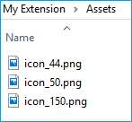

# <span data-ttu-id="33dcb-104">Criando e testando um pacote AppX de extensão do Microsoft Edge</span><span class="sxs-lookup"><span data-stu-id="33dcb-104">Creating and testing a Microsoft Edge extension AppX package</span></span>  

[!INCLUDE [deprecation-note](../../includes/deprecation-note.md)]  

<span data-ttu-id="33dcb-105">As extensões do Microsoft Edge são empacotadas como AppX, semelhante à forma como os aplicativos universais do Windows são empacotados.</span><span class="sxs-lookup"><span data-stu-id="33dcb-105">Microsoft Edge extensions are packaged as AppX, similar to how Universal Windows Apps are packaged.</span></span> <span data-ttu-id="33dcb-106">Desde a atualização de aniversário do Windows 10, foi introduzido um novo esquema para AppX que permite que um AppX inclua uma extensão do Microsoft Edge como conteúdo.</span><span class="sxs-lookup"><span data-stu-id="33dcb-106">As of Windows 10 Anniversary Update, a new schema has been introduced for AppX that allows an AppX to include a Microsoft Edge extension as its content.</span></span>

<span data-ttu-id="33dcb-107">Se você já sabe como a extensão do Microsoft Edge AppXs é criada, você pode ignorar o [uso do ManifoldJS para a extensão do pacote](./using-manifoldjs-to-package-extensions.md) para saber como usar uma ferramenta baseada em Node.js para fazer tudo isso por você!</span><span class="sxs-lookup"><span data-stu-id="33dcb-107">If you already know how Microsoft Edge extension AppXs are created, you can skip to [Using ManifoldJS to package extension](./using-manifoldjs-to-package-extensions.md) to learn how to use a Node.js based tool to do all of this for you!</span></span>

> [!NOTE]
> <span data-ttu-id="33dcb-108">No momento, o envio de uma extensão do Microsoft Edge para a Microsoft Store é um recurso restrito.</span><span class="sxs-lookup"><span data-stu-id="33dcb-108">Submitting a Microsoft Edge extension to the Microsoft Store is currently a restricted capability.</span></span> <span data-ttu-id="33dcb-109">Depois de criar, empacotar e testar sua extensão, envie uma solicitação em nosso formulário de [envio de extensão](https://aka.ms/extension-request).</span><span class="sxs-lookup"><span data-stu-id="33dcb-109">Once you've created, packaged and tested your extension, please submit a request on our [extension submission form](https://aka.ms/extension-request).</span></span>

## <span data-ttu-id="33dcb-110">Preparando a pasta de envio</span><span class="sxs-lookup"><span data-stu-id="33dcb-110">Preparing the submission folder</span></span>

<span data-ttu-id="33dcb-111">Para preparar a extensão para envio, você precisa criar uma pasta com a seguinte estrutura:</span><span class="sxs-lookup"><span data-stu-id="33dcb-111">To prepare your extension for submission, you need to create a folder with the following structure:</span></span>


<span data-ttu-id="33dcb-114">Na raiz da pasta, você deve incluir um arquivo AppXManifest.xml.</span><span class="sxs-lookup"><span data-stu-id="33dcb-114">At the root of the folder, you should include an AppXManifest.xml file.</span></span> <span data-ttu-id="33dcb-115">Esse arquivo é usado para especificar o conteúdo e o layout do pacote.</span><span class="sxs-lookup"><span data-stu-id="33dcb-115">This file is used to specify the contents and layout of the package.</span></span>

<span data-ttu-id="33dcb-116">Você também deve ter uma pasta de ativos que contém os ativos de interface do usuário a serem usados na Microsoft Store e uma pasta de extensão que contém os arquivos da extensão (scripts, ícones etc.).</span><span class="sxs-lookup"><span data-stu-id="33dcb-116">You should also have an Assets folder which contains the UI assets to be used in the Microsoft Store, and an Extension folder that contains your extension's files (scripts, icons, etc).</span></span>

> [!IMPORTANT]
> <span data-ttu-id="33dcb-117">Você pode criar uma estrutura de pastas diferente para o pacote, mas a estrutura de pastas deve corresponder aos valores de AppXManifest.</span><span class="sxs-lookup"><span data-stu-id="33dcb-117">You can create a different folder structure for your package, but the folder structure must match the AppXManifest values.</span></span>

### <span data-ttu-id="33dcb-118">AppXManifest.xml</span><span class="sxs-lookup"><span data-stu-id="33dcb-118">AppXManifest.xml</span></span>
<span data-ttu-id="33dcb-119">O arquivo AppXManifest é um documento XML que contém informações que o sistema precisa para implantar, exibir ou atualizar um aplicativo do Windows.</span><span class="sxs-lookup"><span data-stu-id="33dcb-119">The AppXManifest file is an XML document that contains info the system needs to deploy, display, or update a Windows app.</span></span> <span data-ttu-id="33dcb-120">Esse arquivo também inclui a identidade do pacote, recursos e elementos visuais.</span><span class="sxs-lookup"><span data-stu-id="33dcb-120">This file also includes package identity, capabilities, and visual elements.</span></span> <span data-ttu-id="33dcb-121">Cada pacote de aplicativo deve incluir um arquivo AppXManifest.</span><span class="sxs-lookup"><span data-stu-id="33dcb-121">Every app package must include one AppXManifest file.</span></span>

<span data-ttu-id="33dcb-122">Os desenvolvedores podem usar o modelo a seguir para o arquivo AppXManifest.xml:</span><span class="sxs-lookup"><span data-stu-id="33dcb-122">Developers can use the following template for their AppXManifest.xml file:</span></span>

```xml
<?xml version="1.0" encoding="utf-8"?>
<Package
  xmlns="http://schemas.microsoft.com/appx/manifest/foundation/windows10"
  xmlns:uap="http://schemas.microsoft.com/appx/manifest/uap/windows10"
  xmlns:uap3="http://schemas.microsoft.com/appx/manifest/uap/windows10/3"
  IgnorableNamespaces="uap3">

  <Identity
    Name="[REPLACE WITH PACKAGE/IDENTITYNAME]"
    Publisher="[REPLACE WITH PACKAGE/IDENTITY/PUBLISHER]"
    Version="[REPLACE WITH PACKAGE VERSION in the form X.X.X.0]"/>

  <Properties>
    <DisplayName>[REPLACE WITH RESERVED STORE NAME]</DisplayName>
    <PublisherDisplayName>[REPLACE WITH PACKAGE/PROPERTIES/PUBLISHERDISPLAYNAME]</PublisherDisplayName>
    <Logo>[REPLACE WITH RELATIVE PATH TO 50x50 ICON]</Logo>
  </Properties>

  <Dependencies>
    <TargetDeviceFamily Name="Windows.Desktop"
      MinVersion="10.0.14393.0"
      MaxVersionTested="10.0.14800.0" />
  </Dependencies>

  <Resources>
    <Resource Language="en-us"/>
  </Resources>

  <Applications>
    <Application Id="App">
      <uap:VisualElements
        AppListEntry="none"
        DisplayName="[REPLACE WITH RESERVED STORE NAME]"
        Square150x150Logo="[REPLACE WITH RELATIVE PATH TO 150x150 ICON]"
        Square44x44Logo="[REPLACE WITH RELATIVE PATH TO 44x44 ICON]"
        Description="This is the description of the extension"
        BackgroundColor="white">
      </uap:VisualElements>
    <Extensions>
    <uap3:Extension Category="windows.appExtension">
    <uap3:AppExtension Name="com.microsoft.edge.extension"
        Id="EdgeExtension"
        PublicFolder="Extension"
      DisplayName="[REPLACE WITH RESERVED STORE NAME]">
    </uap3:AppExtension>
    </uap3:Extension>
    </Extensions>
 </Application>
</Applications>
</Package>
```  

#### <span data-ttu-id="33dcb-123">Valores do modelo de identidade do aplicativo</span><span class="sxs-lookup"><span data-stu-id="33dcb-123">App identity template values</span></span>
<span data-ttu-id="33dcb-124">Depois de [reservar o nome de sua extensão](./extensions-in-the-windows-dev-center.md#name-reservation) por meio do centro de desenvolvimento do Windows, você poderá encontrar as informações necessárias de identidade do pacote necessárias para substituir os seguintes valores no AppXManifest.xml:</span><span class="sxs-lookup"><span data-stu-id="33dcb-124">Once you've [reserved the name of your extension](./extensions-in-the-windows-dev-center.md#name-reservation) through the Windows Dev Center, you'll be able to find the necessary package identity information needed to replace the following values in AppXManifest.xml:</span></span>

-   `Name`
-   `Publisher`
-   `DisplayName`
-   `PublisherDisplayName`

<span data-ttu-id="33dcb-125">Você pode acessar a página de identidade do aplicativo usando as seguintes etapas:</span><span class="sxs-lookup"><span data-stu-id="33dcb-125">You can access your App identity page using the following steps:</span></span>

1.  <span data-ttu-id="33dcb-126">Navegue até o [centro de desenvolvimento do Windows](https://developer.microsoft.com/windows/).</span><span class="sxs-lookup"><span data-stu-id="33dcb-126">Navigate to [Windows Dev Center](https://developer.microsoft.com/windows/).</span></span>
2.  <span data-ttu-id="33dcb-127">Conecte-se à sua conta de desenvolvedor.</span><span class="sxs-lookup"><span data-stu-id="33dcb-127">Sign in to your developer account.</span></span>
3.  <span data-ttu-id="33dcb-128">Navegue até o painel.</span><span class="sxs-lookup"><span data-stu-id="33dcb-128">Navigate to the Dashboard.</span></span>
4.  <span data-ttu-id="33dcb-129">Selecione o nome da sua extensão.</span><span class="sxs-lookup"><span data-stu-id="33dcb-129">Select the name of your extension.</span></span>
    
    
    
5.  <span data-ttu-id="33dcb-131">Navegue até a página identidade do aplicativo que está na seção Gerenciamento de aplicativos (após você ter registrado o aplicativo).</span><span class="sxs-lookup"><span data-stu-id="33dcb-131">Navigate to the App identity page which is under the App management section (after you've registered your app).</span></span>
    
    
    
<span data-ttu-id="33dcb-133">Agora você pode preencher o modelo AppXManifest com valores da página identidade do aplicativo, conforme indicado no modelo:</span><span class="sxs-lookup"><span data-stu-id="33dcb-133">You can now populate the AppXManifest template with values from the App identity page, as indicated in the template:</span></span>

```xml
<Identity
  Name="37369abigailc.MyExtension"
  Publisher="CN=732F2E5E-B9A6-4243-85F6-A4210F57AA10"
  Version="[REPLACE WITH PACKAGE VERSION in the form X.X.X.0]" />

<Properties>
  <DisplayName>My Extension</DisplayName>
  <PublisherDisplayName>abigailc</PublisherDisplayName>
  <Logo>[REPLACE WITH RELATIVE PATH TO 50x50 ICON]</Logo>
</Properties>
```  

#### <span data-ttu-id="33dcb-134">Valores de modelo de manifesto JSON</span><span class="sxs-lookup"><span data-stu-id="33dcb-134">JSON manifest template values</span></span>
<span data-ttu-id="33dcb-135">Alguns valores no AppXManifest precisam corresponder àqueles definidos no manifesto JSON.</span><span class="sxs-lookup"><span data-stu-id="33dcb-135">Some values in the AppXManifest need to match those that are defined in the JSON manifest.</span></span> <span data-ttu-id="33dcb-136">Atualize os seguintes valores no appxmanifest.xml com base em seu manifesto de extensão JSON:</span><span class="sxs-lookup"><span data-stu-id="33dcb-136">Please update the following values in appxmanifest.xml based on your extension JSON manifest:</span></span>

-   `Version` <span data-ttu-id="33dcb-137">-Esta é a versão listada no manifesto JSON de extensão.</span><span class="sxs-lookup"><span data-stu-id="33dcb-137">- This is the version listed in your extension's JSON manifest.</span></span> <span data-ttu-id="33dcb-138">A cadeia de caracteres precisa coincidir com o formato X. X. X. X em que o último inteiro precisa ser 0.</span><span class="sxs-lookup"><span data-stu-id="33dcb-138">The string needs to match the X.X.X.X format where the last integer has to be 0.</span></span> <span data-ttu-id="33dcb-139">Ex.</span><span class="sxs-lookup"><span data-stu-id="33dcb-139">E.g.</span></span> <span data-ttu-id="33dcb-140">1.2.3.0</span><span class="sxs-lookup"><span data-stu-id="33dcb-140">1.2.3.0</span></span>
    
    ```xml
    <Identity
         Name="37369abigailc.MyExtension"
         Publisher="CN=732F2E5E-B9A6-4243-85F6-A4210F57AA10"
         Version="1.0.0.0" />
    ```  
    
-   `Description` <span data-ttu-id="33dcb-141">-Esta é uma cópia da descrição no manifesto JSON de extensão.</span><span class="sxs-lookup"><span data-stu-id="33dcb-141">- This is a copy of the description in your extension's JSON manifest.</span></span>
    
    ```xml
    <uap:VisualElements
         AppListEntry="none"
         DisplayName="My Extension"
         Square150x150Logo="[REPLACE WITH RELATIVE PATH TO 150x150 ICON]"
         Square44x44Logo="[REPLACE WITH RELATIVE PATH TO 44x44 ICON]"
         Description="This extension will allow you to quickly print by clicking the browser action."
         BackgroundColor="white">
    </uap:VisualElements>
    ```  
    
### <span data-ttu-id="33dcb-142">Pasta ativos</span><span class="sxs-lookup"><span data-stu-id="33dcb-142">Assets folder</span></span>

<span data-ttu-id="33dcb-143">Na pasta ativos, você precisará de três tamanhos de ícone diferentes.</span><span class="sxs-lookup"><span data-stu-id="33dcb-143">Within the Assets folder you will need three different icon sizes.</span></span> <span data-ttu-id="33dcb-144">Esses ícones serão usados na Microsoft Store e na interface do usuário do Windows.</span><span class="sxs-lookup"><span data-stu-id="33dcb-144">These icons will be used in the Microsoft Store and the Windows UI.</span></span> <span data-ttu-id="33dcb-145">Para obter mais informações sobre esses ícones, consulte o guia de [design](./../design.md#icons-for-packaging) .</span><span class="sxs-lookup"><span data-stu-id="33dcb-145">For more information on these icons, see the [Design](./../design.md#icons-for-packaging) guide.</span></span>



<span data-ttu-id="33dcb-147">Depois de criar os ativos de interface do usuário necessários, atualize AppXManifest.xml para apontar para os arquivos corretos:</span><span class="sxs-lookup"><span data-stu-id="33dcb-147">Once you've created the necessary UI assets, update AppXManifest.xml to point to the correct files:</span></span>

-   <span data-ttu-id="33dcb-148">44x44</span><span class="sxs-lookup"><span data-stu-id="33dcb-148">44x44</span></span>
    
    ```xml
    Square44x44Logo="Assets/icon_44.png"
    ```  
    
-   <span data-ttu-id="33dcb-149">50x50</span><span class="sxs-lookup"><span data-stu-id="33dcb-149">50x50</span></span>
    
    ```xml
    <Logo>Assets/icon_50.png</Logo>
    ```  
    
-   <span data-ttu-id="33dcb-150">150x150</span><span class="sxs-lookup"><span data-stu-id="33dcb-150">150x150</span></span>
    
    ```xml
    Square150x150Logo="Assets/icon_150.png"
    ```  
    
### <span data-ttu-id="33dcb-151">Pasta de extensão</span><span class="sxs-lookup"><span data-stu-id="33dcb-151">Extension folder</span></span>
<span data-ttu-id="33dcb-152">Copie os arquivos de extensão (mantendo a estrutura de pastas) para a pasta de extensão.</span><span class="sxs-lookup"><span data-stu-id="33dcb-152">Copy your extension files (keeping the folder structure) into the Extension folder.</span></span> <span data-ttu-id="33dcb-153">Certifique-se `manifest.json` de que esteja na pasta raiz de extensão.</span><span class="sxs-lookup"><span data-stu-id="33dcb-153">Make sure `manifest.json` is at the root your Extension folder.</span></span>


### <span data-ttu-id="33dcb-155">Suporte a mais de uma localidade</span><span class="sxs-lookup"><span data-stu-id="33dcb-155">Supporting more than one locale</span></span>
<span data-ttu-id="33dcb-156">Se a extensão oferecer suporte a mais de um idioma, talvez você queira configurar o pacote AppX com todas as localidades necessárias para que o ícone e a descrição corretos localizados sejam exibidos na Microsoft Store.</span><span class="sxs-lookup"><span data-stu-id="33dcb-156">If your extension supports more than one language, you may want to configure the AppX package with all the locales that you need so that the correct localized icon and description appear in the Microsoft Store.</span></span> <span data-ttu-id="33dcb-157">Para saber mais, consulte [localizando pacotes de extensão](./localizing-extension-packages.md) para obter mais informações.</span><span class="sxs-lookup"><span data-stu-id="33dcb-157">See [Localizing extension packages](./localizing-extension-packages.md) for more information.</span></span>

### <span data-ttu-id="33dcb-158">Criando um Appx</span><span class="sxs-lookup"><span data-stu-id="33dcb-158">Creating an Appx</span></span>

<span data-ttu-id="33dcb-159">Para criar um Appx, você precisará encontrar o caminho para makeappx.</span><span class="sxs-lookup"><span data-stu-id="33dcb-159">To create an Appx, you'll need to find the path for makeappx.</span></span> <span data-ttu-id="33dcb-160">Isso geralmente está localizado no seguinte local se você estiver em um computador de 64 bits.</span><span class="sxs-lookup"><span data-stu-id="33dcb-160">This is usually located in the following location if you're on a 64-bit machine.</span></span>

`C:\Program Files (x86)\Windows Kits\10\bin\x64`

<span data-ttu-id="33dcb-161">Execute o seguinte comando para criar o pacote AppX para sua extensão:</span><span class="sxs-lookup"><span data-stu-id="33dcb-161">Execute the following command to create the AppX package for your extension:</span></span>

`[Path to makeappx] makeappx pack /h SHA256 /d [Path to package folder created in #1] /p [Path to the appx file that you want to create]`

<span data-ttu-id="33dcb-162">Isso deve ter uma aparência assim que você preencher os caminhos:</span><span class="sxs-lookup"><span data-stu-id="33dcb-162">This should look something like this once you've filled in the paths:</span></span>

`C:\Program Files (x86)\Windows Kits\10\bin\x64>makeappx.exe pack /h SHA256 /d "C:\Extension\My Extension" /p C:\Extension\MyExtension.appx`

### <span data-ttu-id="33dcb-163">Descompactar um Appx</span><span class="sxs-lookup"><span data-stu-id="33dcb-163">Unpacking an Appx</span></span>
<span data-ttu-id="33dcb-164">Você pode querer descompactar um AppX gerado anteriormente e usá-lo como ponto de partida para a próxima iteração da extensão ou para confirmar que o AppX foi criado corretamente.</span><span class="sxs-lookup"><span data-stu-id="33dcb-164">You may want to unpack a previously generated AppX and use it as a starting point for the next iteration of your extension or to confirm that the AppX was created correctly.</span></span>

<span data-ttu-id="33dcb-165">Para fazer isso, você pode executar o seguinte comando para descompactar o pacote AppX da extensão do Microsoft Edge:</span><span class="sxs-lookup"><span data-stu-id="33dcb-165">To do this, you can execute the following command to unpack the AppX package of your Microsoft Edge extension:</span></span>

```shell
[Path to makeappx] makeappx unpack /v /p [Path to appx file you want to unpack] /d [Path to the location where you want to create the package folder]
```  

<span data-ttu-id="33dcb-166">Isso deve ser algo assim quando preenchido:</span><span class="sxs-lookup"><span data-stu-id="33dcb-166">This should look something like this when filled out:</span></span>

```text
C:\Program Files (x86)\Windows Kits\10\bin\x64>makeappx.exe unpack /v /p "C:\Extension\MyExtension.appx" /d "C:\Extension\My Extension"
```  

## <span data-ttu-id="33dcb-167">Testando um pacote AppX</span><span class="sxs-lookup"><span data-stu-id="33dcb-167">Testing an AppX package</span></span>

<span data-ttu-id="33dcb-168">Você pode testar o pacote AppX da extensão do Microsoft Edge fazendo o Sideload no Microsoft Edge.</span><span class="sxs-lookup"><span data-stu-id="33dcb-168">You can test your Microsoft Edge extension AppX package by sideloading it in Microsoft Edge.</span></span> <span data-ttu-id="33dcb-169">Sideload o pacote AppX de extensão é semelhante ao Sideload de um aplicativo universal do Windows.</span><span class="sxs-lookup"><span data-stu-id="33dcb-169">Sideloading the extension AppX package is similar to sideloading a Universal Windows app.</span></span> <span data-ttu-id="33dcb-170">Será necessário criar um certificado para assinar o pacote e, em seguida, adicionar o pacote ao Windows.</span><span class="sxs-lookup"><span data-stu-id="33dcb-170">You will need to create a certificate for signing the package, and then add the package to Windows.</span></span>

### <span data-ttu-id="33dcb-171">Assinou</span><span class="sxs-lookup"><span data-stu-id="33dcb-171">Signing</span></span>

<span data-ttu-id="33dcb-172">Veja [como criar um certificado de assinatura de pacote de aplicativo](https://msdn.microsoft.com/library/windows/desktop/jj835832.aspx) e [como assinar um pacote de aplicativo usando Signtool](https://msdn.microsoft.com/library/windows/desktop/jj835835.aspx) para obter informações sobre o processo de autenticação e certificação para pacotes.</span><span class="sxs-lookup"><span data-stu-id="33dcb-172">See [How to create an app package signing certificate](https://msdn.microsoft.com/library/windows/desktop/jj835832.aspx) and [How to sign an app package using SignTool](https://msdn.microsoft.com/library/windows/desktop/jj835835.aspx) for info on the signing and certification process for packages.</span></span>

> [!NOTE]
> <span data-ttu-id="33dcb-173">Você não precisa assinar um pacote de extensão antes de enviá-lo para a Microsoft Store; o processo de inclusão da loja cuidará disso para você.</span><span class="sxs-lookup"><span data-stu-id="33dcb-173">You do not need to sign an extension package before submitting it to the Microsoft Store; the Store ingestion process will take care of that for you!</span></span>

<span data-ttu-id="33dcb-174">Depois de assinar o pacote com o certificado que você criou, o certificado ainda não é confiável para a máquina local para a implantação de pacotes de aplicativos até que você o instale no repositório de certificados confiáveis do computador local.</span><span class="sxs-lookup"><span data-stu-id="33dcb-174">After you've signed the package with the certificate that you created, the certificate is still not trusted by the local machine for deployment of app packages until you install it into the trusted certificates store of the local computer.</span></span> <span data-ttu-id="33dcb-175">Você pode usar Certutil.exe, que vem com o Windows, para fazer isso.</span><span class="sxs-lookup"><span data-stu-id="33dcb-175">You can use Certutil.exe, which comes with Windows to do this.</span></span>

<span data-ttu-id="33dcb-176">Para instalar certificados com o WindowsCertutil.exe, execute Cmd.exe como administrador e execute o seguinte comando:</span><span class="sxs-lookup"><span data-stu-id="33dcb-176">To install certificates with WindowsCertutil.exe, run Cmd.exe as administrator and run the following command:</span></span>

```shell
Certutil -addStore TrustedPeople MyKey.cer
```  

<span data-ttu-id="33dcb-177">Depois que os certificados não estiverem mais em uso, recomendamos que você os remova executando o seguinte comando em um prompt de comando de administrador:</span><span class="sxs-lookup"><span data-stu-id="33dcb-177">Once the certificates are no longer in use, it is recommended that you remove them by running the following command from an administrator command prompt:</span></span>

```shell
Certutil -delStore TrustedPeople certID
```  

<span data-ttu-id="33dcb-178">O certid é o número de série do certificado.</span><span class="sxs-lookup"><span data-stu-id="33dcb-178">The certID is the serial number of the certificate.</span></span> <span data-ttu-id="33dcb-179">Para determinar o número de série do certificado, execute o seguinte comando:</span><span class="sxs-lookup"><span data-stu-id="33dcb-179">To determine the certificate serial number, run the following command:</span></span>

```shell
Certutil -store TrustedPeople
```  

### <span data-ttu-id="33dcb-180">Implantando</span><span class="sxs-lookup"><span data-stu-id="33dcb-180">Deploying</span></span>
<span data-ttu-id="33dcb-181">Você pode implantar o pacote AppX da extensão do Microsoft Edge executando o seguinte comando no PowerShell (como administrador):</span><span class="sxs-lookup"><span data-stu-id="33dcb-181">You can deploy the Microsoft Edge Extension AppX package by running the following command in PowerShell (as administrator):</span></span>

```powershell
Add-AppxPackage [path to AppX]
```  

## <span data-ttu-id="33dcb-182">Teste automatizado com o WebDriver</span><span class="sxs-lookup"><span data-stu-id="33dcb-182">Automated testing with WebDriver</span></span>

<span data-ttu-id="33dcb-183">Desde a atualização de aniversário, você pode Sideload programaticamente a sua extensão no Microsoft Edge com o WebDriver, permitindo o teste automatizado de extensões quando o Microsoft Edge for iniciado no modo WebDriver.</span><span class="sxs-lookup"><span data-stu-id="33dcb-183">As of the Anniversary Update, you can programmatically sideload your extension in Microsoft Edge with WebDriver, enabling automated testing of extensions when Microsoft Edge is launched in WebDriver mode.</span></span> <span data-ttu-id="33dcb-184">Isso permitirá que você configure testes automatizados para qualquer extensão que manipule conteúdo em uma página e verifique se o comportamento correto está sendo exibido.</span><span class="sxs-lookup"><span data-stu-id="33dcb-184">This will allow you to set up automated tests for any extension that manipulates content on a page and verify that the correct behavior is exhibited.</span></span>

<span data-ttu-id="33dcb-185">Para Sideload a extensão do teste automatizado, você precisará armazenar a pasta da extensão em `%LOCALAPPDATA%\Packages\Microsoft.MicrosoftEdge_8wekyb3d8bbwe\LocalState\` .</span><span class="sxs-lookup"><span data-stu-id="33dcb-185">To sideload your extension for automated testing, you'll need to store your extension's folder under `%LOCALAPPDATA%\Packages\Microsoft.MicrosoftEdge_8wekyb3d8bbwe\LocalState\`.</span></span> <span data-ttu-id="33dcb-186">Depois que sua extensão estiver no `LocalState` diretório, você precisará criar um [`EdgeOptions`](https://seleniumhq.github.io/selenium/docs/api/dotnet/html/T_OpenQA_Selenium_Edge_EdgeOptions.htm) objeto e adicionar a `extensionPaths` funcionalidade a ele.</span><span class="sxs-lookup"><span data-stu-id="33dcb-186">Once your extension is in the `LocalState` directory, you'll need to create an [`EdgeOptions`](https://seleniumhq.github.io/selenium/docs/api/dotnet/html/T_OpenQA_Selenium_Edge_EdgeOptions.htm) object, and add the `extensionPaths` capability to it.</span></span> <span data-ttu-id="33dcb-187">O valor dessa funcionalidade é uma matriz de caminhos absolutos para as extensões (no `LocalState` diretório) que você deseja que o lado seja carregado quando o Microsoft Edge iniciar no modo WebDriver.</span><span class="sxs-lookup"><span data-stu-id="33dcb-187">The value of this capability is an array of absolute paths to the extensions (in the `LocalState` directory) you wish to have side loaded when Microsoft Edge starts in WebDriver mode.</span></span>

<span data-ttu-id="33dcb-188">Confira o seguinte [arquivo em C#](https://github.com/scottlow/Ignite2016/blob/master/Ignite%202016%20WebDriver%20Demo/IgniteWebDriverDemo/Program.cs) para obter um exemplo completo sobre extensões de carregamento lado a lado do Microsoft Edge com WebDriver.</span><span class="sxs-lookup"><span data-stu-id="33dcb-188">Check out the following [C# file](https://github.com/scottlow/Ignite2016/blob/master/Ignite%202016%20WebDriver%20Demo/IgniteWebDriverDemo/Program.cs) for a complete sample on side loading extensions in Microsoft Edge with WebDriver.</span></span>
