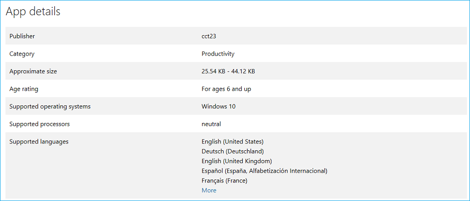
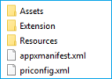
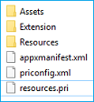

# <a name="localizing-microsoft-edge-extensions-for-windows-and-the-microsoft-store"></a><span data-ttu-id="92dc8-104">Localizando extensões do Microsoft Edge para Windows e Microsoft Store</span><span class="sxs-lookup"><span data-stu-id="92dc8-104">Localizing Microsoft Edge extensions for Windows and the Microsoft Store</span></span>  

[!INCLUDE [deprecation-note](../../includes/deprecation-note.md)]  

<span data-ttu-id="92dc8-105">Este guia explica como localizar sua extensão do Microsoft Edge para que ela esteja pronta para várias localidades após a versão.</span><span class="sxs-lookup"><span data-stu-id="92dc8-105">This guide walks through how to localize your Microsoft Edge extension so that it's ready for multiple locales upon release.</span></span>  <span data-ttu-id="92dc8-106">Para localização completa da extensão, você precisará seguir as etapas do Windows e da Microsoft Store.</span><span class="sxs-lookup"><span data-stu-id="92dc8-106">To fully localize your extension, you'll need to follow the steps for both Windows and the Microsoft Store.</span></span>  

<span data-ttu-id="92dc8-107">Se quiser localizar seus recursos de extensão para o Microsoft Edge, saiba como usar a estrutura i18n no guia [Internacionalização.](../internationalization.md)</span><span class="sxs-lookup"><span data-stu-id="92dc8-107">If you want to localize your extension resources for Microsoft Edge, you can learn how to use the i18n framework in the [Internationalization guide](../internationalization.md).</span></span>  

> [!NOTE]
> <span data-ttu-id="92dc8-108">Se sua extensão não tiver suporte para vários idiomas, você poderá ignorar o nome e a descrição de localização [na Microsoft Store.](#localizing-name-and-description-in-the-microsoft-store)</span><span class="sxs-lookup"><span data-stu-id="92dc8-108">If your extension doesn't support multiple languages, you can skip to [Localizing name and description in the Microsoft Store](#localizing-name-and-description-in-the-microsoft-store).</span></span>  

## <a name="the-localization-process-overview"></a><span data-ttu-id="92dc8-109">Visão geral do processo de localização</span><span class="sxs-lookup"><span data-stu-id="92dc8-109">The localization process overview</span></span>  

<span data-ttu-id="92dc8-110">A primeira etapa para disponibilizar sua extensão para uma ampla audiência é configurar seu [AppxManifest](#configuring-the-appxmanifest) para vários idiomas.</span><span class="sxs-lookup"><span data-stu-id="92dc8-110">The first step towards getting your extension available to a wide audience is to [configure its AppxManifest](#configuring-the-appxmanifest) for multiple languages.</span></span>  <span data-ttu-id="92dc8-111">Na Microsoft Store, isso mostrará aos usuários quais idiomas sua extensão oferece suporte.</span><span class="sxs-lookup"><span data-stu-id="92dc8-111">In the Microsoft Store, this will show users what languages your extension supports.</span></span>  <span data-ttu-id="92dc8-112">Determinados campos no AppxManifest também precisarão ser alterados se você quiser que o nome da sua extensão seja localizado na interface do usuário do Windows e [na Microsoft Store](#localizing-extension-resources-for-windows-and-the-microsoft-store).</span><span class="sxs-lookup"><span data-stu-id="92dc8-112">Certain fields in the AppxManifest will also need to be changed if you want the name of your extension to be [localized in the Windows UI and the Microsoft Store](#localizing-extension-resources-for-windows-and-the-microsoft-store).</span></span>  

<span data-ttu-id="92dc8-113">Depois que o AppxManifest estiver configurado, você precisará criar recursos de cadeia de caracteres [JSON](#creating-json-string-resources) para os idiomas que você indicou como suportados.</span><span class="sxs-lookup"><span data-stu-id="92dc8-113">Once your AppxManifest is configured, you'll need to [create JSON string resources](#creating-json-string-resources) for the languages that you indicated as supported.</span></span>  <span data-ttu-id="92dc8-114">Isso requer a criação de um arquivo para cada idioma, onde cada arquivo tem todas as cadeias de caracteres de interface do usuário `.resjson` desse idioma dentro dele.</span><span class="sxs-lookup"><span data-stu-id="92dc8-114">This requires creating a `.resjson` file for each language, where each file has all the UI strings of that language within it.</span></span>  

<span data-ttu-id="92dc8-115">Depois que os arquivos dos idiomas com suporte foram feitos, um arquivo de recurso `.resjson` [.pri precisará ser criado](#creating-the-resources-file).</span><span class="sxs-lookup"><span data-stu-id="92dc8-115">After the `.resjson` files for the supported languages have been made, a [.pri resource file will need to be created](#creating-the-resources-file).</span></span> <span data-ttu-id="92dc8-116">Isso será criado usando um arquivo de configuração para a ferramenta MakePRI que vem com o [SDK do Windows 10.](https://developer.microsoft.com/windows/downloads/windows-10-sdk)</span><span class="sxs-lookup"><span data-stu-id="92dc8-116">This will be created by using a configuration file to the MakePRI tool that comes with the [Windows 10 SDK](https://developer.microsoft.com/windows/downloads/windows-10-sdk).</span></span>  

> [!NOTE]
> <span data-ttu-id="92dc8-117">Se você estiver baixando apenas o SDK do Windows 10 para usar a ferramenta, poderá selecionar apenas as Ferramentas de Assinatura do SDK do Windows para Aplicativos de Área de Trabalho e o SDK do Windows para recursos do Aplicativo Gerenciado `MakePri.exe` **UWP** para manter o download mais claro. </span><span class="sxs-lookup"><span data-stu-id="92dc8-117">If you are only downloading the Windows 10 SDK to use the `MakePri.exe` tool, you can select only the **Windows SDK Signing Tools for Desktop Apps** and **Windows SDK for UWP Managed App** features to keep the download lighter.</span></span>  <span data-ttu-id="92dc8-118">A `MakePri.exe` ferramenta aparecerá em subpastas de `C:\Program Files (x86)\Windows Kits\10\bin\10.0.17713.0` .</span><span class="sxs-lookup"><span data-stu-id="92dc8-118">The `MakePri.exe` tool will appear in subfolders of `C:\Program Files (x86)\Windows Kits\10\bin\10.0.17713.0`.</span></span>  

<span data-ttu-id="92dc8-119">Depois de carregar sua extensão, a etapa final é localizar o nome e a [descrição na Microsoft Store](#localizing-name-and-description-in-the-microsoft-store).</span><span class="sxs-lookup"><span data-stu-id="92dc8-119">Once you've uploaded your extension, the final step is to [localize the name and description in the Microsoft Store](#localizing-name-and-description-in-the-microsoft-store).</span></span>  

> [!NOTE]
> <span data-ttu-id="92dc8-120">No momento, enviar uma extensão do Microsoft Edge à Microsoft Store é um recurso restrito.</span><span class="sxs-lookup"><span data-stu-id="92dc8-120">Submitting a Microsoft Edge extension to the Microsoft Store is currently a restricted capability.</span></span>  <span data-ttu-id="92dc8-121">**Entre em contato conosco com** suas solicitações para fazer parte da Microsoft Store e consideraremos você para uma atualização futura.</span><span class="sxs-lookup"><span data-stu-id="92dc8-121">**Reach out to us** with your requests to be a part of the Microsoft Store, and we'll consider you for a future update.</span></span>  

## <a name="configuring-the-appxmanifest"></a><span data-ttu-id="92dc8-122">Configurando o AppXManifest</span><span class="sxs-lookup"><span data-stu-id="92dc8-122">Configuring the AppXManifest</span></span>  

<span data-ttu-id="92dc8-123">A lista de idiomas com suporte da sua extensão na Microsoft Store é gerada com base em seus valores AppXManifest.</span><span class="sxs-lookup"><span data-stu-id="92dc8-123">Your extension's Supported languages list in the Microsoft Store is generated based on its AppXManifest values.</span></span>  <span data-ttu-id="92dc8-124">Essa lista é especificada usando o `Resource` elemento.</span><span class="sxs-lookup"><span data-stu-id="92dc8-124">This list is specified using the `Resource` element.</span></span>  

  

<span data-ttu-id="92dc8-126">Para especificar a lista de idiomas que são suportados pela extensão, você pode adicionar um elemento no formato visto abaixo \(este elemento mostrará suporte para inglês, alemão e francês na `Resource` `Resource` Microsoft Store\):</span><span class="sxs-lookup"><span data-stu-id="92dc8-126">To specify the list of languages that are supported by your extension, you can add a `Resource` element in the format seen below \(this `Resource` element will show support for English, German, and French in the Microsoft Store\):</span></span>  

```xml
<Resources>
    <Resource Language="en-us"/>
    <Resource Language="de-de"/>
    <Resource Language="fr-fr"/>
</Resources>
```  

<span data-ttu-id="92dc8-127">Consulte [Idiomas com suporte para](/windows/uwp/publish/supported-languages) obter informações sobre os códigos de idiomas/idiomas compatíveis com a Microsoft Store.</span><span class="sxs-lookup"><span data-stu-id="92dc8-127">See [Supported languages](/windows/uwp/publish/supported-languages) for info on the languages/language codes that the Microsoft Store supports.</span></span>  

<span data-ttu-id="92dc8-128">Para especificar cadeias de caracteres localizadas para todos os elementos visíveis publicamente no AppxManifest, você terá que usar um identificador de recurso no formato `ms-resource:<resource id>` de .</span><span class="sxs-lookup"><span data-stu-id="92dc8-128">In order to specify localized strings for all publicly visible elements in the AppxManifest, you'll have to use a resource identifier in the format of `ms-resource:<resource id>`.</span></span>  

<span data-ttu-id="92dc8-129">Os trechos abaixo fazem um AppxManifest completo.</span><span class="sxs-lookup"><span data-stu-id="92dc8-129">The snippets below make a complete AppxManifest.</span></span> <span data-ttu-id="92dc8-130">Os seguintes valores devem ser recuperados de arquivos de recursos localizados:</span><span class="sxs-lookup"><span data-stu-id="92dc8-130">The following values should be retrieved from localized resource files:</span></span>  

*   <span data-ttu-id="92dc8-131">Properties\DisplayName</span><span class="sxs-lookup"><span data-stu-id="92dc8-131">Properties\DisplayName</span></span>  
*   <span data-ttu-id="92dc8-132">Properties\Description</span><span class="sxs-lookup"><span data-stu-id="92dc8-132">Properties\Description</span></span>  
*   <span data-ttu-id="92dc8-133">Properties\PublisherDisplayName</span><span class="sxs-lookup"><span data-stu-id="92dc8-133">Properties\PublisherDisplayName</span></span>  

```xml
<Properties>
    <DisplayName>ms-resource:DisplayName</DisplayName>
    <Description>ms-resource:Description</Description>
    <Logo>Assets\PackageLogo.png</Logo>
    <PublisherDisplayName>ms-resource:PublisherName</PublisherDisplayName>
</Properties>
```  

*   <span data-ttu-id="92dc8-134">Applications\Application\VisualElements\DisplayName</span><span class="sxs-lookup"><span data-stu-id="92dc8-134">Applications\Application\VisualElements\DisplayName</span></span>  
*   <span data-ttu-id="92dc8-135">Applications\Application\VisualElements\Description</span><span class="sxs-lookup"><span data-stu-id="92dc8-135">Applications\Application\VisualElements\Description</span></span>  
*   <span data-ttu-id="92dc8-136">Applications\Application\Extensions\Extension\AppExtension\DisplayName</span><span class="sxs-lookup"><span data-stu-id="92dc8-136">Applications\Application\Extensions\Extension\AppExtension\DisplayName</span></span>  

```xml
<Applications>
    <Application Id="App">
      <uap:VisualElements
        AppListEntry="none"
            DisplayName="ms-resource:DisplayName"
       Square150x150Logo="Assets\Square150x150Logo.png"
       Square44x44Logo="Assets\Square44x44Logo.png"
            Description="ms-resource:Description"
        BackgroundColor="transparent">
      </uap:VisualElements>
      <Extensions>
      <uap3:Extension Category="windows.appExtension">
        <uap3:AppExtension Name="com.microsoft.edge.extension"
            Id="MicrosoftTranslate"
            PublicFolder="Extension"
            DisplayName="ms-resource:DisplayName">
        </uap3:AppExtension>
      </uap3:Extension>
      </Extensions>
    </Application>
  </Applications>
```  

## <a name="localizing-extension-resources-for-windows-and-the-microsoft-store"></a><span data-ttu-id="92dc8-137">Localizando recursos de extensão para Windows e a Microsoft Store</span><span class="sxs-lookup"><span data-stu-id="92dc8-137">Localizing extension resources for Windows and the Microsoft Store</span></span>  

<span data-ttu-id="92dc8-138">Agora que seu AppxManifest está configurado para vários idiomas, há algumas diferenças importantes que você deve saber entre a localização da interface do usuário em sua extensão e a localização de sua extensão para Windows e a Microsoft Store.</span><span class="sxs-lookup"><span data-stu-id="92dc8-138">Now that your AppxManifest is configured for multiple languages, there are some key differences you should know between localizing the UI within your extension and localizing your extension for Windows and the Microsoft Store.</span></span>  

<span data-ttu-id="92dc8-139">Embora as extensões do Microsoft Edge não são executados fora do Microsoft Edge, o gerenciamento delas pode ocorrer no Windows.</span><span class="sxs-lookup"><span data-stu-id="92dc8-139">While Microsoft Edge extensions don't run outside of Microsoft Edge, the management of them can occur within Windows.</span></span>  <span data-ttu-id="92dc8-140">Por exemplo, os usuários podem gerenciar suas extensões no aplicativo Configurações:</span><span class="sxs-lookup"><span data-stu-id="92dc8-140">For example, users can manage their extensions in the Settings app:</span></span>  

  

<span data-ttu-id="92dc8-142">O nome da extensão que aparece no aplicativo Configurações no Windows vem do AppXManifest.</span><span class="sxs-lookup"><span data-stu-id="92dc8-142">The name of the extension that shows up in the Settings app in Windows comes from the AppXManifest.</span></span>  <span data-ttu-id="92dc8-143">Se esse valor for hardcoded em inglês, a versão em inglês do nome será aparecer em dispositivos Windows que não sejam inglês.</span><span class="sxs-lookup"><span data-stu-id="92dc8-143">If this value is hardcoded in English, the English version of the name will show up on non-English Windows devices.</span></span>  <span data-ttu-id="92dc8-144">Se a identidade visual da extensão for somente em inglês, não há problema em deixá-la codificada.</span><span class="sxs-lookup"><span data-stu-id="92dc8-144">If the branding of your extension is English only, it's ok to leave it hardcoded.</span></span>  

> [!NOTE]
> <span data-ttu-id="92dc8-145">Se você quiser usar nomes localizados para o Microsoft Edge Extension no [](./extensions-in-the-windows-dev-center.md#name-reservation) Windows, certifique-se de que os nomes localizados também estão disponíveis e reservados antes de fazer as alterações no arquivo AppXManifest.</span><span class="sxs-lookup"><span data-stu-id="92dc8-145">If you want to use localized names for your Microsoft Edge Extension in Windows, make sure the localized names are also [available and reserved](./extensions-in-the-windows-dev-center.md#name-reservation) before you make the changes in the AppXManifest file.</span></span>  <span data-ttu-id="92dc8-146">Se os nomes não são reservados, você obterá o seguinte erro ao carregar o pacote final no Centro de Dev do Windows:</span><span class="sxs-lookup"><span data-stu-id="92dc8-146">If the names are not reserved, you'll get the following error when you upload the final package to Windows Dev Center:</span></span>  
> 
>   

<span data-ttu-id="92dc8-148">A infraestrutura de localização baseada em i18n definida para extensões JavaScript só é aplicável no ambiente do Microsoft Edge.</span><span class="sxs-lookup"><span data-stu-id="92dc8-148">The i18n based localization infrastructure that's defined for JavaScript extensions is only applicable within the Microsoft Edge environment.</span></span>  

<span data-ttu-id="92dc8-149">Fora do Microsoft Edge, no Windows e na Microsoft Store, a única estrutura de localização com suporte é baseada na estrutura de localização da Plataforma Universal do Windows (UWP).</span><span class="sxs-lookup"><span data-stu-id="92dc8-149">Outside of Microsoft Edge, within Windows and the Microsoft Store, the only supported localization framework is based on the Universal Windows Platform (UWP) localization framework.</span></span>  

<span data-ttu-id="92dc8-150">Embora suportemos recursos baseados em JSON para aplicativos windows baseados em HTML, o esquema para os recursos JSON não é igual ao definido para extensões JavaScript.</span><span class="sxs-lookup"><span data-stu-id="92dc8-150">While we do support JSON based resources for HTML based Windows apps, the schema for the JSON resources doesn't match the one defined for JavaScript extensions.</span></span>  

<span data-ttu-id="92dc8-151">Veja a seguir as principais diferenças em [aplicativos baseados em HTML do Windows:](/previous-versions/windows/apps/hh465228(v=win.10))</span><span class="sxs-lookup"><span data-stu-id="92dc8-151">The following are the key differences in [HTML based Windows apps](/previous-versions/windows/apps/hh465228(v=win.10)):</span></span>  

*   <span data-ttu-id="92dc8-152">Os recursos são especificados em `.resjson` arquivos em vez de `.json` arquivos.</span><span class="sxs-lookup"><span data-stu-id="92dc8-152">Resources are specified in `.resjson` files instead of `.json` files.</span></span>  
*   <span data-ttu-id="92dc8-153">As localidades com suporte devem ser especificadas no arquivo AppXManifest, com a primeira localidade sendo a localidade padrão.</span><span class="sxs-lookup"><span data-stu-id="92dc8-153">The locales supported should be specified in the AppXManifest file, with the first locale being the default locale.</span></span>  
*   <span data-ttu-id="92dc8-154">Os recursos de aplicativos do Windows baseados em HTML usam o seguinte esquema:</span><span class="sxs-lookup"><span data-stu-id="92dc8-154">HTML based Windows apps resources use the following schema:</span></span>  
    
    ```json
    {
        "greeting"              : "Hello",
        "_greeting.comment"     : "A welcome greeting.",

        "farewell"              : "Goodbye",
        "_farewell.comment"     : "A goodbye."
    }
    ```  
    
    <span data-ttu-id="92dc8-155">O par nome/valor denotado por um sublinhado são comentários para o recurso de cadeia de caracteres correspondente.</span><span class="sxs-lookup"><span data-stu-id="92dc8-155">The name/value pair denoted by an underscore are comments for the corresponding string resource.</span></span>  
*   `.resjson` <span data-ttu-id="92dc8-156">os arquivos são compilados em `.pri` arquivos que devem ser incluídos durante a criação do pacote AppX.</span><span class="sxs-lookup"><span data-stu-id="92dc8-156">files are compiled into `.pri` files which must be included during AppX package creation.</span></span>  
    
### <a name="creating-json-string-resources"></a><span data-ttu-id="92dc8-157">Criando recursos de cadeia de caracteres JSON</span><span class="sxs-lookup"><span data-stu-id="92dc8-157">Creating JSON string resources</span></span>  

<span data-ttu-id="92dc8-158">Com um AppxManifest configurado em mãos e as diferenças entre as estruturas de localização i18n e UWP realçadas, você está pronto para criar seus arquivos de recursos.</span><span class="sxs-lookup"><span data-stu-id="92dc8-158">With a configured AppxManifest in hand and the differences between the i18n and UWP localization frameworks highlighted, you're ready to create your resource files.</span></span>  

<span data-ttu-id="92dc8-159">Somente uma cadeia de caracteres de recurso no manifesto é aplicável aos pacotes de extensão do Microsoft Edge.</span><span class="sxs-lookup"><span data-stu-id="92dc8-159">Only one resource string in the manifest is applicable to Microsoft Edge extension packages.</span></span>  <span data-ttu-id="92dc8-160">A cadeia de caracteres é geralmente localizada em extensões JavaScript e pode ser facilmente mapeada para os `DisplayName` arquivos que o Windows `.resjson` espera.</span><span class="sxs-lookup"><span data-stu-id="92dc8-160">The `DisplayName` string is commonly localized in JavaScript extensions, and can be easily mapped to the `.resjson` files that Windows expects.</span></span>  <span data-ttu-id="92dc8-161">Supondo que esse seja o único recurso que você gostaria de localização, aqui está um arquivo de `.resjson` exemplo que deve ser criado:</span><span class="sxs-lookup"><span data-stu-id="92dc8-161">Assuming that this is the only resource that you would like to localize, here is a sample `.resjson` file that should be created:</span></span>  

```json
{
    "DisplayName"              : "Jigsaw",
    "_DisplayName.comment"     : "Name of extension."
}
```  

<span data-ttu-id="92dc8-162">A ID do recurso em cada `.resjson` arquivo precisa corresponder à ID usada no AppXManifest.</span><span class="sxs-lookup"><span data-stu-id="92dc8-162">The resource ID in each `.resjson` file needs to match the ID used in the AppXManifest.</span></span>  <span data-ttu-id="92dc8-163">Usando o `.resjson` trecho de exemplo acima, a entrada appXManifest correspondente deve ser:</span><span class="sxs-lookup"><span data-stu-id="92dc8-163">Using the example `.resjson` snippet above, the corresponding AppXManifest entry should be:</span></span>  

`DisplayName="ms-resource:DisplayName"`  

<span data-ttu-id="92dc8-164">Cada idioma compatível com sua extensão deve ter um arquivo de recursos correspondente e `.resjson` ser colocado na seguinte estrutura de pastas:</span><span class="sxs-lookup"><span data-stu-id="92dc8-164">Each language that your extension supports should have a corresponding resources `.resjson` file and be placed in the following folder structure:</span></span>  

  

### <a name="creating-the-resources-file"></a><span data-ttu-id="92dc8-166">Criando o arquivo de recursos</span><span class="sxs-lookup"><span data-stu-id="92dc8-166">Creating the resources file</span></span>  

<span data-ttu-id="92dc8-167">Depois de criar todos os seus arquivos, você estará pronto para criar seu arquivo de índice de recursos do pacote `.resjson` \(PRI\).</span><span class="sxs-lookup"><span data-stu-id="92dc8-167">Once you've created all your `.resjson` files, you're ready to create your package resource index \(PRI\) file.</span></span>  <span data-ttu-id="92dc8-168">Esse arquivo armazena os recursos de todos os idiomas com suporte.</span><span class="sxs-lookup"><span data-stu-id="92dc8-168">This file stores the resources for all your supported languages.</span></span>  <span data-ttu-id="92dc8-169">Para fazer isso, você pode usar a **ferramenta MakePRI** que está incluída no SDK do Windows 10.</span><span class="sxs-lookup"><span data-stu-id="92dc8-169">To do this you can use the **MakePRI** tool which is included with the Windows 10 SDK.</span></span>  

<span data-ttu-id="92dc8-170">Primeiro, você precisará criar o arquivo de configuração.</span><span class="sxs-lookup"><span data-stu-id="92dc8-170">First you'll need to create the configuration file.</span></span>  <span data-ttu-id="92dc8-171">Isso define os qualificadores padrão e a plataforma para os recursos.</span><span class="sxs-lookup"><span data-stu-id="92dc8-171">This defines the default qualifiers and platform for the resources.</span></span>  <span data-ttu-id="92dc8-172">Para este exemplo, faça o idioma padrão `English (US)` e a plataforma Windows 10.</span><span class="sxs-lookup"><span data-stu-id="92dc8-172">For this example, make the default language `English (US)` and the platform Windows 10.</span></span>  <span data-ttu-id="92dc8-173">Para fazer isso, crie `priconfig.xml` um arquivo com o seguinte conteúdo no `[Root folder]` :</span><span class="sxs-lookup"><span data-stu-id="92dc8-173">To do this, create a `priconfig.xml` file with the following content in the `[Root folder]`:</span></span>  

  

```xml
<?xml version="1.0" encoding="UTF-8" standalone="yes"?>
<resources targetOsVersion="10.0.0" majorVersion="1">
    <index root="\" startIndexAt="\">
        <default>
            <qualifier name="Language" value="en-US"/>
            <qualifier name="Contrast" value="standard"/>
            <qualifier name="HomeRegion" value="001"/>
            <qualifier name="TargetSize" value="256"/>
            <qualifier name="LayoutDirection" value="LTR"/>
            <qualifier name="Theme" value="dark"/>
            <qualifier name="AlternateForm" value=""/>
            <qualifier name="DXFeatureLevel" value="DX9"/>
            <qualifier name="Configuration" value=""/>
            <qualifier name="DeviceFamily" value="Universal"/>
            <qualifier name="Custom" value=""/>
        </default>
        <indexer-config type="folder" foldernameAsQualifier="true" filenameAsQualifier="true" qualifierDelimiter="."/>
        <indexer-config type="resw" convertDotsToSlashes="true" initialPath=""/>
        <indexer-config type="resjson" initialPath=""/>
        <indexer-config type="PRI"/>
    </index>
</resources>
```  

<span data-ttu-id="92dc8-175">Agora você pode usar o arquivo de configuração e a ferramenta MakePRI para criar o arquivo resources.pri.</span><span class="sxs-lookup"><span data-stu-id="92dc8-175">Now you can use the configuration file and the MakePRI tool to create the resources.pri file.</span></span>  <span data-ttu-id="92dc8-176">Para este exemplo, o local raiz do projeto será `[Root folder]` .</span><span class="sxs-lookup"><span data-stu-id="92dc8-176">For this example, the root location for the project will be `[Root folder]`.</span></span>  

```cmd
MakePRI new /pr [Root folder] /cf [Root folder]\priconfig.xml /mn [Root folder]\AppxManifest.xml /of [Root folder]\resources.pri /o
```  

<span data-ttu-id="92dc8-177">Agora você deve ter um arquivo resources.pri em sua pasta raiz:</span><span class="sxs-lookup"><span data-stu-id="92dc8-177">You should now have one resources.pri file in your root folder:</span></span>  

  

## <a name="localizing-name-and-description-in-the-microsoft-store"></a><span data-ttu-id="92dc8-179">Nome e descrição de localização na Microsoft Store</span><span class="sxs-lookup"><span data-stu-id="92dc8-179">Localizing name and description in the Microsoft Store</span></span>  

<span data-ttu-id="92dc8-180">Depois de tentar carregar seu pacote completo localizado, o Centro de Desenvolvimento do Windows detectará que há suporte para mais de um idioma e verificará se você tem nomes e descrições localizadas correspondentes para cada um deles.</span><span class="sxs-lookup"><span data-stu-id="92dc8-180">Once you try to upload your complete, localized package, the Windows Dev Center will detect that more than one language is supported and check that you have corresponding localized names and descriptions for each.</span></span>  <span data-ttu-id="92dc8-181">Se algum dos valores localizados estiver ausente, seu envio será bloqueado até que você forneça os valores.</span><span class="sxs-lookup"><span data-stu-id="92dc8-181">If any of the localized values are missing, your submission will be blocked until you provide the values.</span></span>  

<span data-ttu-id="92dc8-182">Se você estiver interessado apenas em fornecer um nome e uma descrição localizados para a Microsoft Store (e não o Windows), você pode fazer isso [reservando](./extensions-in-the-windows-dev-center.md#name-reservation)todos os nomes localizados para sua extensão .</span><span class="sxs-lookup"><span data-stu-id="92dc8-182">If you are only interested in providing a localized name and description for the Microsoft Store (and not Windows), you can do so by [reserving all the localized names for your extension](./extensions-in-the-windows-dev-center.md#name-reservation).</span></span>  

<span data-ttu-id="92dc8-183">Depois de ter reservado nomes localizados adicionais, você pode criar um envio atualizado.</span><span class="sxs-lookup"><span data-stu-id="92dc8-183">Once you've reserved additional localized names, you can create an updated submission.</span></span>  <span data-ttu-id="92dc8-184">Na seção descrição, você pode gerenciar idiomas adicionais para sua listagem da Microsoft Store:</span><span class="sxs-lookup"><span data-stu-id="92dc8-184">In the description section you can manage additional languages for your Microsoft Store listing:</span></span>  

  

<span data-ttu-id="92dc8-186">Depois de selecionar **Gerenciar idiomas**adicionais, você poderá selecionar quais idiomas deseja adicionar à sua listagem da Microsoft Store.</span><span class="sxs-lookup"><span data-stu-id="92dc8-186">Once you've selected **Manage additional languages**, you'll get to select which languages you want to add to your Microsoft Store listing.</span></span>  <span data-ttu-id="92dc8-187">O novo idioma será aparecer como **idioma de descrição adicional** na seção **Descrição.**</span><span class="sxs-lookup"><span data-stu-id="92dc8-187">The new language will show up as **Additional description language** in the **Description** section.</span></span>  

<span data-ttu-id="92dc8-188">Você pode clicar no link individual na seção **Descrição** para fornecer um nome e uma descrição localizados, notas de versão e ativos visuais para cada idioma.</span><span class="sxs-lookup"><span data-stu-id="92dc8-188">You can click on the individual link in the **Description** section to provide a localized name and description, release notes, and visual assets for each language.</span></span>  <span data-ttu-id="92dc8-189">A descrição da Microsoft Store não é extraída do AppXManifest.</span><span class="sxs-lookup"><span data-stu-id="92dc8-189">The description for the Microsoft Store is not extracted from the AppXManifest.</span></span>  <span data-ttu-id="92dc8-190">Cada descrição localizada precisa ser inserida manualmente no Centro de Desenvolvimento do Windows:</span><span class="sxs-lookup"><span data-stu-id="92dc8-190">Each localized description needs to be manually entered in the Windows Dev Center:</span></span>  

  

<span data-ttu-id="92dc8-192">Depois que as descrições localizadas são enviadas e a extensão é publicada, qualquer pessoa acessando uma página localizada da extensão na Microsoft Store verá a interface do usuário a seguir:</span><span class="sxs-lookup"><span data-stu-id="92dc8-192">Once the localized descriptions are submitted and the extension is published, anyone accessing a localized page of the extension in the Microsoft Store will see the following UI:</span></span>  

  

## <a name="appxmanifest-samples"></a><span data-ttu-id="92dc8-194">Exemplos de AppxManifest</span><span class="sxs-lookup"><span data-stu-id="92dc8-194">AppxManifest samples</span></span>  

### <a name="non-localized-appxmanifest"></a><span data-ttu-id="92dc8-195">AppxManifest não localizado</span><span class="sxs-lookup"><span data-stu-id="92dc8-195">Non-localized AppxManifest</span></span>  

<span data-ttu-id="92dc8-196">O exemplo a seguir mostra um AppxManifest que não está localizado e dá suporte apenas à `en-us` localidade.</span><span class="sxs-lookup"><span data-stu-id="92dc8-196">The following example shows an AppxManifest that isn't localized, and only supports the `en-us` locale.</span></span>  

```xml
<?xml version="1.0" encoding="utf-8"?>
<Package
    xmlns="http://schemas.microsoft.com/appx/manifest/foundation/windows10"
    xmlns:uap="http://schemas.microsoft.com/appx/manifest/uap/windows10"
    xmlns:uap3="http://schemas.microsoft.com/appx/manifest/uap/windows10/3"
    IgnorableNamespaces="uap3">
    <Identity
        Name="63533cct23.Jigsaw"
        Publisher="CN=932A7C4A-0308-4632-9E2F-5931E8F02B7C"
        Version="1.3.0.0" />

    <Properties>
        <DisplayName>Jigsaw</DisplayName>
        <PublisherDisplayName>cct23</PublisherDisplayName>
        <Logo>Assets\icon-50.png</Logo>
    </Properties>

    <Dependencies>
        <TargetDeviceFamily Name="Windows.Desktop" MinVersion="10.0.14393.0" MaxVersionTested="10.0.14800.0" />
    </Dependencies>

    <Resources>
        <Resource Language="en-us" />
    </Resources>

    <Applications>
        <Application Id="App">
            <uap:VisualElements
                AppListEntry="none"
                DisplayName="Jigsaw"
                Square150x150Logo="Assets\icon-150.png"
                Square44x44Logo="Assets\icon-44.png"
                Description="This is a jigsaw puzzle app"
                BackgroundColor="transparent">
            </uap:VisualElements>
            <Extensions>
                <uap3:Extension Category="windows.appExtension">
                    <uap3:AppExtension
                        Name="com.microsoft.edge.extension"
                        Id="EdgeExtension"
                        PublicFolder="Extension"
                        DisplayName="Jigsaw">
                        <uap3:Properties>
                            <Capabilities>
                                <Capability Name="websiteContent"/>
                                <Capability Name="websiteInfo"/>
                                <Capability Name="browserStorage"/>
                            </Capabilities>
                        </uap3:Properties>
                    </uap3:AppExtension>
                </uap3:Extension>
            </Extensions>
        </Application>
    </Applications>
</Package>
```  

#### <a name="localized-appxmanifest"></a><span data-ttu-id="92dc8-197">AppxManifest localizado</span><span class="sxs-lookup"><span data-stu-id="92dc8-197">Localized AppxManifest</span></span>  

<span data-ttu-id="92dc8-198">Este exemplo appxManifest é localizado para outras oito localidades além de "en-us".</span><span class="sxs-lookup"><span data-stu-id="92dc8-198">This AppxManifest sample is localized for eight other locales besides "en-us".</span></span> <span data-ttu-id="92dc8-199">Observe as `ms-resource:<resource id>` ocorrências:</span><span class="sxs-lookup"><span data-stu-id="92dc8-199">Notice the `ms-resource:<resource id>` occurrences:</span></span>  

```xml
<?xml version="1.0" encoding="utf-8"?>
<Package
    xmlns="http://schemas.microsoft.com/appx/manifest/foundation/windows10"
    xmlns:uap="http://schemas.microsoft.com/appx/manifest/uap/windows10"
    xmlns:uap3="http://schemas.microsoft.com/appx/manifest/uap/windows10/3"
    IgnorableNamespaces="uap3">
    <Identity
        Name="63533cct23.Jigsaw"
        Publisher="CN=932A7C4A-0308-4632-9E2F-5931E8F02B7C"
        Version="1.3.0.0" />

    <Properties>
        <DisplayName>ms-resource:DisplayName</DisplayName>
        <PublisherDisplayName>cct23</PublisherDisplayName>
        <Logo>Assets\icon-50.png</Logo>
    </Properties>

    <Dependencies>
        <TargetDeviceFamily Name="Windows.Desktop" MinVersion="10.0.14393.0" MaxVersionTested="10.0.14800.0" />
    </Dependencies>

    <Resources>
        <Resource Language="en-us" />
        <Resource Language="de" />
        <Resource Language="en" />
        <Resource Language="en-gb" />
        <Resource Language="es" />
        <Resource Language="fr" />
        <Resource Language="it" />
        <Resource Language="ja" />
        <Resource Language="zh-cn" />
    </Resources>

    <Applications>
        <Application Id="App">
            <uap:VisualElements
                AppListEntry="none"
                DisplayName="ms-resource:DisplayName"
                Square150x150Logo="Assets\icon-150.png"
                Square44x44Logo="Assets\icon-44.png"
                Description="ms-resource:Description"
                BackgroundColor="transparent">
            </uap:VisualElements>
            <Extensions>
                <uap3:Extension Category="windows.appExtension">
                    <uap3:AppExtension
                        Name="com.microsoft.edge.extension"
                        Id="EdgeExtension"
                        PublicFolder="Extension"
                        DisplayName="ms-resource:DisplayName">
                        <uap3:Properties>
                            <Capabilities>
                                <Capability Name="websiteContent"/>
                                <Capability Name="websiteInfo"/>
                                <Capability Name="browserStorage"/>
                            </Capabilities>
                        </uap3:Properties>
                    </uap3:AppExtension>
                </uap3:Extension>
            </Extensions>
        </Application>
    </Applications>
</Package>
```  
