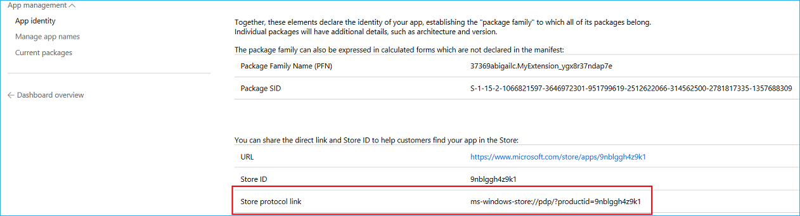
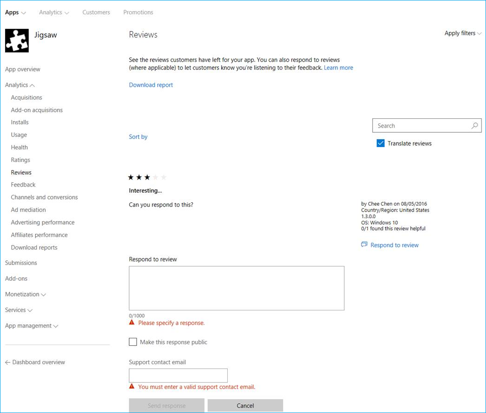

# <a name="tips-and-tricks"></a><span data-ttu-id="6bd80-104">Dicas e truques</span><span class="sxs-lookup"><span data-stu-id="6bd80-104">Tips and tricks</span></span>  

[!INCLUDE [deprecation-note](includes/deprecation-note.md)]  

<span data-ttu-id="6bd80-105">Se você estiver trabalhando em uma extensão do Microsoft Edge ou já tiver publicado uma, as dicas e truques a seguir podem ser úteis.</span><span class="sxs-lookup"><span data-stu-id="6bd80-105">Whether you're currently working on a Microsoft Edge extension or have already published one, the following tips and tricks might come in handy.</span></span>  

## <a name="get-a-direct-link-to-your-extension-in-the-microsoft-store"></a><span data-ttu-id="6bd80-106">Obter um link direto para sua extensão na Microsoft Store</span><span class="sxs-lookup"><span data-stu-id="6bd80-106">Get a direct link to your extension in the Microsoft Store</span></span>  

<span data-ttu-id="6bd80-107">No painel do Centro de Dev do Windows, você pode encontrar um link direto para sua extensão na Microsoft Store.</span><span class="sxs-lookup"><span data-stu-id="6bd80-107">In the Windows Dev Center dashboard, you can find a direct link to your extension in the Microsoft Store.</span></span>  <span data-ttu-id="6bd80-108">Esse link pode ser útil para publicidade e compartilhamento de sua extensão.</span><span class="sxs-lookup"><span data-stu-id="6bd80-108">This link can be useful for advertising and sharing out your extension.</span></span>  

<span data-ttu-id="6bd80-109">Depois de entrar no Centro de Dev do Windows e navegar até sua extensão pelo painel, na página Identidade do aplicativo, você encontrará o link na linha de link de protocolo **da Loja:**</span><span class="sxs-lookup"><span data-stu-id="6bd80-109">After logging in to the Windows Dev Center and navigating to your extension through the dashboard, on the App identity page you’ll find the link in the **Store protocol link** row:</span></span>  

  
 
## <a name="make-sure-youre-following-the-microsoft-store-policy"></a><span data-ttu-id="6bd80-111">Certifique-se de que você está seguindo a Política da Microsoft Store</span><span class="sxs-lookup"><span data-stu-id="6bd80-111">Make sure you’re following the Microsoft Store Policy</span></span>  

<span data-ttu-id="6bd80-112">Ao criar sua extensão, lembre-se de ter em mente as diretrizes para envio à Microsoft Store realçadas na [Política da Microsoft Store.](/windows/uwp/publish/store-policies)</span><span class="sxs-lookup"><span data-stu-id="6bd80-112">When creating your extension, make sure you keep in mind the guidelines for submitting to the Microsoft Store highlighted in the [Microsoft Store Policy](/windows/uwp/publish/store-policies).</span></span>  
 
<span data-ttu-id="6bd80-113">As extensões do Microsoft Edge também têm um conjunto adicional de políticas a seguir [vistas aqui](/windows/uwp/publish/store-policies#pol_10_12).</span><span class="sxs-lookup"><span data-stu-id="6bd80-113">Microsoft Edge extensions also have an additional set of policies to follow seen [here](/windows/uwp/publish/store-policies#pol_10_12).</span></span>  

## <a name="improve-your-extensions-discoverability-in-the-microsoft-store"></a><span data-ttu-id="6bd80-114">Melhorar a capacidade de descoberta da extensão na Microsoft Store</span><span class="sxs-lookup"><span data-stu-id="6bd80-114">Improve your extension’s discoverability in the Microsoft Store</span></span>  

<span data-ttu-id="6bd80-115">Você pode adicionar palavras-chave ao envio de extensão para melhorar sua capacidade de descoberta por meio de pesquisas.</span><span class="sxs-lookup"><span data-stu-id="6bd80-115">You can add keywords to your extension submission to improve its discoverability through searches.</span></span>  <span data-ttu-id="6bd80-116">Por exemplo, `Microsoft Edge Extensions` e `name of my extension` .</span><span class="sxs-lookup"><span data-stu-id="6bd80-116">For example, `Microsoft Edge Extensions` and `name of my extension`.</span></span>  

<span data-ttu-id="6bd80-117">Isso pode ser feito no Centro de Dev do Windows na seção descrição da extensão.</span><span class="sxs-lookup"><span data-stu-id="6bd80-117">This can be done in the Windows Dev Center under the description section of your extension.</span></span>  <span data-ttu-id="6bd80-118">Essas palavras-chave precisarão ser adicionadas para cada idioma que sua extensão oferece suporte.</span><span class="sxs-lookup"><span data-stu-id="6bd80-118">These keywords will need to be added for every language your extension supports.</span></span>  

  

## <a name="automate-your-submission-to-the-microsoft-store"></a><span data-ttu-id="6bd80-120">Automatizar seu envio para a Microsoft Store</span><span class="sxs-lookup"><span data-stu-id="6bd80-120">Automate your submission to the Microsoft Store</span></span>  

<span data-ttu-id="6bd80-121">Você pode automatizar e simplificar seus envios para a Microsoft Store usando a nova API de Envio da Microsoft Store, que permite atualizar aplicativos/jogos, complementos \(compras no aplicativo\) e pacotes de pré-venda por meio de uma API REST.</span><span class="sxs-lookup"><span data-stu-id="6bd80-121">You can automate and streamline your submissions to the Microsoft Store by using the new Microsoft Store Submission API, which allows you to update apps/games, add-ons \(in-app purchases\), and package flights through a REST API.</span></span>  <span data-ttu-id="6bd80-122">Confira a [documentação e os exemplos](/windows/uwp/monetize/create-and-manage-submissions-using-windows-store-services) ou use a extensão [VSTS](https://github.com/Microsoft/windows-dev-center-vsts-extension) da API de Envio de código aberto para começar.</span><span class="sxs-lookup"><span data-stu-id="6bd80-122">Check out the [documentation and samples](/windows/uwp/monetize/create-and-manage-submissions-using-windows-store-services) or use the open source [Submission API VSTS extension](https://github.com/Microsoft/windows-dev-center-vsts-extension) to get started.</span></span>  

## <a name="use-the-windows-feedback-hub-to-gather-feedbackreviewsfeature-requests"></a><span data-ttu-id="6bd80-123">Usar o Hub de Feedback do Windows para coletar comentários/avaliações/solicitações de recursos</span><span class="sxs-lookup"><span data-stu-id="6bd80-123">Use the Windows Feedback Hub to gather feedback/reviews/feature requests</span></span>  

<span data-ttu-id="6bd80-124">Você pode direcionar os usuários para a subcategoria do Windows Feedback Hub para sua extensão incorporando um link que aponta para ele.</span><span class="sxs-lookup"><span data-stu-id="6bd80-124">You can direct users to the Windows Feedback Hub subcategory for your extension by embedding a link that points to it.</span></span>  <span data-ttu-id="6bd80-125">Este link precisará ser criado usando o seguinte formato:</span><span class="sxs-lookup"><span data-stu-id="6bd80-125">This link will need to be created using the following format:</span></span>  

```text
feedback-hub://?tabid=2&appid=<PFN>!App
```  

<span data-ttu-id="6bd80-126">Você precisará substituir pelo Nome da Família de `<PFN>` Pacotes de sua extensão.</span><span class="sxs-lookup"><span data-stu-id="6bd80-126">You will need to substitute `<PFN>` with the Package Family Name of you extension.</span></span>  <span data-ttu-id="6bd80-127">Isso pode ser encontrado na seção **Identidade do aplicativo** para sua extensão no Centro de Dev do Windows.</span><span class="sxs-lookup"><span data-stu-id="6bd80-127">This can be found under the **App identity** section for your extension in the Windows Dev Center.</span></span>  

## <a name="check-out-your-ratings-and-reviews"></a><span data-ttu-id="6bd80-128">Confira suas classificações e críticas</span><span class="sxs-lookup"><span data-stu-id="6bd80-128">Check out your ratings and reviews</span></span>  

<span data-ttu-id="6bd80-129">Faça logoff regularmente para verificar as avaliações e classificações do usuário.</span><span class="sxs-lookup"><span data-stu-id="6bd80-129">Log in regularly to check your user reviews and ratings.</span></span>  <span data-ttu-id="6bd80-130">Embora o aplicativo UWP tenha apenas informações sobre o mercado de usuários atual, o log no Centro de Desenvolvimento do Windows exibirá a classificação média em todos os mercados.</span><span class="sxs-lookup"><span data-stu-id="6bd80-130">While the UWP app will only have info on the current user market, logging into the Windows Dev Center will display average rating across all markets.</span></span>  

## <a name="respond-to-user-reviews"></a><span data-ttu-id="6bd80-131">Responder a avaliações do usuário</span><span class="sxs-lookup"><span data-stu-id="6bd80-131">Respond to user reviews</span></span>  

<span data-ttu-id="6bd80-132">Você pode responder às críticas do usuário na Microsoft Store por meio do painel do Centro de Dev do Windows.</span><span class="sxs-lookup"><span data-stu-id="6bd80-132">You can respond to user reviews in the Microsoft Store through the Windows Dev Center's dashboard.</span></span>  <span data-ttu-id="6bd80-133">Navegue até sua extensão e, em Análise, selecione **Avaliações**.</span><span class="sxs-lookup"><span data-stu-id="6bd80-133">Navigate to your extension and under Analytics select **Reviews**.</span></span>  <span data-ttu-id="6bd80-134">Um link aparecerá abaixo de cada revisão que permitirá que você responda diretamente ao cliente.</span><span class="sxs-lookup"><span data-stu-id="6bd80-134">A link will appear underneath each review that will allow you to respond directly to the customer.</span></span>  <span data-ttu-id="6bd80-135">Este canal de comunicação permite que você ofereça comentários, resoluções ou envie um obrigado pela revisão!</span><span class="sxs-lookup"><span data-stu-id="6bd80-135">This channel of communication enables you to offer feedback, resolutions, or send a thank you for the review!</span></span>  

  
