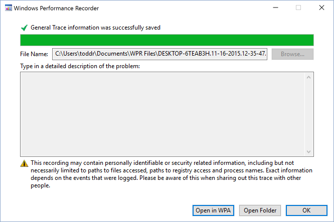
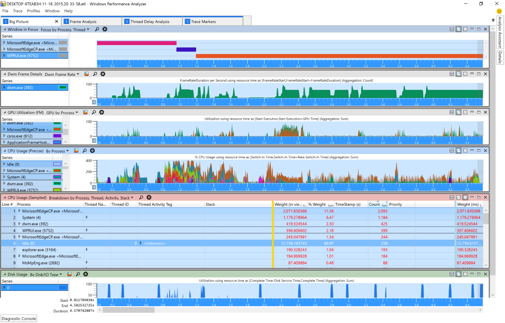
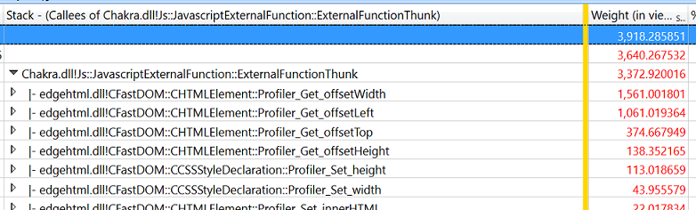

# Análise de desempenhoPerformance Analysis  

Se você não tem experiência com o desempenho, consulte o [Guia de devtools F12](../devtools-guide/index.md).If you're new to performance, you should check out the [F12 DevTools guide](../devtools-guide/index.md).
As [Ferramentas F12](../devtools-guide/index.md) incorporadas ao Microsoft Edge podem ser usadas para analisar o desempenho geral de um site da Web.The [F12 tools](../devtools-guide/index.md) built into Microsoft Edge can be used to analyze the general performance of a web site.  Ele fornece recursos semelhantes (mas mais limitados) ao [Kit de ferramentas de desempenho do Windows](/windows-hardware/test/wpt/index) diretamente no navegador.It provides similar (but more limited) capabilities to the [Windows Performance Toolkit](/windows-hardware/test/wpt/index) from right within the browser.  

Se você quiser uma análise mais profunda do desempenho do navegador, a equipe do Microsoft Edge usa o [Windows Performance Toolkit](/windows-hardware/test/wpt/index) (WPT).If you want a deeper analysis of browser performance, the Microsoft Edge team uses the [Windows Performance Toolkit](/windows-hardware/test/wpt/index) (WPT).  O WPT foi criado pela equipe do Windows para realizar análises detalhadas de desempenho do programa.WPT was created by the Windows team to conduct in-depth program performance analysis.  Ele se espalha pelos limites entre o site JavaScript e o código nativo do Microsoft Edge, permitindo que ambos sejam exibidos dentro da mesma ferramenta.It straddles the boundaries between website JavaScript and Microsoft Edge native code, allowing both to be viewed within the same tool.  WPT pode ser usado para:WPT can be used to:  

*   Medir o tempo de CPU usado para o software concluir o trabalhoMeasure CPU time taken for software to complete work  
*   Calcular a memória alocada por softwareCalculate the memory allocated by software  
*   Mostrar os detalhes do download de arquivos de servidores remotosShow the details of downloading files from remote servers  
*   Avalie a taxa de quadros.Measure frame rate.  

Para começar a usar o kit de ferramentas de desempenho do Windows para analisar seu site, você precisa primeiro baixar o [Kit de avaliação e implantação do Windows 10 (ADK)](https://developer.microsoft.com/windows/hardware/windows-assessment-deployment-kit).To get started with using the Windows Performance Toolkit to analyze your website, you'll first need to download the [Windows 10 Assessment and Deployment Kit (ADK)](https://developer.microsoft.com/windows/hardware/windows-assessment-deployment-kit).  Selecione a opção *Windows Performance Toolkit* durante a instalação:Select the *Windows Performance Toolkit* option during installation:  

  

Aqui, abordaremos como gravar e analisar um rastreamento de desempenho.Here we'll cover how to record and analyze a performance trace.  
Para saber mais sobre o que está incluído no kit de ferramentas de desempenho do Windows, confira a documentação completa do [WPT](/windows-hardware/test/wpt/index).To learn more about what's included in the Windows Performance Toolkit, check out the full [WPT documentation](/windows-hardware/test/wpt/index).  

## Gravando um rastreamentoRecording a trace  

Em seguida, configure o cenário do usuário e prepare-se para coletar um rastreamento usando o gravador de desempenho do Windows.Next, set up your user scenario and prepare to gather a trace using Windows Performance Recorder.  
Veja como criar o perfil do seu cenário da Web com o *gravador de desempenho do Windows (WPR)*.Here's how to profile your web scenario with the *Windows Performance Recorder (WPR)*.  

### 1. preparar seu ambiente para coletar um rastreamento de desempenho1.  Prepare your environment to gather a performance trace  

Encerre o maior número possível de programas em execução para evitar ruído no rastreamento que você está prestes a gravar.Shut down as many running programs as possible to avoid noise in the trace that you're about to record.  O ideal é que o único software em execução seja o gravador de desempenho do Windows (WPR) e o navegador.Ideally, the only running software will be Windows Performance Recorder (WPR) and the browser.  

### 2. Inicie o gravador de desempenho do Windows (WPR) e selecione opções2.  Launch Windows Performance Recorder (WPR) and select options  

Inicie o gravador de desempenho do Windows e assegure-se de que **mais opções** de alternância sejam expandidas.Launch the Windows Performance Recorder and ensure that **More options** toggle is expanded.  Selecione as caixas de seleção do *navegador de bordas* e cenário de *capacidade de resposta HTML* .Select the *Edge Browser* and *HTML Responsiveness* scenario analysis checkboxes.  

  

#### Dicas e truques para reunir rastreamentosTips and tricks for gathering traces  

*   Tente manter a atividade em segundo plano em um mínimo obrigatório absoluto.Try to keep background activity to an absolute required minimum.  Processos em segundo plano podem distorcer o desempenho percebido e as características de desempenho real e afetar os resultados.Background processes may skew both perceived performance and actual performance characteristics and affect the results.  Idealmente, não há outros aplicativos em execução ao lado do navegador e do WPR.Ideally there are no other running applications beside browser and WPR.  
*   Identifique os cenários que você está analisando e tente mantê-los o mais atômico possível.Identify the scenarios you're analyzing and try to keep them as atomic as possible.  Por exemplo, se o seu site tiver problemas de desempenho ao carregar a página, a rolagem e a seleção de algo em uma tabela, separe os problemas em três cenários:For example, if your site has performance problems when loading the page, scrolling, and selecting something in a table, separate the issues into three scenarios:  
    *   Carregamento da página (desde o início da navegação até a carga da página concluída)Page load (from start of navigation to page load complete)  
    *   RolagemScroll  
    *   Selecionar algo na tabelaSelecting something in the table  
*   Se um cenário envolve navegar para um site, considere iniciar o cenário em sobre: em branco.If a scenario involves navigating to a site, consider beginning the scenario at about:blank.  A partir de: em branco, evitará a sobrecarga da página anterior.Starting at about:blank will avoid the overhead of the previous page.  Se ele envolver a navegação longe de um site, navegue até sobre: em branco para concluir o cenário.If it involves navigating away from a site, navigate to about:blank to complete the scenario.  Isso impedirá o ruído de outros sites do rastreamento, a menos que a interação específica entre sites seja o problema de investigação.This will keep the noise of other sites out of the trace unless the specific interaction between sites is the issue under investigation.  

### 3. Registre o cenário3.  Record the scenario  

Clique em **Iniciar** para começar a gravar.Click **Start** to begin recording.  A ferramenta irá relatar o tamanho do buffer que está usando para ajudar você a prever o tamanho do arquivo gerado.The tool will report the size of the buffer it is using to help you anticipate the size of the generated file.  Execute o cenário do usuário que você deseja medir e, em seguida, clique em **salvar** para parar a gravação e salvar o rastreamento.Perform the user scenario you want to measure, then click **Save** to stop the recording and save the trace.  Salvar logo após concluir o cenário ajudará a minimizar o tamanho do arquivo de rastreamento.Saving immediately after finishing your scenario will help minimize the size of the trace file.  

  

A ferramenta WPR indicará que as informações de rastreamento foram salvas com êxito:The WPR tool will indicate that your trace information was saved successfully:  

  

## Analisando um rastreamentoAnalyzing a trace  

Agora que você coletou seus dados de desempenho, pode analisar o rastreamento usando o analisador de desempenho do Windows para ver quais otimizações podem ser feitas.Now that you've gathered your performance data, you can analyze the trace using Windows Performance Analyzer to see what optimizations can be made.  
Veja aqui como analisar seus dados de desempenho do cenário Web.Here's how to analyze your web scenario performance data.  

### 1. abrir o Windows Performance Analyzer (WPA)1.  Open Windows Performance Analyzer (WPA)  

Inicie o analisador de desempenho do Windows e abra o `.etl` arquivo a ser analisado (**arquivo**  >  **aberto...**).Launch Windows Performance Analyzer and open the `.etl` file to be analyzed (**File** > **Open...**).  

### 2. carregar símbolos e aplicar o perfil de *análise HTML*2.  Load symbols and apply the *HTML analysis* profile  

> [!WARNING]
> Carregar símbolos pela primeira vez exigirá um download grande e levará um tempo significativo em uma conexão de Internet típica.Loading symbols for the first time will require a large download and will take a significant amount of time on a typical internet connection.  

Carregue seus símbolos selecionando **rastrear**  >  **carregar símbolos** no menu.Load your symbols by selecting **Trace** > **Load Symbols** from the menu.  Os símbolos serão armazenados em cache em disco e os rastreamentos futuros carregarão os símbolos muito mais rapidamente.The symbols will be cached to disk and future traces will load symbols much faster.  

Você pode carregar símbolos de forma mais rápida, restringindo o carregamento para o Microsoft Edge e o host de aplicativos Web.You can load symbols significantly faster by restricting the loading to Microsoft Edge and the web apps host.  Selecione **rastrear**  >  **Configurar símbolos** e restringir as **configurações de carregar** apenas `MicrosoftEdgeCP.exe` e `WWAHost.exe` .Select **Trace** > **Configure Symbols** and restrict the **Load Settings** to only `MicrosoftEdgeCP.exe` and `WWAHost.exe`.  

  

Depois que os símbolos começarem a ser carregados, aplique o *perfil de análise HTML* (**perfis**  >  **se aplicam...**  >  **Procurar catálogo..**  >  . **HtmlResponsivenessAnalysis. wpaProfile**)After symbols begin loading, apply the *Html Analysis Profile* (**Profiles** > **Apply...** > **Browse Catalog...** > **HtmlResponsivenessAnalysis.wpaProfile**)  
O perfil irá carregar vários gráficos e tabelas para a sua análise.The profile will load several graphs and tables for your analysis.  Para praticamente todas as investigações de sites, recomendamos iniciar com este perfil.For nearly all website investigations, we recommend starting with this profile.  

  

#### O perfil de análise de capacidade de resposta HTMLThe Html Responsiveness Analysis Profile  

O perfil de análise de *capacidade de resposta HTML* fornece quatro guias:The *Html Responsiveness* analysis profile provides four tabs:  

**Visão geral** : isso é útil para confirmar que não há fontes inesperadas de atividade da CPU e o navegador está usando todos os recursos disponíveis.**Big Picture** - This is useful for confirming that there are no unexpected sources of CPU activity and the browser is indeed using all available resources.  Verifique o uso da CPU e certifique-se de que nenhum processo contribua significativamente com o uso da CPU diferente do navegador.Check your CPU usage and verify that no processes contribute significantly to CPU usage other than the browser.  

**Análise de quadros** -esta seção é usada para análise básica.**Frame Analysis** - This section is used for basic analysis.  O gráfico *uso da CPU (atribuído)* permite um relance rápido para a compreensão dos subsistemas responsáveis pelo uso da CPU.The *CPU Usage (Attributed)* graph enables a quick glance for understanding of the subsystems responsible for CPU usage.  Quebrar os exemplos na tabela *uso da CPU (amostrad)* no *thread da interface do usuário HTML* é útil para identificar afunilamentos de desempenho críticos.Breaking down the samples in the *CPU Usage (Sampled)* table on the *HTML UI Thread* is helpful for identifying critical performance bottlenecks.  

**Marcadores de rastreamento** -esta seção mostra todos os marcadores de rastreamento que vêm do navegador (Microsoft Edge), incluindo *msWriteProfilerMark*, que fornece pontos precisos para medir o código.**Trace Markers** - This section shows all tracing markers coming from the browser (Microsoft Edge), including *msWriteProfilerMark*, which provides precise points for measuring code.  Para ver o rastreamento do *msWriteProfilerMark* , role para baixo até o gráfico de  *eventos genéricos* e selecione **HTML msWriteProfilerMark** no menu suspenso.To see *msWriteProfilerMark* tracing, scroll down to the  *Generic Events* graph and select **HTML msWriteProfilerMark** from the drop-down menu.  

**Análise de atraso de threads** – essa guia geralmente é usada pelos desenvolvedores do Microsoft Edge para investigar quando um thread está bloqueado e aguardando em outro.**Thread Delay Analysis** - This tab is often used by Microsoft Edge developers to investigate when one thread is blocked and waiting on another.  Em raras ocasiões, também pode ser útil para os desenvolvedores da Web.On rare occasions it might also be useful to web developers.  

### 3. zoom para remover o resumo do rastreamento3.  Zoom to remove trace rundown  

Você pode focalizar sua análise removendo as seções de *Resumo de rastreamento* de rastros vazias de seus gráficos.You can focus your analysis by removing the empty trailing *Trace Rundown* sections of your graphs.  Em qualquer um dos gráficos que está mostrando:From any of the graphs currently showing:  
*   Clique com o botão esquerdo no início dos dados do gráfico que você deseja investigarLeft-click at the start of the graph data you wish to investigate  
*   Segure, arraste e solte para selecionar a região desejadaHold, drag and release to select the desired region  
*   Clique com o botão direito do mouse e selecione **zoom**Right-click and select **Zoom**  

O zoom será aplicado a todos os gráficos e gráficos na guia ativa.The zoom will apply to all graphs and charts on the active tab.  

  

### 4. investigue o que está ocupando ciclos de CPU4.  Investigate what's taking up CPU cycles  

 A tabela **uso da CPU (amostraada)** na guia **análise de quadro** é onde a maior parte da sua análise provavelmente acontecerá.The **CPU Usage (Sampled)** table in the **Frame Analysis** tab is where most of your analysis will likely happen.  Você pode expandir os vários processos para identificar o código JavaScript e o código do navegador com maior volume de computação.You can expand the various processes to identify the most compute intensive JavaScript and browser code.  Geralmente, um único pouco de JavaScript é responsável por um problema de desempenho e levar o tempo para otimizá-lo pode fazer uma diferença significativa.Often a single bit of JavaScript is responsible for a performance issue, and taking the time to optimize it can make a significant difference.  

### 5. analisar em qualquer código JavaScript de execução lenta5.  Drill into any slow-running JavaScript code  

A análise de chamadas de DOM de baixo pode ser útil para identificar o JavaScript responsável por ocupar a maioria do tempo durante o cenário.Bottom up DOM call analysis can be useful for identifying the JavaScript responsible for taking up the majority of time during the scenario.  Isso é especialmente útil quando muitas chamadas de nível superior são reutilizadas as mesmas bibliotecas JavaScript.This is especially helpful when many top level calls are re-using the same JavaScript libraries.  

Comece examinando a *divisão de uso da CPU (amostrad) por processo, thread, atividade, pilha*.Start by looking at *CPU Usage (Sampled) Breakdown by Process, Thread, Activity, Stack*.  Clique em qualquer célula na coluna **empilhada** .Click on any cell in **Stack** column.  Pressione *Ctrl + F* e procure por *ExternalFunctionThunk*.Press *Ctrl+F* and search for *ExternalFunctionThunk*.  

> [!NOTE] 
> Isso só funcionará se você tiver carregado símbolos com êxito.This only works if you have successfully loaded symbols.  

  

Investigue todas as linhas com o *ExternalFunctionThunk*.Investigate any lines with *ExternalFunctionThunk*.  Essa é a interface do mecanismo JavaScript Chakra para o mecanismo Microsoft Edge.This is the interface from the Chakra JavaScript engine to the Microsoft Edge engine.  Ele mostra onde as pontes de código do navegador para a execução de JavaScript.It shows where code bridges from the browser to JavaScript execution.  Clique com o botão direito do mouse na linha e selecione **Exibir chamadas**  >  **por módulo** para ver uma lista ponderada das funções mais longas do mecanismo do navegador.Right-click on the line and select **View Callees** > **By Module** to see a weighted list of longest running browser engine functions.  

  

Para identificar todo o JavaScript chamando uma API específica, clique com o botão direito do mouse nele e selecione **Exibir chamadores**  >  **por função** e expanda a árvore para exibir e comparar os pesos relativos.To identify all the JavaScript calling a specific API, right-click on it and select **View Callers** > **By Function** and expand the tree to view and compare the relative weights.  
