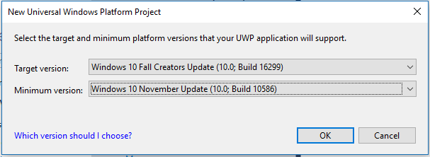
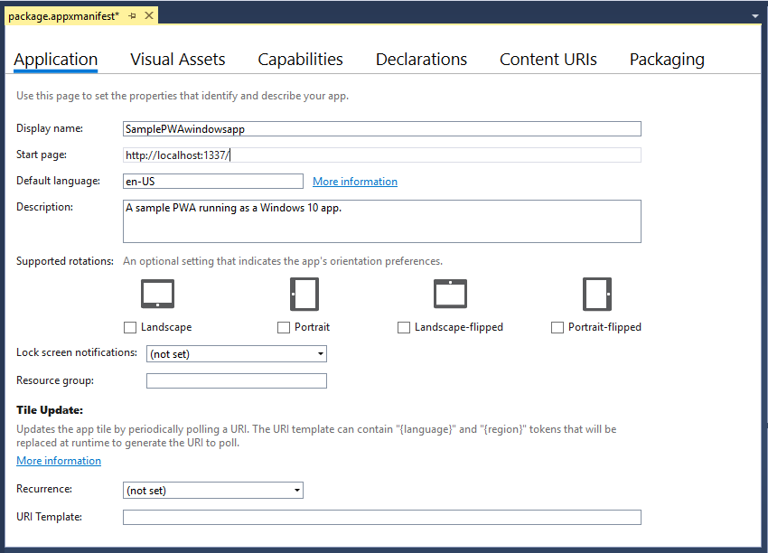
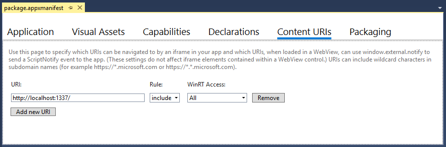
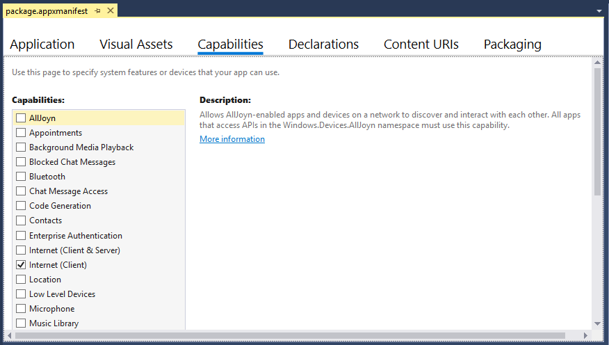

# Personalizar o PWA (EdgeHTML) para Windows  

O PWAs instalado no Windows 10 aproveita [todas as vantagens][PwaIndexWindows10] de executar como aplicativos da [plataforma universal do Windows \ (UWP \)][WindowsUWPGetStartedGuide] , incluindo a proteção por meio da proteção de segurança do aplicativo Windows e acesso total a APIs do [Windows Runtime \ (WinRT \))][UwpApiIndex] , incluindo as para:  

*   Controlando recursos de dispositivo \ (como câmera, microfone, GPS \)  
*   Acessando recursos do usuário \ (como calendário, contatos, documentos, música \)  
*   Iniciar/navegar pelo aplicativo por meio de comandos de voz da Cortana  
*   Integração com o sistema operacional Windows \ (por meio da central de ações do Windows, da barra de tarefas da área de trabalho e dos menus de contexto \)  
    
Estas são apenas algumas das possibilidades adicionadas ao seu PWA \ (EdgeHTML \) no Windows.  

Este artigo mostra como instalar, executar e aprimorar o seu PWA \ (EdgeHTML \) como um aplicativo do Windows 10 e ainda garantir a compatibilidade entre navegadores e várias plataformas.  

> [!IMPORTANT]
> Os exemplos e etapas neste artigo exigem o Visual Studio 2017. O Visual Studio 2019 não inclui o modelo usado neste artigo. Para baixar o Visual Studio 2017, consulte [downloads do Visual Studio-2017, 2015 & versões anteriores][PreviousVSDownloads]  


## Pré-requisitos  

*   Um PWA existente \ (ou aplicativo Web hospedado \), um site dinâmico ou localhost.  Este guia usa o PWA de exemplo de [introdução a Web Apps progressivos][PwaGetStarted].  
*   Baixe o \ (grátis \) [comunidade do Visual Studio 2017][MicrosoftVisualStudio|::ref1::|].  Você também pode usar as edições Professional, Enterprise ou [Preview][MicrosoftVisualStudioPreview] .  No instalador do Visual Studio, escolha as seguintes cargas de trabalho:  
    *   **Desenvolvimento da plataforma universal do Windows**  
        
## Configurar e executar seu aplicativo universal do Windows  

Um PWA \ (EdgeHTML \) instalado como um aplicativo do Windows 10 é executado independentemente do navegador, em uma janela autônoma \ ( `WWAHost.exe` process \).  Habilitar isso simplesmente requer um wrapper de aplicativo leve que contém seu aplicativo Web hospedado, que você pode configurar rapidamente usando o modelo de projeto do Visual Studio `Progressive Web App (Universal Windows)` .  \ (Toda a lógica do aplicativo, incluindo o envio de solicitações nativas da API do Windows Runtime, ainda acontece no código do seu aplicativo Web original. \)  

Configurar seu ambiente de desenvolvimento de aplicativos do Windows no Visual Studio.  

1.  Em suas configurações do Windows, ative o [modo de desenvolvedor][WindowsUWPGetStartedEnable].  \ (Digite `developer mode` o Searchbar do Windows para localizá-lo. \)  
1.  Inicie o Visual Studio e selecione **criar um novo projeto..**..  
1.  Escolha **JavaScript**  >  **Windows universal** e selecione **Web App progressivo (Universal Windows)** na lista de tipos de projeto no Visual Studio 2017.  
1.  Selecione o Windows 10 `Target version` \ (versão mais recente \) e `Minimum version` \ (Build 10586 ou superior) padrão e escolha **OK**.  
    
      
    
    Seu novo projeto é carregado com o Package. appxmanifest designer aberto.  Isso é onde você configura os detalhes do seu aplicativo, incluindo identidade do pacote, dependências do pacote, recursos necessários, elementos visuais e pontos de extensibilidade.  Esta é uma versão do manifesto do pacote do aplicativo, que é facilmente configurável, usada durante o desenvolvimento do aplicativo.  
    Quando você cria seu projeto de aplicativo, o [Visual Studio gera um arquivo AppxManifest.xml][UwpSchemasAppxpackageUapmanifestschemaGeneratePackageManifest] desses metadados, que é usado para instalar e executar o aplicativo.  Sempre que atualizar o `package.appxmanifest` arquivo, certifique-se de recriar o projeto para que ambos sejam refletidos em seu `AppxManifest.xml` tempo de execução.  
    
1.  No painel de **aplicativos** do designer de manifesto, insira a URL do seu PWA como o `Start page` .
    
    > [!NOTE]
    > Os funcionários de serviço têm suporte para todas as URLs HTTPS \ (Secure, Remote \) especificadas como a `StartPage` .  Os funcionários de serviço não são suportados por padrão para aplicativos Web que especificam uma página inicial local.  Para habilitar o suporte do trabalho do serviço para estes casos, adicione uma entrada [ApplicationContentUriRules](#set-application-content-uri-rules-acurs) explícita ao manifesto, por exemplo: `<uap:Rule Match="http://web-platform.test/" Type="include" uap5:ServiceWorker="true"/>`  
    
      
    
    Você também pode modificar a `Display name` e como quiser `Description` .  
1.  Salve este arquivo \ (ou outra imagem 512x512 da sua escolha \) na área de trabalho.  
    Em seguida, no painel **recursos visuais** do designer de manifesto, clique no `Source` botão campo **..** ., selecione-o como seu arquivo de origem e clique em **gerar**.  \ (Em seguida, clique em **OK** para substituir as imagens de espaço reservado padrão \).  
    
      
    
    Isso gera os ativos visuais básicos para instalar, executar, iniciar e distribuir seu aplicativo na loja.  
    Se você vir algum erro vermelho \ ( `X` \) indicando imagens ausentes, é possível clicar nos botões **...** para selecionar manualmente um arquivo das imagens geradas.  
1.  No painel URIs de **conteúdo** do designer de manifesto, substitua `http://example.com` o local do seu PWA \ (de exemplo `Rule`  =  `include` `WinRT Access`  =  `All` ).  
    Isso concede à sua permissão do PWA para enviar solicitações de API nativas do tempo de execução do Windows \ (WinRT \) durante a execução como um aplicativo do Windows 10, que é abordado um pouco mais tarde.   Se o PWA real não exigir acesso ao WinRT, você poderá mudar o `WinRT Access` valor para `None` .  De qualquer forma, certifique-se de subfator a `http://example.com` cadeia de caracteres padrão com o URI do seu PWA ou seu aplicativo não pode carregar corretamente no tempo de execução.  
    Você está pronto para executar e depurar o PWA como um aplicativo do Windows 10.  Se você estiver usando um site localhost para percorrer este guia, verifique se ele está em execução.  Siga  
1.  Compilar \ ( `Ctrl` + `Shift` + `F5` \) e executar \ ( `F5` \) seu projeto do PWA.  Seu site agora deve ser iniciado em uma janela de aplicativo autônomo.  Não somente é um aplicativo Web hospedado; Ele está sendo executado como um aplicativo Web progressivo instalado no Windows 10!  
    
      
    
## Depurar o PWA \ (EdgeHTML \) como um aplicativo do Windows  

Como um PWA \ (EdgeHTML \) é simplesmente um aplicativo Web hospedado aprimorado progressivamente, você pode depurar o código do lado do servidor da mesma forma que qualquer aplicativo Web, usando o IDE e o fluxo de trabalho usuais.  As alterações que você implantar ao vivo serão refletidas no seu PWA instalado na próxima vez que você iniciá-lo \ (não é necessário implantar novamente seu pacote de aplicativo universal do Windows \).

Para a depuração do lado do cliente em seu aplicativo do Windows 10, você deve ter o `Microsoft Edge DevTools Preview` aplicativo.  Este aplicativo autônomo inclui toda a funcionalidade do [Microsoft Edge do Microsoft Edge devtools][DevToolsGuide] \ (incluindo as [Ferramentas do PWA][DevToolsGuideServiceWorkers]), além de suporte de [depuração remota][DevToolsProtocol01ClientsEdgePreview] básica e um [seletor de destino de depuração][DevToolsGuideMicrosoftStoreApp] para anexar a qualquer instância em execução do mecanismo EdgeHTML, incluindo suplementos do Office, Cortana, webviews de aplicativos e, é claro, PWAs executados no Windows.  

Veja como configurar a depuração para seu PWA \ (EdgeHTML \).  

1.  Instale o aplicativo [Microsoft Edge devtools Preview][MicrosoftStoreEdgeDevtoolsPreview] da Microsoft Store se ainda não o tiver.  
1.  Com o site do PWA em funcionamento, inicie o aplicativo DevTools.  
1.  No Visual Studio, inicie o aplicativo do Windows 10 com `Start Without Debugging` o `Ctrl` + `F5` comando ().  \ (O aplicativo DevTools não é anexado corretamente se o depurador do Visual Studio estiver ativo. \)  
1.  No aplicativo DevTools, clique no botão **Atualizar** no seletor de destino de depuração local.  Seu site do PWA \ (EdgeHTML \) agora deve estar listado.  \ (Se ele também estiver sendo executado em uma janela do navegador, será a última instância desse site na lista. \)  
1.  Clique em sua lista de sites do PWA \ (EdgeHTML \) para abrir uma nova guia de instância do DevTools e iniciar a depuração.  
    
      
    
1.  Você pode verificar se o DevTools está anexado ao seu aplicativo executando-executando-como-Windows-aplicativo.  No **console**do devtools, digite:  
    
    ```shell
    window.Windows
    ```  
    
    Isso retorna o `Windows Runtime` objeto global que contém todos os [namespaces do WinRT de nível superior](#find-windows-runtime-winrt-apis).  Esse é o seu EntryPoint \ (EdgeHTML \) do PWA para a [plataforma universal do Windows][WindowsUWPIndex]e só está exposto a aplicativos Web que são executados como aplicativos do Windows 10 (sendo executados fora do navegador, em um `WWAHost.exe` processo).  
    
## Localizar APIs do Windows Runtime (WinRT)  

Como um aplicativo instalado do Windows, seu [PWA \ (EdgeHTML \) tem acesso completo a APIs nativas do Windows Runtime][WindowsRuntime]; Identifique o que você precisa usar, obtenha as permissões necessárias e empregue a detecção de recursos para enviar essa solicitação de API em ambientes compatíveis.  Siga este processo para adicionar um aperfeiçoamento progressivo para usuários da área de trabalho do Windows do seu PWA.  

Há várias maneiras de identificar as APIs da plataforma universal do Windows necessárias para o seu PWA do Windows, incluindo a pesquisa de uma ampla [documentação UWP no centro de desenvolvimento do Windows] [UWP/API/], o download e a execução de [exemplos de código UWP](#uwp-code-samples) com o Visual Studio e a navegação em trechos de código para tarefas comuns do PWAs no Windows.

Há várias maneiras de identificar as APIs da plataforma universal do Windows necessárias para o seu Windows PWA, incluindo a pesquisa de uma abrangente [documentos UWP no centro de desenvolvimento do Windows] [UWP/API/], o download e a execução de [exemplos de código UWP](#uwp-code-samples) com o Visual Studio e a navegação em trechos de código para tarefas comuns do [PWAs no Windows 10 10 (EdgeHTML)][PwaIndexWindows10].  

Em geral, as APIs do WinRT funcionam em JavaScript da mesma forma que no C#, portanto, você pode seguir a documentação geral da [plataforma universal do Windows][WindowsUWPIndex] e a [referência de API][UwpApiIndex] para uso.  No entanto, observe as seguintes diferenças:  

*   Os recursos do WinRT em JavaScript usam diferentes convenções de uso de  [maiúsculas][ScriptingJsinrtUsingWinRTCasingConventions]  
*   [Os eventos são representados como identificadores de cadeia de caracteres][ScriptingJsinrtHandlingWinRTEvents] passados para `addEventListener` / `removeEventListener` métodos de classe  
*   [Métodos assíncronos][ScriptingJsinrtUsingWinRT] usam o modelo JavaScript Promise  
*   APIs no `Windows.UI.Xaml` namespace não são compatíveis com aplicativos JavaScript, que em vez disso usam a pilha de renderização da Web do mecanismo [EdgeHTML][DevGuideWhatsNew] \ (HTML, CSS \)  
    
Para obter mais detalhes, consulte [usando o Windows Runtime em JavaScript][WindowRuntimeUsingJavascript].  

### Exemplos de código UWP  

Confira o repositório de [exemplos de código da plataforma universal do Windows \ (UWP \)][MicrosoftDeveloperWindowsSamples] para procurar exemplos de JavaScript para cenários comuns de aplicativos do Windows 10.  Embora as versões do JS dessas amostras usem a biblioteca [WinJS][GithubWinjsWinjs] para estruturar o modelo de exemplo, WinJS não é necessário para enviar as solicitações de API do WinRT demonstradas nestes exemplos.  

> [!NOTE]
> Se precisar escutar o [`activated`][UwpApiWindowsUiWebuiWebapplicationActivated] evento do aplicativo, você poderá fazer isso usando a seguinte API do WinRT nativo:  
> 
> **Use este**  
> 
> ```javascript
> Windows.UI.WebUI.WebUIApplication.addEventListener("activated", function (activatedEventArgs) {
>     // Check activatedEventArgs.kind and respond as needed
> });
> ```  
> 
> ... em oposição a esse tipo de solicitação de WinJS usado nos exemplos:  
> 
> **Não é isso**  
> 
> ```javascript
>     var page = WinJS.UI.Pages.define("/html/scenario1-launched.html", {
>         ready: function (element, options) {
>             // Check options.activationKind and respond as needed
>         }
>     });
> ```  

## Enviar solicitações de API do WinRT do seu PWA (EdgeHTML)  

Neste ponto, finja que você deseja adicionar um menu de contexto personalizado para usuários do Windows do nosso PWA \ (EdgeHTML \) e identificar as APIs necessárias no namespace [Windows. UI. popups][UwpApiWindowsUiPopups] .  

Para enviar quaisquer solicitações de APIs do WinRT de nosso PWA \ (EdgeHTML \), primeiro você precisa [estabelecer as permissões necessárias](#set-application-content-uri-rules-acurs) \ (ou, regras de URI de conteúdo do aplicativo \) no seu arquivo de manifesto do pacote de aplicativos do Windows \ ( `.appxmanifest` \).  

Se qualquer uma dessas solicitações de API envolver o acesso aos recursos do usuário, como imagens ou músicas, ou a recursos do dispositivo, como a câmera ou o microfone, você também precisará adicionar [declarações de funcionalidade do aplicativo](#app-capability-declarations) ao manifesto do pacote do aplicativo para que o Windows solicite a permissão do usuário.  Se, posteriormente, você publicar seu PWA \ (EdgeHTML \) na Microsoft Store, essas [permissões de aplicativo][MicrosoftSupportWindowsAppPermissions] necessárias também serão observadas na listagem da loja.  

#### Definir regras de URI de conteúdo do aplicativo (ACURs)  

Por meio do ACURs, também conhecido como uma lista de permissão de URL, você pode fornecer às URLs do seu PWA \ (EdgeHTML \) acesso direto às APIs do Windows Runtime.  No nível do sistema operacional Windows, os limites de política corretos são definidos para permitir que o código hospedado em seu servidor Web envie diretamente solicitações de API de plataforma.  Você define esses limites no arquivo de manifesto do pacote do aplicativo quando especifica as URLs do PWA como `ApplicationContentUriRules` .  

Suas regras devem incluir a página inicial do aplicativo e quaisquer outras páginas que você queira incluir como páginas do aplicativo.  Se o usuário navegar para uma URL que não está incluída nas regras, o Windows abrirá a URL de destino no navegador Microsoft Edge, em vez de sua janela autônoma \ (EdgeHTML \) do PWA \ ( `WWAHost.exe` processo \).  Você também pode excluir URLs específicas.  

Há várias maneiras de especificar uma URL `Match` em suas regras:  

*   Um nome de host exato  
*   Um nome de host para o qual um URI com qualquer subdomínio desse nome de host é incluído ou excluído  
*   Um URI exato  
*   Um URI exato contendo uma propriedade de consulta  
*   Um caminho parcial e um curinga para indicar uma extensão de arquivo específica para uma regra de inclusão  
*   Caminhos relativos para regras de exclusão  
    
Aqui estão alguns exemplos de ACURs em um `.appxmanifest` arquivo:  

```xml
<Application
Id="App"
StartPage="https://contoso.com/home">
<uap:ApplicationContentUriRules>
    <uap:Rule Type="include" Match="https://contoso.com/" WindowsRuntimeAccess="all" />
    <uap:Rule Type="include" Match="https://*.contoso.com/" WindowsRuntimeAccess="all" />
    <uap:Rule Type="exclude" Match="https://contoso.com/excludethispage.aspx" />
</uap:ApplicationContentUriRules>
```  

As URLs definidas no ACURs para seu aplicativo podem receber permissão para o tempo de execução do Windows por meio do `WindowsRuntimeAccess` atributo, que aceita os seguintes valores:  

*   `all`: O código JavaScript remoto tem acesso a todas as APIs do WinRT e a componentes de pacotes locais.  O namespace [Windows \ (WinRT \))][UwpApiIndex] é injetado e está presente no mecanismo de script.  
*   `allowForWeb`: O acesso ao código JavaScript remoto está limitado a componentes de pacotes locais, incluindo componentes C++/C # personalizados.  
*   `none`Assume.  A URL especificada não tem acesso a plataforma.  
    
Neste tutorial, você já definiu a única ACUR de que precisa \ (etapa 6 da configuração anterior [e executar a seção do aplicativo](#set-up-and-run-your-universal-windows-app) \) para o aplicativo de uma única página.  Você pode confirmar isso no painel URIs de **conteúdo** do designer do Visual Studio `package.appxmanifest` .  

  

Você também pode exibir o XML bruto do seu manifesto clicando com o botão direito do mouse `package.appxmanifest` no arquivo no Gerenciador de soluções do Visual Studio e selecionando **Exibir código** \ ( `F7` \).  Para alternar de volta para o modo de exibição de designer, selecione **View Designer** \ ( `Shift` + `F7` \).  

#### Declarações de funcionalidades do app  

Se seu aplicativo precisar de acesso programático a recursos do usuário, como imagens ou músicas, ou para dispositivos como uma câmera ou um microfone, você deve incluir as [declarações de funcionalidade do aplicativo][WindowsUwpPackagingAppCapabilities] correspondente em seu arquivo de manifesto do pacote do aplicativo.  Há três categorias de declaração de recurso de aplicativo:  

*   [As funcionalidades de uso geral][WindowsUwpPackagingAppCapabilitiesGeneralUse] que se aplicam à maioria dos cenários de aplicativos.  
*   [As funcionalidades do dispositivo][WindowsUwpPackagingAppCapabilitiesDevice] que permitem que seu aplicativo acesse dispositivos periféricos e internos.  
*   [Recursos de uso especial][WindowsUwpPackagingAppCapabilitiesSpecialRestricted] que dão suporte a cenários empresariais e exigem uma conta da empresa da Microsoft Store.  Para saber mais sobre contas empresariais, consulte [Tipos de conta, locais e taxas][WindowsUwpPublishAccountTypesLocationsFees].
    
Sua página do aplicativo Microsoft Store lista todas as funcionalidades declaradas no manifesto do pacote do aplicativo, portanto, certifique-se de especificar apenas as funcionalidades que o seu aplicativo realmente usa.

Alguns recursos fornecem acesso aos recursos confidenciais dos aplicativos.  Esses recursos são considerados confidenciais porque cada um pode acessar os dados pessoais do usuário ou custar dinheiro para o usuário.  As configurações de privacidade, gerenciadas pelo aplicativo [configurações][BingResultsWindows10Settings] do Windows 10, permitem que o usuário controle dinamicamente o acesso a recursos confidenciais.  Portanto, é importante que seu aplicativo não assuma que um recurso confidencial sempre está disponível.  Para obter mais informações sobre como acessar recursos confidenciais, consulte [Diretrizes para aplicativos com reconhecimento de privacidade][WindowsUwpSecurityIndex].  

Você solicita acesso declarando funcionalidades no manifesto do pacote para seu aplicativo.  No Visual Studio, você pode fazer isso a partir do painel de **recursos** do designer Package. appxmanifest.  

  

Neste tutorial, somente a funcionalidade padrão da Internet \ (cliente \) é necessária, portanto, não é necessária nenhuma ação adicional.  

### Usar a detecção de recursos para invocar o WinRT  

Para garantir uma experiência de linha de base de qualidade para o seu público do PWA em todas as plataformas, você aprimora progressivamente a experiência do PWA no Windows usando a detecção de recursos do WinRT.  Dessa forma, você pode ter certeza de que seu código específico do Windows é executado apenas em um contexto em que as APIs do WinRT estão disponíveis e são aplicáveis.  

A detecção de recursos pode ser tão simples quanto procurar o `Windows` objeto \ (o ponto de entrada para o [namespace do WinRT][UwpApiIndex]\) da seguinte maneira:  

```javascript
if(window.Windows){
    /*Run code that sends Windows API requests */
}
```  

No entanto, Considerando que nem todas as APIs do Windows estão disponíveis em todos os [tipos de dispositivo do Windows 10][UwpExtensionSdkDeviceFamiliesOverview], geralmente é útil usar a detecção de recursos mais específica para qualificar ainda mais o namespace da solicitação de API que você está enviando:  

```javascript
if(window.Windows && Windows.Media.SpeechRecognition){
    /*Run code that sends Windows API requests */
}
```  

Com esse plano de fundo, você está pronto para adicionar um código do WinRT para implementar um menu de contexto personalizado.  Se você estiver usando o PWA de exemplo de [introdução com Web Apps progressivos][PwaGetStarted]:

1.  Abra o Visual Studio para seu projeto de site do PWA.  
1.  No Gerenciador de soluções, abra o `views\layout.pug` arquivo e adicione a seguinte linha, logo abaixo da `script` referência para seu trabalhador do serviço:
    
    ```xml
    script(src='/javascripts/site.js')
    ```  
    
1.  No Gerenciador de soluções, clique com o botão direito do mouse na `javascripts` pasta e **adicione**  >  **novo arquivo..**..
1.  Nomeie seu arquivo: `site.js` e copie no código a seguir:
    
    ```javascript
    if (window.Windows && Windows.UI.Popups) {
        document.addEventListener('contextmenu', function (e) {

            // Build the context menu
            var menu = new Windows.UI.Popups.PopupMenu();
            menu.commands.append(new Windows.UI.Popups.UICommand("Option 1", null, 1));
            menu.commands.append(new Windows.UI.Popups.UICommandSeparator);
            menu.commands.append(new Windows.UI.Popups.UICommand("Option 2", null, 2));

            // Convert from webpage to WinRT coordinates
            function pageToWinRT(pageX, pageY) {
                var zoomFactor = document.documentElement.msContentZoomFactor;
                return {
                    x: (pageX - window.pageXOffset) * zoomFactor,
                    y: (pageY - window.pageYOffset) * zoomFactor
                };
            }

            // When the menu is invoked, execute the requested command
            menu.showAsync(pageToWinRT(e.pageX, e.pageY)).done(function (invokedCommand) {
                if (invokedCommand !== null) {
                    switch (invokedCommand.id) {
                        case 1:
                            console.log('Option 1 selected');
                            // Invoke code for option 1
                            break;
                        case 2:
                            console.log('Option 2 selected');
                            // Invoke code for option 2
                            break;
                        default:
                            break;
                    }
                } else {
                    // The command is null if no command was invoked.
                    console.log("Context menu dismissed");
                }
            });
        }, false);
    }
    ```
    
1.  Compare o comportamento do menu de contexto quando você executa o PWA no navegador \ ( `F5` do projeto de site do PWA \) em vez de dentro da janela de aplicativo do Windows \ ( `F5` do seu projeto de aplicativo universal do Windows \).  No navegador, clicar com o botão direito do mouse oferece o menu de contexto padrão do Microsoft Edge, enquanto `WWAHost.exe` , no processo, o menu personalizado agora é exibido.  
    
    | Microsoft Edge | Aplicativo do Windows 10 |  
    |:--- |:---- |  
    |  |  |  
    
Espero que agora você tenha uma base sólida para melhorar progressivamente seu PWAs no Windows.  Se você tiver dúvidas ou algo não estiver claro, envie um comentário!  

## Aprofundamento

O [centro de desenvolvimento do Windows][MicrosoftDeveloperWindowsApps] é a referência completa para todos os estágios do prédio do aplicativo Windows, desde a [introdução][MicrosoftDeveloperWindowsAppsGetStarted]até o [design][MicrosoftDeveloperWindowsAppsDesign], o [desenvolvimento][MicrosoftDeveloperWindowsAppsDevelop]e a [publicação][MicrosoftDeveloperStorePublishApps] na Microsoft Store.  

Para obter uma visão geral da plataforma universal do Windows \ (UWP \) e como se concentrar em famílias de dispositivos Windows 10 diferentes, consulte [Intro para a plataforma universal do Windows][WindowsUWPGetStartedGuide].  

E quando estiver pronto, veja como \ (e por quê! \) [enviar seu PWA para a Microsoft Store](./microsoft-store.md).  

<!-- links -->  

[PwaGetStarted]: ./get-started.md "Introdução aos aplicativos Web progressivos | Documentos da Microsoft"  
[PwaIndexWindows10]: ./index.md#pwas-on-windows-10-edgehtml "PWAs no Windows 10 (EdgeHTML)-aplicativos Web progressivos no Windows | Documentos da Microsoft"  
[DevToolsGuide]: ../devtools-guide/index.md "Ferramentas de desenvolvedor do Microsoft Edge (EdgeHTML) | Documentos da Microsoft"  
[DevToolsGuideMicrosoftStoreApp]: ../devtools-guide/index.md#microsoft-store-app "Aplicativo da Microsoft Store-ferramentas para desenvolvedores do Microsoft Edge (EdgeHTML) | Documentos da Microsoft"  
[DevToolsGuideServiceWorkers]: ../devtools-guide/service-workers.md "Trabalhadores de serviço | Documentos da Microsoft"  
[DevToolsProtocol01ClientsEdgePreview]: ../devtools-protocol/0.1/clients.md#microsoft-edge-devtools-preview "Microsoft Edge DevTools Preview-DevTools de protocolo dos clientes | Documentos da Microsoft"  
[DevGuideWhatsNew]: ../dev-guide/whats-new.md "O que há de novo no EdgeHTML | Documentos da Microsoft"  
[WindowsRuntime]: ../windows-runtime/index.md "Tempo de execução do Windows (WinRT) para JavaScript | Documentos da Microsoft"  
[WindowRuntimeUsingJavascript]: ../windows-runtime/using-the-windows-runtime-in-javascript.md "Usar o tempo de execução do Windows em JavaScript | Documentos da Microsoft"  

[ScriptingJsinrtHandlingWinRTEvents]: /scripting/jswinrt/handling-windows-runtime-events-in-javascript "Manipulando eventos do tempo de execução do Windows em JavaScript | Documentos da Microsoft"  
[ScriptingJsinrtUsingWinRT]: /scripting/jswinrt/using-windows-runtime-asynchronous-methods "Usando métodos assíncronos do tempo de execução do Windows | Documentos da Microsoft"  
[ScriptingJsinrtUsingWinRTCasingConventions]:  /scripting/jswinrt/using-the-windows-runtime-in-javascript#casing-conventions-with-windows-runtime-features "Convenções de maiúsculas e minúsculas com recursos do Windows Runtime-usando o Windows Runtime em JavaScript | Documentos da Microsoft"  
[UwpApiIndex]: /uwp/api/index "Namespaces UWP do Windows | Documentos da Microsoft"  
[UwpApiWindowsUiPopups]: /uwp/api/windows.ui.popups "Namespace Windows. UI. popups | Documentos da Microsoft"  
[UwpApiWindowsUiWebuiWebapplicationActivated]: /uwp/api/windows.ui.webui.webuiapplication.activated "Evento WebUIApplication. Activated | Documentos da Microsoft"  
[UwpExtensionSdkDeviceFamiliesOverview]: /uwp/extension-sdks/device-families-overview "Visão geral das famílias de dispositivos | Documentos da Microsoft"  
[UwpSchemasAppxpackageUapmanifestschemaGeneratePackageManifest]: /uwp/schemas/appxpackage/uapmanifestschema/generate-package-manifest "Como o Visual Studio gera um manifesto do pacote do aplicativo | Documentos da Microsoft"  
[WindowsUWPIndex]: /windows/uwp/index "Documentação da plataforma universal do Windows | Documentos da Microsoft"  
[WindowsUWPGetStartedGuide]: /windows/uwp/get-started/universal-application-platform-guide "O que é um aplicativo da plataforma universal do Windows (UWP)? | Documentos da Microsoft"  
[WindowsUWPGetStartedEnable]: /windows/uwp/get-started/enable-your-device-for-development "Habilite seu dispositivo para desenvolvimento | Documentos da Microsoft"  
[WindowsUwpSecurityIndex]: /windows/uwp/security/index "Segurança | Documentos da Microsoft"  
[WindowsUwpPublishAccountTypesLocationsFees]: /windows/uwp/publish/account-types-locations-and-fees "Tipos de conta, localizações e taxas | Documentos da Microsoft"  
[WindowsUwpPackagingAppCapabilitiesSpecialRestricted]: /windows/uwp/packaging/app-capability-declarations#special-and-restricted-capabilities "Recursos restritos | Documentos da Microsoft"  
[WindowsUwpPackagingAppCapabilitiesDevice]: /windows/uwp/packaging/app-capability-declarations#device-capabilities "Recursos de dispositivo | Documentos da Microsoft"  
[WindowsUwpPackagingAppCapabilitiesGeneralUse]: /windows/uwp/packaging/app-capability-declarations#general-use-capabilities "Recursos de uso geral | Documentos da Microsoft"  
[WindowsUwpPackagingAppCapabilities]: /windows/uwp/packaging/app-capability-declarations "Declarações de funcionalidades do aplicativo | Documentos da Microsoft"  

[BingResultsWindows10Settings]: https://binged.it/2lOGSH0 "configurações do Windows 10-Bing"  
[GithubWinjsWinjs]: https://github.com/winjs/winjs "winjs/winjs | GitHub"  
[MicrosoftDeveloperStorePublishApps]: https://developer.microsoft.com/store/publish-apps/index "Publicar aplicativos e jogos do Windows"  
[MicrosoftDeveloperWindowsApps]: https://developer.microsoft.com/windows/apps/index "Documentação da plataforma universal do Windows"  
[MicrosoftDeveloperWindowsAppsDesign]: https://developer.microsoft.com/windows/apps/design/index "Projetar e codificar aplicativos do Windows"  
[MicrosoftDeveloperWindowsAppsDevelop]: https://developer.microsoft.com/windows/apps/develop/index "Desenvolver aplicativos UWP"  
[MicrosoftDeveloperWindowsAppsGetStarted]: https://developer.microsoft.com/windows/apps/getstarted/index "Comece a usar os aplicativos do Windows 10"  
[MicrosoftDeveloperWindowsSamples]: https://developer.microsoft.com/windows/samples "Exemplos de código"  
[MicrosoftStoreEdgeDevtoolsPreview]: https://www.microsoft.com/store/p/microsoft-edge-devtools-preview/9mzbfrmz0mnj "Microsoft Edge DevTools Preview"  
[MicrosoftSupportWindowsAppPermissions]: https://support.microsoft.com/help/10557/windows-10-app-permissions "Permissões de aplicativo"  
[MicrosoftVisualStudioDownloads]: https://visualstudio.microsoft.com/downloads "Fará"  
[MicrosoftVisualStudioPreview]: https://visualstudio.microsoft.com/vs/preview "Visualização do Visual Studio"  
[PreviousVSDownloads]: https://visualstudio.microsoft.com/vs/older-downloads/ "Downloads do Visual Studio"  
