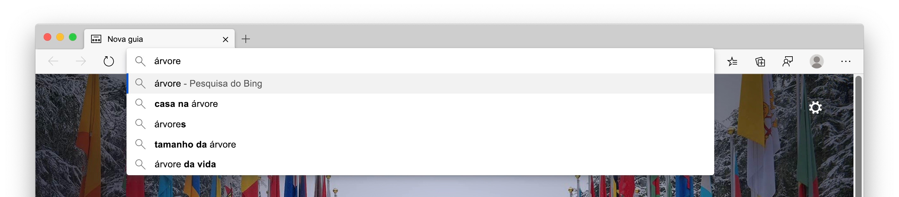
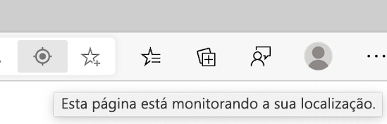
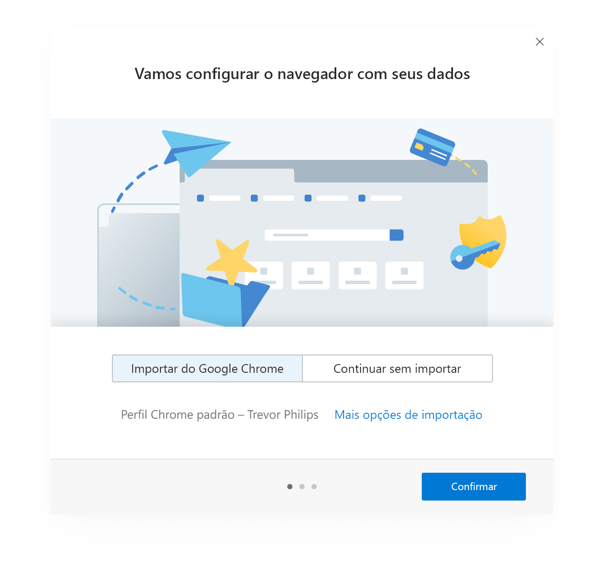
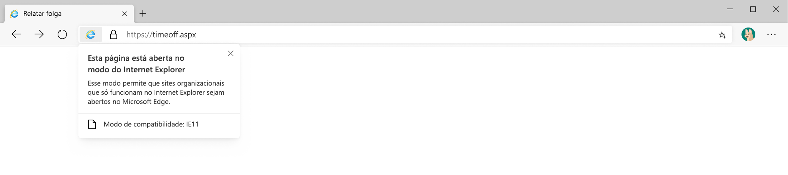
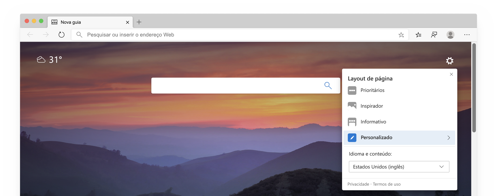
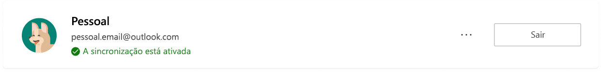
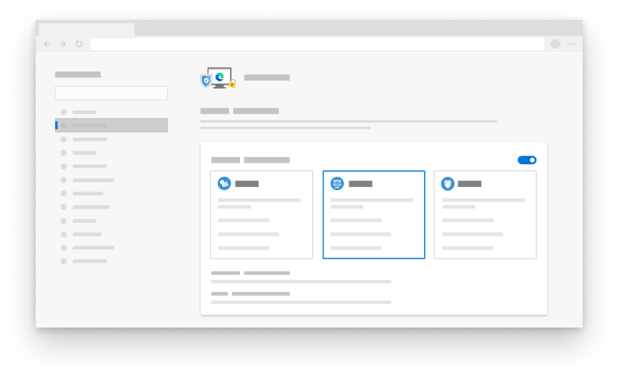
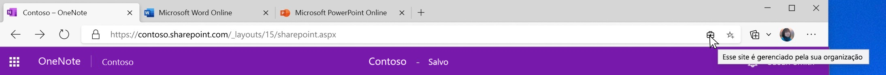

# White paper de Privacidade do Microsoft EdgeMicrosoft Edge Privacy Whitepaper  

Nossa promessa de privacidade do navegador é fornecer a você a proteção, transparência, controle e respeito que você merece.Our browser privacy promise is to provide you with the protection, transparency, control and respect you deserve.  Para sustentar compromissos para dar a você transparência aos produtos da Microsoft, a equipe do Microsoft Edge forneceu um White paper sobre privacidade que explica como os recursos e serviços do Microsoft Edge funcionam e como cada um deles pode afetar sua privacidade.To uphold commitments to give you transparency into Microsoft products, the Microsoft Edge team provided a privacy whitepaper that explains how Microsoft Edge features and services work and how each may affect your privacy.  O objetivo da equipe Microsoft Edge é oferecer a você um entendimento completo sobre como os dados são usados, como controlar os diferentes recursos e como gerenciar seus dados coletados para que você tenha as informações necessárias para tomar as decisões corretas de privacidade para você.The goal of the Microsoft Edge team is to give you a full understanding into how your data is used, how to control the different features, and how to manage your collected data, so you have the info you need to make the right privacy decisions for you.  

Em determinadas seções do papel, a equipe da Microsoft fornece as etapas para acessar as configurações do Microsoft Edge e outras páginas.In certain sections of the paper, the Microsoft Team provide steps to go to Microsoft Edge settings and other pages.  Para a consistência, a equipe do Microsoft Edge usou um formato reduzido em todo o White Paper: você deve ver URLs que começam `edge://` como `edge://favorites` ou `edge://settings/privacy` .For consistency, the Microsoft edge team used a shortened format throughout the whitepaper: You should see URLs that begin with `edge://` such as `edge://favorites` or `edge://settings/privacy`.  Para ir até as páginas, digite o texto em negrito diretamente na barra de endereços do Microsoft Edge.To go to the pages, type the bolded text directly into the Microsoft Edge address bar.  Essas páginas só podem ser visualizadas no Microsoft Edge.These pages are only be viewable in Microsoft Edge.  

O White Paper se concentra na versão para área de trabalho do Microsoft Edge, e partes do papel podem incluir recursos ou experiências que não estão disponíveis para todos os usuários.The whitepaper focuses on the desktop version of Microsoft Edge, and parts of the paper may include features or experiences that are not available for all users.  Além disso, o White Paper discute recursos e serviços que existem no produto hoje, mas que podem estar sujeitos a alterações no futuro.In addition, the whitepaper discusses features and services that exist in the product today, but may be subject to change in the future.  A redução da coleção de dados de práticas da Microsoft, o que significa que seus dados são mantidos pelo tempo mínimo, mas os tempos de retenção podem variar de acordo com o recurso ou serviço sendo usado e possam mudar ao longo do tempo.Microsoft practices data collection minimization, which means your data is kept for the minimum amount of time, but retention times may vary depending on the feature or service being used and may change over time.  

## Barra de endereços e sugestõesAddress bar and suggestions  

A barra de endereços permite que você insira URLs de site e pesquise na Web.The address bar allows you to enter website URLs and search the web.  Por padrão, a barra de endereços fornece sugestões de pesquisa e de sites usando os caracteres que você digita.By default, the address bar provides search and site suggestions using the characters you type.  Você deve ver sugestões de seus favoritos, do histórico de navegação, das pesquisas anteriores e do provedor de pesquisa padrão.You should see suggestions from your favorites, browsing history, previous searches, and default search provider.  

  

Para facilitar a navegação e a pesquisa, à medida que você digita na barra de endereços, os caracteres digitados são enviados ao seu provedor de pesquisa padrão do provedor de pesquisa para enviar consultas de pesquisa sugeridas de volta.To make browsing and searching faster, as you type in the address bar, the typed characters are sent to your default search provider for the search provider to send back suggested search queries.  A barra de endereços categoriza a entrada como uma URL, uma pesquisa ou desconhecida.The address bar categorizes your entry as a URL, search, or unknown.  As informações, além de qual sugestão selecionada, posição de seleção e outros dados da barra de endereços, são enviadas ao seu provedor de pesquisa padrão.The information, along with which suggestion you select, position of selection, and other address bar data is sent to your default search provider.  Se o seu provedor de pesquisa for Bing, um identificador Resettable exclusivo para o seu navegador será enviado com os dados para compreender a consulta de pesquisa e a sessão de consulta.If your search provider is Bing, a resettable identifier unique to your browser is sent with the data to understand the search query and query session.  Outros identificadores de serviço de sugestão automática são enviados ao seu mecanismo de pesquisa padrão para concluir as sugestões de pesquisa.Other autosuggest service identifiers are sent to your default search engine to complete the search suggestions.  Seu endereço IP e cookies são enviados ao seu provedor de pesquisa padrão para aumentar a relevância dos resultados da pesquisa.Your IP address and cookies are sent to your default search provider to increase the relevance of the search results.  Um sinal será enviado ao seu provedor de pesquisa padrão quando você selecionar a barra de endereços, para sinalizar ao provedor para se preparar para fornecer sugestões.A signal is sent to your default search provider when you select the address bar, to signal to the provider to get ready to provide suggestions.  Os caracteres digitados e as consultas de pesquisa não são enviados para a Microsoft, a menos que seu provedor de pesquisa seja o Bing.The typed characters and search queries are not sent to Microsoft unless your search provider is Bing.  Esses dados só serão enviados ao seu provedor de pesquisa padrão se você tiver a configuração **Mostrar-me e sugestões de site usando a configuração meus caracteres digitados** ativada.This data is only sent to your default search provider if you have the **Show me search and site suggestions using my typed characters** setting turned on.  Desativar o recurso impedirá que os caracteres digitados sejam enviados para o provedor de pesquisa padrão.Turning off the feature stops your typed characters from being sent to the default search provider.  Suas consultas de pesquisa ainda são enviadas ao seu provedor de pesquisa padrão para fornecer resultados de pesquisa.Your search queries are still sent to your default search provider to provide search results.  Se o Microsoft Edge detectar que a digitação na barra de endereços pode conter informações confidenciais, como credenciais de autenticação, nomes de arquivo locais ou dados de URL normalmente criptografados, ele não enviará o texto digitado.If Microsoft Edge detects that your typing in the address bar may contain sensitive information, such as authentication credentials, local file names, or URL data that is normally encrypted, it does not send the typed text.  Se você tiver **aprimorar os produtos da Microsoft, enviando relatórios de falha e dados sobre como você usa a configuração do navegador** ativada, o Microsoft Edge coleta dados de diagnóstico sobre a barra de endereços, como Quantas consultas foram oferecidas, independentemente do seu provedor de pesquisa.If you have **Improve Microsoft products by sending crash reports and data about how you use the browser** setting turned on, Microsoft Edge collects diagnostic data about the address bar, such as how many queries were offered, regardless of your search provider.  

Os pressionamentos de teclas e os websites que você visita são armazenados localmente no dispositivo por perfil.Keystrokes and the websites you visit are stored locally on the device per profile.  Você pode excluir os dados em `edge://settings/clearBrowserData` , marcando a caixa de seleção para **histórico de navegação**e selecionando **limpar agora**.You may delete the data in `edge://settings/clearBrowserData`, selecting the check box for **Browsing history**, and selecting **Clear now**.  Se o Bing for o seu provedor de pesquisa padrão e você estiver conectado ao Bing, você poderá excluir suas pesquisas por meio do [painel de privacidade da Microsoft](https://account.microsoft.com/account/privacy?ref=privacy-edge-browse&ru=https%3A%2F%2Faccount.microsoft.com%2Fprivacy%2Fbrowse%3Fref%3Dprivacy-edge-browse&destrt=privacy-dashboard).If Bing is your default search provider and you are signed into Bing, you may delete your searches through the [Microsoft privacy dashboard](https://account.microsoft.com/account/privacy?ref=privacy-edge-browse&ru=https%3A%2F%2Faccount.microsoft.com%2Fprivacy%2Fbrowse%3Fref%3Dprivacy-edge-browse&destrt=privacy-dashboard).  Você pode limpar o histórico de navegação do `edge://history` para excluir os sites da apresentação como sugestões na barra de endereços.You may clear your browsing history in `edge://history` to delete those websites from appearing as suggestions in the address bar.  No Windows 10, você pode limpar os dados que a Microsoft coleta da barra de endereços e os recursos de **sugestões de pesquisa**acessando  >  **configurações**  >  diagnósticos de**privacidade**  >  **\ & comentários**e selecionando **excluir** em **excluir dados de diagnóstico**.On Windows 10, you may clear the data Microsoft collects from the address bar and search suggestions features by going to **Start** > **Settings** > **Privacy** > **Diagnostics \& feedback**, and selecting **Delete** under **Delete diagnostic data**.  Todos os outros dados são excluídos após 36 meses.All other data is deleted after 36 months.  

Se você estiver conectado ao Microsoft Edge com uma conta corporativa ou de estudante da Microsoft, e o Microsoft Search estiver disponível, um token anônimo que representa a sua conta será enviado com a consulta para fornecer funcionalidades específicas da conta, como os resultados específicos da sua empresa.If you are signed into Microsoft Edge with a Microsoft work or school account, and Microsoft Search is available, an anonymized token representing your account is sent with the query to provide account-specific functionality such as results specific to your company.  

Todos os dados são transmitidos com segurança por HTTPS.All data is transmitted securely over HTTPS.  Se o [Bing](https://bing.com) for o seu provedor de pesquisa padrão, os caracteres pesquisas e tipos serão salvos por até seis meses.If [Bing](https://bing.com) is your default search provider, the searches and types characters are saved for up to 6 months.  

Se você procurar uma única palavra na caixa endereço, o Microsoft Edge poderá enviar a única palavra ao seu servidor DNS para ver se ela corresponde a um host na sua rede e pode tentar se conectar ao host correspondente.If you search for a single word in the address box, Microsoft Edge may send the single word to your DNS server to see whether it corresponds to a host on your network, and may try to connect to the corresponding host.  Isso lhe dá a opção de navegar até o host em vez de Pesquisar.This gives you the option to navigate to that host instead of searching.  Por exemplo, se o seu roteador for o nome do host `router` e você digitar `router` a barra de endereços, você terá a opção de navegar para `https://router/` a palavra `router` com o seu provedor de pesquisa padrão.For example, if your router goes by the hostname `router` and you type `router` in the address bar, you are given the option to navigate to `https://router/`, as well as to search for the word `router` with your default search provider.  Esse recurso não é controlado pela configuração **Mostrar e sugestões de site usando meus caracteres digitados** , pois ele não envolve o envio de dados para o mecanismo de pesquisa padrão.This feature is not controlled by the **Show me search and site suggestions using my typed characters** setting since it does not involve sending data to your default search engine.  

Você pode desativar a configuração **Mostrar e sugestões de sites usando meus caracteres digitados** e alterar seu mecanismo de pesquisa padrão no `edge://settings/search` .You may turn off the **Show me search and site suggestions using my typed characters** setting and change your default search engine in `edge://settings/search`.  Durante a navegação InPrivate ou no modo de convidado, as sugeridas automáticas estão desativadas.While browsing InPrivate or in Guest mode, autosuggestions are turned off.  InPrivate mostra sugestões da navegação local, como histórico de navegação ou pesquisas anteriores, mas nenhum caractere digitado é enviado ao seu mecanismo de pesquisa padrão.InPrivate shows suggestions from your local browsing such as browsing history or past searches, but no typed characters are sent to your default search engine.  O modo convidado não exibe sugestões nem envia caracteres digitados para o seu mecanismo de pesquisa padrão.Guest mode does not display any suggestions or send typed characters to your default search engine.  

Os dados coletados por outros provedores de pesquisa seguem a política de privacidade da empresa.Data collected by other search providers follow the privacy policy of the company.  

## FillAutofill  

O preenchimento automático no Microsoft Edge ajuda você a ser mais produtivo ao permitir que você salve senhas, informações de pagamento, endereços e outros dados de entrada de formulário.Autofill in Microsoft Edge helps you be more productive by letting you save passwords, payment info, addresses, and other form entry data.  Quando você visita um site e começa a preencher um formulário, o Microsoft Edge usa informações de preenchimento de formulário para corresponder os dados de Autopreenchimento salvos ao formulário.When you visit a site and start to fill out a form, Microsoft Edge uses form fill info to match your saved autofill data to the form.  O Microsoft Edge oferece dados de entrada de formulário salvos anteriormente quando você encontra formas semelhantes.Microsoft Edge offers form entry data you previously saved when you encounter similar forms.  Senhas e informações de cartão de crédito só são salvas com sua permissão explícita para cada senha e cartão.Passwords and credit card info are only saved with your explicit permission for each password and card.  

Os endereços e outras entradas do formulário são salvos por padrão.Addresses and other form entries are saved by default.  No entanto, você pode desativar o salvamento e o AutoPreenchimento de endereços e outros dados de formulário `edge://settings/addresses` .However, you may turn off saving and autofill of address and other form data in `edge://settings/addresses`.  

Impedir que o Microsoft Edge solicite que você salve senhas desativando a configuração da **oferta para salvar senha** `edge://settings/passwords` .Prevent Microsoft Edge from prompting you to save passwords by turning off the **Offer to save passwords** setting in `edge://settings/passwords`.  Se você não quiser que o Microsoft Edge Predefina automaticamente senhas salvas existentes, você pode excluir suas senhas salvas em `edge://settings/passwords` para excluir todos os dados de Autopreenchimento, vá para a configuração **limpar dados de navegação** nas configurações de privacidade e serviços do Microsoft Edge.If you do not want Microsoft Edge to autofill existing saved passwords, you may delete your saved passwords in `edge://settings/passwords`  To delete all autofill data go to the **Clear browsing data** setting in Microsoft Edge Privacy and services settings.  Selecione **dados do formulário de Autopreenchimento**, o intervalo de tempo desejado e, em seguida, **desmarque agora**.Select **Autofill form data**, the desired time range and then **Clear now**.  

Se você ativou a sincronização do seu perfil, os dados de Autopreenchimento serão sincronizados em todas as versões do Microsoft Edge nas quais você está conectado às mesmas credenciais.If you have turned on sync for your profile, your autofill data is synced across all versions of Microsoft Edge where you are signed into the same credentials.  Quando a sincronização está ativada, todos os dados de Autopreenchimento são armazenados em servidores Microsoft criptografados.When sync is turned on, all autofill data is stored on encrypted Microsoft servers.  Os dados de Autopreenchimento armazenados em servidores Microsoft só são usados para fins de sincronização.The autofill data stored on Microsoft servers is only used for sync purposes.  Você pode desativar a sincronização de seus dados em AutoPreenchimento `edge://settings/profiles/sync` .You may turn off syncing of your autofill data in `edge://settings/profiles/sync`.  Se você ativou a sincronização para AutoPreenchimento, excluir dados de AutoPreenchimento de um dispositivo em que você está conectado ao Microsoft Edge removerá os dados de AutoPreenchimento de outros dispositivos nos quais você está conectado.If you turned on sync for autofill, deleting autofill data from a device where you are signed into Microsoft Edge removes the autofill data from other devices where you are signed-in.  

Quando você visita uma página da Web e envia um formulário, o Microsoft Edge envia informações sobre o formulário, como um hash dos tipos de entrada do nome do host e do AutoPreenchimento \ (por exemplo, a caixa 1 está procurando um endereço de email, a caixa 2 está procurando uma senha e assim por diante \) para o serviço de preenchimento do Microsoft Form.When you visit a webpage and submit a form, Microsoft Edge sends info about the form such as a hash of the hostname and autofill entry types \(for example, box 1 is looking for an email address, box 2 is looking for a password, and so on\) to the Microsoft form fill service.  Não são enviadas informações ou identificadores de usuário inseridos pelo usuário para o serviço.No user-entered info or user identifiers are sent to the service.  Essas informações ajudam o Microsoft Edge a identificar corretamente os formulários em páginas da Web diferentes.This info helps Microsoft Edge correctly identify forms across different webpages.  Esses dados são usados para ajudar a corresponder os dados de Autopreenchimento salvos ao formulário.This data is used to help match your saved autofill data to the form.  

Quando você usa o modo convidado, o AutoPreenchimento não está disponível e novas entradas de Autopreenchimento não são adicionadas.When you use guest mode, autofill is not available and new autofill entries are not added.  Quando você navega em InPrivate, o Microsoft Edge oferece entradas de Autopreenchimento, mas as novas entradas de Autopreenchimento não são adicionadas.When you browse InPrivate, Microsoft Edge offers autofill entries, but new autofill entries are not added.  

## CastCast  

Cast in Microsoft Edge permite que você exiba sua mídia em outra tela usando o Google Cast.Cast in Microsoft Edge allows you to display your media to another screen using Google Cast.  Você pode acessar o recurso em **configurações e mais (...)**  >  **Mais ferramentas**  >  **Transmitir mídia para dispositivo**.You may access the feature from **Settings and more (...)** > **More tools** > **Cast media to device**.  Cast não usa nenhum serviço da Microsoft ou Google.Cast does not use any Microsoft or Google services. 

## ColeçõesCollections  

Você pode coletar sites, texto e imagens na Web e organizar o conteúdo com coleções no Microsoft Edge.You may collect sites, text and images on the web, and organize the content with Collections in Microsoft Edge.  Todos os dados de coleções são armazenados localmente no dispositivo e organizados por perfil do Microsoft Edge.All collections data is stored locally on the device and organized per Microsoft Edge profile.  Se você tiver a sincronização ativada para coleções, suas coleções criadas, incluindo anotações ou comentários, estarão disponíveis em todas as versões conectadas e sincronizadas do Microsoft Edge.If you have sync turned on for Collections, your collections created, including any notes or comments, are available across all signed-in and syncing versions of Microsoft Edge.  

A cada 24 horas, o Microsoft Edge baixa uma lista de sites com suporte para os quais há modelos de extração de entidade especial.Every 24 hours Microsoft Edge downloads a list of supported sites for which special entity extraction templates exists.  Os modelos são específicos de cada website.The templates are specific to each website.  Quando você cria um novo item na sua coleção, o Microsoft Edge verifica se o site do qual você está criando o novo item da coleção está na lista de sites com suporte.When you create a new item in your collection, Microsoft Edge verifies that the site from which you are creating the new collection item is on the list of supported sites.  Se o site estiver na lista, o Microsoft Edge pingrá no serviço de extração de entidades para o modelo de sites específicos.If the site is on the list, Microsoft Edge pings the entity extraction service for the specific sites template.  Nenhum identificador de usuário está associado à solicitação ao serviço.No user identifiers are associated with the request to the service.  Este modelo tenta identificar o nome, o preço, as classificações, a imagem primária e outros dados sobre o item que está sendo coletado.This template attempts to identify the name, price, ratings, primary image, and other data about the item being collected.  Se o site do qual você está criando um novo item de coleção não estiver no site de lista com suporte, o Microsoft Edge não baixará um modelo.If the site from which you are creating a new collection item is not on the supported list site, Microsoft Edge does not download a template.  Os modelos permitem a criação de todos os itens de coleção localmente no dispositivo.The templates enable the creation of all collection items locally on the device.  Nenhum dado sobre os itens da coleção é enviado ao serviço para criar a coleção.No data about the collection items are sent to the service to create the collection.  

Os modelos armazenados no dispositivo podem ser excluídos limpando os dados do cache na configuração **limpar dados de navegação** em `edge://settings/privacy` .The templates stored on the device may be deleted by clearing the cache data under the **Clear browsing data** setting in `edge://settings/privacy`.

<!--  
If you turn on **Show suggestions from Pinterest in Collections**, Collections perform a Microsoft Bing search using the title of your collection to find relevant Pinterest Topic pages.  Microsoft Edge does not send data about your collections to Pinterest.  You may remove the suggestions and stop searches for Pinterest Topic pages by going to `edge://settings/privacy` and turning off **Show suggestions from Pinterest in Collections**.  
-->  

As coleções não estão disponíveis ao usar a navegação InPrivate ou o modo convidado.Collections is not available when using InPrivate browsing or Guest mode.  

## FalharCrashes  

Se dados de diagnóstico opcionais, incluindo relatórios de falha estiverem ativados, o Microsoft coleta dados de diagnóstico quando o Microsoft Edge falha ou encontra outros problemas de confiabilidade.If optional diagnostic data including crash reports are turned on, Microsoft collects diagnostic data when Microsoft Edge crashes or encounters other reliability problems.  Esses dados de diagnóstico são usados para diagnosticar e corrigir problemas de confiabilidade do Microsoft Edge e outros produtos e serviços da Microsoft.This diagnostic data is used to diagnose and fix reliability problems of Microsoft Edge and other Microsoft products and services.  

  

Os dados de diagnóstico coletados estão na forma de despejos de falha, que contém o estado do dispositivo e do software capturado no momento em que o Microsoft Edge encontrou o problema de confiabilidade.The diagnostic data collected is in the form of crash dumps, which contains device and software state captured at the time Microsoft Edge encountered the reliability problem.  O despejo de falha contém informações sobre o que estava acontecendo no momento do problema de confiabilidade.The crash dump contains information about what was happening at the time of the reliability problem.  Informações como o website que você estava visitando no momento da falha ou o uso da CPU podem estar inclusos nos dados de diagnóstico.Information such as the website you were visiting at the time of the crash or your CPU usage may be included in the diagnostic data.  Os dados de diagnóstico de falha são armazenados localmente no dispositivo e enviados à Microsoft usando um link criptografado quando o relatório de falhas está ativado.The crash diagnostic data is stored locally on the device and sent to Microsoft using an encrypted link when crash reporting is turned on.  Cada despejo de falha contém um identificador exclusivo para o seu dispositivo, um identificador Resettable exclusivo para seu navegador e dados de diagnóstico extras \ (como a URL, o uso da CPU e o uso da rede \) para ajudar a identificar o problema.Each crash dump contains an identifier unique to your device, a resettable identifier unique to your browser and extra diagnostic data \(such as the URL, CPU usage, and network usage\) to help identify the problem.  Esses dados de diagnóstico extras são anexados ao despejo de falha para ajudar a diagnosticar o problema de confiabilidade, como compreender quantos dispositivos estão encontrando o problema e a gravidade.This extra diagnostic data is attached to the crash dump to help diagnose the reliability problem, such as understanding how many devices are encountering the problem and the severity.  

Despejos de falha são enviados à Microsoft e armazenados em servidores seguros da Microsoft por até 30 dias e depois excluídos.Crash dumps are sent to Microsoft and stored on secure Microsoft servers for up to 30 days and then deleted.  Solicitação para excluir os dados de diagnóstico em dispositivos Windows 10 indo para **Iniciar**  >  **configurações**  >  **Privacy**  >  **diagnósticos de privacidade \ & comentários** e selecionando **excluir** na configuração **excluir dados de diagnóstico** .Request to delete the diagnostic data on Windows 10 devices by going to **Start** > **Settings** > **Privacy** > **Diagnostics \& feedback** and selecting **Delete** under the **Delete diagnostic data** setting.  As informações de falha agregadas, como uma contagem de tipos de falhas que ocorrem, são armazenadas para fins de relatório e aprimoramento de produtos.Aggregated crash information such as a count of types of crashes occurring are stored for reporting and product improvement purposes.  

Os dados de diagnóstico de falha armazenados localmente no dispositivo podem ser removidos do sistema de arquivos no `edge://crashes` .Crash diagnostic data stored locally on the device may be cleared from the file system in `edge://crashes`.  

Para desativar a coleta de dados de diagnóstico de falha no Windows 10, vá para **Diagnóstico \ & comentários** no Windows diagnóstico \ & configurações de comentários.To turn off crash diagnostic data collection on Windows 10, go to **Diagnostics \& feedback** in Windows Diagnostics \& feedback settings.  Para as versões do Microsoft Edge em todas as outras plataformas `edge://settings/privacy` , acesse e desative os **melhores produtos da Microsoft enviando relatórios de falha e dados sobre como usar a configuração do navegador** .For versions of Microsoft Edge on all other platforms go to `edge://settings/privacy` and turn off the **Improve Microsoft products by sending crash reports and data about how you use the browser** setting.  Esta coleta de dados de diagnóstico também pode ser desativada para empresas por meio [das políticas de grupo gerenciadas pela sua organização](/deployedge/microsoft-edge-privacy-policy).This diagnostic data collection may also be turned off for enterprises through [group policies managed by your organization](/deployedge/microsoft-edge-privacy-policy).  

## Dados de diagnóstico sobre como usar o navegadorDiagnostic data about how you use the browser  

A Microsoft usa dados de diagnóstico para melhorar os produtos e serviços da Microsoft, manter os produtos da Microsoft seguros e atualizados e ajudar a compreender melhor o desempenho dos produtos da Microsoft.Microsoft uses diagnostic data to improve Microsoft products and services, keep Microsoft products secure and up to date, and help to better understand how Microsoft products are performing.Sempre que a equipe do Microsoft Edge coletar dados, a decisão será verificada como a escolha certa para você. Whenever the Microsoft Edge team collect data, the decision is verified as the right choice for you.  A Microsoft acredita e minimiza a minimização da coleta de informações.Microsoft believes in and practices information collection minimization.  A equipe do Microsoft Edge se empenha para coletar apenas as informações necessárias e está armazenada somente pelo tempo necessário para melhorar os produtos e serviços da Microsoft.The Microsoft Edge team strives to gather only the info that is needed and is stored only for as long as it is needed to improve Microsoft products and services.  

À medida que você usa recursos e serviços no Microsoft Edge e outros aplicativos que usam a plataforma da Web do Microsoft Edge, os dados de diagnóstico sobre como você usa esses recursos são enviados à Microsoft.As you use features and services in Microsoft Edge and other applications that use the Microsoft Edge web platform, diagnostic data about how you use those features is sent to Microsoft.  Esses dados de diagnóstico incluem informações como a instalação do Microsoft Edge, o uso de recursos, o desempenho e o uso da memória.This diagnostic data includes information like your installation of Microsoft Edge, feature usage, performance, and memory usage.  Por exemplo, se você tiver favorito um site da Web, a equipe do Microsoft Edge receberá informações de que o botão favorito foi clicado e um favorito foi adicionado com êxito, mas não qual site foi definido como um favorito.For example, if you favorite a website, the Microsoft Edge team receives info that the favorite button was clicked and a favorite was successfully added, but not which site was set as a favorite.  Esses dados de diagnóstico também incluem informações de desempenho, como quantos milissegundos levaram para abrir uma nova guia.  Os recursos e serviços mencionados no White Paper coletam dados de diagnóstico.This diagnostic data also includes performance information, such as how many milliseconds it took to open a new tab.  The features and services mentioned in the whitepaper collect diagnostic data.  

  

Além disso, o Microsoft Edge coleta um conjunto de dados de diagnóstico obrigatórios necessários para manter o produto atualizado, seguro e funcionando corretamente.In addition, Microsoft Edge collects a set of required diagnostic data necessary to keep the product up to date, secure and performing properly.  Isso inclui informações sobre a configuração e a conectividade do dispositivo sobre a configuração atual de consentimento da coleta de dados, a versão do aplicativo e o estado de instalação.This includes device connectivity and configuration information about the current data collection consent setting, app version, and installation state.  Você só pode desativar a configuração com políticas de grupo gerenciadas pela sua organização.You may only turn the setting off with group policies managed by your organization.  [Saiba mais sobre os dados de diagnóstico em sua organização](/windows/privacy/configure-windows-diagnostic-data-in-your-organization).[Learn more about diagnostic data in your organization](/windows/privacy/configure-windows-diagnostic-data-in-your-organization).  

O Microsoft Edge gera os dados de diagnóstico, os armazena localmente e envia-os periodicamente à Microsoft.Microsoft Edge generates the diagnostic data, stores it locally, and periodically sends it to Microsoft.  Os dados de diagnóstico são enviados usando HTTPS e armazenados em servidores da Microsoft.The diagnostic data is sent using HTTPS and stored on Microsoft servers.  Esses dados de diagnóstico são associados a um identificador exclusivo para seu dispositivo e um identificador Resettable exclusivo para o seu navegador.This diagnostic data is associated with an identifier unique to your device and a resettable identifier unique to your browser.  Os identificadores não contêm suas informações pessoais.The identifiers do not contain your personal information.  Para redefinir o identificador exclusivo do seu navegador em dispositivos Windows 10, vá para **Iniciar**  >  **configurações**  >  diagnóstico de**privacidade**  >  **\ & comentários** e selecione **excluir** na configuração **excluir dados de diagnóstico** ou alterar sua configuração em dados de **diagnóstico** de **completo** para **básico**.To reset the identifier unique to your browser on Windows 10 devices, go to **Start** > **Settings** > **Privacy** > **Diagnostics \& feedback** and select **Delete** under the **Delete diagnostic data** setting or change your setting under **Diagnostic data** from **Full** to **Basic**.  Em outras plataformas, o identificador Resettable exclusivo do seu navegador é gerado novamente sempre que você altera os **melhores produtos da Microsoft, enviando dados sobre como você usa a** configuração do navegador em `edge://settings/privacy` de **ativado** para **off**.On other platforms, the resettable identifier unique to your browser is generated again whenever you change the **Improve Microsoft products by sending data about how you use the browser** setting in `edge://settings/privacy` from **on** to **off**.  Essa funcionalidade de redefinição pode ser diferente para dispositivos gerenciados com políticas de grupo definidas por sua organização.This reset functionality may be different for devices managed with group policies set by your organization.  

Se você estiver usando o Windows 10 versão 1803 \ (atualização de abril de 2018) ou superior, poderá ver os dados de produto compartilhados com a Microsoft no Visualizador de dados **de diagnóstico**acessando  >  **configurações**  >  diagnóstico de**privacidade**  >  **\ & comentários** e selecionando **abrir o Visualizador de dados de diagnóstico** na configuração **exibir dados de diagnóstico** .If you are using Windows 10 version 1803 \(April 2018 Update\) or above, you may view product data shared with Microsoft in the Diagnostic Data Viewer by going to **Start** > **Settings** > **Privacy** > **Diagnostics \& feedback** and selecting **Open Diagnostic Data Viewer** under the **View diagnostic data** setting.  

Para outras plataformas ou versões do Windows 10 inferiores à versão 1803, acesse `edge://data-viewer` para exibir os dados de diagnóstico.For other platforms or versions of Windows 10 lower than version 1803, go to `edge://data-viewer` to view the diagnostic data.  Os dados são enviados à Microsoft periodicamente e `edge://data-viewer` mostram somente os dados que foram enviados para a Microsoft desde a última vez que o visualizador foi aberto.Data is sent to Microsoft periodically, and `edge://data-viewer` only shows data that has been sent to Microsoft since the last time the viewer was opened.  Talvez seja necessário atualizar o visualizador para ver quais dados foram enviados à Microsoft para a sua sessão específica.You may need to refresh the viewer to see what data has been sent to Microsoft for your given session.  Os dados usados para popular `edge://data-viewer` são armazenados localmente no dispositivo.The data used to populate `edge://data-viewer` is stored locally on the device.  Para limpar os dados no visualizador, basta fechar a `edge://data-viewer` guia.To clear the data in the viewer, simply close the `edge://data-viewer` tab.  

Os dados de diagnóstico são armazenados nos servidores da Microsoft por até 18 meses.The diagnostic data is stored on Microsoft servers for up to 18 months.  No Windows 10, você pode excluir os dados de diagnóstico indo para **Iniciar**  >  **configurações**  >  **Privacy**  >  **diagnósticos de privacidade \ & comentários** e selecionando **excluir** na configuração **excluir dados de diagnóstico** .On Windows 10 you may delete the diagnostic data by going to **Start** > **Settings** > **Privacy** > **Diagnostics \& feedback** and selecting **Delete** under the **Delete diagnostic data** setting.  A funcionalidade excluir dados de diagnóstico só tem suporte no Windows 10, atualização de abril de 2018 e mais recente.The Delete diagnostic data functionality is only supported on Windows 10, April 2018 update and newer.  Para obter mais informações, consulte [diagnósticos, comentários e privacidade no Windows 10](https://support.microsoft.com/help/4468236/diagnostics-feedback-and-privacy-in-windows-10-microsoft-privacy).For more information see [Diagnostics, feedback, and privacy in Windows 10](https://support.microsoft.com/help/4468236/diagnostics-feedback-and-privacy-in-windows-10-microsoft-privacy).  

Para o Microsoft Edge no Windows 10, a configuração é determinada pela configuração dados de diagnóstico do Windows.For Microsoft Edge on Windows 10, the setting is determined by your Windows diagnostic data setting.  Isso se reflete nas configurações de privacidade e serviços do Microsoft Edge.This is reflected in your Microsoft Edge Privacy and services settings.  Altere as configurações do Windows indo para **Iniciar**  >  **configurações**  >  **Privacy**  >  **diagnósticos de privacidade \ & comentários**.Change the Windows settings by going to **Start** > **Settings** > **Privacy** > **Diagnostics \& feedback**.  Em todos os outros canais e plataformas, você pode controlar a coleta de dados de diagnóstico `edge://settings/privacy` e ativar ou desativar o **aperfeiçoamento dos produtos da Microsoft, enviando relatórios de falha e dados sobre como usar a configuração do navegador** .On all other channels and platforms, you may control the diagnostic data collection in `edge://settings/privacy` and turning on or off the **Improve Microsoft products by sending crash reports and data about how you use the browser** setting.  Essa configuração é a mesma para todos os perfis associados à instalação do Microsoft Edge em seu dispositivo.This setting is the same for all profiles associated with the installation of Microsoft Edge on your device.  Essa configuração não é sincronizada entre dispositivos.This setting is not synced across devices.  A configuração se aplica à navegação InPrivate e ao modo Convidado.The setting applies to InPrivate browsing and Guest mode.  Se o seu dispositivo for gerenciado com políticas de grupo definidas pela sua organização, ele será refletido `edge://settings/privacy` .If your device is managed with group policies set by your organization, it is reflected in `edge://settings/privacy`.  

## Gerenciamento de direitos digitais e licenças de mídiaDigital Rights Management and Media Licenses  

Quando um site oferece conteúdo de mídia protegido pelo gerenciamento de direitos digitais \ (DRM \), o Microsoft Edge usa um pipeline de reprodução seguro para garantir que o conteúdo não seja copiado ou acessado incorretamente.When a website offers media content that is protected by Digital Rights Management \(DRM\), Microsoft Edge uses a secure playback pipeline to ensure the content is not copied or accessed improperly.  Como parte do recurso, o Microsoft Edge pode armazenar dados relacionados ao DRM em seu dispositivo, incluindo um identificador exclusivo e licenças de mídia, e pode transmitir esse identificador exclusivo a um servidor de licenciamento de mídia especificado pelo provedor de conteúdo.As part of the feature, Microsoft Edge may store DRM-related data on your device, including a unique identifier and media licenses, and may transmit that unique identifier to a media licensing server specified by the content provider.  Quando você usa o site, o Microsoft Edge recupera as informações do DRM para ter certeza de que você tem permissão para usar o conteúdo.When you use the website, Microsoft Edge retrieves the DRM info to make sure you have permission to use the content.  Esses dados ajudam a validar o acesso ao conteúdo protegido e garantir uma experiência de mídia perfeita.This data helps to validate access to the protected content and ensure a seamless media experience.  

O Microsoft Edge suporta DRM usando a API de extensões de mídia criptografadas \ (API EME \) para sites HTML5.Microsoft Edge supports DRM using the Encrypted Media Extensions API \(EME API\) for HTML5 sites.  A API EME permite que os sites se comuniquem com um provedor de DRM chamado de módulo de descriptografia de conteúdo \ (mdl \).The EME API allows websites to communicate with a DRM provider called a Content Decryption Module \(CDM\).  Sistemas DRM diferentes, como Widevine pelo Google ou PlayReady pela Microsoft, podem ser suportados pela implementação do MDL do desenvolvedor.Different DRM systems, such as Widevine by Google or PlayReady by Microsoft, may be supported by the CDM implementation of the developer.  Provedores de conteúdo podem optar por dar suporte a um ou mais sistemas DRM potenciais e podem utilizar a funcionalidade da API EME para decidir qual sistema de DRM usar para um cliente específico.Content providers may choose to support one or more potential DRM systems and may utilize the functionality of the EME API to decide which DRM system to use for a specific client.  [Saiba mais sobre a privacidade do eme](https://w3.org/TR/encrypted-media/#privacy).[Learn more about EME privacy](https://w3.org/TR/encrypted-media/#privacy).  

O Microsoft Edge suporta o DRM do PlayReady somente no Windows 10.Microsoft Edge supports PlayReady DRM only on Windows 10.  O PlayReady é uma implementação de DRM para fornecer experiências de mídia, como vídeo de 4K e áudio Dolby Atmos.PlayReady is an DRM implementation to deliver media experiences such as 4K video and Dolby Atmos audio.  O Microsoft Edge usa as APIs do Media Foundation da plataforma Windows para dar suporte ao PlayReady.Microsoft Edge uses the Windows Platform Media Foundation APIs to support PlayReady.  Para validar o acesso ao conteúdo protegido, o Microsoft Edge utiliza o sistema operacional Windows 10 que usa um identificador exclusivo e comunica isso com o serviço PlayReady.To validate access to protected content, Microsoft Edge utilizes the Windows 10 operating system which uses a unique identifier and communicates that with the PlayReady service.  Todos os EME, MDL e dados do navegador para PlayReady que persistem no dispositivo são armazenados e mantidos no Microsoft Edge.All EME, CDM, and browser data for PlayReady that persists on the device is stored and maintained on Microsoft Edge.  [Saiba mais sobre o PlayReady](/playready/overview/simple-end-to-end-system).[Learn more about PlayReady](/playready/overview/simple-end-to-end-system).  

O Microsoft Edge aceita o Widevine pelo Google DRM e a opção está ativada por padrão.Microsoft Edge supports Widevine by Google DRM and the option is on by default.  O Microsoft Edge busca periodicamente atualizações para o Widevine do Google Servers.Microsoft Edge periodically fetches updates for Widevine from Google servers.  O uso de Widevine pode incluir comunicações com o Google.The use of Widevine may include communications to Google.  Os usuários podem optar por usar o Widevine no Microsoft Edge desabilitando o sinalizador de DRM do Widevine `edge://flags/#edge-widevine-drm` .Users may opt-out of using Widevine in Microsoft Edge by disabling the Widevine DRM flag in `edge://flags/#edge-widevine-drm`.  O Widevine tem a funcionalidade de criar um identificador de dispositivo exclusivo e transmiti-lo para o Google.Widevine has the capability to create a unique device identifier and transmit it to Google.  Para obter informações mais específicas sobre o Widevine e a privacidade, consulte a política de privacidade do Google.For more specific information on Widevine and privacy, see the Google privacy policy.  

O Microsoft Edge suporta o DRM de acesso flash pela Adobe, que é usado por alguns sites em vez de HTML5.Microsoft Edge supports the Flash Access DRM by Adobe, which is used by some sites instead of HTML5.  Você deve conceder permissão para permitir que o Adobe Flash quando um site o solicita.You must give permission to allow Adobe Flash when a site requests it.  Quando um site usa o DRM de acesso do flash pela Adobe, o Microsoft Edge oferece ao Adobe Access um identificador de dispositivo exclusivo.When a site uses the Flash Access DRM by Adobe, Microsoft Edge gives Adobe access to a unique device identifier.  Você pode limpar e redefinir quaisquer instâncias armazenadas localmente do identificador no `edge://settings/privacy` .You may clear and reset any locally stored instances of the identifier in `edge://settings/privacy`.  Em **limpar dados de navegação**, selecione **escolher o que limpar**, marque a caixa de seleção para **cookies e outros dados do site**e selecione **limpar agora** para remover qualquer identificador armazenado.Under **Clear browsing data**, select **Choose what to clear**, select the check box for **Cookies and other site data**, and select **Clear now** to remove any stored identifiers.  Impedir que o Adobe Flash DRM nunca seja usado em `edge://settings/content/flash` .Stop Adobe Flash DRM from ever being used in `edge://settings/content/flash`.  

Quando você solicita acesso a uma mídia HTML5 criptografada como um filme online, o Microsoft Edge cria uma solicitação de licença para descriptografar a mídia.When you request access to encrypted HTML5 media like an online movie, Microsoft Edge creates a license request to decrypt the media.  O MDL sendo usado cria a solicitação de licença que contém uma ID de solicitação.The CDM being used creates the license request that contains a request ID.  Esta solicitação é enviada para o servidor de licenças.This request is sent to the license server.  Nenhuma parte da solicitação de licença contém informações que possam identificá-lo pessoalmente, e a solicitação de licença não é armazenada no dispositivo.No part of the license request contains any personally identifiable information, and the license request is not stored on the device.  

Ao retornar a licença de mídia, um identificador de mídia é criado e exclusivo para o usuário e o site.When returning the media license, a media identifier is created which is unique to the user and the site.  Essa ID não é compartilhada entre sites e é diferente para cada site.This ID is not shared between sites and is different for each site.  Uma ID de sessão, usada para identificar uma sessão de reprodução, é enviada com o identificador de mídia para descriptografar a mídia.A session ID, used to identify a playback session, is sent with the media identifier to decrypt the media.  O identificador de mídia é armazenado localmente no dispositivo e pode ser armazenado com o provedor de conteúdo.The media identifier is stored locally on the device and may be stored with the content provider.  

Todas as proteções de DRM e conteúdo podem estar desativadas `edge://settings/content/protectedContent` .All DRM and content protections may be turned off in `edge://settings/content/protectedContent`.  

- Desativar a configuração **permitir que os sites para reprodução de conteúdo protegido** desabilita a reprodução de sistemas DRM baseados em MDL, como PlayReady e Widevine, mas não para sistemas que não sejam baseados em MDL, como o DRM de acesso flash.Turning off the **Allow sites to play protected content** setting disables playback for CDM-based DRM systems such as PlayReady and Widevine, but not for non-CDM-based systems like Flash Access DRM.  O flash é gerenciado por uma permissão de site separada no `edge://settings/content/flash` .Flash is managed by a separate site permission in `edge://settings/content/flash`.  Desativar a configuração faz com que a funcionalidade de mídia pare de funcionar corretamente.Turning off the setting causes media functionality to stop working properly.  
- Desativar a configuração **permitir identificadores para conteúdo protegido** impede a criação de identificadores para o DRM de acesso flash e impede que o Widevine busque atualizações periódicas do Google.Turning off the **Allow identifiers for protected content** setting prevents the creation of identifiers for Flash Access DRM and prevents Widevine from periodically fetching updates from Google.  Isso pode fazer com que algumas funcionalidades de mídia em alguns sites parem de funcionar corretamente.This may cause some media functionality on some sites to stop working properly.  

## Não rastrearDo Not Track  

Quando você ativa a configuração de **solicitações enviar "não rastrear"** no `edge://settings/privacy` , o Microsoft Edge envia um cabeçalho de http dnt: 1 com suas solicitações de tráfego http, HTTPS e SPDY de navegação para sites que você visita para solicitar que cada um não use rastreadores.When you turn on the **Send "Do Not Track" requests** setting in `edge://settings/privacy`, Microsoft Edge sends a DNT:1 HTTP header with your outgoing HTTP, HTTPS and SPDY browsing traffic requests to websites you visit to request that each does not use trackers.  No entanto, ativar a configuração de **solicitações "não rastrear"** não garante que os sites não sejam capazes de rastrear você.However, turning on the **Send "Do Not Track" requests** setting does not guarantee that websites are not able to track you.  Alguns sites podem honrar a solicitação mostrando anúncios não baseados em nenhuma navegação anterior.Some sites may honor the request by showing you ads not based on any previous browsing.  O Microsoft Edge não terá controle se a solicitação for liquidada ou não.Microsoft Edge does not have control if the request is honored or not.  Para ajudar a evitar que os sites o rastreiem, altere a configuração de **prevenção de rastreamento** `edge://settings/privacy` para **equilibrado** ou **estrito**.To help prevent websites from tracking you, change your **Tracking prevention** setting in `edge://settings/privacy` to **Balanced** or **Strict**.  

Quando você usa o modo convidado, o Microsoft Edge não envia solicitações "não rastrear".When you use guest mode, Microsoft Edge does not send "Do Not Track" requests.  Quando você usa a navegação InPrivate, o Microsoft Edge só envia solicitações "não rastrear" se a configuração de **solicitações enviar "não rastrear"** estiver ativada para o perfil que você está usando.When you use InPrivate browsing, Microsoft Edge only sends "Do Not Track" requests if the **Send "Do Not Track" requests** setting is turned on for the profile you are using.  

## DownloadsDownloads  

O Microsoft Edge permite baixar arquivos com segurança e segurança.Microsoft Edge lets you download files safely and securely.  Você pode escolher onde os arquivos são baixados no seu dispositivo `edge://settings/downloads` .You may choose where files are downloaded on your device in `edge://settings/downloads`.  Se o SmartScreen estiver habilitado, as informações sobre o arquivo, como o nome do arquivo e a URL serão enviadas ao SmartScreen para verificar a reputação do arquivo.If SmartScreen is enabled, info about your file, such as the file name and URL, are sent to SmartScreen to check the reputation of the file.  Isso ajuda você a evitar o download acidental de malware conhecido que é conhecido por afetar o seu dispositivo.This helps you avoid accidentally downloading known malware that is known to hurt your device.  Você pode ativar ou desativar o SmartScreen em `edge://settings/privacy` .You may turn SmartScreen on or off in `edge://settings/privacy`.  [Saiba mais sobre o SmartScreen](#smartscreen).[Learn more about SmartScreen](#smartscreen).  

Um histórico de seus downloads anteriores pode ser visualizado `edge://downloads` .A history of your previous downloads may be viewed in `edge://downloads`.  A limpeza dos dados de navegação em `edge://settings/clearBrowserData` pode ser usada para excluir seus dados de navegação, incluindo o histórico de downloads.Clearing your browsing data in `edge://settings/clearBrowserData` may be used to delete your browsing data, including your download history.  A exclusão do histórico de downloads do Microsoft Edge não remove os arquivos do seu dispositivo.Deleting your download history from Microsoft Edge does not remove the files from your device.  Excluir arquivos baixados do seu dispositivo não remove os arquivos do seu histórico de downloads.Deleting downloaded files from your device does not remove the files from your download history.  Quando você usa o modo de navegação InPrivate ou convidado, o histórico de download dessa sessão é limpo quando você fecha as janelas InPrivate ou convidado, mas os arquivos são salvos no dispositivo.When you use InPrivate browsing or Guest mode, the download history from that session is cleared when you close the InPrivate or Guest windows, but the files are saved on the device.  

## Complementos do Microsoft Edge e extensõesExtensions and Microsoft Edge Add-ons  

Você pode instalar extensões no Microsoft Edge que adicionem funcionalidades ao navegador.You may install extensions in Microsoft Edge that add functionality to the browser.  Quando você instala uma extensão do site de Complementos do Microsoft Edge ou outro repositório de extensão, a Microsoft coleta informações sobre as extensões para ajudar os desenvolvedores e a Microsoft a entender como as informações são usadas.When you install an extension from the Microsoft Edge Add-ons website or another extension store, Microsoft collects information about the extensions to help developers and Microsoft understand how the information is used.  O Microsoft Edge coleta dados agregados, incluindo o número de vezes que uma extensão foi baixada e informações sobre como ela está sendo executada, como dados de falha.Microsoft Edge collects aggregated data including the number of times an extension was downloaded and information about how it is performing, such as crash data.  A Microsoft compartilha os dados agregados com os desenvolvedores das extensões.Microsoft shares the aggregated data with the developers of the extensions.  Os comentários e as avaliações dos usuários são públicos no site de Complementos e também são compartilhados com os desenvolvedores.Comments and reviews from users are public on the Add-ons website and are also shared with the developers. Se você estiver conectado ao Microsoft Edge, as extensões instaladas do site Complementos do Microsoft Edge são associadas à sua conta e fornecem recomendações de extensão.If you are signed into Microsoft Edge, installed extensions from Microsoft Edge Add-ons website are associated with your account and provide extension recommendations.  Esses dados são usados em agregação para compreender a popularidade de extensões.This data is used in aggregate to understand the popularity of extensions.   

Se você ativou a sincronização de extensões nas configurações do seu perfil, as extensões e preferências dessas extensões serão sincronizadas entre todas as suas versões de sincronização conectadas do Microsoft Edge.If you turned on sync for extensions in your profile settings, your extensions and preferences for those extensions are synced across all your signed-in syncing versions of Microsoft Edge.   

A instalação de extensões é opcional e todas as extensões podem ser desinstaladas a qualquer momento, acessando `edge://extensions` o Microsoft Edge.Installing extensions is optional, and all extensions may be uninstalled at any time by going to `edge://extensions` in Microsoft Edge.  Quando uma extensão é instalada, ele especifica quais dados do usuário ele precisa acessar e o Microsoft Edge pede permissão antes de instalar a extensão.When an extension is installed, it specifies what user data it needs to access, and Microsoft Edge asks for your permission before installing the extension.  Sempre certifique-se de que uma extensão seja confiável e segura antes de instalá-la e examine a política de privacidade do desenvolvedor para essa extensão.Always make sure an extension is credible and secure before installing it and review the developer's privacy policy for that extension.  

As extensões são atualizadas com o uso do serviço de atualização do Microsoft Edge.Extensions are updated using the Microsoft Edge update service.  O Microsoft Edge envia uma lista das extensões instaladas para o serviço de atualização para verificar se há uma atualização disponível.Microsoft Edge sends a list of the installed extensions to the update service to check if an update is available.  Se você instalar uma extensão da loja da Web Chrome, as solicitações serão enviadas para a loja da Web Chrome em intervalos regulares para verificar se há atualizações de extensão.If you install an extension from the Chrome Web Store, requests are sent to the Chrome Web Store at regular intervals to check for extension updates.  O identificador de extensão, a versão de extensão e informações sobre o Microsoft Edge são incluídos na solicitação que procura atualizações.The extension identifier, extension version, and info about Microsoft Edge are included in the request looking for updates.  Para interromper solicitações para a loja da Web Chrome, desinstale as extensões **de outras fontes** em `edge://extensions` .To stop requests to the Chrome Web Store, uninstall extensions under **From other sources** in `edge://extensions`.   

Ao importar extensões de outros navegadores como o Google Chrome, se uma extensão estiver disponível no site de Complementos do Microsoft Edge, o Microsoft Edge instalará automaticamente a extensão do site Complementos do Microsoft Edge e ativará essa opção se você anteriormente tinha a extensão ativada.When importing extensions from other browsers like Google Chrome, if an extension is available in the Microsoft Edge Add-ons website, Microsoft Edge automatically installs the extension from the Microsoft Edge Add-ons website and turn it on if you previously had the extension turned on.  Se a extensão não estiver disponível no site de Complementos do Microsoft Edge, o Microsoft Edge copiará localmente e instalará sua extensão do Google Chrome sem ligá-lo ou se conectar à loja da Web Chrome.If the extension is not available from the Microsoft Edge Add-ons website, Microsoft Edge locally copies and installs your extension from Google Chrome without turning it on or connecting to the Chrome Web Store.  O Microsoft Edge pede permissão para ativar a extensão e permitir extensões de outras lojas.Microsoft Edge asks for your permission to turn on the extension and to allow extensions from other stores.  Se você concedeu permissão, o Microsoft Edge permite a instalação de extensões de outras lojas e atualizações em suas extensões usando a Web Store Chrome.If you granted permission, Microsoft Edge allows installation of extensions from other stores and updates to your extensions using the Chrome Web Store.  Você pode ativar ou desativar a opção **permitir extensões de outras lojas** em `edge://extensions` .You may turn on or off **Allow extensions from other stores** at `edge://extensions`.

## Proteção para a famíliaFamily safety  

A Microsoft oferece várias ferramentas para ajudar famílias a se manterem conectadas e manter as crianças mais seguras em dispositivos Windows 10, Xbox e Android que executam o Microsoft Launcher.Microsoft offers a number of tools to help families stay connected and keep kids safer on Windows 10, Xbox, and Android devices running Microsoft Launcher.  

Em um grupo de família, há configurações de família que devem ser habilitadas para crianças ao usar o Microsoft Edge.Within a family group, there are family settings that should be enabled for children while using Microsoft Edge.  O organizador do grupo família deve habilitar essas configurações para usuários do grupo.The family group organizer must enable these settings for users in the group.  Os três principais recursos oferecidos a um grupo de família são filtragem da Web, relatórios de atividades e pesquisa segura.The three main features offered to a family group are web filtering, activity reporting, and safe search.  

A filtragem da Web protege os filhos do grupo de família a partir de sites ou sites da Web, especificamente bloqueados pelo organizador da família.Web filtering protects children in the family group from going to mature websites or websites specifically blocked by the family organizer.  

Relatórios de atividades registram informações sobre os sites filho acessarem, bem como pesquisas, tempo de tela, dispositivos usados e tentativas de visitar sites bloqueados.Activity reporting records info about the websites children visit, as well as searches, screen time, devices used, and attempts to visit blocked sites.  O organizador de grupos da família poderá ver as informações em [Family.Microsoft.com](https://family.microsoft.com).The family group organizer may see the info at [family.microsoft.com](https://family.microsoft.com).  Esses dados são coletados, criptografados em trânsito e enviados para a Microsoft e armazenados em servidores de armazenamento da Microsoft seguros.This data is collected, encrypted in transit, and sent to Microsoft and stored on secure Microsoft storage servers.  Esses dados são coletados com a conta da Microsoft da criança, para que possam ser gerenciados.This data is collected with the child's Microsoft account, so it may be managed.  Os relatórios de atividades são armazenados no [Family.Microsoft.com](https://family.microsoft.com) por até 30 dias e depois excluídos depois.Activity reports are stored on [family.microsoft.com](https://family.microsoft.com) for up to 30 days and then deleted after.  

A pesquisa segura adiciona uma palavra-chave segura à solicitação de cabeçalho aos mecanismos de pesquisa.Safe search adds a safe keyword to the header request to search engines.  O Bing lê a palavra-chave Safe e filtra os resultados da pesquisa retornados ao filho.Bing reads the safe keyword and filters search results returned to the child.  Outros mecanismos de pesquisa podem retornar resultados filtrados devido à palavra-chave também.Other search engines may return filtered results due to the keyword as well.  Todas as pesquisas da criança são coletadas e disponibilizadas para o organizador da família para visualização nos relatórios de atividades ou em [Family.Microsoft.com](https://family.microsoft.com).All of the child's searches are collected and made available for the family organizer to view in activity reports or at [family.microsoft.com](https://family.microsoft.com).  Esses dados são coletados com a conta da Microsoft da criança para que possam ser gerenciados corretamente.This data is collected with the child's Microsoft account so it may be properly managed.  

Os dados de navegação da criança são armazenados em servidores protegidos pela Microsoft e disponibilizados para pais por até 30 dias e, em seguida, excluídos imediatamente.The child's browsing data is stored on Microsoft-secured servers and made available to parents for up to 30 days, then immediately deleted.  Esses dados podem ser excluídos a qualquer momento pelo [painel de privacidade da Microsoft](https://account.microsoft.com/account/privacy).This data may be deleted at any time from the [Microsoft privacy dashboard](https://account.microsoft.com/account/privacy).  Navegar pelos dados armazenados localmente em um dispositivo deve ser limpar os dados de navegação do Microsoft Edge `edge://settings/clearBrowserData` .Browsing data stored locally on a device must be Clear browsing data from Microsoft Edge in `edge://settings/clearBrowserData`.  

O filho deve estar conectado ao Windows 10 com uma conta da Microsoft, e a configuração de relatório de atividades deve ser ativada pelo organizador da família para habilitar a coleta de dados e compartilhadas com o organizador de grupos da família.The child must be signed into Windows 10 with a Microsoft account, and the activity reporting setting must be turned on by the family organizer, to enable collection of the data and shared with the family group organizer.  Você não precisa que a criança esteja conectada ao Microsoft Edge para a coleta dos dados.You do not need the child signed into Microsoft Edge for collection of the data.  Se os recursos de segurança da família não estiverem disponíveis na sua versão do Windows 10, você pode atualizar para a versão mais recente do Windows para obter esses recursos.If family safety features are not available on your version of Windows 10, you may update to the most recent version of Windows to get these features.  

O modo convidado e a navegação InPrivate serão desabilitados se a filtragem da Web ou o relatório de atividades estiver ativado.Guest mode and InPrivate browsing are disabled if web filtering or activity reporting is turned on.  

O organizador do grupo família pode parar a coleta de dados do portal de segurança da família.The family group organizer may stop the data collection from the family safety portal.  [Saiba mais sobre os recursos de segurança da família Microsoft](https://support.microsoft.com/help/12413/microsoft-account-what-is-family-group).[Learn more about Microsoft family safety features](https://support.microsoft.com/help/12413/microsoft-account-what-is-family-group).  

## Privacidade JurídicaFeedback  

A equipe do Microsoft Edge está sempre ouvindo seus clientes e valor seus comentários.The Microsoft Edge team is always listening to customers and value your feedback.  Para fornecer comentários no Microsoft Edge, selecione as **configurações e mais**  >  **ajuda e comentários**  >  **enviar comentários**.To provide feedback in Microsoft Edge, select the **Settings and more** > **Help and feedback** > **Send feedback**.  Para aplicativos Web progressivos \ (PWA \), selecione as **configurações e muito mais...**  >  **Enviar comentários à Microsoft**.For Progressive Web Apps \(PWA\), select the **Settings and more ...** > **Send feedback to Microsoft**.  Você deve fornecer detalhes sobre o comentário, mas todas as outras informações são opcionais.You must provide details about the feedback, but all other information is optional.  Se um email for detectado do seu perfil do Microsoft Edge, ele será previamente preenchido juntamente com a URL atual do site que você está usando e dados de diagnóstico relevantes.If an email is detected from your Microsoft Edge profile it is pre-populated along with the current URL of the site you are on and relevant diagnostic data.  Os dados de diagnóstico podem incluir dados sobre os recursos que você ativou e o uso do navegador.The diagnostic data may include data about the features you turned on and your usage of the browser.  Uma captura de tela, um arquivo do seu dispositivo e a gravação do navegador também podem ser incluídas opcionalmente.A screenshot, file from your device, and recording of your browser may also be optionally included.  A gravação adicional opcional fornecida pode incluir informações de identificação pessoal.The optional additional recording you provide may include personally identifiable information.  Esses dados só são usados para fins de diagnóstico e aprimoramento do produto.This data is only used for diagnostic and product improvement purposes.  

Os comentários dos usuários são enviados com segurança para a Microsoft usando HTTPS e armazenados em servidores Microsoft seguros.User feedback is securely sent to Microsoft using HTTPS and stored on secure Microsoft servers.  Se você incluir seu endereço de email e os **melhores produtos da Microsoft, enviar relatórios de falha e dados sobre como usar a configuração do navegador** está ativado nas configurações de privacidade do Microsoft Edge, um identificador exclusivo para a instalação do seu navegador em seu dispositivo está associado ao seu feedback.If you include your email address and  the **Improve Microsoft products by sending crash reports and data about how you use the browser** setting is turned on in your Microsoft Edge privacy settings, an identifier unique to your browser installation on your device is associated with your feedback.  Todos os dados de diagnóstico, incluindo logs de diagnóstico, gravações e anexos, são armazenados por até 30 dias.All diagnostic data including diagnostic logs, recordings, and attachments are stored for up to 30 days.  Os dados de comentários restantes, incluindo uma captura de tela opcional, são armazenados por até 15 meses.The remaining feedback data including an optional screenshot is stored for up to 15 months.  Faça uma [solicitação](https://www.microsoft.com/concern/privacy) para excluir seus comentários se você forneceu um e-mail com o item de comentários.Make a [request](https://www.microsoft.com/concern/privacy) to delete your feedback if you provided an email with your feedback item.  

## GeolocalizaçãoGeolocation  

O Microsoft Edge oferece suporte à [API geolocalização](https://w3.org/TR/geolocation-api), que permite que os sites acessem suas informações de localização com sua permissão.Microsoft Edge supports the [Geolocation API](https://w3.org/TR/geolocation-api), which allows websites to access your location information with your permission.  Os sites podem solicitar sua localização, por exemplo, ao tentar encontrar a loja do armário para você.Websites may ask for your location, for example, when trying to find the closet coffee shop to you.  O Microsoft Edge sempre pede sua permissão antes de conceder acesso aos sites ao seu local.Microsoft Edge always asks for your permission before granting websites access to your location.  Para gerenciar a permissão ou para sempre bloquear o acesso de sites à sua localização, acesse `edge://settings/content/location` .To manage the permission or to always block sites from accessing your location, go to `edge://settings/content/location`.  

No lado direito da barra de endereços, o Microsoft Edge indica quando o seu local está ou não está sendo compartilhado.On the right side of the address bar, Microsoft Edge indicates when your location is or is not being shared.  

  

Se você permitir o compartilhamento de sua localização com um site, o Microsoft Edge enviará informações de rede local, como seu endereço IP e pontos de acesso Wi-Fi próximos ao serviço de localização da Microsoft.If you allow sharing of your location with a site, Microsoft Edge sends local network information such as your IP address and nearby Wi-Fi access points to the Microsoft location service.  O serviço da Microsoft usa as informações para estimar suas coordenadas de localização geográfica.The Microsoft service uses the info to estimate your geolocation coordinates.  Essa estimativa de geolocalização é então compartilhada com o site com o qual você concordou em compartilhar sua localização.This geolocation estimate is then shared with the site with which you agreed to share your location.  No Windows 10, o Microsoft Edge usará somente o serviço de localização da Microsoft se você ativou a [configuração de localização do Windows](https://support.microsoft.com/help/4468240/windows-10-location-service-and-privacy).On Windows 10, Microsoft Edge only uses the Microsoft location service if you turned on your [Windows location setting](https://support.microsoft.com/help/4468240/windows-10-location-service-and-privacy).  

Um novo ID gerado aleatoriamente é usado ao fazer solicitações ao serviço de localização da Microsoft.A new randomly generated ID is used when making requests to the Microsoft location service.  O serviço de localização do Microsoft Edge não armazena suas coordenadas de localização geográfica por qualquer período de tempo.Microsoft Edge location service does not store your geolocation coordinates for any period of time.  

A navegação InPrivate usa a configuração de permissão de localização do perfil do qual a sessão InPrivate foi iniciada.InPrivate browsing uses the location permission setting of the profile from which the InPrivate session was launched.  O modo de convidado sempre pede permissão para você antes de conceder o site à sua localização.Guest mode always asks you for permission before granting the site your location.  

## Importar dados do navegadorImport browser data  

O Microsoft Edge oferece uma experiência interativa e perfeita quando você inicia o navegador pela primeira vez.Microsoft Edge offers an interactive and seamless experience when you launch the browser for the first time.  Como parte da experiência, você tem a opção de importar os dados do seu navegador para o Microsoft Edge a partir de outro navegador.As part of the experience, you have the option to import your browser data to Microsoft Edge from another browser.  Durante a experiência de importação, você pode manter os dados importados ou excluí-los e começar a ser atualizado.During the import experience you may either keep your imported data or delete it and start fresh.  Esses dados incluem seus favoritos, o histórico de navegação, os dados de Autopreenchimento, as extensões, as configurações e outros dados de navegação.This data includes your favorites, browsing history, autofill data, extensions, settings, and other browsing data.  Seus dados de navegação de versões mais antigas do Microsoft Edge são automaticamente incluídos quando você atualiza para o novo Microsoft Edge.Your browsing data from older versions of Microsoft Edge is automatically included when you update to the new Microsoft Edge.  Com sua confirmação, o Microsoft Edge importa dados do navegador de outros navegadores, como Google Chrome, Mozilla Firefox e Internet Explorer, e é determinado com base no navegador mais utilizado definido pelo seu sistema operacional.With your confirmation, Microsoft Edge imports browser data from other browsers such as Google Chrome, Mozilla Firefox and Internet Explorer and is determined based on your most used browser defined by your OS.  A importação de seus dados é completada localmente em seu dispositivo, armazenada localmente e não é enviada para a Microsoft, a menos que você concorde em sincronizar seus dados de navegação.Importing your data is all completed locally on your device, stored locally and is not sent to Microsoft unless you agree to syncing your browsing data.  

  

Ao importar suas extensões de um navegador diferente, como Google Chrome, o Microsoft Edge importa uma cópia local e solicita permissão antes de ela ser ativada.When importing your extensions from a different browser such as Google Chrome, Microsoft Edge imports a local copy and asks for permission before it is turned on.  As permissões para algumas das extensões podem ter sido alteradas.The permissions for some of the extensions may have changed.  Para revisar as permissões de extensão, acesse `edge://extensions` .To review the extension permissions, go to `edge://extensions`.  

Você pode optar por importar dados de outro navegador a qualquer momento `edge://settings/importData` .You may choose to import data from another browser at any time in `edge://settings/importData`.  

## Instalar e atualizarInstall and update  

Você pode baixar e instalar o Microsoft Edge em plataformas como Windows e macOS.You may download and install Microsoft Edge on platforms such as Windows and macOS.  O Microsoft Edge usa o serviço atualizador para manter sua versão do Microsoft Edge atualizada e segura.Microsoft Edge uses the updater service to keep your version of Microsoft Edge up to date and secure.  

Quando você baixa e instala o Microsoft Edge, as informações sobre o seu dispositivo, como o canal de lançamento, informações básicas de hardware, identificadores de atualização, um identificador exclusivo para seu dispositivo e um identificador Resettable exclusivo para seu navegador são enviadas para a Microsoft durante o processo de instalação.When you download and install Microsoft Edge, information about your device, such as your release channel, basic hardware information, update identifiers, an identifier unique to your device and a resettable identifier unique to your browser are sent to Microsoft during the installation process.  O endereço IP do dispositivo é enviado para o serviço atualizador, mas o último decimal é depurado para proteções de privacidade adicionadas.The IP address of the device is sent to the updater service, but the last decimal is scrubbed for added privacy protections.  Durante cada sessão de navegação, um token gerado aleatoriamente é criado para instalar versões atualizadas do Microsoft Edge.During each browsing session, a newly randomly generated token is created to install updated versions of Microsoft Edge.  O token não está associado a qualquer informação pessoal e só é usado para o processo de instalação e atualização e para melhorar o serviço atualizador.The token is not associated with any personal information and is only used for the installation and update process and to improve the updater service.  

O Microsoft Edge executa o ping no serviço Microsoft Edge Updater sobre os estágios de instalação e atualização.Microsoft Edge pings the Microsoft Edge updater service about the stages of installation and update.  Se uma instalação ou atualização falhar e os relatórios de falha estiverem ativados, um log será criado e enviado à Microsoft.If an installation or update fails and crash reporting is turned on, a log is created and sent to Microsoft.  [Saiba como enviar relatórios de falha à Microsoft](#crashes).[Learn about sending crash reports to Microsoft](#crashes).  A Microsoft coleta informações sobre como baixar o Microsoft Edge, o sucesso da instalação e todas as desinstalações para compreender melhor o sucesso dos downloads do Microsoft Edge.Microsoft collects info about how you downloaded Microsoft Edge, the success of the installation, and any un-installations to better understand the success of Microsoft Edge downloads.  

O recurso atualizações automáticas está ativado por padrão para todos os usuários do Microsoft Edge.Automatic updates are turned on by default for all Microsoft Edge users.  Em todas as plataformas, o Microsoft Edge verifica se há atualizações na inicialização e periodicamente durante a execução.On all platforms, Microsoft Edge checks for updates on startup and periodically while running.  Em dispositivos MacOS, o Microsoft AutoUpdate também verifica atualizações para produtos da Microsoft periodicamente.On MacOS devices, Microsoft AutoUpdate checks for updates for Microsoft products periodically as well.  Controles e configurações adicionais estão disponíveis para organizações.Additional controls and configurations are available for organizations.  [Saiba mais sobre configurações e controles adicionais](/deployedge/microsoft-edge-update-policies#update).[Learn more about additional controls and configurations](/deployedge/microsoft-edge-update-policies#update).  

## Modo Internet ExplorerInternet Explorer mode  

O Microsoft Edge oferece uma experiência simplificada com a integração do Internet Explorer \ (IE \).Microsoft Edge offers a simplified experience with the integration of Internet Explorer \(IE\).  O Microsoft Edge só dá suporte ao IE 11 e ao modo IE e só está disponível no Windows.Microsoft Edge only supports IE 11, and IE mode and is only available on Windows.  Esse recurso está disponível para organizações por meio de políticas de grupo.This feature is available for organizations through group policies.  O administrador decide abrir uma lista de sites no modo IE no Microsoft Edge.The administrator chooses to open a list of sites in IE mode in Microsoft Edge.  

  

O Microsoft Edge baixa a lista de sites de um local definido pelo administrador por meio de uma política e armazena em cache o arquivo para determinar quais sites devem ser abertos no modo IE.Microsoft Edge downloads the list of sites from a location defined by the admin through a policy, and caches the file to determine which sites must be opened in IE mode.  Dependendo das configurações do Windows ou do IE 11, o Microsoft Edge coleta dados de diagnóstico sobre o uso do modo do IE, como a quais sites os usuários acessam, dados de desempenho, dados de confiabilidade e dados de uso de recursos.Depending on your Windows or IE 11 settings, Microsoft Edge collects diagnostic data about the use of IE mode, such as which sites users go to, performance data, reliability data, and feature usage data.  No Windows 10, os dados de diagnóstico são coletados de acordo com a configuração dos dados de diagnóstico do Windows.On Windows 10, the diagnostic data is collected according to your Windows Diagnostic data setting.  No Windows 8,1, as informações do site são coletadas se o usuário tiver optado pelo recurso de reversão antecipada ou sites sugeridos no IE.On Windows 8.1, website info is collected if the user has opted into the Flip Ahead or Suggested Sites feature in IE.  O modo do IE não pode seguir a mesma coleta de dados alterna nas configurações de privacidade e serviços do Microsoft Edge.IE mode may not follow the same data collection toggles in the Microsoft Edge Privacy and services settings.  

Se o administrador ativou a descoberta de site corporativo, os dados do histórico de navegação são coletados para ajudar os administradores a examinar os sites que os usuários acessam periodicamente e garantir que qualquer atualização do sistema continue a dar suporte a esses sites.If your administrator turned on Enterprise Site Discovery, browsing history data is collected to help administrators review the sites that users visit periodically and ensure that any system upgrades continue to support those sites.  [Saiba mais sobre a descoberta de sites corporativos no IE11](/internet-explorer/ie11-deploy-guide/collect-data-using-enterprise-site-discovery).[Learn more about Enterprise Site Discovery in IE11](/internet-explorer/ie11-deploy-guide/collect-data-using-enterprise-site-discovery).  

A navegação do Internet Explorer é armazenada localmente no Microsoft Edge e no Internet Explorer.Internet Explorer browsing is stored locally in Microsoft Edge and Internet Explorer.  Esses dados podem ser desmarcados de limpar dados de navegação e limpar dados de navegação no Internet Explorer `edge://settings/privacy` .This data may be cleared from Clear browsing data and Clear browsing data for Internet Explorer in `edge://settings/privacy`.  

## Anúncios invasivosIntrusive ads  

Para oferecer uma experiência de navegação melhor, o Microsoft Edge oferece anúncios de anúncios, que impedem o carregamento de anúncios em sites que mostram anúncios invasivos ou enganosos.To provide a better browsing experience, Microsoft Edge offers Ads Blocking, which prevents advertisements from loading on sites that show intrusive or misleading ads.  Quando o bloqueio de anúncios estiver ativado, o Microsoft Edge baixará periodicamente os servidores da Microsoft, a lista de sites mais recentes que mostram anúncios invasivos ou enganosas e os armazena localmente no seu dispositivo.When Ads Blocking is turned on, Microsoft Edge periodically downloads, from Microsoft servers, the most recent list of sites that show intrusive or misleading ads and stores it locally on your device.  Nenhum identificador de usuário está incluído na solicitação de download.No user identifiers are included in the download request.  Se você visitar um site que está na lista, o Microsoft Edge bloqueará todos os anúncios nesse site, e você verá a mensagem "anúncios bloqueados".If you visit a site that is on the list, Microsoft Edge blocks all ads on that site, and you should see the message "Ads blocked".  Permitir anúncios no site ao gerenciar as configurações de anúncios no `edge://settings/content/ads` .Allow ads on the site, by managing Ads settings in `edge://settings/content/ads`.  Além de baixar a lista de sites com anúncios invasivos, o recurso de bloqueio de anúncios não envia informações adicionais à Microsoft ou solicita informações adicionais pela Microsoft enquanto você navega na Web.Other than downloading the list of sites with intrusive ads, the Ads Blocking feature does not send additional information to Microsoft or request additional information from Microsoft while you are browsing the web.  

## Lista de atalhosJump list  

A lista de atalhos no Microsoft Edge permite localizar facilmente os sites fechados mais recentemente clicando com o botão direito do mouse no ícone do Microsoft Edge na barra de tarefas.The jump list in Microsoft Edge lets you easily find your most recently closed sites by right-clicking on the Microsoft Edge icon in the task bar.  As três últimas guias fechadas são armazenadas localmente para cada perfil.The last three closed tabs are stored locally for each profile.  Você pode excluir sites da lista de atalhos clicando com o botão direito do mouse em cada um deles no Windows 10.You may delete sites from the jump list by right-clicking on each in Windows 10.  Se não quiser exibir as guias fechadas recentemente na lista de atalhos, você pode [limpar seus dados de navegação](https://support.microsoft.com/help/10607) ou alterar suas configurações para limpar dados de navegação quando fechar o navegador.If you do not want to display your recently closed tabs in the jump list, you may either [Clear your browsing data](https://support.microsoft.com/help/10607) or change your settings to Clear browsing data when you close the browser.  Ao usar uma janela InPrivate, o Microsoft Edge não adiciona informações da guia fechada à lista de atalhos.When using an InPrivate window, Microsoft Edge does not add closed tab information to the jump list.  Ao usar o modo convidado, a lista de atalhos não está disponível.When using Guest mode, the jump list is not available.  

## Hora da redeNetwork time  

O Microsoft Edge usa um serviço de tempo de rede da Microsoft para controlar o tempo de uma fonte externa, como um servidor de horário.Microsoft Edge uses a Microsoft network time service to track time from an external source like a time server.  Em intervalos aleatórios ou quando o Microsoft Edge encontra um certificado SSL expirado, o Microsoft Edge pode enviar solicitações à Microsoft para obter a hora de uma fonte confiável.At random intervals or when Microsoft Edge encounters an expired SSL certificate, Microsoft Edge may send requests to Microsoft to obtain the time from a trusted source.  Essas solicitações ocorrem com mais frequência se o Microsoft Edge detectar que o relógio do sistema é impreciso.These requests occur more frequently if Microsoft Edge detects the system clock is inaccurate.  Isso ocorrerá se o usuário alterar o horário no sistema operacional e se entrar em conflito com o fuso horário correto.This happens if the user changes the time on the operating system and that conflicts with the correct time zone.  O serviço de tempo de rede da Microsoft é usado para obter o tempo universal coordenado \ (UTC \).The Microsoft network time service is used to get the Coordinated Universal Time \(UTC\).  Essas solicitações não contêm cookies ou identificadores de usuário, e nenhum dado é registrado.These requests contain no cookies or user identifiers, and no data is logged.  

## Página da nova guiaNew tab page  

O Microsoft Edge oferece uma nova experiência de página da guia centrada no usuário e envolve uma caixa de pesquisa da [Bing.com](https://bing.com), blocos link rápido para os sites que você visita com mais frequência e conteúdo relevante do Microsoft News ou do Office 365.Microsoft Edge provides an engaging and user centric new tab page experience with a search box powered by [Bing.com](https://bing.com), quick link tiles for the sites you visit most frequently, and relevant content from Microsoft News or Office 365.  Personalize a aparência da página da nova guia selecionando o botão Personalizar.Customize the appearance of the new tab page by selecting the customize button.  Suas novas preferências de página da guia são definidas para cada perfil e armazenadas localmente em seu dispositivo, e essas preferências não são sincronizadas entre dispositivos.Your new tab page preferences are set for each profile and stored locally on your device, and these preferences are not synced across devices.  

  

### Notícias da MicrosoftMicrosoft News  

Para adaptar o conteúdo às suas interações e preferências, a nova guia do Microsoft Edge armazena cookies com identificadores gerados aleatoriamente no dispositivo.To tailor content to your interactions and preferences, the new tab page in Microsoft Edge stores cookies with randomly generated identifiers on the device.  Uma versão depurada do seu endereço IP também é usada para ajustar o conteúdo para a sua região geral.A scrubbed version of your IP address is also used to tailor the content to your general region.  Os cookies persistem em seu dispositivo até serem limpos `edge://settings/siteData` .The cookies persist on your device until cleared in `edge://settings/siteData`.  

Impedir que anúncios sejam personalizados acessando [configurações do anúncio](https://account.microsoft.com/privacy/ad-settings/signedout?ru=https:%2F%2Faccount.microsoft.com%2Fprivacy%2Fad-settings) no painel de privacidade da Microsoft e desativando a configuração **ver anúncios personalizados no navegador** .Prevent ads from being personalized by going to [Ad settings](https://account.microsoft.com/privacy/ad-settings/signedout?ru=https:%2F%2Faccount.microsoft.com%2Fprivacy%2Fad-settings) on the Microsoft privacy dashboard and turning off the **See personalized ads in your browser** setting.  Você também pode desativar os blocos de link rápido selecionando o **botão Personalizar**  >  **personalizado** e desativando a configuração **Mostrar links rápidos** .You may also turn off the quick link tiles by selecting the **customize button** > **Custom** and turn off the **Show quick links** setting.  O Microsoft Edge usa seu histórico de navegação local para personalizar os blocos do link rápido, e você pode excluir ou criar novos blocos.Microsoft Edge uses your local browsing history to personalize the quick link tiles, and you may delete or create new tiles.  Esses dados só são armazenados localmente no dispositivo, por perfil.This data is only stored locally on the device, per profile.  

A caixa de pesquisa na página da nova guia executa uma pesquisa do Bing com base na consulta de pesquisa que você digita.The search box on the new tab page performs a Bing search based on the search query you type.  Para fornecer automaticamente sugestões e resultados de pesquisa, o Microsoft Edge compartilha seus caracteres digitados, a consulta de pesquisa, o endereço IP e os identificadores de pesquisa com o Bing.To automatically provide search suggestions and results, Microsoft Edge shares your typed characters, search query, IP address, and search identifiers with Bing.  A caixa de pesquisa pode ser configurada com políticas de grupo para fornecer resultados de pesquisa do Microsoft Search, retornando informações da sua organização, como documentos e conteúdo da intranet.The search box may be configured with group policies to provide search results from Microsoft Search, returning information from your organization such as documents and intranet content.  Para oferecer uma experiência de pesquisa integrada, o Microsoft Edge armazena cookies localmente no dispositivo.To provide an integrated search experience, Microsoft Edge stores cookies locally on the device.  

Se você estiver conectado ao Microsoft Edge com sua conta da Microsoft, poderá gerenciar suas atividades de navegação associadas à nova guia de página a partir do [painel de privacidade da Microsoft](https://account.microsoft.com/privacy/ad-settings/signedout?ru=https:%2F%2Faccount.microsoft.com%2Fprivacy%2Fad-settings).If you are signed into Microsoft Edge with your Microsoft account, you may manage your browsing activity associated with the new tab page from the [Microsoft privacy dashboard](https://account.microsoft.com/privacy/ad-settings/signedout?ru=https:%2F%2Faccount.microsoft.com%2Fprivacy%2Fad-settings).  

O Microsoft Edge coleta dados de diagnóstico sobre como você usa a página da nova guia, como interações com a caixa de pesquisa e clica em blocos de link rápido, se os **melhores produtos da Microsoft enviarem relatórios de falha e dados sobre como usar a configuração do navegador** está ativada `edge://settings/privacy` .Microsoft Edge collects diagnostic data about how you use the new tab page, such as interactions with the search box and clicks on quick link tiles, if the **Improve Microsoft products by sending crash reports and data about how you use the browser** setting is turned on in `edge://settings/privacy`.  O navegador envia dados de diagnóstico sobre como você usa a página de notícias da Microsoft para a Microsoft para nos ajudar a entender as interações do usuário com o conteúdo das notícias e melhorar os produtos da Microsoft.The browser sends diagnostic data about how you use the Microsoft News page to Microsoft to help us understand user interactions with news content and improve Microsoft products.  Você pode desativar o conteúdo de notícias da Microsoft selecionando o botão Personalizar na página nova guia.You may turn off Microsoft News content by selecting the customize button on the new tab page.  Os dados de notícias são enviados para a Microsoft usando HTTPS e armazenados por até 13 meses, após os quais são agregados e se tornarem anônimos.News data is sent to Microsoft using HTTPS and stored for up to 13 months, after which it is aggregated and made anonymous.  

A página da nova guia também permite definir uma imagem personalizada como plano de fundo.The new tab page also allows you to set a custom image as the background.  Esta imagem é armazenada localmente no dispositivo e pode ser excluída com a remoção da imagem ou o carregamento de uma nova imagem.This image is stored locally on the device and may be deleted by removing the image or uploading a new image.  Nenhuma informação sobre a imagem é enviada à Microsoft.No info about the image is sent to Microsoft.  

### Office 365Office 365  

Se você estiver conectado ao Microsoft Edge com uma conta corporativa ou de estudante, sua organização poderá ativar o Office 365 como uma opção para o conteúdo da página na página da nova guia.If you are signed into Microsoft Edge with a work or school account, your organization may turn on Office 365 as an option for page content on the new tab page.  No momento, esse recurso está disponível apenas para clientes comerciais e é regido nos [termos do Microsoft Online Services (OST)](https://www.microsoft.com/licensing/product-licensing/products).This feature is currently available only for commercial customers, and is governed under the [Microsoft Online Services Terms (OST)](https://www.microsoft.com/licensing/product-licensing/products).  [Saiba mais sobre a privacidade do Office 365](/deployoffice/privacy/overview-privacy-controls).[Learn more about privacy for Office 365](/deployoffice/privacy/overview-privacy-controls).  

O modo de navegação InPrivate e o modo de convidado oferecem novas experiências de página da guia.InPrivate browsing and Guest mode offer alternative new tab page experiences.  

## Na inicializaçãoOn startup  

O Microsoft Edge permite que você selecione a navegação onde parou abrindo as últimas guias abertas da sessão de navegação anterior.Microsoft Edge lets you pick up your browsing where you left off by opening your last open tabs from your previous browsing session.  Se você escolher a configuração **continuar de onde parou** em `edge://settings/onStartup` , as informações da sessão anterior, incluindo cookies de sessão, permanecerão disponíveis na inicialização para restaurar as guias da sessão anterior e mantê-los conectados aos sites visitados.If you choose the **Continue where you left off** setting in `edge://settings/onStartup`, information from your previous session, including session cookies, remains available on startup to restore tabs from your previous session and keep you signed into sites you visited.  Se você limpar os dados de navegação toda vez que fechar o navegador, mas tiver selecionado a configuração **continuar onde parou** , os dados especificados serão excluídos, mas a URL persiste para a próxima sessão.If you clear browsing data each time you close the browser but selected the **Continue where you left off** setting, the data you specified is deleted but the URL persists for the next session.  

Você também pode definir o Microsoft Edge para abrir páginas específicas na inicialização.You may also set Microsoft Edge to open specific pages on startup.  As páginas especificadas são armazenadas localmente em seu dispositivo e são específicas do perfil.The pages you specify are stored locally on your device and are profile specific.  Se você ativou a sincronização para configurações no `edge://settings/profiles/sync` , as páginas especificadas serão sincronizadas entre todas as versões do Microsoft Edge nas quais você está conectado.If you turned on sync for Settings in `edge://settings/profiles/sync`, the specified pages are synced across all versions of Microsoft Edge where you are signed-in.  

As guias InPrivate e Guest não são restauradas na inicialização.InPrivate and guest tabs are not restored on startup.  

## Monitor de senhasPassword Monitor
O Microsoft Edge tem o compromisso de mantê-lo seguro na Web.Microsoft Edge is committed to keeping you safe on the web.  Para ajudar a manter suas informações pessoais privadas e seguras, se você estiver conectado ao Microsoft Edge, o monitor de senhas alertará se as suas credenciais forem expostas em uma violação de dados de terceiros.To help keep your personal information private and secure, if you are signed into Microsoft Edge, Password Monitor alerts you if your credentials have been exposed in a third-party data breach.  Se o monitor de senhas estiver ativado, as credenciais salvas serão codificadas e criptografadas localmente em seu dispositivo, enviadas para servidores da Microsoft via HTTPS e comparadas com uma lista criptografada de credenciais conhecidas violadas.If Password Monitor is turned on, your saved credentials are hashed and encrypted locally on your device, sent to Microsoft servers over HTTPS, and compared against an encrypted list of known breached credentials.  Seu identificador de conta conectada é enviado com segurança juntamente com suas credenciais de hash e criptografadas para o serviço de monitor de senhas.Your signed-in account identifier is securely sent along with your hashed and encrypted credentials to the Password Monitor service.  Se uma credencial for encontrada na lista de credenciais violadas conhecidas, a Microsoft enviará uma resposta criptografada de volta para a sua versão do Microsoft Edge para avisá-lo que sua credencial foi detectada como parte de um ataque ou uma violação.If a credential is found in the list of known breached credentials, Microsoft sends an encrypted response back to your version of Microsoft Edge to warn you that your credential was detected as part of a hack or breach.  Não há dados armazenados nos servidores da Microsoft após a conclusão da verificação.No data is stored on Microsoft servers after the check is complete.   

Este recurso só está disponível para usuários conectados ao Microsoft Edge.This feature is only available for users signed into Microsoft Edge.  O Microsoft Edge pede sua permissão para ativar o monitor de senhas.Microsoft Edge asks for your permission to turn on Password Monitor.  Para ativar ou desativar o monitor de senhas, vá para `edge://passwords` .To turn Password Monitor on or off, go to `edge://passwords`.

## PagamentosPayments  

O Microsoft Edge ajuda você a ser mais produtivo, permitindo que você salve suas informações de pagamento em seu perfil do navegador e ofertada para preencher automaticamente os formulários de pagamento com as informações quando você precisar delas durante a navegação.Microsoft Edge helps you be more productive by letting you save your payment info to your browser profile and offering to automatically fill in payment forms with the info when you need it while browsing.  Quando você encontra um formulário de pagamento semelhante, o Microsoft Edge oferece para preencher o formulário com as informações salvas.When you encounter a similar payment form, Microsoft Edge offers to fill in the form with the saved info.  O cartão de crédito e outras informações de pagamento são salvos apenas com a sua permissão explícita.Credit card and other payment info is only saved with your explicit permission.  

O Microsoft Edge pergunta se você deseja armazenar suas informações de pagamento, se o preenchimento automático de pagamento estiver ativado.Microsoft Edge ask you if you want to store your payment info, if payment autofill is turned on.  Essas informações são criptografadas localmente em seu dispositivo.This info is encrypted locally on your device.  Você pode excluir todas as informações de pagamento salvas em `edge://settings/payments` .You may delete any saved payment info in `edge://settings/payments`.  Quando você exclui informações de pagamento salvas, essas informações não são mais exibidas como uma sugestão de Autopreenchimento.When you delete saved payment info, that info no longer appears as an autofill suggestion.  Você pode optar por não salvar as informações de pagamento desativando o recurso `edge://settings/payments` .You may choose not to save any payment info by turning off the feature in `edge://settings/payments`.  

O Microsoft Edge aceita a API PaymentRequest, permitindo que você pague compras com informações de pagamento salvas anteriormente usando o AutoPreenchimento.Microsoft Edge supports the PaymentRequest API by letting you pay for purchases with payment info you previously saved using autofill.  A API PaymentRequest permite que o comerciante solicite as seguintes informações: número do cartão de crédito, expiração do cartão de crédito, nome completo, endereço para cobrança, endereço de email, número de telefone e endereço de entrega.PaymentRequest API allows the merchant to request the following information: credit card number, credit card expiration, full name, billing address, email address, phone number, and shipping address.  A API informa ao comerciante que o usuário tem informações de cartão de crédito salvas, mas não compartilha informações com o comerciante até você aceitar.The API tells the merchant that the user has credit card info saved but does not share any info with the merchant until you agree.  Você pode desativar o recurso `edge://settings/privacy` .You may turn off the feature in `edge://settings/privacy`.  

Se você salvou informações de pagamento anteriormente em sua conta da Microsoft, ela também estará disponível para AutoPreenchimento no navegador.If you previously saved payment info to your Microsoft account, it is also available for autofill in the browser.  As informações de pagamento armazenadas na sua conta da Microsoft são sincronizadas entre dispositivos.Payment info stored in your Microsoft account syncs across devices.  Se você já fez todas as compras do Xbox ou da Microsoft Store, talvez já tenha informações de pagamento salvas em sua conta da Microsoft.If you previously made any Xbox or Microsoft Store purchases, you may already have payment info saved to your Microsoft account.  Durante o AutoPreenchimento de pagamento, um cartão da sua conta da Microsoft é mascarado e só é totalmente revelado após a autenticação de dois fatores.During payment autofill, a card from your Microsoft account is masked and is only fully revealed after two-factor authentication.  Isso fornece segurança adicional enquanto recupera as informações de pagamento.This provides additional security while retrieving your payment info.  

## Personalizando anúncios, pesquisas, notícias e outros serviços da MicrosoftPersonalizing advertising, search, news and other Microsoft services  

Se você permitiu a personalização, a equipe do Microsoft Edge coleta e usa o histórico de navegação do Microsoft Edge para personalizar experiências e anúncios `Bing.com` , notícias da Microsoft e outros serviços da Microsoft.If you allowed personalization, the Microsoft Edge team collects and uses your Microsoft Edge browsing history to personalize experiences and advertising on `Bing.com`, Microsoft News, and other Microsoft services.  Isso fornece resultados de pesquisa, anúncios e conteúdo de notícias mais relevantes e úteis.This provides more relevant and useful search results, ads, and news content.  Por exemplo, se a equipe do Microsoft Edge infere com base na sua navegação que você prefere comprar em uma loja específica, os anúncios que você vê podem ser adaptados para produtos dessa loja.For example, if the Microsoft Edge team infers based on your browsing that you prefer shopping at a particular store, the ads you see may be tailored to products on that store.  Da mesma forma, se você olhar com frequência nos Blogs de viagem e ler artigos de viagem, o seu feed de notícias pode incluir conteúdo mais relevante para as notícias sobre viagens.Similarly, if you frequently look at travel blogs and read travel articles, your news feed may include more relevant news content about traveling.  
 
Este recurso só está disponível para usuários com uma conta da Microsoft não-filho.This feature is only available for users with a non-child Microsoft account.  Este recurso não está disponível para usuários conectados ao Microsoft Edge com uma conta corporativa.This feature is not available for users signed into Microsoft Edge with a work account.  

Seu histórico de navegação será coletado e usado para personalização somente se todas as quatro condições forem atendidas:Your browsing history is collected and used for personalization only if all four conditions are met:  

*   O usuário está conectado a uma conta da Microsoft que não é filhoThe user is signed into a non-child Microsoft account   
*   O usuário concedeu permissão para a coleta e o uso dos dados para personalização.The user has granted permission for the collection and use of the data for personalization.  
*   As políticas de grupo do usuário gerenciadas pela organização \ (empregador, escola e assim por diante \) permitem personalização.The user's group policies managed by the organization \(employer, school, and so on\) allows personalization.  
*   O usuário não está usando o navegador no modo de convidado ou no modo InPrivate.The user is not using the browser in Guest mode or InPrivate mode.  

O histórico de navegação e outros dados relevantes são transferidos via HTTPS e anexados às informações da sua conta da Microsoft.Your browsing history and other relevant data is transferred over HTTPS and attached to your Microsoft account info.  Seu histórico de navegação está armazenado em servidores seguros da Microsoft.Your browsing history is stored on secure Microsoft servers.  Você pode exibir e excluir o histórico de navegação compartilhado anteriormente acessando o [painel de privacidade da Microsoft](https://account.microsoft.com/account/privacy?ref=privacy-edge-browse&ru=https%3A%2F%2Faccount.microsoft.com%2Fprivacy%2Fbrowse%3Fref%3Dprivacy-edge-browse&destrt=privacy-dashboard).You may view and delete previously shared browsing history by going to the [Microsoft privacy dashboard](https://account.microsoft.com/account/privacy?ref=privacy-edge-browse&ru=https%3A%2F%2Faccount.microsoft.com%2Fprivacy%2Fbrowse%3Fref%3Dprivacy-edge-browse&destrt=privacy-dashboard).  Seu histórico de navegação é armazenado em servidores seguros da Microsoft por até 45 dias.Your browsing history is stored on secure Microsoft servers for up to 45 days.  Após 45 dias, os dados são excluídos e não são usados para personalização.After 45 days the data is deleted and not used for personalization.  

Você pode modificar seus interesses ou recusar anúncios personalizados nas configurações de anúncio do [painel de privacidade do Microsoft](https://account.microsoft.com/privacy/ad-settings/signedout?ru=https:%2F%2Faccount.microsoft.com%2Fprivacy%2Fad-settings).You may modify your interests or opt-out of personalized ads from the [Microsoft privacy dashboard ad settings](https://account.microsoft.com/privacy/ad-settings/signedout?ru=https:%2F%2Faccount.microsoft.com%2Fprivacy%2Fad-settings).  

> [!NOTE]
> A cancelamento de anúncios personalizados no painel de privacidade da Microsoft não desativa a coleta e o uso do seu histórico de navegação para personalização dos resultados da pesquisa e do conteúdo em seu feed de notícias.Opting out of personalized ads on the Microsoft privacy dashboard does not turn off the collection and use of your browsing history for personalization of search results and content in your news feed.  Para desativar a coleta e o uso do histórico de navegação do Microsoft Edge para obter resultados de pesquisa personalizados e notícias, vá para `edge://settings/privacy` e desative a **sua experiência na Web, permitindo que a Microsoft use o histórico de navegação da conta para personalizar anúncios, pesquisa, notícias e outras configurações de serviços da Microsoft** em **personalizar sua experiência na Web**.To turn off the collection and use of your Microsoft Edge browsing history for personalized search results and news, go to `edge://settings/privacy` and turn off the **Improve your web experience by allowing Microsoft to use your browsing history from the account for personalizing advertising, search, news and other Microsoft services** setting under **Personalize your web experience**.  Se você parar de compartilhar os dados, a Microsoft não coletará mais e usará seu histórico de navegação para personalizar anúncios, resultados de pesquisa e notícias.If you stop sharing the data, Microsoft no longer collects and uses your browsing history to personalize ads, search results, and news.  [Saiba mais sobre personalização no Microsoft Edge](https://support.microsoft.com/help/4532583/microsoft-edge-browsing-history-personalized-advertising?ocid=EdgeUI-PersonalizedAds).[Learn more about personalization in Microsoft Edge](https://support.microsoft.com/help/4532583/microsoft-edge-browsing-history-personalized-advertising?ocid=EdgeUI-PersonalizedAds).  

## ImprimirPrint  

O Microsoft Edge permite imprimir páginas da Web, arquivos PDF ou outro conteúdo usando diversos dispositivos e aplicativos.Microsoft Edge lets you print webpages, PDF files, or other content using a variety of devices and applications.  Quando você imprime em uma impressora, aplicativo ou PDF, o Microsoft Edge envia os comandos e as informações do arquivo para o sistema operacional do seu dispositivo.When you print to a printer, application, or PDF, Microsoft Edge sends the commands and file info to the operating system of your device.  Essas informações não são enviadas para a Microsoft, e todos os dados enviados para o sistema operacional do seu dispositivo para impressão são excluídos imediatamente após a impressão ser concluída ou cancelada.This info is not sent to Microsoft, and all data sent to the operating system of your device for printing is deleted immediately after printing is completed or cancelled.  Para alterar o destino de impressão, vá para `edge://settings/printing` .To change your printing destination, go to `edge://settings/printing`.  

Você também pode imprimir arquivos e páginas da Web em formato PDF usando o Microsoft Print para PDF, que não envia dados sobre o arquivo de volta para a Microsoft.You may also print webpages and files to PDF format using Microsoft Print to PDF, which does not send any data about the file back to Microsoft.  Todas as anotações feitas no arquivo PDF serão salvas localmente no arquivo.Any annotations made to the PDF file are saved locally to the file.  

## PerfisProfiles  

Os perfis no Microsoft Edge permitem que você separe seus dados de navegação em perfis independentes.Profiles in Microsoft Edge allow you to separate your browsing data into independent profiles.  Os dados associados a um perfil são separados dos dados associados a outros perfis.Data associated with one profile is separate from data associated with other profiles.  Seus favoritos e histórico pessoal, por exemplo, não são sincronizados com sua conta corporativa se você definir cada um deles em diferentes perfis.Your personal favorites and history, for example, are not synchronized with your work account if you set each up in different profiles.  

No entanto, os usuários podem alternar facilmente entre os perfis existentes no Microsoft Edge sem a necessidade de senhas.However, users are able to easily switch between existing profiles in Microsoft Edge without the need for passwords.  Se os usuários tiverem acesso ao mesmo dispositivo, os usuários poderão criar para outro perfil na mesma versão do Microsoft Edge sem a permissão do proprietário do perfil.If users have access to the same device, users may create to another profile on the same version of Microsoft Edge without the permission of the profile owner.  A remoção do perfil das configurações do Microsoft Edge exclui permanentemente os dados de navegação armazenados no dispositivo, como histórico de navegação, favoritos, dados de preenchimento de formulário e senhas.Removing the profile from Microsoft Edge settings permanently deletes browsing data stored on the device like browsing history, favorites, form fill data, and passwords.  Os dados sincronizados com a sua conta ainda poderão ser armazenados na nuvem da Microsoft e poderão ser removidos do [painel de privacidade da Microsoft](https://support.microsoft.com/help/4532583/microsoft-edge-browsing-history-personalized-advertising?ocid=EdgeUI-PersonalizedAds).Data synced to your account may still be stored in the Microsoft cloud and may be cleared from the [Microsoft privacy dashboard](https://support.microsoft.com/help/4532583/microsoft-edge-browsing-history-personalized-advertising?ocid=EdgeUI-PersonalizedAds).  

O modo convidado é uma instância temporária de um novo perfil.Guest mode is a temporary instance of a fresh profile.  Ele permite que você navegue no dispositivo de outro usuário sem modificar o perfil conectado.It allows you to browse on another user's device without modifying the signed-in profile.  Navegar pelos dados do modo de convidado como favoritos, histórico de navegação, senhas e dados de preenchimento de formulário não persiste após fechar todas as janelas do modo convidado.Browsing data from Guest mode such as favorites, browsing history, passwords, and form fill data does not persist after you close all Guest mode windows.  Os downloads são armazenados no dispositivo, mas o histórico dos downloads é excluído.Downloads are stored on the device, but the history of the downloads are deleted.  O modo convidado permite que você navegue pela Web sem ser conectado automaticamente a outros sites.Guest mode allows you to browse the web without being signed into other sites automatically.  O Microsoft Edge não envia a qualquer informação aos sites para indicar que o usuário está navegando no modo convidado.Microsoft Edge does not send websites any info to indicate that the user is browsing in Guest mode.  Quando você usa o modo de convidado, a permissão para coletar dados de diagnóstico sobre como você usa o navegador e os sites visitados é tirada do perfil do Microsoft Edge no qual a sessão do modo convidado foi iniciada.When you use Guest mode, permission to collect diagnostic data about how you use the browser and websites you visit is taken from the profile of Microsoft Edge from which the Guest mode session was launched.  Todos os dados de navegação para esta sessão do modo convidado são limpos depois que todas as janelas convidados são fechadas.All browsing data for that Guest mode session is cleared after all Guest windows are closed.  

A navegação InPrivate é um modo de navegação particular no qual nenhum histórico de navegação, histórico de downloads, cookies e dados de site e dados de preenchimento de formulário são lembrados.InPrivate browsing is a private browsing mode in which no browsing history, download history, cookies and site data, and form fill data are remembered.  O Microsoft Edge salva arquivos baixados, bem como novos favoritos criados durante a navegação InPrivate.Microsoft Edge saves downloaded files as well as any new favorites created while browsing InPrivate.  Por padrão, durante a navegação InPrivate, a Microsoft não coleta informações sobre sites que você visita para fins de aprimoramento do produto.By default, while browsing InPrivate, Microsoft does not collect any info about websites you visit for product improvement purposes.  Sua escola, local de trabalho ou provedor de serviços de Internet ainda pode conseguir ver suas atividades de navegação.Your school, workplace, or internet service provider may still be able to see your browsing activity.  A navegação de dados para essa sessão InPrivate é limpa depois que todas as janelas InPrivate são fechadas.Browsing data for that InPrivate session is cleared after all InPrivate windows are closed.  Ao usar o teclado IME (editor de método de entrada) do Windows para digitação e escrita à tinta, os dados podem ser coletados para melhorar os recursos de sugestão e reconhecimento de idioma.When using the Windows Input Method Editor (IME) keyboard for typing and inking, data may be collected to improve language recognition and suggestion capabilities.  Para interromper a escrita à tinta e a digitação de dados da Microsoft ao usar o teclado IME do Windows em janelas InPrivate e de navegação normal, vá para configurações do Windows > privacidade > escrita à tinta & personalização de digitação.To stop inking and typing data from being collected by Microsoft while using the Windows IME keyboard in InPrivate and normal browsing windows, go to Windows settings > Privacy > Inking & typing personalization.  [Saiba mais sobre a navegação InPrivate](https://support.microsoft.com/help/4533513).[Learn more about InPrivate Browsing](https://support.microsoft.com/help/4533513).  
  

## Ler em voz altaRead aloud  

O Microsoft Edge oferece leitura em voz alta, que lê o conteúdo de uma página da Web para o usuário.Microsoft Edge offers Read aloud, which reads the content of a webpage to the user.  Comece a ler em voz alta a partir do menu de contexto clique com o botão direito em uma página ou acessando **configurações e mais (...)**   >  **Ler em voz alta**.Start Read aloud from either the right-click context menu on a page or by going to **Settings and more (...)** > **Read aloud**.  Ler em voz alta oferece várias vozes que podem ser usadas para ler o conteúdo da página da Web.Read Aloud offers multiple voices that may be used to read the webpage content.  Se você estiver usando vozes [instaladas no Windows 10](https://support.office.com/article/download-voices-for-immersive-reader-read-mode-and-read-aloud-4c83a8d8-7486-42f7-8e46-2b0fdf753130) na seção de **idioma de tempo \ &** das configurações do Windows 10, todas as vozes usadas anteriormente serão armazenadas no cache local e poderão ser limpas `edge://settings/clearBrowserData` .If you are using voices that are [installed on Windows 10](https://support.office.com/article/download-voices-for-immersive-reader-read-mode-and-read-aloud-4c83a8d8-7486-42f7-8e46-2b0fdf753130) under the **Time \& Language** section of Windows 10 Settings, any voices you previously used are stored in the local cache and may be cleared in `edge://settings/clearBrowserData`.  

Quando você começa a ler em voz alta, o Microsoft Edge usa a [API Web Speech](https://wicg.github.io/speech-api/).When you start Read aloud, Microsoft Edge uses the [Web Speech API](https://wicg.github.io/speech-api/).  Dependendo da voz selecionada, o conteúdo da página é convertido de texto em fala usando uma biblioteca do lado do cliente fornecida pela plataforma \ (por exemplo, um específico para o seu sistema operacional \) ou uma biblioteca do lado do servidor da Microsoft cognitiva Services.Depending on the voice you select, the content of the page are converted from text to speech using either a platform-supplied, client-side library \(for example, one specific to your operating system\) or a server-side library powered by Microsoft Cognitive Services.  Se o conteúdo for convertido em fala usando uma biblioteca do lado do cliente, nenhuma informação será enviada aos servidores da Microsoft.If your content is converted to speech using a client-side library, no information are sent to Microsoft servers.  Se o conteúdo for convertido em fala usando o Microsoft cognitiva Services \ (conforme indicado pela palavra "online" em qualquer um dos nomes de voz \), o texto, juntamente com um token gerado aleatoriamente, será enviado à Microsoft.If your content is converted to speech using Microsoft Cognitive Services \(as indicated by the word "Online" in any of the voice names\), the text, along with a randomly generated token, is sent to Microsoft.  Quando a conversão for concluída, o serviço retornará o texto falado em um arquivo de áudio ao seu dispositivo.Once conversion is complete, the service returns the spoken text in an audio file to your device.  Todos os dados são criptografados durante a transferência do seu dispositivo para a Microsoft e vice-versa.All data is encrypted while being transferred from your device to Microsoft and vice versa.  O texto que é enviado à Microsoft e o arquivo de áudio gerado são excluídos imediatamente após a conversão ocorrer; nenhum outro dado sobre o seu conteúdo da Web é armazenado por um período de tempo.The text that is sent to Microsoft and the audio file that is generated are both deleted immediately after conversion occurs; no other data about your web content is stored for any period of time.  

## Liberar nova funcionalidadeReleasing new functionality  

Para melhorar o Microsoft Edge, a equipe do Microsoft Edge está sempre aprendendo dos usuários.To improve Microsoft Edge, the Microsoft Edge team is always learning from users.  Como parte do aprendizado, alguns usuários podem enfrentar a nova funcionalidade antes de disponibilizá-lo para todos.As part of the learning, some users may experience new functionality before it is made available to everyone.  Para habilitar a nova funcionalidade para usuários selecionados aleatoriamente, o Microsoft Edge envia regularmente informações necessárias sobre o sistema operacional, canal, versão, país ou região e outros dados de configuração do dispositivo para o serviço de configuração do Microsoft Edge.To enable new functionality for randomly selected users, Microsoft Edge regularly sends required info about your operating system, channel, version, country or region, and other device configuration data to the Microsoft Edge configuration service.  Esses dados são enviados com um identificador Resettable exclusivo para o seu navegador.This data is sent with a resettable identifier unique to your browser.  Os dados são transmitidos para o serviço por HTTPS.Data is transmitted to the service over HTTPS.  Esses dados são usados para receber atualizações para habilitar novas funcionalidades, para manter o Microsoft Edge atualizado e funcionando corretamente, e para melhorar os produtos e serviços da Microsoft.This data is used for receiving updates to enable new functionality, to keep Microsoft Edge up to date and performing properly, and to improve Microsoft products and services.  Controles e configurações adicionais estão disponíveis para organizações.Additional controls and configurations are available for organizations.  [Saiba mais sobre configurações e controles adicionais para organizações](/deployedge/edge-configuration-and-experiments).[Learn more about additional controls and configurations for organizations](/deployedge/edge-configuration-and-experiments).  

Como usuário, não é possível desativar as atualizações de navegador controladas ou configuradas por sua organização, mas você pode controlar se seus dados de uso do produto serão enviados à Microsoft `edge://settings/privacy` e alterar as configurações na configuração **ajudar a melhorar o Microsoft Edge** .As a user, you are not able to turn off the browser updates controlled or configured by your organization, but you may control whether your product usage data is sent to Microsoft in `edge://settings/privacy` and changing the settings under the **Help improve Microsoft Edge** setting.  

Para entender como a nova funcionalidade afeta o Microsoft Edge e os serviços da Microsoft, o Microsoft Edge envia um identificador Resettable exclusivo para seu navegador e uma marca de funcionalidade que codifica qual nova funcionalidade foi habilitada para o Microsoft Edge e os serviços da Microsoft.To understand how new functionality affects Microsoft Edge and Microsoft services, Microsoft Edge sends a resettable identifier unique to your browser and a functionality tag that encodes what new functionality was enabled to Microsoft Edge and Microsoft services.  Isso nos ajuda a criar experiências e o melhor navegador para todos.This helps us build experiences and the best browser for everyone.  A marca de funcionalidade não é exclusiva da sua instalação do Microsoft Edge e é compartilhada entre todas as instalações do Microsoft Edge que compartilham o mesmo conjunto de funcionalidades habilitadas.The functionality tag is not unique to your installation of Microsoft Edge and is shared across all Microsoft Edge installations that share the same set of functionality being enabled.  O Microsoft Edge envia as informações em um cabeçalho HTTPS somente para serviços da Microsoft.Microsoft Edge sends the information in a HTTPS header to only Microsoft services.  O navegador não envia o cabeçalho quando você navega no modo InPrivate ou no modo de convidado.The browser does not send the header when you browse InPrivate or in Guest mode.  Você pode impedir que os dados sejam enviados `edge://settings/privacy` e desativar os **melhores produtos da Microsoft, enviando relatórios de falha e dados sobre como você usa a configuração do navegador** .You may prevent the data from being sent in `edge://settings/privacy` and turning off the **Improve Microsoft products by sending crash reports and data about how you use the browser** setting.  [Saiba como redefinir o identificador exclusivo do seu navegador](#diagnostic-data-about-how-you-use-the-browser).[Learn how to reset the identifier unique to your browser](#diagnostic-data-about-how-you-use-the-browser).  

## Resolver erros de navegaçãoResolve navigation errors  

Se o Microsoft Edge detectar tempos limite de conexão SSL, erros de certificado ou outros problemas de rede que possam ser causados por um portal cativo \ (por exemplo, uma rede Wi-Fi em um hotel ou aeroporto \), o Microsoft Edge envia solicitações para `http://edge.microsoft.com/captiveportal/generate_204` e verifica o código de resposta.If Microsoft Edge detects SSL connection timeouts, certificate errors,or other network issues that may be caused by a captive portal \(for example, a Wi-Fi network at a hotel or airport\), Microsoft Edge sends a requests to `http://edge.microsoft.com/captiveportal/generate_204` and check the response code.  Se a solicitação for redirecionada para outra URL, o Microsoft Edge abrirá essa URL em uma nova guia, pressupondo que seja uma página de entrada.If the request is redirected to another URL, Microsoft Edge opens that URL in a new tab, assuming that it is a sign-in page.  As solicitações para a página de detecção do portal cativo são um serviço sem monitoração de estado e as solicitações não são registradas e os cookies não são enviados ou salvos.Requests to the captive portal detection page is a stateless service, and requests are not logged and cookies are not sent or saved.  Em plataformas Windows, o Microsoft Edge usa um serviço de portal cativo do Windows.On Windows platforms, Microsoft Edge uses a Windows captive portal service.  Caso contrário, o serviço do portal cativo do Microsoft Edge será usado.Otherwise, the Microsoft Edge captive portal service is used.  Para desativar o serviço, acesse `edge://settings/privacy` e desative a configuração **usar um serviço Web para ajudar a solucionar erros de navegação** .To turn the service off, go to `edge://settings/privacy` and turn off the **Use a web service to help resolve navigation errors** setting.  

## Entrar e identificarSign in and Identity  

A conexão ao Microsoft Edge fornece recursos adicionais para tornar o navegador mais produtivo para você.Signing into Microsoft Edge provides additional features to make the browser more productive for you.  Para conectar você diretamente, ao iniciar o Microsoft Edge pela primeira vez, a equipe do Microsoft Edge tenta detectar sua identidade do sistema operacional.To sign you in seamlessly, when you first launch Microsoft Edge, the Microsoft Edge team attempts to detect your identity from the operating system.  Se a equipe do Microsoft Edge detectar sua identidade a partir do sistema operacional, mas você não quiser conectar-se ao Microsoft Edge, vá para as configurações do perfil do Microsoft Edge e saia ou remova o seu perfil.If the Microsoft Edge team detects your identity from the operating system but you do not want to remain signed into Microsoft Edge, go to your Microsoft Edge profile settings and either sign out or remove your profile.  Se a equipe do Microsoft Edge não detectar sua identidade do sistema operacional, você poderá conectar-se ao Microsoft Edge pelo seu perfil.If the Microsoft Edge team does not detect your identity from the operating system, you may sign into Microsoft Edge from your profile.  

Se uma nova identidade for adicionada ao sistema operacional e o seu perfil do Microsoft Edge não tiver uma identidade no momento, o Microsoft Edge adicionará essa identidade ao seu perfil.If a new identity is added to the operating system and your Microsoft Edge profile does not currently have an identity, Microsoft Edge adds that identity to your profile.  Se você se conectar ao Microsoft Edge com uma conta da Microsoft ou uma conta corporativa ou de estudante e não tiver uma identidade no seu perfil do Windows 10, essa conta será adicionada ao seu perfil do Windows 10, a menos que você opte por não adicioná-lo ao Windows 10 enquanto estiver entrando.If you sign into Microsoft Edge with a Microsoft account or a work or school account and do not have an identity on your Windows 10 profile, that account is added to your Windows 10 profile unless you specifically choose to not add it to Windows 10 while signing-in.  

Seu perfil conectado não inicia a sincronização dos seus dados sem a sua permissão explícita enquanto inicia o Microsoft Edge pela primeira vez ou quando você está entrando no navegador.Your signed-in profile does not begin syncing your data without your explicit permission while either launching Microsoft Edge for the first time or signing into the browser.  

Conectando-se ao Microsoft Edge habilita o logon único \ (você está conectado quando visita sites, como `Bing.com\` ) e outras experiências com identidade, como a sincronização.  Se você quiser se conectar somente ao Microsoft Edge e não a outros sites da Microsoft como o [Bing.com](https://bing.com), poderá sair do site específico.Being signed into Microsoft Edge enables single sign-on \(you are signed-in when you visit sites such as `Bing.com\`) and other identity-powered experiences such as sync.  If you want to only sign into Microsoft Edge and not to other Microsoft sites such as [Bing.com](https://bing.com), you may sign out of the specific site.  A equipe do Microsoft Edge cria um cookie de saída que informa ao Microsoft Edge que não se conecte a esse site para futuras visitas.The Microsoft Edge team creates a sign-out cookie that tells Microsoft Edge to not sign into that site for future visits.  Você pode se conectar a esse site novamente digitando seu nome de usuário e senha ou desmarcando os cookies das configurações do Microsoft Edge.You may sign into that again site by either entering your user name and password or clearing your cookies from Microsoft Edge settings.  [Saiba mais sobre como limpar dados de navegação](https://support.microsoft.com/help/10607).[Learn more about clearing browsing data](https://support.microsoft.com/help/10607).  

Para impedir que qualquer identidade seja associada ao Microsoft Edge, remova o perfil do Microsoft Edge ou desconecte-se do Microsoft Edge.To prevent any identity from being associated with Microsoft Edge, remove your Microsoft Edge profile or sign out of Microsoft Edge.  Para excluir todos os dados associados ao seu perfil do Microsoft Edge em seu dispositivo, você deve remover o seu perfil do Microsoft Edge.To delete all data associated with your Microsoft Edge profile on your device, you must remove your Microsoft Edge profile.  Excluir todos os dados não exclui os dados sincronizados anteriormente associados à identidade.Deleting all data does not delete previously synced data associated with the identity.  

Sua identidade no Microsoft Edge no MacOS é compartilhada entre aplicativos da Microsoft.Your identity in Microsoft Edge on MacOS is shared between Microsoft apps.  Isso permite que você se conecte a um aplicativo da Microsoft sem precisar inserir suas credenciais separadamente se estiver conectado a outro aplicativo da Microsoft no dispositivo.This allows you to sign into a Microsoft app without having to separately enter your credentials if you are signed into another Microsoft app on the device.  No MacOS, você não está conectado automaticamente ao Microsoft Edge com base em seu estado de autenticação em outro aplicativo da Microsoft.On MacOS, you are not automatically signed into Microsoft Edge based on your authentication state in another Microsoft app.  Quando você tenta entrar no Microsoft Edge, a equipe do Microsoft Edge é oferecida para usar as credenciais de outro aplicativo da Microsoft para se conectar perfeitamente ao Microsoft Edge.When you try to sign into Microsoft Edge, the Microsoft Edge team offers to use the credentials from another Microsoft app to sign into Microsoft Edge seamlessly.  Da mesma forma, quando você está conectado a uma conta do Microsoft Edge, se tenta entrar em outros aplicativos da Microsoft, suas credenciais do Microsoft Edge podem ser usadas para ajudá-lo a se conectar aos outros aplicativos da Microsoft no dispositivo sem exigir que você insira suas credenciais novamente.Similarly, when you are signed into an account to Microsoft Edge, if you try to sign into other Microsoft apps, your Microsoft Edge credentials may be used to help you sign into the other Microsoft apps on the device without requiring you to enter your credentials again.  

Você não consegue se conectar ao Microsoft Edge ao usar o modo convidado ou a navegação InPrivate.You are not able to sign into Microsoft Edge when using Guest mode or InPrivate browsing.  

## SmartScreenSmartScreen  

O SmartScreen foi projetado para ajudar você a navegar na Web com segurança.SmartScreen is designed to help you safely browse the web.  Quando você acessar sites ou baixar arquivos, o SmartScreen verifica a reputação da URL ou do arquivo.When you go to websites or download files, SmartScreen checks the reputation of the URL or file.  Se o SmartScreen determinar que o site ou arquivo é mal-intencionado, ele o bloqueará de acessar o site ou de baixar o arquivo.If SmartScreen determines that the site or file is malicious, it blocks you from going to the site or downloading the file.  

  

Enquanto você navega na Web, o SmartScreen categoriza sites e downloads como tráfego superior, perigoso ou desconhecido.As you browse the web, SmartScreen categorizes websites and downloads as top traffic, dangerous, or unknown.  O tráfego superior são sites populares que o SmartScreen determinou são confiáveis.Top traffic is popular sites that SmartScreen has determined are trustworthy.  Se você for para um site marcado como perigoso, o SmartScreen o bloqueará imediatamente de acessar o site.If you go to a site marked as dangerous, SmartScreen immediately blocks you from accessing the site.  Quando você vai para um site desconhecido, o SmartScreen verifica a reputação de determinar se você deve acessar o site.When you go to an unknown site, SmartScreen checks the reputation to determine if you should access the site.  

O SmartScreen usa três tipos de verificações de reputação.SmartScreen uses three types of reputation checks.  Primeiro, o SmartScreen verifica a URL de sites que você visita em uma lista local para determinar se o site faz parte do tráfego superior ou se é um site perigoso conhecido.First, SmartScreen checks the URL of sites you visit against a local list to determine if the site is part of top traffic or is a known dangerous site.  Quando você visita um principal site de tráfego, o SmartScreen não envia a URL para o serviço SmartScreen.When you visit a top traffic site, SmartScreen does not send the URL to the SmartScreen service.  Se a URL estiver na lista local de sites perigosos, o SmartScreen o bloqueará, o que impede que qualquer parte do conteúdo da Web mal-intencionado seja carregada.If the URL is on the local list of dangerous sites, SmartScreen blocks it, which prevents any portion of the malicious web content from loading.  O Microsoft Edge faz o download periódico de uma lista atualizada de tráfego de alto nível e de sites perigosos para o dispositivo.Microsoft Edge periodically downloads an updated list of top traffic and dangerous sites to the device.  O segundo tipo de verificação de URL é uma verificação de reputação assíncrona no serviço SmartScreen.The second type of URL check is an asynchronous reputation check to the SmartScreen service.  O SmartScreen executa a verificação em todas as URLs que não são categorizadas como tráfego superior.SmartScreen performs the check on all URLs that are not categorized as top traffic.  O Microsoft Edge passa a URL, informações relevantes sobre o site, um identificador exclusivo para seu dispositivo e local geral para o serviço SmartScreen para determinar a segurança do site.Microsoft Edge passes the URL, relevant info about the site, an identifier unique to your device, and general location to the SmartScreen service to determine the safety of the site.  Isso permite que o serviço identifique novos sites perigosos e fique atualizado com as ameaças de segurança mais recentes.This allows the service to identify new dangerous sites and stay up to date with the latest security threats.  Os resultados das verificações de URL são armazenados localmente no dispositivo e são automaticamente limpos no final da sessão do navegador.The results of URL checks are stored locally on the device and are automatically cleared at the end of the browser session.  Todas as solicitações ao serviço SmartScreen são feitas com a criptografia TLS.All requests to the SmartScreen service are made with TLS encryption.  

Terceiro, o SmartScreen verifica arquivos baixados para ajudar a evitar danos ao seu dispositivo.Third, SmartScreen checks downloaded files to help prevent harm your device.  O SmartScreen executa uma verificação de reputação de arquivo binário sincronicamente à medida que o download é concluído.SmartScreen performs a binary file reputation check synchronously as your download completes.  O Microsoft Edge envia informações sobre o arquivo, como o hash do arquivo, o nome do arquivo, o URI de download e um identificador exclusivo do seu dispositivo são enviados ao SmartScreen para executar a verificação de reputação.Microsoft Edge sends info about the file such as the file hash, file name, download URI and an identifier unique to your device is sent to SmartScreen to perform the reputation check.  Todas as solicitações do SmartScreen são feitas com a criptografia TLS.All SmartScreen requests are made with TLS encryption.  O serviço SmartScreen envia de volta o resultado da verificação que permite que o arquivo seja totalmente baixado ou não.The SmartScreen service sends back the result of the check which allows the file to either fully download or not.  Esses resultados são armazenados localmente no dispositivo.These results are stored locally on the device.  

O serviço SmartScreen armazena dados sobre as verificações de reputação e cria um banco de dados de URLs e arquivos mal-intencionados conhecidos.The SmartScreen service stores data about the reputation checks and builds a database of known malicious URLs and files.  Esses dados são armazenados em servidores Microsoft seguros e são usados apenas para serviços de segurança da Microsoft.This data is stored on secure Microsoft servers and is only used for Microsoft security services.  Esses dados nunca são usados para identificar ou direcionar você de forma alguma.This data is never used to identify or target you in any way.  A limpeza do cache de navegação limpa todos os dados da URL do SmartScreen armazenados localmente.Clearing your browsing cache clears all locally stored SmartScreen URL data.  A limpeza do histórico de download remove quaisquer dados do SmartScreen armazenados localmente sobre downloads de arquivos.Clearing your download history removes any locally stored SmartScreen data about file downloads.  

O SmartScreen está ativado por padrão para o Microsoft Edge.SmartScreen is turned on by default for Microsoft Edge.  Para desativar o SmartScreen, em **Serviços**  >  **Microsoft defender SmartScreen** `edge://settings/privacy` .To turn off SmartScreen, under **Services** > **Microsoft Defender SmartScreen** in `edge://settings/privacy`.  Essa configuração é a mesma para todos os perfis associados à instalação do Microsoft Edge em seu dispositivo.This setting is the same for all profiles associated with the installation of Microsoft Edge on your device.  Essa configuração não é sincronizada entre dispositivos.This setting is not synced across devices.  A configuração se aplica à navegação InPrivate e ao modo Convidado.The setting applies to InPrivate browsing and Guest mode.  Se o seu dispositivo for gerenciado com políticas de grupo definidas por sua organização, a configuração será refletida em `edge://settings/privacy` .If your device is managed with group policies set by your organization, the setting is reflected in `edge://settings/privacy`.  [Saiba mais sobre o SmartScreen](https://support.microsoft.com/help/17443).[Learn more about SmartScreen](https://support.microsoft.com/help/17443).  

### Bloquear aplicativos potencialmente indesejadosBlock potentially unwanted apps  

Opcionalmente, o SmartScreen verifica a URL de arquivos que você baixa para ver se ele é Categorizado como aplicativos potencialmente indesejados.Optionally, SmartScreen checks the URL of files you download to see if it is categorized as potentially unwanted apps.  Bloquear aplicativos potencialmente indesejados ajuda a oferecer experiências de janelas mais produtivas, de forma que agradáveis.Blocking potentially unwanted apps helps deliver more productive, performant, and delightful Windows experiences.  Essa configuração está desativada por padrão e só está disponível em dispositivos Windows 10.This setting is turned off by default and is only available on Windows 10 devices.  Você pode ativar a configuração **bloquear aplicativos potencialmente indesejados** `edge://settings/privacy` .You may turn on the **Block potentially unwanted apps** setting in `edge://settings/privacy`.  Saiba [como os aplicativos potencialmente indesejados são categorizados](/windows/security/threat-protection/intelligence/criteria#potentially-unwanted-application-pua) ou como [definir](/windows/security/threat-protection/windows-defender-antivirus/detect-block-potentially-unwanted-apps-windows-defender-antivirus) a configuração.Learn [how potentially unwanted apps are categorized](/windows/security/threat-protection/intelligence/criteria#potentially-unwanted-application-pua) or how to [configure](/windows/security/threat-protection/windows-defender-antivirus/detect-block-potentially-unwanted-apps-windows-defender-antivirus) the setting.  

## OrtografiaSpellcheck  

O Microsoft Edge verifica a ortografia à medida que você digita no navegador.Microsoft Edge checks your spelling as you type in the browser.  O serviço de verificação ortográfica é concluído localmente no dispositivo — o Microsoft Edge não envia informações sobre sua digitação para a Microsoft para verificação ortográfica.The spellcheck service is completed locally on the device—Microsoft Edge does not send info about your typing to Microsoft for spellcheck.  Você pode desativar a verificação ortográfica `edge://settings/languages` .You may turn off spellcheck in `edge://settings/languages`.  

Quando você adiciona um novo idioma ao Microsoft Edge, o navegador baixa o dicionário do novo idioma para o dispositivo usando HTTPS.When you add a new language to Microsoft Edge, the browser downloads the dictionary for the new language to the device using HTTPS.  O dicionário é usado para o serviço de verificação ortográfica interno.The dictionary is used for the built-in spellcheck service.  Você também pode adicionar ou remover palavras no seu dicionário local `edge://settings/languages` .You may also add or remove words to your local dictionary in `edge://settings/languages`.  Excluir o idioma das configurações do Microsoft Edge exclui o dicionário do dispositivo.Deleting the language from your Microsoft Edge settings deletes the dictionary from the device.  O modo convidado não usa o dicionário personalizado do perfil ou de qualquer idioma adicionado.Guest mode does not use the custom dictionary from the profile or any added languages.  

## Sugerir sites semelhantesSuggest similar sites  

Para ajudar a resolver erros de digitação de URL na barra de endereços que resultam em um erro de site, o Microsoft Edge pode recomendar uma URL corrigida.To help resolve URL typos in the address bar that result in a website error, Microsoft Edge may recommend a corrected URL.  Quando ocorre um erro de navegação do site, o Microsoft Edge envia o domínio do endereço Web para o serviço da Microsoft para sugerir uma URL corrigida.When a website navigation error occurs, Microsoft Edge sends the domain of the web address to the Microsoft service to suggest a corrected URL.  O Microsoft Edge não inclui identificadores ou tokens com o domínio.Microsoft Edge does not include identifiers or tokens with the domain.  Se o serviço encontrar uma sugestão, ele retornará a URL sugerida.If the service finds a suggestion, it returns the suggested URL.  A Microsoft armazena o domínio incorreto e o domínio sugerido para ajudar a melhorar o serviço.Microsoft stores the incorrect domain and suggested domain to help improve the service.  Para ajudá-lo a navegar para os sites corretos, o recurso está ativado por padrão.To help you navigate to the correct sites, the feature is turned on by default.  Para desativar o recurso, acesse `edge://settings/privacy` e desative sugerir sites semelhantes quando um site não for encontrado.To turn off the feature, go to `edge://settings/privacy` and turn off Suggest similar sites when a website is not found.  

## SincronizaçãoSync  

Conectar-se ao Microsoft Edge com uma conta da Microsoft permite que você sincronize seus dados de navegação em todas as suas versões conectadas do Microsoft Edge.Signing into Microsoft Edge with a Microsoft account allows you to sync your browsing data across all your signed-in versions of Microsoft Edge.  Você pode sincronizar seus favoritos, configurações, dados de preenchimento de formulário \ (endereços e mais \) e senhas.You may sync your favorites, settings, form fill data \(addresses and more\), and passwords.  Você deve permitir permissão para ativar a sincronização no Microsoft Edge, e cada tipo de dados sincronizado pode ser ativado ou desativado individualmente.You must allow permission to turn on sync in Microsoft Edge, and each synced data type may be turned on or off individually.  Favoritos inclui todas as guias que você havia anteriormente na versão herdada da versão herdada do Microsoft Edge e sincronizadas juntamente com seus favoritos.Favorites includes any tabs you previously set aside in the legacy version of Microsoft Edge, and syncs along with your favorites.  Excluir ou modificar os favoritos e outros tipos de dados de uma versão conectada do Microsoft Edge sincroniza com todas as outras versões conectadas do Microsoft Edge onde a sincronização está ativada.Deleting or modifications to favorites, and other data types from one signed-in version of Microsoft Edge syncs to all other signed-in versions of Microsoft Edge where sync is turned on.  As configurações de sincronização podem ser gerenciadas `edge://settings/profiles/sync` .Sync configurations may be managed in `edge://settings/profiles/sync`.  

  

Para a sincronização funcionar, há dados adicionais de conectividade e configuração de dispositivos, como nome do seu dispositivo, fabricante e modelo, necessários para fornecer a experiência de sincronização.For sync to function, there is additional device connectivity and config data such as name of your device, make and model, necessary to provide the sync experience.  Esses dados podem ser excluídos do [painel de dispositivos da Microsoft](https://account.microsoft.com/devices/).This data may be deleted from the [Microsoft device dashboard](https://account.microsoft.com/devices/).  Você pode gerenciar os favoritos sincronizados em `edge://favorites` .You may manage synced favorites in `edge://favorites`.  Todos os outros tipos de dados podem ser gerenciados em suas configurações de perfil do Microsoft Edge `edge://settings/profiles` .All other data types may be managed from your Microsoft Edge profile settings in `edge://settings/profiles`.  

Todos os dados sincronizados são criptografados em trânsito via HTTPS quando transferidos entre o navegador e os servidores da Microsoft.All synced data is encrypted in transit over HTTPS when transferred between the browser and Microsoft servers.  Os dados sincronizados também são armazenados em um estado criptografado nos servidores da Microsoft.The synced data is also stored in an encrypted state in Microsoft servers.  Tipos de dados confidenciais, como endereços e senhas, são mais criptografados no dispositivo antes de serem sincronizados.Sensitive data types such as addresses and passwords are further encrypted on the device before being synced.  Se você estiver usando uma conta corporativa, todos os tipos de dados serão criptografados antes de serem sincronizados usando o Microsoft Information Protection.If you are using a work account, all data types are further encrypted before being synced using Microsoft Information Protection.  Todos os outros tipos de dados sincronizados são armazenados até você excluir os dados, a conta é excluída ou a conta torna-se inativa.All other synced data types are stored until you delete the data, the account is deleted, or the account becomes inactive.  Uma ID de conta é anexada a todos os dados sincronizados, a ID é necessária para executar a sincronização em vários dispositivos.An account ID is attached to all synced data, the ID is necessary to perform sync across multiple devices.  

Os dados de navegação InPrivate e modo de convidado não são sincronizados com a sua conta da Microsoft.InPrivate and Guest mode browsing data does not sync to your Microsoft account.  No entanto, os favoritos criados durante sessões InPrivate são sincronizados entre suas versões conectadas do Microsoft Edge onde a sincronização está ativada.However, favorites created during InPrivate sessions are synced across your signed-in versions of Microsoft Edge where sync is turned on.  

## Prevenção contra rastreamentoTracking prevention  

O Microsoft Edge foi projetado para detectar e bloquear rastreadores conhecidos.Microsoft Edge is designed to detect and block known trackers.  Os usuários podem escolher entre três níveis de prevenção de rastreamento — básico, balanceado e estrito.Users may choose from three levels of tracking prevention—Basic, Balanced, and Strict.  Para proteger a privacidade do usuário, a equilibrada é selecionada por padrão.To protect user's privacy, balanced is selected by default.  O Microsoft Edge detecta rastreadores antes de qualquer ser carregado na página usando uma lista de códigos-fonte abertos de rastreadores conhecidos.Microsoft Edge detects trackers before any are load on the page by using an open source list of known trackers.  Esta lista é baixada para o dispositivo periodicamente à medida que a lista é atualizada.This list is downloaded on to the device periodically as the list is updated.  O número de rastreadores bloqueados e nomes desses rastreadores são armazenados localmente no dispositivo para fins estatísticos.The number of trackers blocked and names of those trackers are stored locally on the device for statistical purposes.  Estes dados podem estar limpos `edge://settings/privacy/blockedTrackers` .This data may be cleared in `edge://settings/privacy/blockedTrackers`.  A detecção e o bloqueio de rastreadores ocorrem localmente no dispositivo.The detection and blocking of trackers occurs locally on the device.  Você pode desativar o recurso de prevenção de rastreamento `edge://settings/privacy` .You may turn off tracking prevention in `edge://settings/privacy`.  [Saiba mais sobre a prevenção de rastreamento](https://support.microsoft.com/help/4533959).[Learn more about Tracking prevention](https://support.microsoft.com/help/4533959).  

Você pode desativar as atualizações da lista usando a política de Grupo: [habilitar atualizações de componentes no Microsoft Edge](/deployedge/microsoft-edge-policies#componentupdatesenabled).You may turn off list updates using the group policy: [Enable component updates in Microsoft Edge](/deployedge/microsoft-edge-policies#componentupdatesenabled).  

  

## TraduçãoTranslate  

No Microsoft Edge, você pode navegar na Web e traduzir páginas da Web em um idioma de sua preferência.In Microsoft Edge, you may browse the web and translate webpages into a language of your choice.  O recurso de tradução interna usa um serviço em seu dispositivo que leva partes aleatórias de uma página da Web para detectar o idioma original.The built-in translation feature uses a service on your device that takes random portions of a webpage to detect the original language.  Se o idioma detectado não for um dos seus idiomas padrão, o Microsoft Edge oferecerá para traduzir a página da Web para o idioma exibido ou para outro idioma que você escolher.If the detected language is not one of your default languages, Microsoft Edge offers to translate the webpage to your displayed language or another language you choose.  O Microsoft Edge não traduz uma página da Web sem a sua permissão.Microsoft Edge does not translate a webpage without your permission.  Você também pode traduzir uma página da Web clicando com o botão direito do mouse na página e selecionando **traduzir**.You may also translate a webpage by right-clicking the page and selecting **Translate**.  Para traduzir a página da Web, o Microsoft Edge envia o conteúdo da página e um token gerado aleatoriamente para o serviço de tradução do Microsoft Azure por meio de uma conexão SSL segura.To translate the webpage, Microsoft Edge sends the content of the page and a randomly generated token to the Microsoft Azure translation service over a secure SSL connection.  O conteúdo da página não é armazenado para nenhuma finalidade.The content of the page is not stored for any purposes.  Para interromper o Microsoft Edge da oferta para traduzir páginas da Web, acesse `edge://settings/languages` e desative a **oferta para traduzir páginas que não estão em um idioma lido**.To stop Microsoft Edge from offering to translate webpages, go to `edge://settings/languages` and turn off **Offer to translate pages that are not in a language you read**.  

## Aplicativos Web e sites fixosWeb apps and Pinned sites  

O Microsoft Edge permite instalar aplicativos Web feitos por desenvolvedores de site e fixar seus sites favoritos.Microsoft Edge allows you to install web apps made by website developers and pin your favorite sites.  

Quando você fixa um site, ele é adicionado à barra de tarefas ou ao Dock.When you pin a site, it is added to your taskbar or dock.  Esses dados são armazenados localmente no seu dispositivo.This data is stored locally on your device.  Para alguns sites, as informações sobre se o site foram fixadas são compartilhadas com o site, portanto, o site sabe que não será solicitado a fixar.For some sites, info about whether the site has been pinned is shared with the site, so the site knows not to prompt to pin.  Você pode gerenciar seus sites fixos na barra de tarefas ou no Dock.You may manage your pinned sites from the taskbar or dock.  Os sites fixos abrem no Microsoft Edge Windows e usam as mesmas permissões de site e dados de diagnóstico sobre como você usa o navegador e os sites que visita como essa versão do Microsoft Edge.Pinned sites open in Microsoft Edge windows and use the same site permissions and diagnostic data about how you use the browser and sites you visit as that version of Microsoft Edge.  

## WebViewWebView

O Microsoft Edge WebView permite que os desenvolvedores de aplicativos hospedem conteúdo da Web em aplicativos nativos no Windows 10 e no Windows 7.Microsoft Edge WebView allows app developers to host web content in native applications on Windows 10 and Windows 7.  Os aplicativos que hospedam o Microsoft Edge WebView podem enviar dados de diagnóstico sobre como você usa a plataforma e sites da Web Microsoft Edge que você visita no aplicativo para a Microsoft.The applications hosting the Microsoft Edge WebView may send diagnostic data about how you use the Microsoft Edge web platform and sites you visit in the application to Microsoft.  Essa coleta de dados de diagnóstico é determinada por sua ajuda para melhorar as configurações do **Microsoft Edge** nas configurações de privacidade e serviços do Microsoft Edge.This diagnostic data collection is determined by your **Help improve Microsoft Edge** settings in Microsoft Edge Privacy and services settings.  Para desativar a coleta de dados de diagnóstico para o Microsoft Edge no Windows 10, vá para configurações de dados de diagnóstico do Windows.To turn off the diagnostic data collection for Microsoft Edge on Windows 10, go to Windows diagnostic data settings.  Para desativar a coleta de dados de diagnóstico para todas as outras plataformas, acesse `edge://settings/privacy` em uma sessão de navegação normal e desative os dois **produtos da Microsoft, enviando relatórios de falha e dados sobre como você usa o navegador** e **fazer pesquisas e produtos da Microsoft melhor enviando informações sobre sites que você visita nas configurações do Microsoft Edge** .To turn off the diagnostic data collection for all other platforms, go to `edge://settings/privacy` in a normal browsing session and turn off both the **Improve Microsoft products by sending crash reports and data about how you use the browser** and **Make searches and Microsoft products better by sending info about websites you visit in Microsoft Edge** settings.  Os aplicativos que hospedam o Microsoft Edge WebView podem coletar outros dados e incluir gerenciamento de coleta de dados do desenvolvedor e políticas de privacidade.The applications hosting the Microsoft Edge WebView may collect other data and include data collection management of the developer and privacy policies.  

## Sites que você visita ao aperfeiçoamento de produtos e serviçosWebsites you visit for product and service improvement  

Se você optou por melhorar pesquisas e outros produtos e serviços da Microsoft, o Microsoft Edge envia informações sobre sites que você visita à Microsoft.If you chose to improve searches and other Microsoft products and services, Microsoft Edge sends info about websites you visit to Microsoft.  Esses dados de diagnóstico são usados em agregação para melhorar os produtos e serviços da Microsoft para todos os usuários e não são coletados ou armazenados com sua conta da Microsoft.This diagnostic data is used in aggregate to improve Microsoft products and services for all users and is not collected or stored with your Microsoft account.  Enviar informações sobre sites que você visita no Microsoft Edge nos ajuda a entender como os sites são carregados com rapidez e aumenta a relevância dos resultados da pesquisa.Sending info about sites you visit in Microsoft Edge helps us understand how quickly sites load and increases the relevance of search results.  

Esses dados de diagnóstico incluem a URL da página que você visita, as métricas do site, o título da página, como você acessou a página, informações sobre o conteúdo da página e outras informações relevantes sobre a navegação da página.This diagnostic data includes the URL of the page you visit, website metrics, title of the page, how you accessed the page, info about the page content, and other relevant info about the page navigation.  Alguns dados de diagnóstico são anexados a um identificador exclusivo do seu dispositivo.Some diagnostic data is attached with an identifier unique to your device.  Caso contrário, os dados de diagnóstico serão associados a um identificador Resettable exclusivo do seu navegador.Otherwise the diagnostic data is associated with a resettable identifier unique to your browser.  Esses identificadores não contêm suas informações pessoais.These identifiers do not contain your personal information.  A equipe do Microsoft Edge respeita a sensibilidade dos dados de diagnóstico, restringindo o acesso a dados e/ou a depuração de informações que podem identificá-lo pessoalmente.The Microsoft Edge team respects the sensitivity of the diagnostic data by restricting data access and/or scrubbing of personally identifiable information.  Para redefinir o identificador exclusivo do seu navegador em dispositivos Windows 10, você pode alterar sua configuração em **dados de diagnóstico** de **completo** para **básico**.To reset the identifier unique to your browser on Windows 10 devices, you may change your setting under **Diagnostic data** from **Full** to **Basic**.  Em outras plataformas, o identificador Resettable exclusivo do seu navegador é gerado novamente sempre que você altera as **pesquisas e os produtos da Microsoft melhor enviando informações sobre sites visitados na configuração do Microsoft Edge** em `edge://settings/privacy` de **ativado** para **desativado**.On other platforms, the resettable identifier unique to your browser is generated again whenever you change the **Make searches and Microsoft products better by sending info about websites you visit in Microsoft Edge** setting in `edge://settings/privacy` from **on** to **off**.  Essa funcionalidade de redefinição pode ser diferente para dispositivos gerenciados com políticas de grupo definidas por sua organização.This reset functionality may be different for devices managed with group policies set by your organization.  

Para o Microsoft Edge no Windows 10, a configuração é determinada pela configuração dados de diagnóstico do Windows.For Microsoft Edge on Windows 10, the setting is determined by your Windows diagnostic data setting.  Isso se reflete nas configurações de privacidade e serviços do Microsoft Edge.This is reflected in your Microsoft Edge Privacy and services settings.  Você pode alterar as configurações do Windows indo para **Iniciar**  >  **configurações**  >  **Privacy**  >  **diagnósticos de privacidade \ & comentários**.You may change the Windows settings by going to **Start** > **Settings** > **Privacy** > **Diagnostics \& feedback**.  Em todas as outras plataformas, você pode controlar a coleta de dados de diagnóstico `edge://settings/privacy` e ativar ou desativar o recurso **fazer pesquisas e produtos da Microsoft melhor enviando informações sobre sites que você visita na configuração do Microsoft Edge** .On all other platforms, you may control the diagnostic data collection in `edge://settings/privacy` and turning on or off the **Make searches and Microsoft products better by sending info about websites you visit in Microsoft Edge** setting.  Essa configuração é a mesma para todos os perfis associados à instalação do Microsoft Edge em seu dispositivo.This setting is the same for all profiles associated with the installation of Microsoft Edge on your device.  Essa configuração não é sincronizada entre dispositivos.This setting is not synced across devices.  Se o seu dispositivo for gerenciado com políticas de grupo definidas por sua organização, a configuração será refletida em `edge://settings/privacy` .If your device is managed with group policies set by your organization, the setting is reflected in `edge://settings/privacy`.  

Esses dados de diagnóstico são criptografados em trânsito e armazenados em servidores seguros da Microsoft em formato bruto por até 30 dias.This diagnostic data is encrypted in transit and stored on secure Microsoft servers in raw form for up to 30 days.  Depois que os dados de diagnóstico forem desidentificados e agregados ou os dados de diagnóstico brutos forem excluídos.After the diagnostic data is de-identified and aggregated or the raw diagnostic data is deleted.  Os dados de diagnóstico cancelados e agregados são armazenados por até 2 anos para continuar a melhorar os produtos e serviços da Microsoft.The de-identified and aggregated diagnostic data is stored for up to 2 years to continue to improve Microsoft products and services.  Como os dados de diagnóstico não são coletados ou armazenados com sua conta da Microsoft, os dados de diagnóstico podem não ser exibidos ou excluídos do seu painel de privacidade da Microsoft.Because the diagnostic data is not collected from or stored with your Microsoft account, the diagnostic data may not be viewed or deleted from your Microsoft privacy dashboard.  Em dispositivos Windows 10, você pode solicitar a exclusão dos dados de diagnóstico associados ao seu dispositivo indo para **Iniciar**  >  **configurações**  >  **Privacy**  >  **diagnósticos de privacidade \ & comentários** e selecionando **excluir** em **excluir dados de diagnóstico**.On Windows 10 devices, you may request to delete the diagnostic data associated with your device by going to **Start** > **Settings** > **Privacy** > **Diagnostics \& feedback** and selecting **Delete** under **Delete diagnostic data**.  Em outras plataformas, os dados de diagnóstico são excluídos ou totalmente agregados e tornam-se anônimos dentro de 30 dias.On other platforms the diagnostic data is deleted or fully aggregated and made anonymous within 30 days.  

Exibir dados de diagnóstico sendo coletados no Windows 10 usando o Visualizador de dados de **Start**diagnóstico acessando  >  **configurações**  >  diagnóstico de**privacidade**  >  **\ & comentários**  >  **exibir dados de diagnóstico**.View diagnostic data being collected on Windows 10 using the Diagnostic data viewer by going to **Start** > **Settings** > **Privacy** > **Diagnostics \& feedback** > **View diagnostic data**.  Em outras plataformas, você pode ver os dados no `edge://data-viewer` , se ativou a opção **fazer pesquisas e produtos da Microsoft melhor enviando informações sobre sites visitados na** configuração do Microsoft Edge `edge://settings/privacy` .On other platforms, you may view the data in `edge://data-viewer`, if you turned on **Make searches and Microsoft products better by sending info about websites you visit in Microsoft Edge** setting in `edge://settings/privacy`.  

Esses dados de diagnóstico nunca são enviados durante a navegação InPrivate ou no modo convidado.This diagnostic data is never sent while browsing InPrivate or in Guest mode.  

## Windows Defender Application GuardWindows Defender Application Guard  

O Windows Defender Application Guard \ (WDAG \) é um recurso disponível para organizações.Windows Defender Application Guard \(WDAG\) is a feature available for organizations.  Quando o Windows Defender Application Guard está ativado, o Microsoft Edge abre sites não confiáveis dentro de um contêiner isolado para proteger os recursos da sua organização contra ataques de phishing ou sites mal-intencionados.When Windows Defender Application Guard is turned on, Microsoft Edge opens untrusted sites inside an isolated container to protect the resources in your organization from malicious sites or phishing attacks.  Esse recurso só é ativado com as políticas de grupo gerenciadas pela sua organização e só está disponível em versões recentes de dispositivos Windows 10.This feature is only be turned on with group policies managed by your organization  and is only available on recent versions of Windows 10 devices.  O WDAG coleta dados de diagnóstico de aprimoramento de produtos sobre como abrir sites não confiáveis no contêiner isolado, como quanto tempo leva para abrir uma nova janela do Application Guard.WDAG collects product improvement diagnostic data about opening untrusted sites in the isolated container, such as how long it takes to open a new Application Guard window.  

Com sua permissão, o WDAG também coleta informações sobre como você usa o navegador e informações sobre os sites que visita.With your permission, WDAG also collects info about how you use the browser and information about sites you visit.  Para desativar a coleta de dados de diagnóstico para o Microsoft Edge no Windows 10, vá para configurações de dados de diagnóstico do Windows.To turn off the diagnostic data collection for Microsoft Edge on Windows 10, go to Windows diagnostic data settings.  Para desativar a coleta de dados de diagnóstico para todas as outras plataformas, acesse `edge://settings/privacy` em uma sessão de navegação normal e desative os dois **produtos da Microsoft, enviando relatórios de falha e dados sobre como você usa o navegador** e **fazer pesquisas e produtos da Microsoft melhor enviando informações sobre sites que você visita nas configurações do Microsoft Edge** .To turn off the diagnostic data collection for all other platforms, go to `edge://settings/privacy` in a normal browsing session and turn off both the **Improve Microsoft products by sending crash reports and data about how you use the browser** and **Make searches and Microsoft products better by sending info about websites you visit in Microsoft Edge** settings.  

## Proteção de Informações do WindowsWindows Information Protection  

Proteção de informações do Windows \ (WIP \) ajuda a evitar a perda acidental de informações corporativas.Windows Information Protection \(WIP\) helps prevent the accidental leaking of corporate information.  Ele só está disponível para organizações por meio de políticas de grupo gerenciadas pela sua organização.It is only available for organizations through  group policies managed by your organization.  O WIP é habilitado para os sites identificados como ativos corporativos.WIP is enabled for those sites that are identified as corporate assets.  Identifique quais sites são ativos corporativos do ícone de gerenciamento na barra de endereços.Identify which sites are corporate assets from the management icon in the address bar.  O WIP impõe recursos como impedir a cópia e colar do navegador ou carregar determinados arquivos para sites fora de sua organização.WIP enforces features such as preventing copying and pasting from the browser or uploading certain files to sites outside your organization.  

  

Se a WIP estiver habilitada em sua versão do Microsoft Edge, o navegador coletará os logs de eventos e os enviará à sua organização.If WIP is turned on for your version of Microsoft Edge, the browser collects event logs and sends them to your organization.  [Saiba mais sobre os logs de eventos capturados por WIP](/windows/security/information-protection/windows-information-protection/collect-wip-audit-event-logs).[Learn more about the event logs captured by WIP](/windows/security/information-protection/windows-information-protection/collect-wip-audit-event-logs).  Se o WIP estiver ativado, você não poderá recusar a coleta de dados.If WIP is turned on, you are not able to opt-out of the data collection.  O WIP só está disponível em lançamentos do Windows 10 a partir de agosto de 2016 e mais recentes.WIP is only available on releases of Windows 10 from August 2016 and newer.  

## Obrigado!Thank you!  

O Microsoft Edge torna-se possível pelo projeto de código-fonte aberto [Chromium](https://www.chromium.org/) e outro software de código aberto `edge://credits/` .Microsoft Edge is made possible by the [Chromium](https://www.chromium.org/) open source project and other open source software `edge://credits/`.  O [White Paper de privacidade do Google Chrome](https://www.google.com/chrome/privacy/whitepaper.html) foi usado como fonte para a coleta de informações relacionadas sobre o projeto de fonte aberta do Chromium.[Google Chrome's Privacy Whitepaper](https://www.google.com/chrome/privacy/whitepaper.html) was used as a source for gathering related information about the Chromium open source project.  

O Microsoft Edge está comprometido a proteger e respeitar sua privacidade e, ao mesmo tempo, fornecer transparência e controle que você merece.Microsoft Edge is committed to protecting and respecting your privacy, while giving the transparency and control you deserve.  Acesse [@MSEdgeDev](https://twitter.com/MSEdgeDev) no Twitter ou envie comentários acessando **configurações e muito mais (...)**  >  **Ajuda e comentários**  >  **Envie comentários** com perguntas ou comentários.Reach out to [@MSEdgeDev](https://twitter.com/MSEdgeDev) on Twitter or submit feedback by going to **Settings and more (...)** > **Help and feedback** > **Send feedback** with questions or comments.  
