# Introdução ao WebView2 em aplicativos do Windows Forms (visualização)  

Neste artigo, comece a criar seu primeiro aplicativo WebView2 e saiba mais sobre os principais recursos do [WebView2 (visualização)](/microsoft-edge/hosting/webview2/index).  Para obter mais informações sobre APIs individuais, consulte [referência de API](../reference/dotnet/0-9-515-reference-webview2.md).  

## Pré-requisitos  

Verifique se você instalou a seguinte lista de pré-requisitos antes de continuar:  

* [Microsoft Edge (Chromium) Canárias Channel](https://www.microsoftedgeinsider.com/download/) instalado no Windows 10, no Windows 8,1 ou no Windows 7. 
* [Visual Studio](https://visualstudio.microsoft.com/) 2017 ou posterior.

> [!NOTE]
> O WebView2 não é compatível no momento com o designer do .NET Core 3.0 [(Preview)](https://visualstudio.microsoft.com/vs/preview/).

## Etapa 1-criar um único aplicativo de janela

Comece com um projeto de área de trabalho básico contendo uma única janela principal.  

1. Abra o **Visual Studio.**

2. Escolha **aplicativo do Windows Forms .NET Framework** e, em seguida, escolha **Avançar**.

    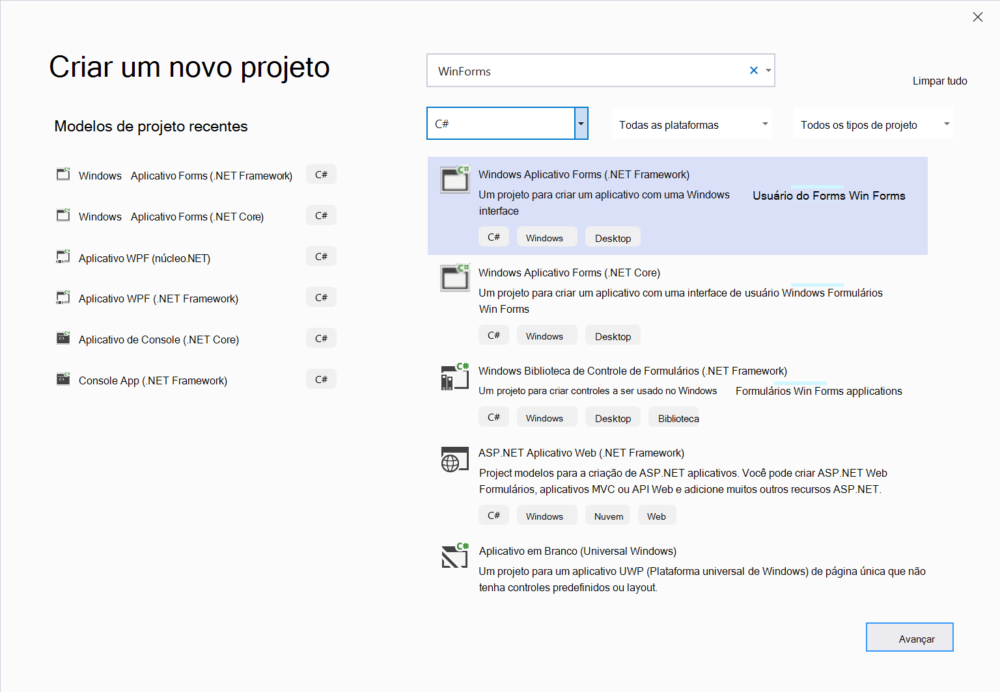

3. Insira valores para **nome** e **local**do projeto.  Selecione **.NET Framework 4.6.2** ou posterior.  

    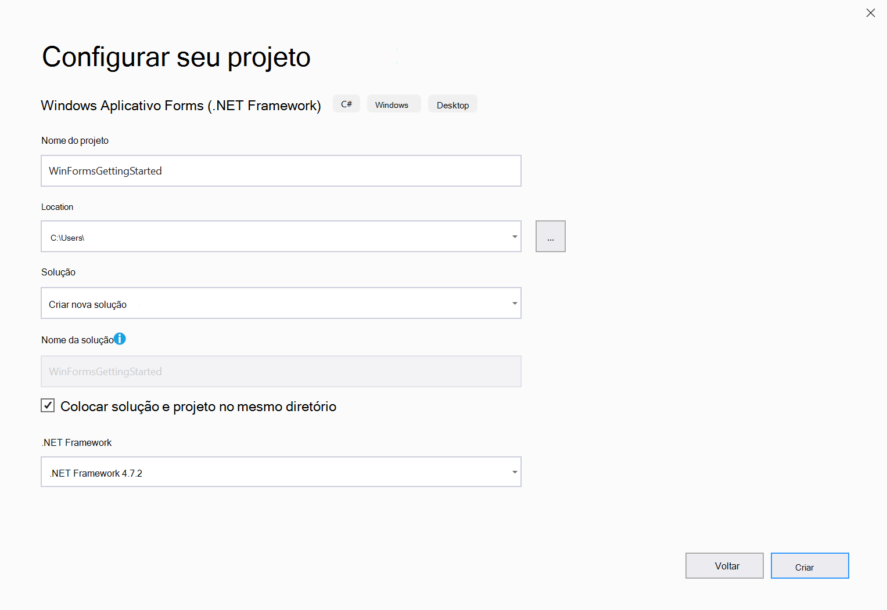

4. Escolha **criar** para criar seu projeto.

## Etapa 2-instalar o SDK do WebView2

Em seguida, adicione o SDK WebView2 ao projeto.  Para a visualização, instale o SDK do WebView2 usando NuGet.  

1. Abra o menu de contexto no projeto \ (clique com o botão direito do mouse \) e escolha **gerenciar pacotes NuGet..**..  

    :::image type="complex" source="./media/wpf-gettingstarted-mngnuget.png" alt-text="NuGet":::
       NuGet :::image-end:::

2. Digite `Microsoft.Web.WebView2` na barra de pesquisa.  Escolha **Microsoft. Web. WebView2** nos resultados da pesquisa.  

3. Marque **incluir pré-lançamento**, selecione uma versão de pacote de **pré-lançamento** e escolha **instalar**.  

    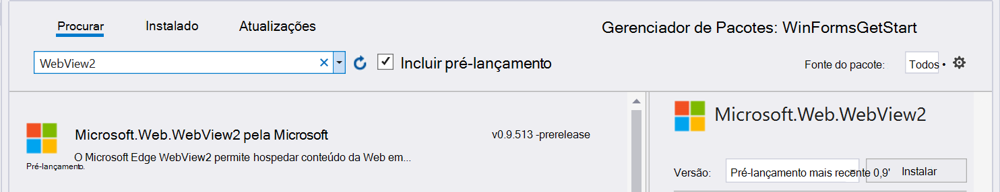

Você está pronto para começar a desenvolver aplicativos usando a API WebView2.  Selecione `F5` para compilar e executar o projeto.  O projeto em execução exibe uma janela vazia.  


## Etapa 3-criar uma única WebView  

Em seguida, adicione um WebView ao seu aplicativo.  

1. Abra o **Windows Forms Designer**.  
2. Procure por **WebView2** na **caixa de ferramentas**. Arraste e solte o controle **WebView2** no aplicativo formulários do Windows

    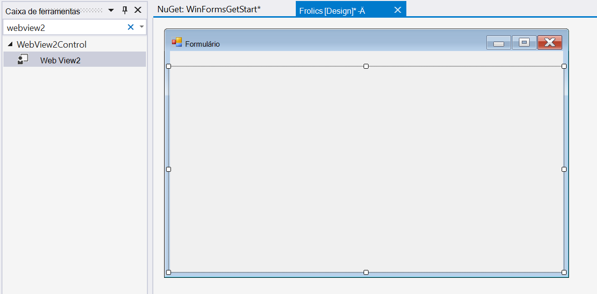

3. Altere a `Name` propriedade para `webView` .

    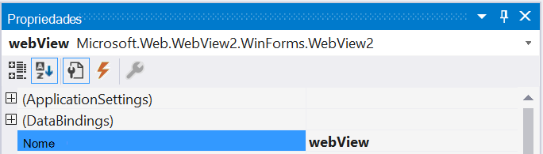

4. A `Source` propriedade define o URI inicial exibido no controle WebView2. Defina a propriedade Source como <https://www.microsoft.com>

    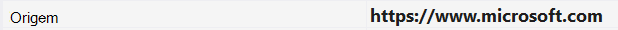

Selecione `F5` para compilar e executar o projeto.  Confirme se o controle WebView2 é exibido [https://www.microsoft.com](https://www.microsoft.com) .

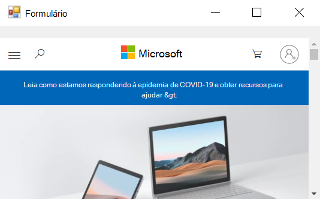

> [!NOTE]
> Se estiver trabalhando em um monitor de DPI alta, talvez seja necessário [configurar seu aplicativo do Windows Forms para suporte a dpi alta](https://docs.microsoft.com/dotnet/framework/winforms/high-dpi-support-in-windows-forms#configuring-your-windows-forms-app-for-high-dpi-support).

## Etapa 4-manipular eventos de redimensionamento de janela

Adicione mais alguns controles aos formulários do Windows a partir da caixa de ferramentas e, em seguida, manipule a janela redimensionar eventos apropriadamente.

1. No **designer do Windows Forms** , abra a **caixa de ferramentas**
2. Arraste e solte uma **caixa de texto** no aplicativo formulários do Windows. Nomeie a **caixa de texto** `addressBar` na **guia Propriedades**.
3. Arraste e solte um **botão** no aplicativo formulários do Windows. Altere o texto no **botão** para `Go!` e nomeie o **botão** `goButton` na **guia Propriedades**.

O aplicativo deve ser semelhante ao seguinte no designer:

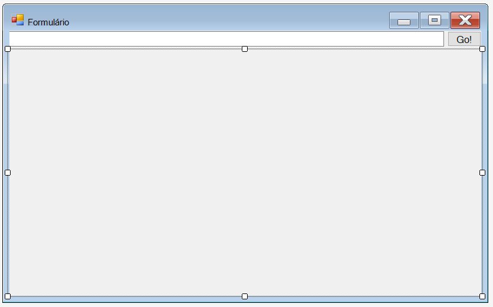

4. No **Form1.cs** , defina `Form_Resize` para manter os controles in-loco quando a janela do aplicativo for redimensionada.

```csharp
public Form1()
{
    InitializeComponent();
    this.Resize += new System.EventHandler(this.Form_Resize);
}

private void Form_Resize(object sender, EventArgs e)
{
    webView.Size = this.ClientSize - new System.Drawing.Size(webView.Location);
    goButton.Left = this.ClientSize.Width - goButton.Width;
    addressBar.Width = goButton.Left - addressBar.Left;
}
```

Selecione `F5` para compilar e executar o projeto.  Confirme se o aplicativo é exibido de forma semelhante à seguinte captura de tela.

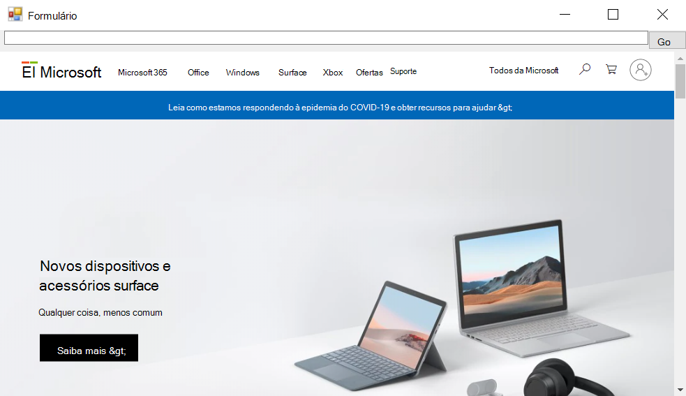

## Etapa 5-navegação

Adicione a capacidade de permitir que os usuários alterem a URL que o controle WebView2 exibe ao adicionar uma barra de endereços ao aplicativo.

1. Em `Form1.cs` Adicionar o `CoreWebView2` namespace, insira o trecho de código a seguir na parte superior de `Form1.cs` .  

    ```csharp
    using Microsoft.Web.WebView2.Core;
    ```

2. No **Windows Forms Designer**, clique duas vezes no `Go!` botão para criar o `goButton_Click` método `Form1.cs` . Copie e cole o seguinte snippet dentro da função. Agora, a `goButton_Click` função navega pelo WebView para a URL inserida na barra de endereços.

    ```csharp
    private void goButton_Click(object sender, EventArgs e)
    {
        if (webView != null && webView.CoreWebView2 != null)
        {
            webView.CoreWebView2.Navigate(addressBar.Text);
        }
    }
    ```  

Selecione `F5` para compilar e executar o projeto.  Insira uma nova URL na barra de endereços e clique em **ir**.  Por exemplo, digite `https://www.bing.com` .  Confirme se o controle WebView2 navega para a URL.  

> [!NOTE]
> Assegure-se de que uma URL completa seja inserida na barra de endereços. Uma `ArgumentException` será lançada se a URL não iniciar com `http://` ou `https://`

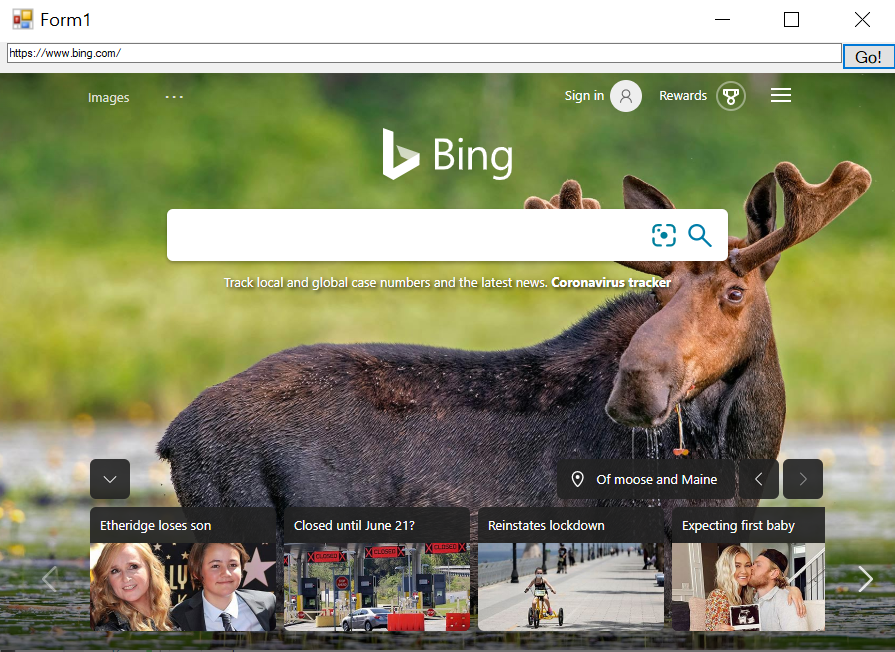

## Etapa 6-eventos de navegação  

O aplicativo que hospeda os controles WebView2 ouve os eventos a seguir que são gerados pelo controle WebView2 durante a navegação em páginas da Web.  

* `NavigationStarting`  
* `SourceChanged`  
* `ContentLoading`  
* `HistoryChanged`  
* `NavigationCompleted`  

Para obter mais informações, consulte [eventos de navegação](../reference/win32/0-9-488/icorewebview2.md#navigation-events).  

:::image type="complex" source="../media/navigation-events.png" alt-text="Eventos de navegação":::
   Eventos de navegação
:::image-end:::

Quando ocorre um erro, os seguintes eventos são gerados e podem depender da navegação para uma página de erro.  

* `SourceChanged`  
* `ContentLoading`  
* `HistoryChanged`  

Quando há um redirecionamento HTTP, há vários `NavigationStarting` eventos.  

Para demonstrar como usar esses eventos, comece registrando um manipulador para `NavigationStarting` que cancele todas as solicitações que não usam https.  

Em `Form1.cs` , modifique o Construtor conforme mostrado abaixo e adicione a `EnsureHttps` função.  

```csharp
public Form1()
{
    InitializeComponent();
    this.Resize += new System.EventHandler(this.Form_Resize);

    webView.NavigationStarting += EnsureHttps;
}

void EnsureHttps(object sender, CoreWebView2NavigationStartingEventArgs args)
{
    String uri = args.Uri;
    if (!uri.StartsWith("https://"))
    {
        args.Cancel = true;
    }
}
```

No construtor, EnsureHttps é registrado como o manipulador de eventos no `NavigationStarting` evento no controle WebView2.  

Selecione `F5` para compilar e executar o projeto. Confirme que, ao navegar para um site HTTP, a WebView permanecerá inalterada. No entanto, o WebView vai navegar para sites HTTPS.

## Etapa 7-scripting  

Você pode usar aplicativos de host para injetar código JavaScript em controles WebView2 em tempo de execução.  O JavaScript injetado se aplica a todos os novos documentos de nível superior e a quaisquer quadros filho até que o JavaScript seja removido.  O JavaScript injetado é executado após a criação do objeto global e antes que qualquer outro script incluído no documento HTML seja executado.  

Você pode usar o script para alertar o usuário ao navegar para um site que não seja HTTPS.  Modifique a `EnsureHttps` função para que ela Insira o script no conteúdo da Web usando o método [ExecuteScriptAsync]() .  

```csharp
void EnsureHttps(object sender, CoreWebView2NavigationStartingEventArgs args)
{
    String uri = args.Uri;
    if (!uri.StartsWith("https://"))
    {
        webView.CoreWebView2.ExecuteScriptAsync($"alert('{uri} is not safe, try an https link')");
        args.Cancel = true;
    }
}
```  

Selecione `F5` para compilar e executar o projeto.  Confirme se o aplicativo exibe um alerta ao navegar para um site que não usa HTTPS.  

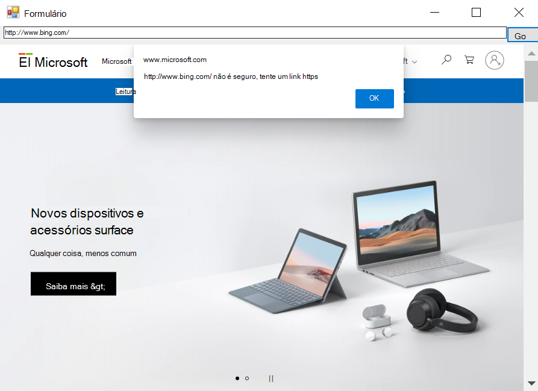

## Etapa 8 – comunicação entre o conteúdo do host e da Web  

O conteúdo do host e da Web pode se comunicar uns com os outros usando `postMessage` o seguinte procedimento:  

* Conteúdo da Web em um controle WebView2 pode postar uma mensagem para o host usando `window.chrome.webview.postMessage` .  O host manipula a mensagem usando qualquer registro registrado `WebMessageReceived` no host.  
* Hospeda mensagens postadas em conteúdo da Web em um controle WebView2 usando `CoreWebView2.PostWebMessageAsString` ou `CoreWebView2.PostWebMessageAsJSON` .  Essas mensagens são detectadas pelos manipuladores adicionados a `window.chrome.webview.addEventListener` .  

Esse mecanismo de comunicação permite que o conteúdo da Web passe mensagens para o host usando recursos nativos.  

Em seu projeto, quando o controle WebView2 navega para uma URL, ele exibe a URL na barra de endereços e alerta o usuário da URL exibida no controle WebView2.  

1. No **Form1.cs**, atualize o construtor e crie uma `InitializeAsync` função conforme mostrado no trecho de código a seguir.  A `InitializeAsync` função aguarda [EnsureCoreWebView2Async]() porque a inicialização `CoreWebView2` é assíncrona.  

    ```csharp
    public Form1()
    {
        InitializeComponent();
        this.Resize += new System.EventHandler(this.Form_Resize);
        webView.NavigationStarting += EnsureHttps;
        InitializeAsync();
    }

    async void InitializeAsync()
    {
        await webView.EnsureCoreWebView2Async(null);
    }
    ```  

2. Após a inicialização do **CoreWebView2** , registre um manipulador de eventos para responder `WebMessageReceived` .  Em `Form1.cs` Atualizar `InitializeAsync` e adicionar `UpdateAddressBar` usando o trecho de código a seguir.  

    ```csharp
    async void InitializeAsync()
    {
        await webView.EnsureCoreWebView2Async(null);
        webView.CoreWebView2.WebMessageReceived += UpdateAddressBar;
    }

    void UpdateAddressBar(object sender, CoreWebView2WebMessageReceivedEventArgs args)
    {
        String uri = args.TryGetWebMessageAsString();
        addressBar.Text = uri;
        webView.CoreWebView2.PostWebMessageAsString(uri);
    }
    ```  

3. Para que o WebView envie e responda à mensagem da Web, após a `CoreWebView2` inicialização, o host injeta um script no conteúdo da Web para:  

    1. Envie a URL para o host usando `postMessage` .
    2. Registre um manipulador de eventos para imprimir uma mensagem enviada do host.  

Em `Form1.cs` , atualize `InitializeAsync` conforme mostrado no trecho de código a seguir.  

```csharp
async void InitializeAsync()
{
    await webView.EnsureCoreWebView2Async(null);
    webView.CoreWebView2.WebMessageReceived += UpdateAddressBar;

    await webView.CoreWebView2.AddScriptToExecuteOnDocumentCreatedAsync("window.chrome.webview.postMessage(window.document.URL);");
    await webView.CoreWebView2.AddScriptToExecuteOnDocumentCreatedAsync("window.chrome.webview.addEventListener(\'message\', event => alert(event.data));");
}
```  

Selecione `F5` para compilar e executar o aplicativo.  Confirme se a barra de endereços exibe a URL do site exibida no WebView. Além disso, quando você navegar com êxito para uma nova URL, o WebView alertará o usuário da URL exibida na WebView.  

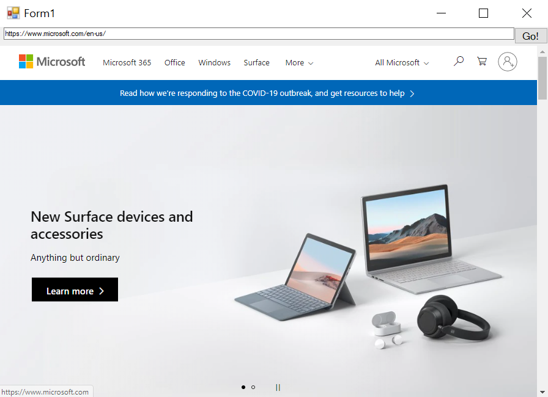

Parabéns, você criou seu primeiro aplicativo WebView2!  

## Próximas etapas 

* Fazer check-out do [repositório WebView2Samples](https://github.com/MicrosoftEdge/WebView2Samples) para obter um exemplo abrangente de recursos do WebView2's
* [Referência de API](../reference/winforms/0-9-515/microsoft-web-webview2-winforms-webview2.md) de check-out para obter informações mais detalhadas sobre nossas APIs
* Fazer check-out de uma lista de [recursos do WebView2](../index.md#next-steps) para saber mais sobre o WebView2


## Entrar em contato com a equipe do Microsoft Edge WebView  

Ajude a criar uma experiência de WebView2 mais rica compartilhando seus comentários!  Visite o [repositório de comentários](https://aka.ms/webviewfeedback) da WebView da Microsoft Edge para enviar solicitações de recursos ou relatórios de erros ou Pesquisar problemas conhecidos.  
